# 026：无线入侵检测系统(WIDS) 📡

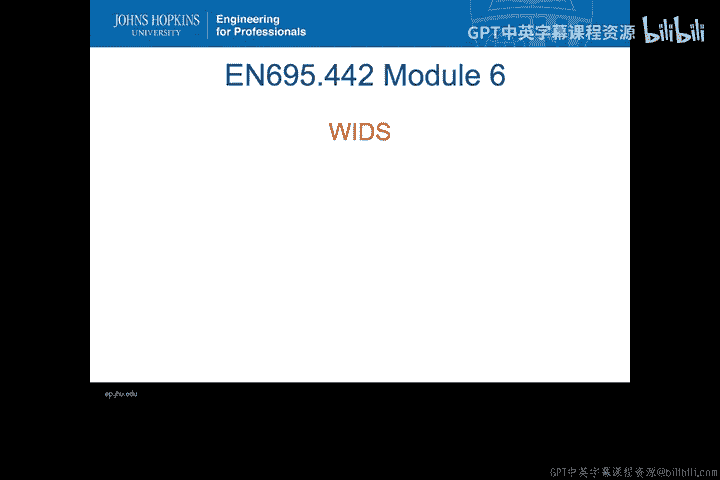

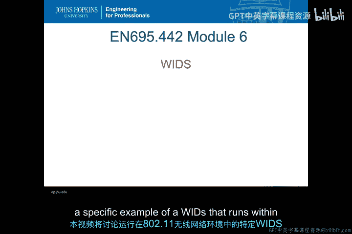

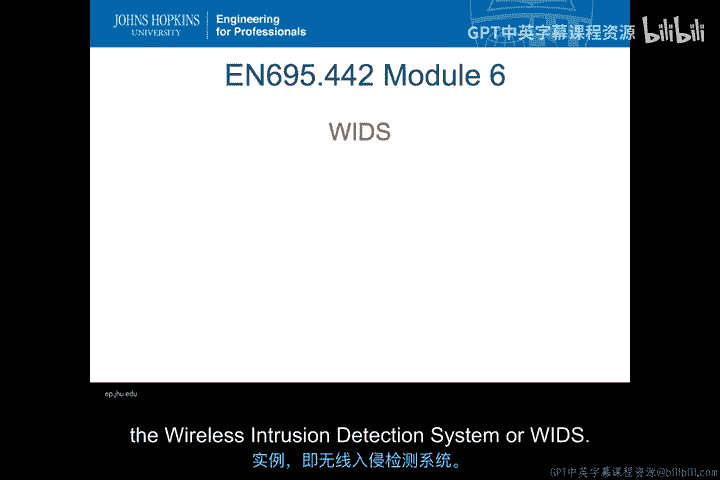

在本节课中，我们将要学习一种运行在无线802.11空间内的特定网络入侵检测系统（NID）——无线入侵检测系统（WIDS）。我们将探讨其独特之处、面临的无线攻击类型以及相关的防御工具。

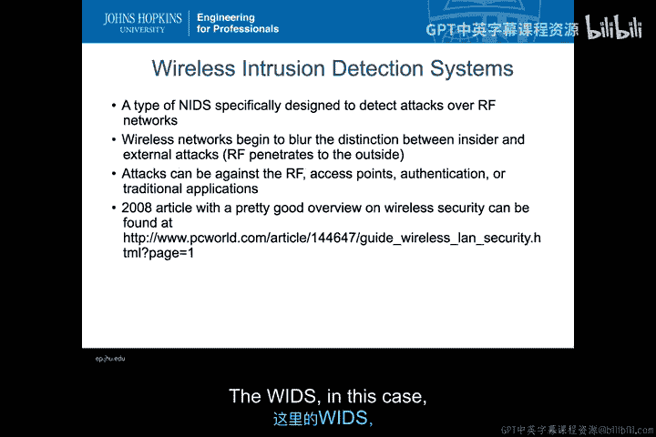

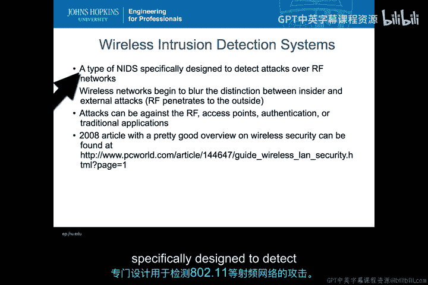

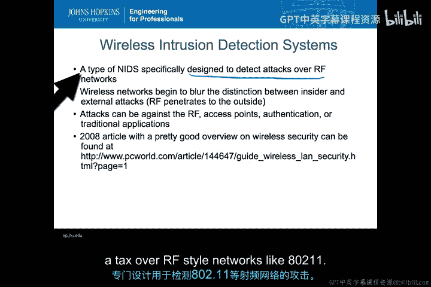

## 概述

无线入侵检测系统（WIDS）是一种专门为检测通过射频（RF）网络（如802.11）发起的攻击而设计的网络入侵检测系统。尽管现今大多数WIDS主要针对802.11a/b/g等标准，但其核心思想是：在任何基于射频的系统中，都需要一种能够以射频信号为输入，并在无线空间内进行入侵检测的系统。

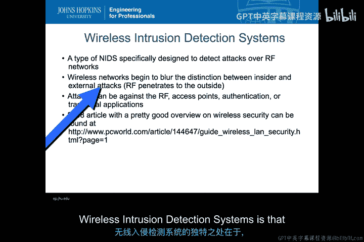

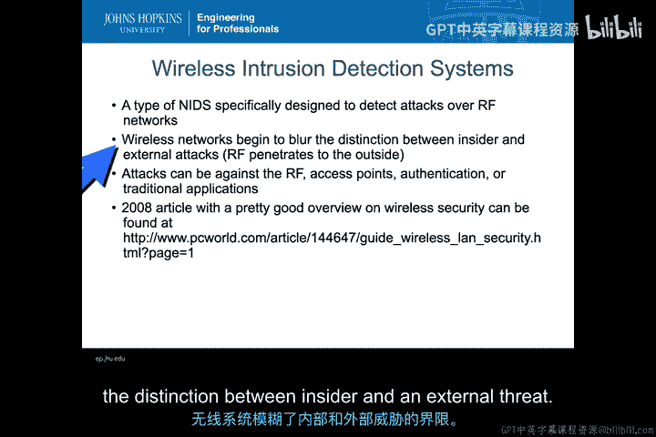

## 无线环境的独特性

上一节我们介绍了WIDS的基本概念，本节中我们来看看无线环境带来的一个独特挑战：它模糊了内部威胁和外部威胁的界限。

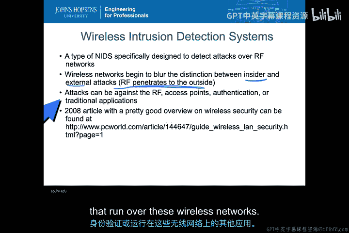

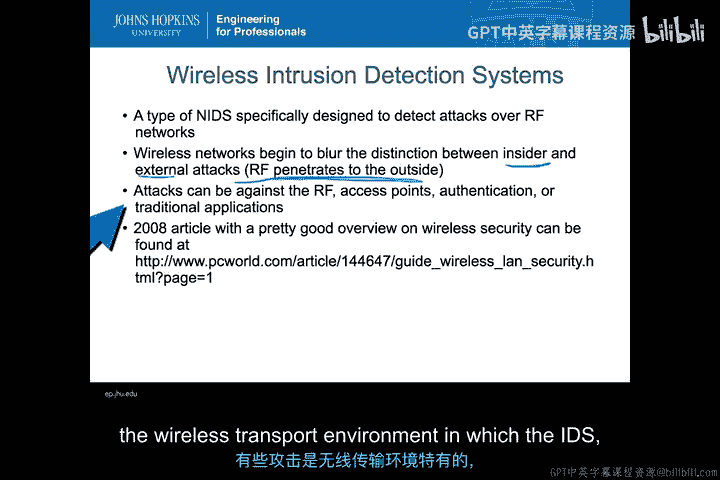

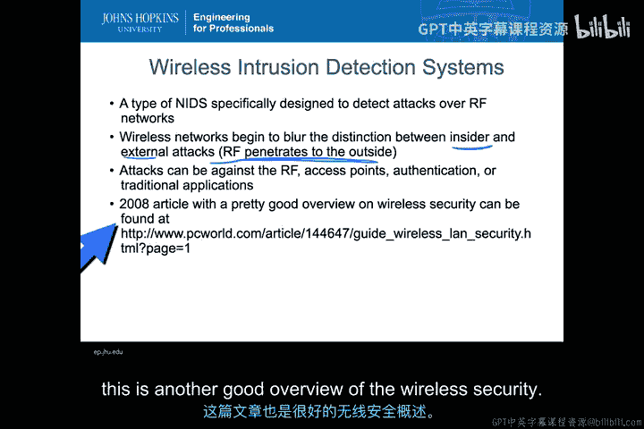

无线信号通常不会停留在建筑物墙壁之内。大多数部署了无线网络的建筑并未进行射频屏蔽。这意味着攻击者可以在组织的物理边界之外，通过穿透到外界的射频信号访问无线网络。这样一来，我们对于“内部人员”（在建筑内物理接触系统）和“外部人员”（在建筑附近但能通过射频接入）的传统区分就被模糊了。

## 无线攻击类型

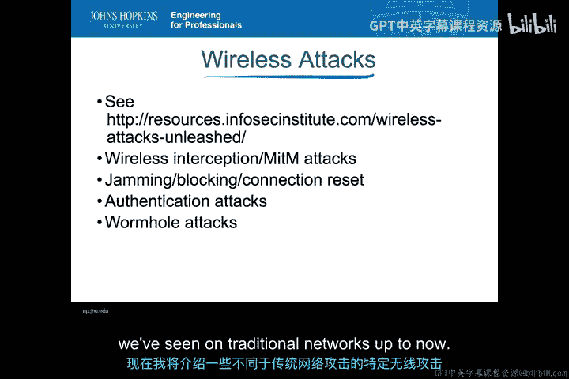

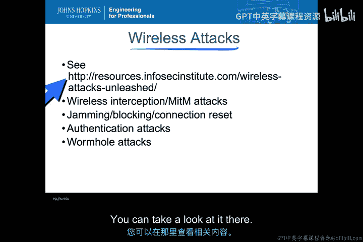

无线攻击不仅针对射频本身，也可能针对接入点、身份验证机制或在无线网络上运行的其他应用。其中一些攻击是无线传输环境所特有的。除了本视频内容，2008年一篇关于无线安全的文章（链接：[此处](特定链接)）提供了更全面的概述。

接下来，我们将介绍几种不同于传统有线网络的、特定的无线攻击示例。这些攻击包括无线拦截与中间人攻击、干扰与阻断连接重置、身份验证攻击以及虫洞攻击。以下内容主要参考了“无线攻击揭秘”这一资源。

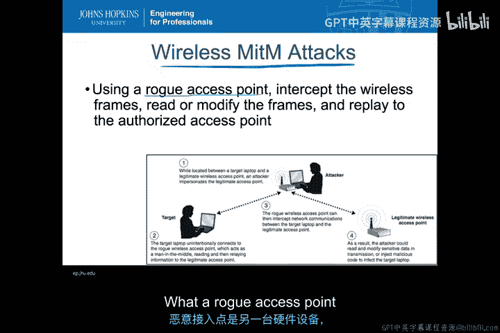

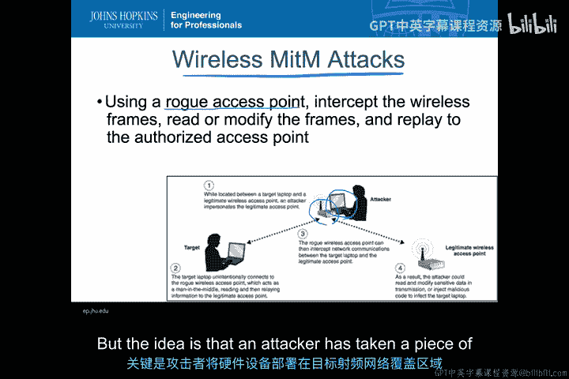

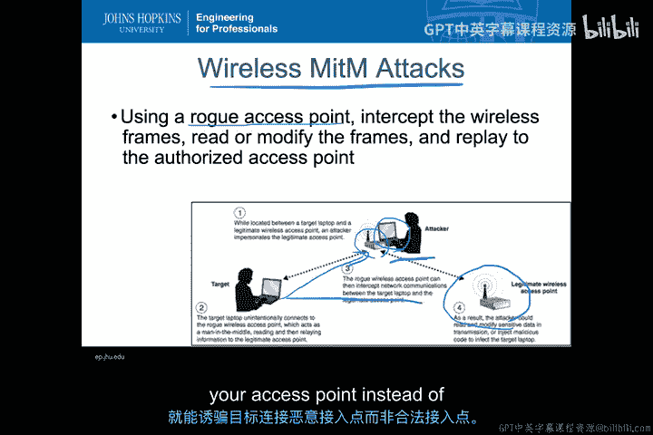

以下是几种主要的无线攻击类型：

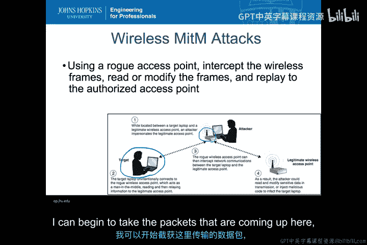

### 无线中间人攻击

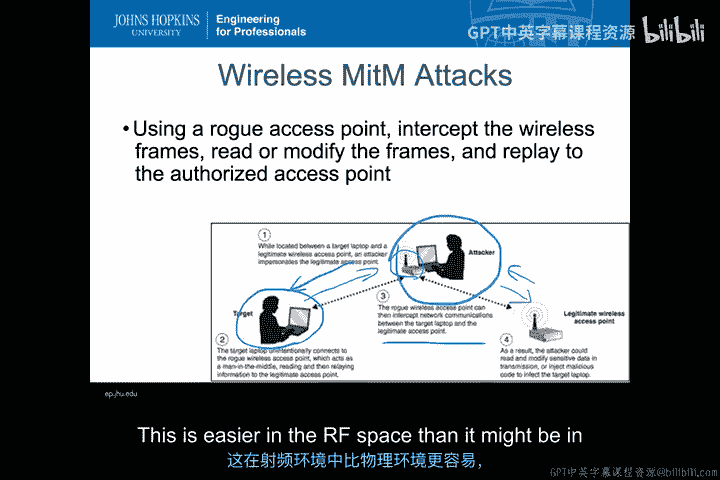

这种攻击本质上始于使用一个**恶意接入点**。恶意接入点可以是另一个物理硬件设备，也可以是一台笔记本电脑。攻击者将硬件设备引入目标射频网络的工作区域，并命名一个与合法接入点名称相同的接入点，从而诱骗目标设备连接到恶意接入点而非合法接入点。

一旦受害设备连接到恶意接入点，攻击者就可以开始拦截数据包（包括身份验证数据包），读取并修改它们，然后再转发给合法的接入点。攻击者可以创建自动化工具来完成这个过程，使目标用户完全无法察觉中间存在一个在无线空间中利用恶意接入点进行拦截的攻击者。

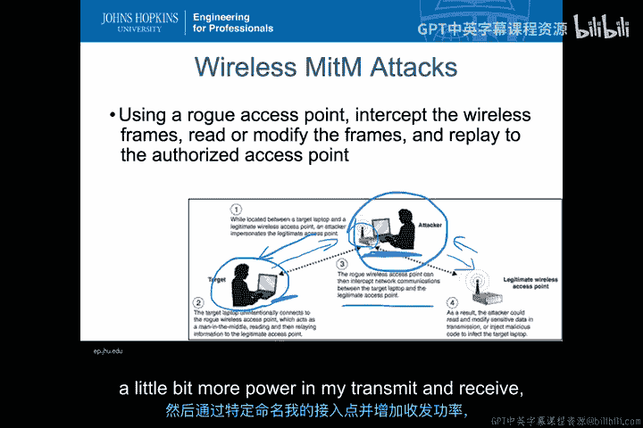

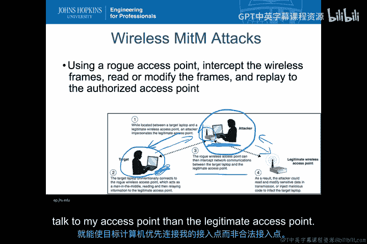

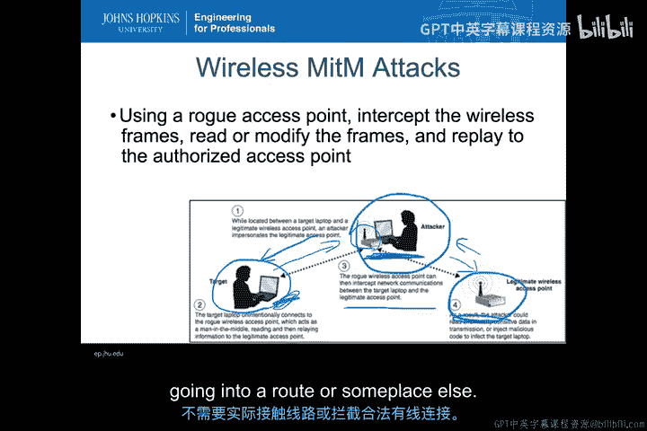

在射频空间中实施这种攻击比在有线物理环境中更容易，因为攻击者无需考虑在哪里接入或切断线路，只需处于目标设备的射频信号范围内即可。通过命名技巧并增加发射和接收功率，攻击者可以使目标计算机更倾向于与自己的接入点通信。

### 干扰、阻断与连接重置攻击

在射频环境中，干扰、阻断和重置连接是另一类独特的攻击。攻击者同样会引入一个恶意接入点或其他类型的发射器到环境中，使其工作在相同的信道和频率上。

但在此类攻击中，攻击者利用射频创建无线帧来干扰、阻断合法信号，或向连接中注入重置指令，从而破坏组织在接入点与终端之间进行的任何正常工作。攻击者可以通过向接入点发送恶意射频信号和畸形数据包，使其无法响应甚至崩溃（例如通过资源耗尽攻击），也可以直接干扰各个终端设备。

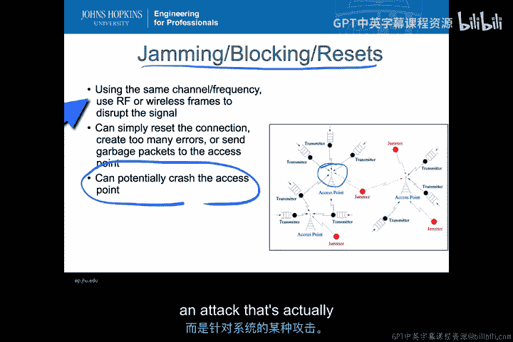

在射频空间中，入侵检测系统（IDS）可以寻找那些表现为干扰、阻断和重置的模式，识别出它们并非正常的射频信号变化，而是针对系统发起的某种攻击。

### 身份验证攻击

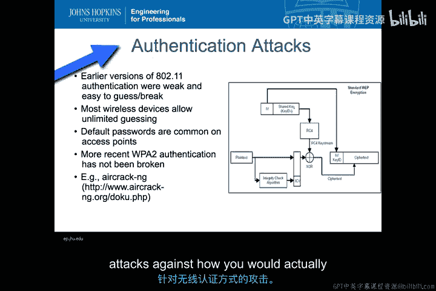

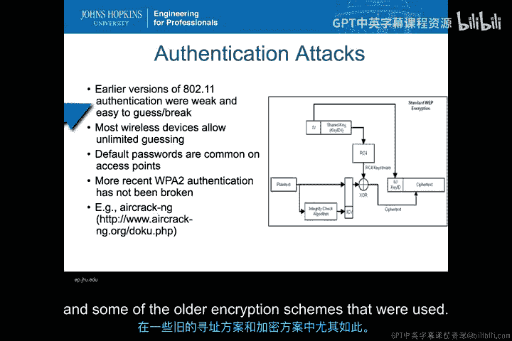

针对射频空间的另一种非常严重的攻击是身份验证攻击，即攻击无线接入的认证方式。早期版本的身份验证机制（如WEP加密）很容易被破解，互联网上存在许多常见工具可用于破解各种类型的无线身份验证。

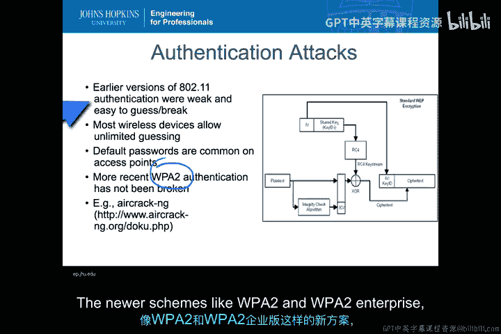

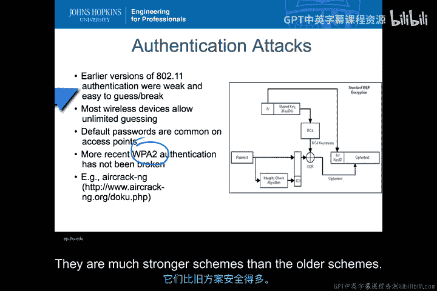

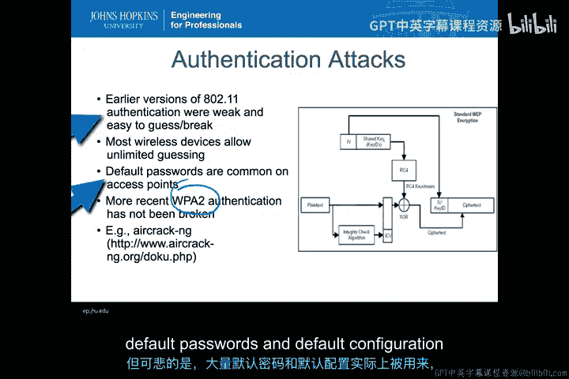

较新的方案如**WPA2**和**WPA2企业版**至今未被攻破，比旧方案安全得多。然而，许多无线接入点使用默认密码和默认配置，且维护不善（用户不更新固件、不重置默认密码、不升级加密标准），导致这些系统容易被利用。

例如，互联网上的工具如**Aircrack-ng**，就非常擅长利用这些漏洞来破解标准的无线密钥加密（尤其是旧的、易受攻击的WEP加密），使攻击者能够伪装进入网络，成为网络中的活跃参与者。

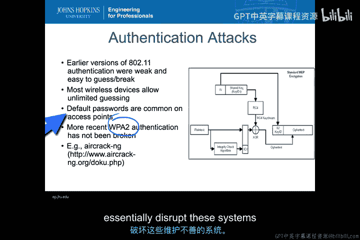

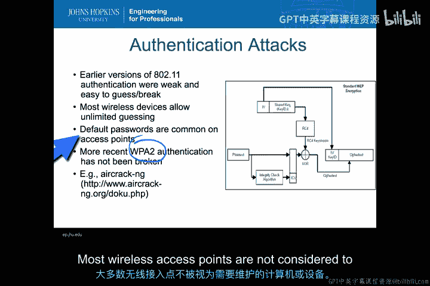

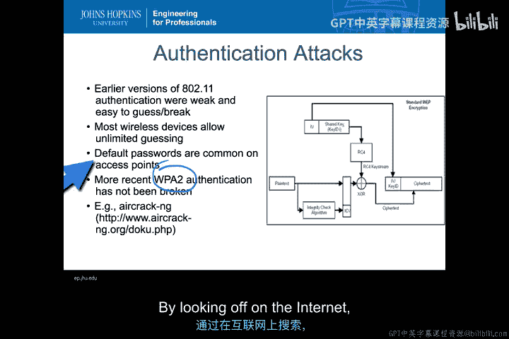

### 虫洞攻击

无线领域中另一种完全不同的常见攻击是虫洞攻击。这是中间人攻击的一种变体，其本质是拦截数据包，并通过一个“虫洞”将其传送到更接近目的地的位置，而不是让它通过无线网络、基础设施的正常路径到达目的地。

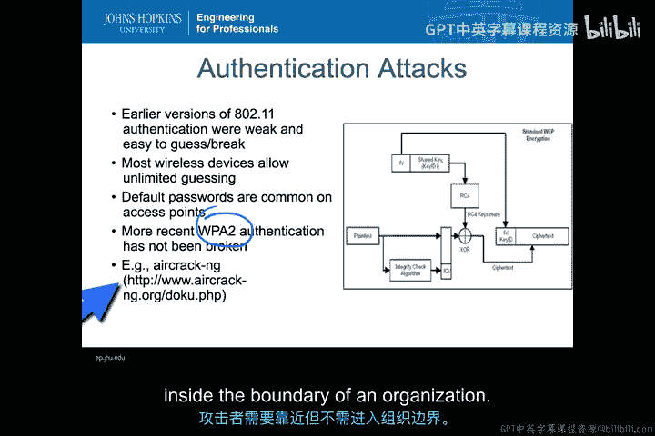

这样做的好处是，通过接管数据包（无论是重写还是重放），攻击者可以让自己的应答通过虫洞返回，从而利用来自原始起点或目的地的所有身份验证和加密标准来控制连接。这个虫洞隧道使攻击者能够比原始数据包更快地到达目的地，导致后续到达的原始数据包被视为重复包而被丢弃。

这样一来，建立起来的主要连接将通过这个由对手控制的虫洞进行。对手可以修改数据包或直接接管连接。虫洞攻击在无线网络上有效，是因为无线连接往往比有线连接慢，路径也更迂回，使得攻击者能够“赛跑”并将数据包抢先送达目的地。即使攻击者无法解密数据包或理解其完整载荷，仍然可以通过虫洞进行中间人攻击来控制连接。

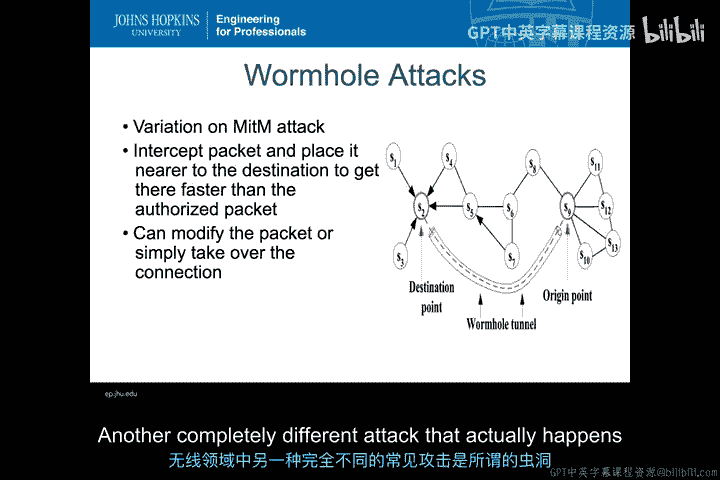

## 攻击工具与防御工具

这些攻击及其防御工具并非理论性质。攻击工具在现实中广泛存在，通过任何搜索引擎都能找到针对无线网络的各种攻击工具。

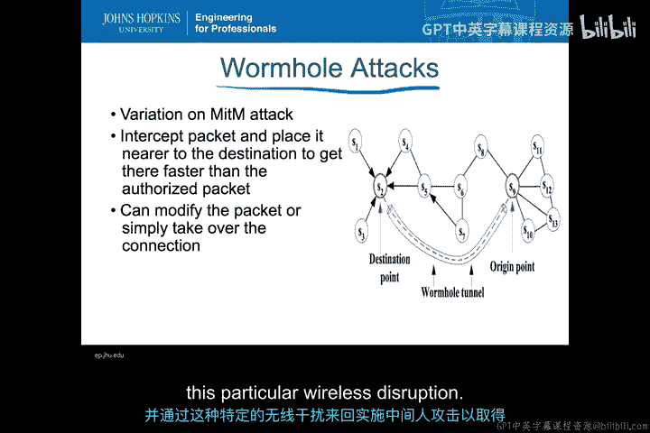

同时，也有一些WIDS工具可用。主要的开源工具是 **Kismet**（访问网址：[此处](特定URL)）。Kismet是一个基于签名和异常检测的WIDS，是一个基于无线网络的入侵检测系统。

如果想了解攻击方，**Kali Linux**（一个包含许多攻击工具的镜像文件）也包含许多开源的无线攻击工具。在测试环境中运行Kismet和Kali Linux，可以测试无线系统抵御各种常见攻击的能力，并观察Kismet作为主要检测工具是如何发现和预防这些攻击的。

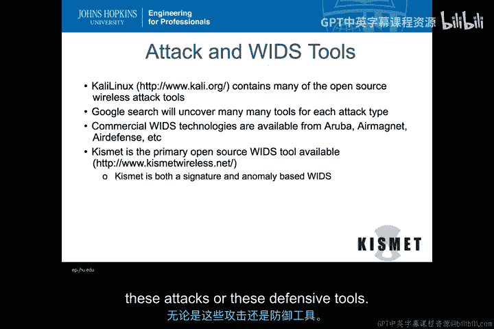

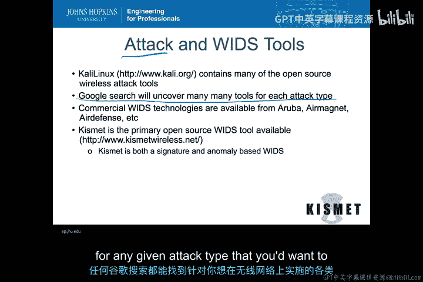

在本课程中，我们虽不重点深入航空或无线入侵检测领域，但它是网络入侵检测系统工具中一个重要且不断增长的方面。本模块的阅读材料包含一些近期论文，进一步描述了WIDS领域的研究以及当今无线入侵检测的发展现状。

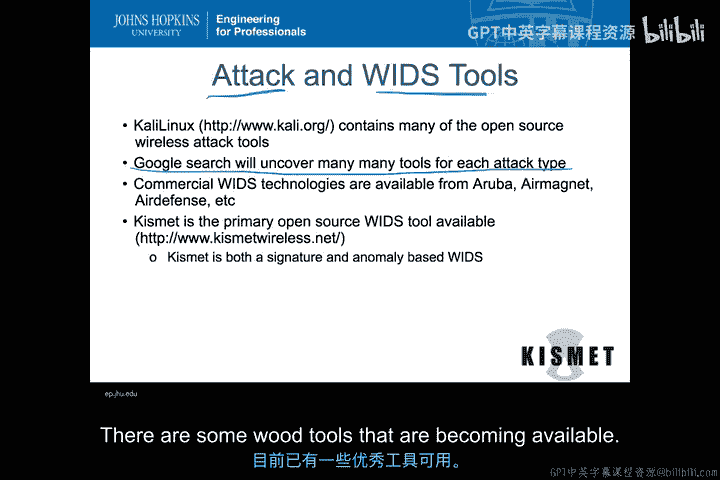

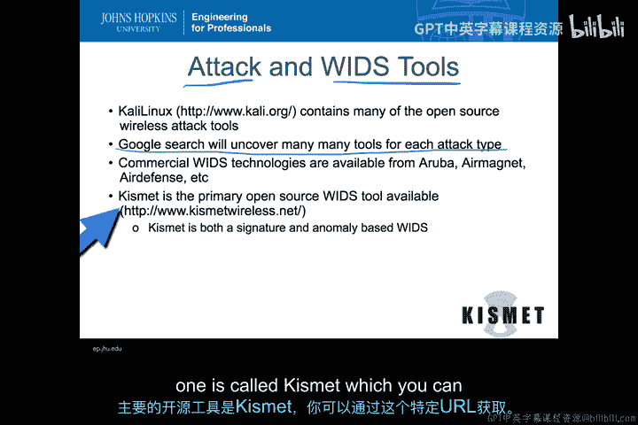

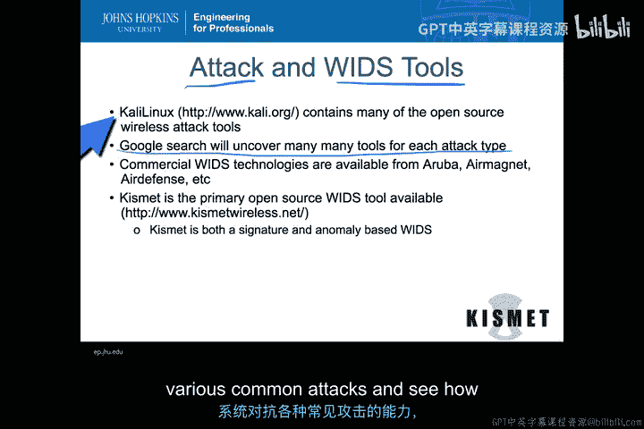

## 总结

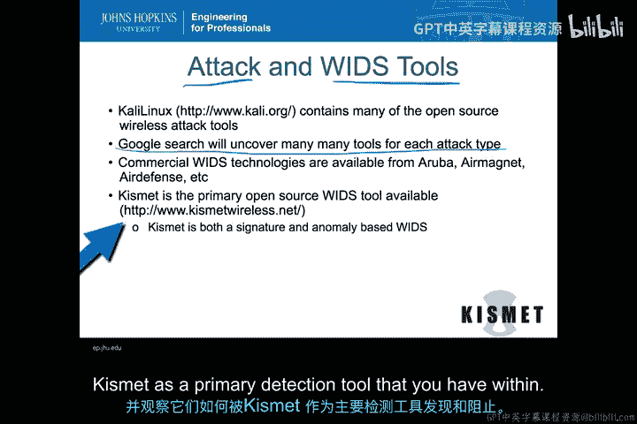

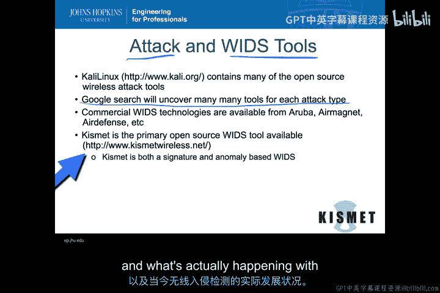

本节课中，我们一起学习了无线入侵检测系统（WIDS）。我们了解了WIDS如何专门检测射频网络攻击，以及无线环境如何模糊内外威胁的界限。我们详细探讨了几种典型的无线攻击：中间人攻击、干扰阻断攻击、身份验证攻击和虫洞攻击，并简要介绍了用于攻击测试的Kali Linux和用于防御检测的开源工具Kismet。无线安全是入侵检测中一个至关重要且持续发展的领域。