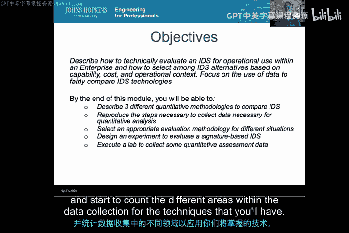
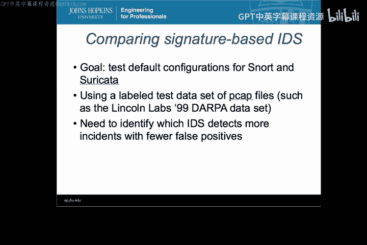

# 027：入侵检测系统评估方法 🎯

在本模块中，我们将学习如何对不同的入侵检测系统进行技术性评估和比较。我们将介绍三种主要的定量评估方法，并讲解如何收集数据、选择合适的方法，以及如何设计实验来评估基于签名的IDS。通过本模块的学习，你将能够理解如何在实际环境中选择和评估入侵检测系统。

---

## 入侵检测：8.1：比较不同类型的IDS 📊

上一节我们概述了本模块的目标，本节中我们来看看比较入侵检测系统的三种主要方法。

这三种方法适用于不同的场景，在实际选择IDS时，你可能会结合使用它们。

以下是三种主要的评估方法：

1.  **基于特征的比较**：此方法涉及对比不同IDS的技术规格表。你需要根据自身需求，分析外部信息和技术规格表，进行对比。
2.  **经济性比较**：此方法简要分析部署IDS的成本与收益。下一个视频将对此进行更详细的探讨。
3.  **基于结果的比较**：此方法通过在环境中测试IDS，对其性能进行分析，评估其工作效果。

我们将把项目重点放在基于结果的比较上，因为这能让你获得入侵检测系统的实际操作经验。然而，在实际环境中选择IDS时，这三种方法都需要考虑。

这三种方法各有不同的缺点，我们将会讨论各自的局限性。这些方法可以结合使用，并非只能选择其一。

---

## 入侵检测：8.2：经济性分析 💰

上一节我们介绍了三种比较方法，本节中我们深入探讨如何进行IDS的经济性分析。

这部分内容不会涵盖完整经济分析所需的每个细节，但会为你提供要点，确保你覆盖关键方面。

经济分析主要涵盖以下成本：

*   **前期成本**：这包括部署IDS所需的资源以及员工培训要求。
*   **持续成本**：我们将讨论可能预期的持续成本。
*   **效益评估**：这可能是整个经济分析中最困难的部分，即计算某种投资回报率，以理解在环境中部署IDS可能带来的回报。

---

## 入侵检测：8.3：为IDS评估收集数据 📈

上一节我们讨论了经济分析，本节中我们来看看如果你打算自己进行定量评估，应如何收集数据。

为了对不同的IDS进行测试，你需要收集具有特定特征的数据集。

以下是数据收集的关键步骤和考虑因素：

*   **期望的数据特征**：确定你希望用于评估的数据应具备哪些特性。
*   **收集正常流量与攻击流量**：你需要收集正常的网络流量数据和攻击流量数据，以便用它们来测试不同的IDS。
*   **数据标记**：如何标记数据，以便后续进行分析。
*   **数据更新**：如何保持数据的时效性。

理解如何获取适合你环境使用的、具备正确特征的数据，是本视频的重点。

---

## 入侵检测：8.4：比较基于签名的IDS（示例）🔍

上一节我们介绍了数据收集，本节我们将通过一个具体示例，将所学内容融会贯通，展示如何测试基于签名的IDS。

我们将以比较Snort和Suricata的默认配置为例。

评估步骤如下：

1.  **使用标记的测试数据集**：假设你有一个用于分析的PCAP文件数据集。
2.  **运行测试**：用该数据集对IDS进行测试。
3.  **识别性能差异**：找出哪个IDS能以更少的误报检测到更多的事件。

本模块将初步介绍如何通过运行攻击来对IDS进行定量分析。更深入的基于比率的计算和ROC分析将在下一个模块中讨论。

---

## 总结 📝

本节课中，我们一起学习了入侵检测系统的评估方法。我们介绍了三种主要的定量比较方法：基于特征、基于经济性和基于结果的比较。我们探讨了为评估收集数据的关键步骤，并通过一个比较Snort和Suricata的示例，演示了如何对基于签名的IDS进行测试。理解这些方法不仅能帮助你比较不同的IDS，还能让你对运行中的IDS有合理的性能预期，并了解如何处理其检测到的事件。

这是一个非常重要的模块，祝你在后续学习中顺利。让我们开始吧。