# 028：各类入侵检测系统对比分析 🔍

在本节课中，我们将学习如何实际比较不同类型的入侵检测系统。当您拥有多个系统，并希望根据特定情况决定哪个最佳时，遵循一个明确的程序，使用真实数据和特征或经济分析来比较IDS，将是您开始精确分类IDS在特定环境中如何工作的方式。

我们将讨论三种主要方法。我们将讨论特征比较，这是比较两个或多个入侵检测系统最简单的方法，即直接比较它们的特性。我们将介绍经济比较，但会在下一个视频中更详细地介绍。然后，我们将简要讨论基于结果的比较，这种方法需要您运行测试数据，并根据测试数据确定哪些入侵检测系统的结果最适合您的具体情况。

根据您在选择入侵检测系统时希望最大化的目标，您将使用不同的方法。无论是希望最大化特性、经济效益还是IDS的性能结果，不同的情况需要不同类型的比较。没有一种完美的方法来比较两个IDS，所有这些技术都有其缺点，我们将讨论这些缺点是什么。这些方法并不互斥，您可以结合使用不同的方法。在某些情况下，您可能希望查看特征比较；在某些情况下，您可能希望查看基于结果的比较；在某些情况下，您可能希望查看经济比较。但在任何特定情况下，您都可以选择其中两种或更多方法，然后结合结果来帮助您为特定情况选择最佳IDS。

## 特征比较法

最直接的IDS比较类型是直接比较入侵检测系统内的不同特征。基本上，您将从最适合您需求的入侵检测系统类型开始。这些类型我们已经讨论过：异常检测与误用检测，基于网络的与基于主机的IDS。因此，这基本上是说，首先确定哪种类型的IDS最可能满足我的需求。在每种类型中，您将会有多个特定类型的入侵检测系统可供选择进行比较。因此，您可以查看这些特定IDS中的不同特征，并确定哪些特征是真正需要的。然而，具有您所需确切功能列表的产品可能并不存在。因此，您必须开始权衡哪些IDS在您实际希望拥有的各种不同特征方面具有最佳匹配度。

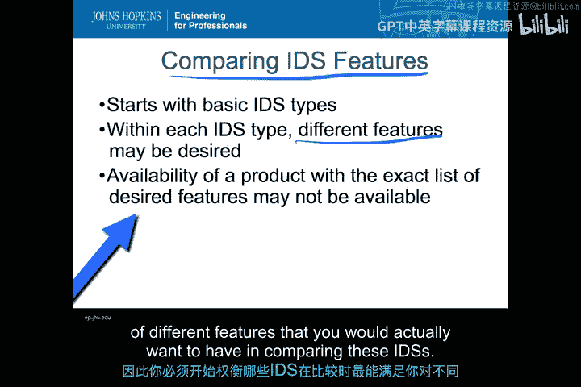

那么，从哪里获取特征呢？您可以从任何给定的分类法开始。我们有异常检测与基于签名的分类法。在这些分类法中，有不同类型，并且我们已经讨论了这些分类法可能细分的不同方式。它们会细分为更精细的细节，最终您会得到可能为特定情况选择的特定类型的IDS。

这可以相当直接。例如，如果我知道我想要一个基于专家系统的基于签名的IDS，那么我现在就有了可供选择的列表，可以查看并确定这是否有意义。相反，如果我想要一个异常检测系统，并且我不希望它是自学习的，我希望它是一个描述性的简单统计模型，那么我将会有更多朝这个方向发展的选择。因此，如果您有一个包含不同类型特征的分类法，并且这组特定特征更多地来自底部的参考文献。您可以通过简单的网络搜索找到许多这类不同的IDS分类法。这个分类法实际上可以一直列出一些IDS。许多主要杂志和出版物也会有其他类型的细分。这是一种简单追踪并确定是否有任何IDS满足您想要查看的特定功能集的方法。

另一种同样有效的方法是，如果您不查看IDS的特定分类法，而是创建自己的功能集。您可能实际上有一个包含不同架构形式的功能集。

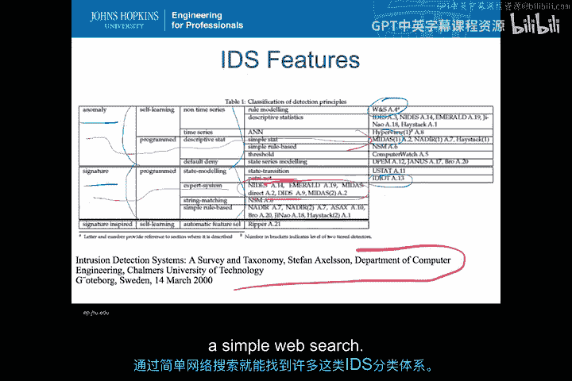

以下是不同种类的事件分析。这基本上不一定是IDS的分类法。这些是您认为在选择特定IDS时重要的具体特征。一旦您有了自己的特征，现在您可以出去查看所有可能包含这些特征的不同入侵检测系统，然后开始逐一检查，看看哪些IDS包含哪些各种特征，一直到您确定对您最有意义的那些。

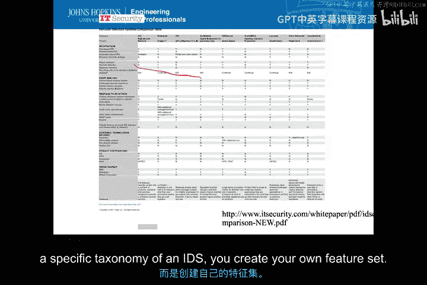

因此，如果我决定我真正想要的是某种漏洞检查器，并且我想查看漏洞分析，那么我可以说，我已经检查了很多这些领域，可以看到大多数都没有我需要的功能，但我可以说，这个有我需要的东西。

这个几乎有我需要的，但不完全。所以我回过头来查看所有这些，然后说，这给了我一个相当有限的集合。那么这两个工具是哪些呢？基本上就是我列在顶部的Air Defense和StrataGuard。

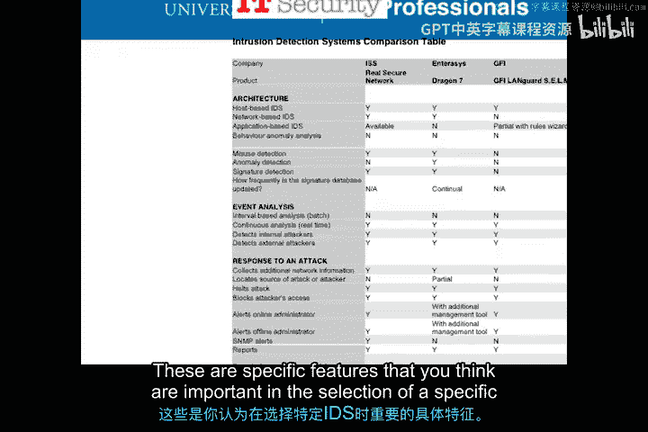

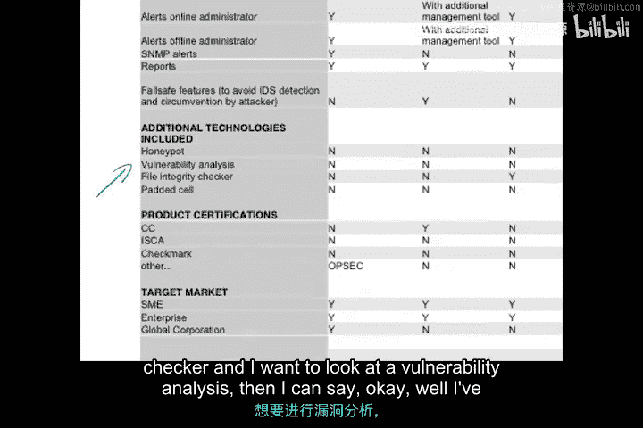

所以现在我知道，当我挑选了几个我真正想看的特定功能时，我知道哪些最可能对我重要。

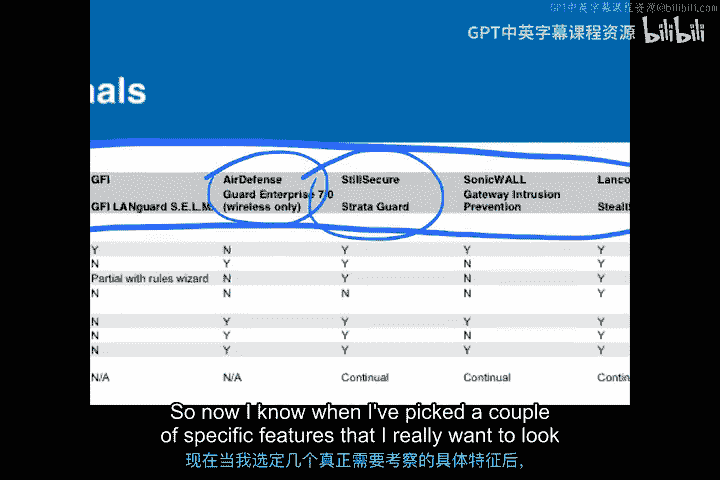

同样，这个特定的集合来自下面我列出的参考文献。但再次强调，使用此方法的最佳方式基本上是定义您自己的功能集，即您认为最重要的功能集，即侧边的列。当您想了解在这些功能中您真正想使用哪些时。

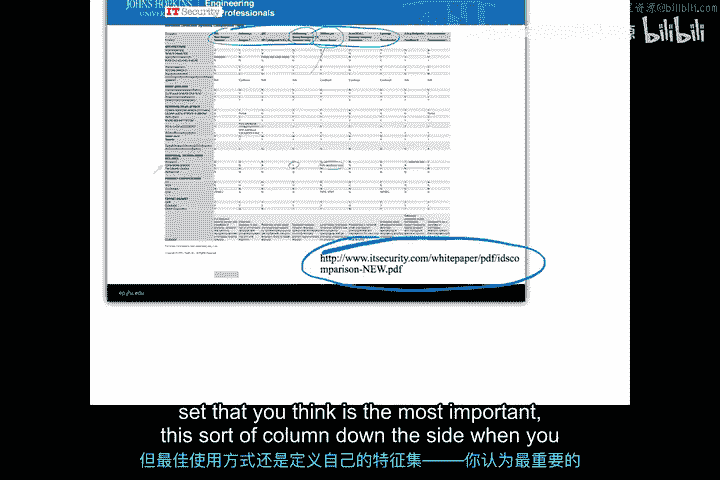

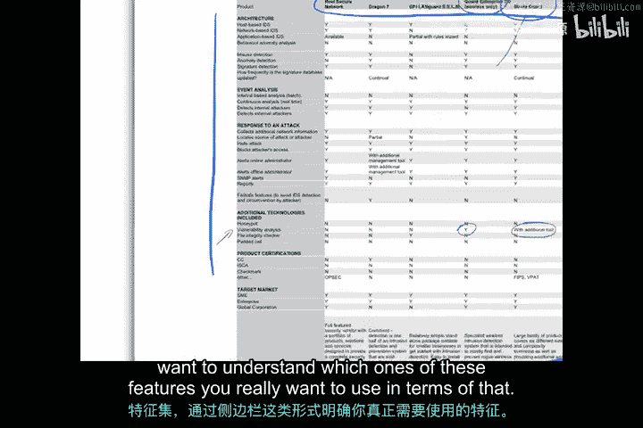

您可以对一些功能进行更详细的了解。同样，这些不一定是您自己测量的功能。这些是作为特定IDS规格表或广告一部分列出的功能。因此，您将能够看到覆盖范围、误报率、检测概率等许多类型的定量特征，这些信息也可以从IDS规格表中获得。

因此，如果您真正关注的是关联事件的能力，那可能是一个在规格表上列出定量结果的特定功能。您可能专门寻找检测前所未见攻击或零日攻击的能力。因此，您可能希望去寻找那些特定类型的入侵检测系统。或者您可能优先考虑多级抽象，即可以在数据包级别以及会话或应用程序级别工作的功能。这些对于您寻找特定IDS的定量特征可能很重要。

使用基于特征的分析来评估这些IDS时，重要的是您主要通过发布的规格表和您组织外部找到的比较分析来完成，因此您不一定需要将所有IDS引入您的组织并验证所有这些功能是否存在。因此，您将简单地根据可以找到的功能列表来选择IDS。

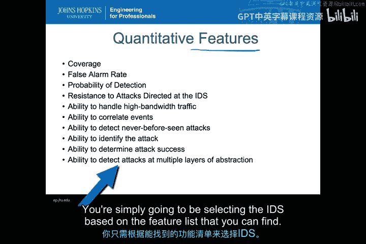

## 特征列表与需求分析

我一直在讨论功能列表，重要的是要认识到功能列表与需求集不是一回事。

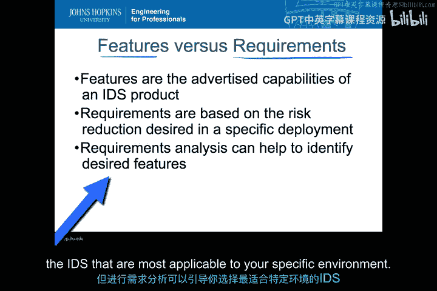

因此，如果您为入侵检测系统制定了一套需求，您可能会回过头来查看功能列表，看看这些功能是否满足您的需求。但需求是您根据自己的企业或环境的要求或约束设定的。另一方面，功能是产品的广告能力。当您查看需求时，您是基于风险降低和期望的特定部署来制定需求的。这就是您如何制定需求的方式。进行需求分析实际上可以帮助识别所需的功能。需求通常与您在IDS中可能看到的功能列表不完全相同，但进行需求分析可以引导您选择最适合您特定环境的IDS功能。

让我们来看一个非常简单的例子。假设有一个企业要求IDS能够检测已知攻击并识别攻击的明显来源。在这种情况下，我真正想了解攻击来自哪里。

我希望该产品在网络中运行。我希望它们能检测已知攻击，但这些必须定期更新。因此，不仅仅是设置一次就完事，我需要有一种方法让这个特定的IDS保持更新到最新状态。最后，这里有一个非常重要的要求。我的事件必须能够集成到现有的事件管理器，即安全事件管理器中。因此，我必须确保我决定创建的任何IDS产生的所有警报都能进入我已经拥有的SIM中。在这种情况下，我正在寻找一个基于网络的签名IDS，因为我希望在网络中运行以检测已知攻击。所以这将意味着我需要一个基于网络的签名IDS来满足这些需求。

我希望包含用于签名更新的商业支持。这意味着我确实需要一个具有某种维护合同或能够让我使用某种商业产品自动保持签名更新的产品。

我必须使用标准警报类型才能集成到我的SIM中。因此，基本上我的IDS输出必须是标准格式。因此，有几个基于商业的IDS将满足这些需求。例如Sourcefire。许多其他基于网络的IDS可能满足我将要在我的特定环境中拥有的所有这些不同类型的需求，以实现我的目标。

正如我们在之前的模块中看到的，基于网络的签名IDS是我们能找到的最常见的商业产品之一。当然，许多这些公司提供签名更新。并且有标准的IDS警报类型可以集成到常见的SIM中。

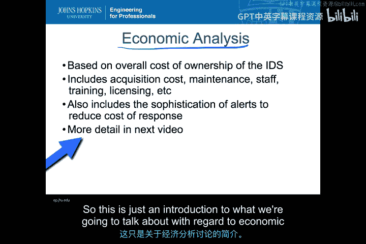

## 经济分析法

除了基于特征的分析，我们可能希望进行经济分析，以了解在我的基础设施中部署IDS以满足需求的最具成本效益的方式。因此，我将基于入侵检测系统的总拥有成本来进行此分析。这将包括购置成本、维护、员工培训、许可等与运行IDS并使用结果实际降低风险有关的一切。我还必须考虑警报的复杂性，以确定警报是否足够复杂，能够真正应对将降低我风险的那种威胁。我们将在下一个视频中更详细地介绍这一点，所以这只是对我们将要讨论的经济分析的介绍。

## 基于结果的比较法

现在，我将花一些时间看看基于结果的比较。基本上，这将是我们的入侵检测系统在部署环境中的测试和性能。

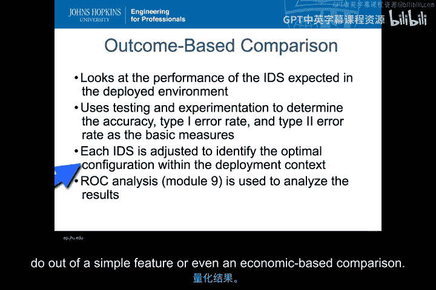

在这种情况下，我们必须至少获取我们想要使用的入侵检测系统的某种测试版本，以便在某种直接环境、我们环境的代表环境或至少代表我们环境的数据中部署它们。因此，我们将使用测试和实验来确定准确性、类型1（误报）错误率、类型2（漏报）错误率以及一些基本指标，以说明这个特定的IDS在我们这样的环境中工作得如何。

在这个过程中，我们将调整每个IDS的配置，以最大化或优化部署，并覆盖我们特定环境中真正关心的风险类型。因此，这比基于特征或经济的分析要深入得多，但也更紧密地联系到部署环境的具体情况，以降低风险。因此，您从基于结果的比较中获得的定量结果比从简单的特征甚至基于经济的比较中获得的要多得多。我们将详细讨论一些特定的定量分析，称为接收者操作特征曲线，我们将使用它来分析从基于结果的比较中获得的结果。

在基于结果的比较中，我们试图做的全部事情都围绕着混淆矩阵。这是我们在讨论尝试对我们的特定IDS进行定量分析时将使用的关键工件。攻击被分类器（即IDS）检测到或未检测到。如果它被IDS检测到，我们称之为真阳性或检测到。如果未被检测到，我们称之为正常或假。这为我们进行IDS检测测试时提供了四种可能的结果。

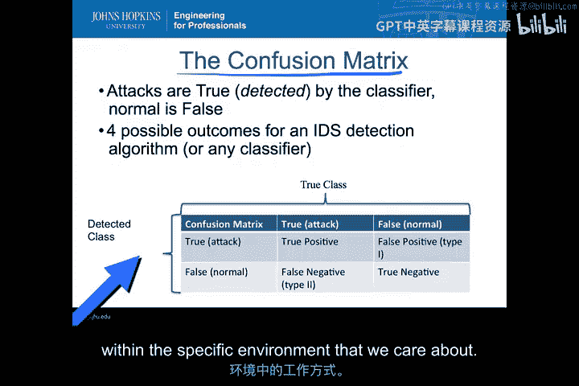

我们可以有检测到的类别和真实的类别。真实的类别是数据或环境真正提供的，检测到的类别是我们正在测试的每个IDS实际给出的。因此，如果存在真正的攻击并且IDS确实检测到了它，我们称之为真阳性，我们可以在这里计数。

如果存在真正的正常情况，但未被检测到，却被IDS检测到了，那么我们得到一个类型1错误，即误报。如果真实的类别是阳性，但检测到的类别错过了它。这是IDS未发现事件的情况。这是一个类型2错误。那是我们的漏报。最后，如果存在真阴性，即在真实类别中为阴性且IDS未将其检测为事件的情况，我们称之为真阴性或正常的适当测试。

一旦我们在任何给定的IDS测试中获得了所有这些计数，我们就可以在一系列不同类型的定量分析中使用它们，以比较这些IDS在我们关心的特定环境中的工作方式。

进行这种基于结果的比较的典型程序如下所列。第一步，我们必须开发代表部署环境的测试数据。这非常重要，如果我们要开发测试数据，它必须实际代表我们想要部署的环境。这意味着它具有我们试图保护的相同类型的资产，以及我们可能期望用IDS检测到的相同类型的攻击，并且它必须具有我们希望IDS正确分类为正常的正常行为。这第一步可能是进行基于结果的比较中最困难的部分之一。开发或使用外部测试数据库来理解如何进行这些测试，涉及一系列要素和问题，以确保其具有适当的代表性，确保其具有正确的攻击类型，确保其正确代表我们的资产。

因此，一旦我们完成了这项工作并拥有了测试数据，我们就可以使用测试数据对每个IDS进行调优和相互测试。因此，我们可能会使用单个IDS的各种不同配置类型，这将从我们的测试数据中给出不同的结果。使用相同的测试数据，我们可以对多个具有不同配置的不同入侵检测系统运行相同的测试数据，并进行真正的正面比较，以了解这些IDS在测试数据中的工作情况。

在通过测试数据运行后，我们可以为要比较的每个IDS配置生成混淆矩阵。从那里，我们可以开始分析，收集每个配置的性能、规模数据，然后我们可以使用接收者操作特征曲线、精确率-召回率图或任何其他表示形式来比较这些IDS的性能。我们将在下一个模块中更详细地介绍ROC图、PR图和其他类型的详细定量分析。对于本模块，我们将更多地讨论收集性能和规模数据，然后仅对检测率、错误率和性能之间的权衡进行集体数据点的比较。

现在，这是对基于结果的比较过程的一个非常高级的概述。显然，在这六个步骤中的每一个步骤中，都有大量细节我目前只是略过，您必须完成这些细节才能进行公平、严谨、可重复的测试，并且该测试实际上代表了您将在实际环境中部署的IDS类型。

## 方法总结与应用场景

到目前为止，我们在这个视频中讨论了三种技术。我们有基于特征的分析、基于经济的分析和基于结果的分析。那么，您何时会想使用这些方法中的每一种？何时会想结合使用它们？

一种看待它的方式是基本上只看它们的优缺点。对于基于特征的分析，请记住，这只是查看IDS的数据表和规格表以及外部测试，以评估它是否值得在我们的环境中运行。因此，正如您可以想象的，收集这些数据很容易。它将作为营销材料的一部分出现。可能会有学术文章和其他类型的分析，您可以获取并阅读关于特定IDS的内容，这些内容真正了解这些IDS在某种测试环境中的性能。然而，这种方法的缺点是，创建这些特征的测试环境不一定非常准确地反映您的环境。而且，特别是来自营销数据，这些特征往往非常主观。例如，他们可能会说我们检测零日攻击。但这到底意味着什么？这是否意味着它对各种类型的攻击进行某种异常检测？它是否具有真正查看其他从未发生过的新型攻击的创新技术？因此，当您查看的只是来自外部测试和营销的数据时，有很多这类开放性问题。此外，这些特征分析不会解决您自己环境中的特定性能问题和约束。这非常重要，因为仅通过查看功能列表，您很难知道其中一些IDS的扩展性如何。

如果我们看经济分析法，我们将在下一个视频中讨论如何进行经济分析的细节，但这种方法的优缺点在于，我们可以解决初始和经常性成本。我们可以将技术和人员联系起来。这可能是其中最重要的部分之一，即我们可以将其视为一种方式，不仅孤立地看待技术，而且着眼于该技术如何适应我们的团队和事件响应团队、CERT团队，以了解我们将如何利用IDS的结果来降低风险。从经济分析来看，向决策者传达这一点相当容易，因为成本将以底线形式的美元和美分计算。

然而，这种方法的缺点是，这些分析会推动最小化成本的解决方案，并且它们可能比其他可能功能更全的系统或您可能想要测试的系统效果差得多。在进行这种经济分析时，您常常会低估人员和经常性成本。大多数销售IDS的公司都有低估这些成本的最大利益。如果不仔细分析您将如何部署这些不同类型的入侵检测，您可能无法意识到实际使用它们所需的一些培训和人员配备要求。最后，这些经济分析技术相对静态，不能很好地适应不断变化的威胁，并且随着威胁的变化，IDS内部可能存在增加各种成本的开放式经济需求。

在基于结果的分析中，这种方法产生定量结果。您确实在您的环境背景下获得它，因此您对IDS在您特定环境中的性能有更好的了解。它还允许您考虑单个IDS内的多种不同配置，并充分考虑性能问题。但要明白，这是一种昂贵且难以进行的分析类型。它需要对测试环境或测试数据进行大量投资，并且难以比较IDS中根本不同的方法。如果我有一个看起来像网络数据集的数据集，它可能无法告诉我基于主机的IDS在那种情况下将如何降低我可能拥有的相同类型的风险。

## 结合使用多种方法

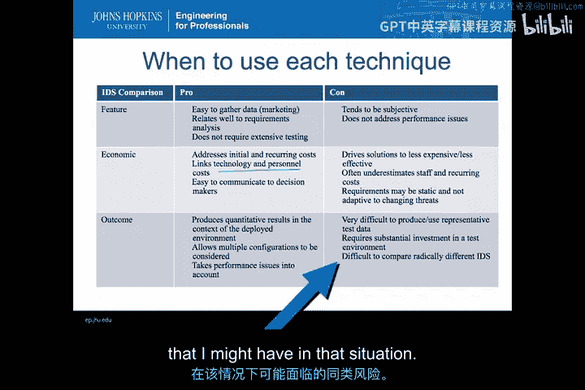

最后，没有任何规定说我们不能将这些技术结合使用。每种技术都可以用来解决其他一些技术的不足。因此，特征列表本身可以用来对您的初始选择进行分类，以获得数量较少的IDS，然后您将对这些IDS进行基于结果的选择。最后，在完成基于结果的选择后，您可能希望进行经济比较，以了解您可能想要使用的任何解决方案的可负担性和总拥有成本。

这些是您开始比较不同入侵检测系统的一些方法。随着我们学习本模块和下一个模块，我们将越来越明确地介绍如何实际运行这些测试，以便您可以清楚地证明您可以获取IDS并运行测试，并在两个或多个入侵检测系统之间进行定量比较。

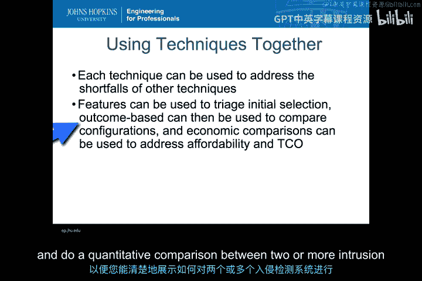

在本节课中，我们一起学习了三种比较入侵检测系统的主要方法：基于特征的分析、基于经济的分析和基于结果的分析。每种方法都有其适用场景和优缺点，并且可以结合使用以获得更全面的评估。理解这些方法将帮助您为特定环境选择最合适的IDS。