# 029：入侵检测系统的经济效益分析 💰

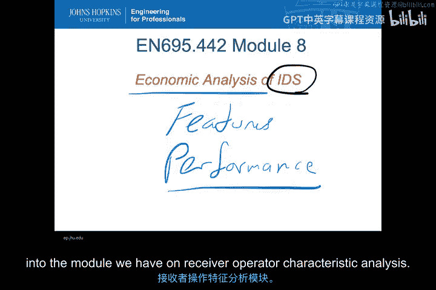

在本节课中，我们将更深入地探讨如何对不同入侵检测系统进行经济效益比较。这是评估和选择最适合特定环境的入侵检测系统的三种方法之一。

上一节我们主要讨论了基于**功能特性**的比较。本节我们将聚焦于**经济效益分析**。在下一节视频中，我们将讨论如何基于**性能**进行定量分析，而性能比较的概念也将延续到我们关于接收者操作特征分析的模块中。

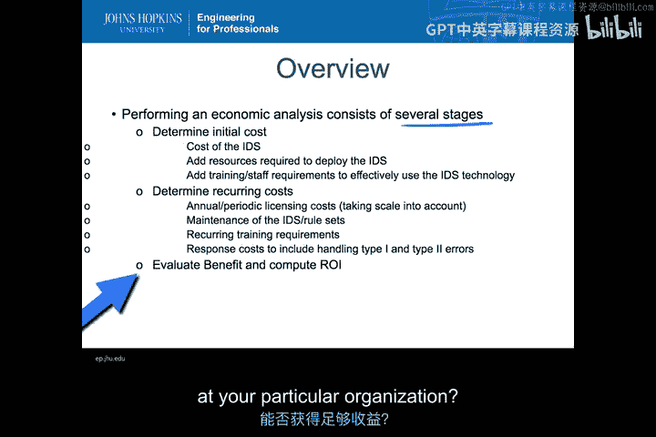

---

## 确定初始成本 💸

进行经济效益分析的第一步是确定初始成本。这不仅仅是IDS软件或硬件的采购成本，还包括部署后运行IDS所需的所有资源成本。

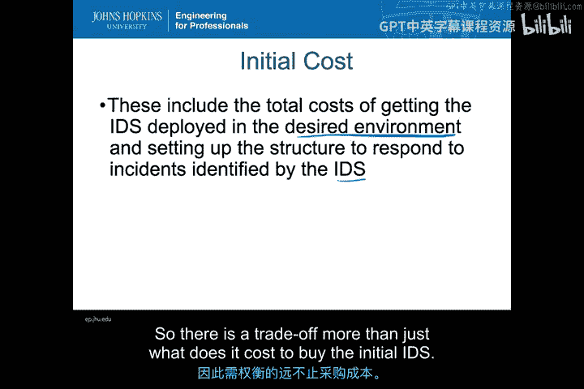

需要记住的是，部署IDS的总成本远不止购买软件和硬件。您可能需要修改目标环境，以确保具备设置IDS所需的一切条件。您必须拥有所有的数据传输、传感器和分析能力，以明确在给定IDS下希望检测到哪些类型的事件和事故。

许多人倾向于选择开源或免费版本的入侵检测系统，认为这将大幅节省成本。然而，事实往往并非如此。这些免费IDS看起来很好，因为您可以快速下载并运行软件，但您通常没有一个公司在背后支持，以确保您拥有理想的环境，确保其针对所有可能需要的外部资源进行了适当调优。因此，这里存在一个权衡，而不仅仅是购买初始IDS的成本。

---

## 成本构成因素

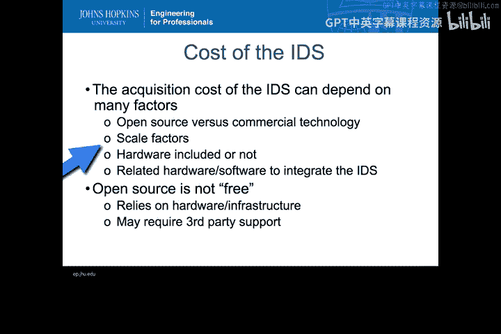

IDS的成本确实取决于许多因素。

*   **开源与商业技术成本**：开源技术可以免费下载和运行，而商业技术则需要采购。开源与商业技术的功能特性差异不一定很大。商业技术可能具有一些开源技术不具备的额外功能。例如，商业技术Sourcefire基于开源技术Snort，但提供了更多功能。然而，如果您寻找的是普通Snort就能发现的东西，那么转向Sourcefire并不会带来太多额外价值。另一方面，像Sourcefire这样的商业产品通常能提供更大的扩展能力，因为它拥有定制硬件和经过调优的软件，而不仅仅是下载的开源代码。这些安装通常可以扩展到比某些开源工具所能支持的更大、更复杂的环境。例如，Bro作为一个开源工具，是用于高级入侵检测的优秀工具，但它并非为高性能而设计，其运行速度可能不及某些商业技术产品。
*   **硬件考虑**：对于商业技术，您通常会获得一个**设备**，即专门为运行该特定IDS而调优和安装的硬件。如果使用开源IDS，您需要意识到，您将需要使用额外的硬件资源，通常是大量的硬件资源，才能将其部署到整个基础设施中。
*   **集成成本**：当然，还需要考虑将IDS集成到环境中所需的其他相关硬件和软件问题。这可能包括从网络分路器和额外交换机，到对VPN或虚拟网络设置方式进行重大更改等方方面面，以便将传感器信息路由到您的IDS。

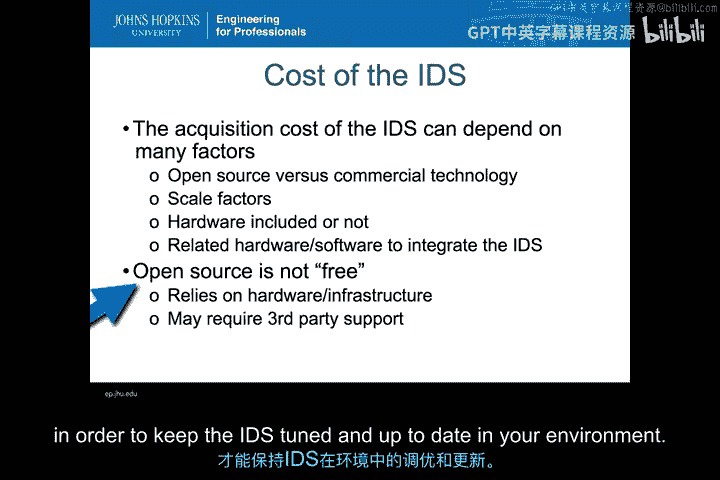

总而言之，在您的基础设施内部署IDS时，开源并非免费。您确实依赖于硬件基础设施，并且可能需要某种第三方支持，以保持IDS在您的环境中得到调优和更新。

---

## 非IDS相关的部署成本

上一张幻灯片提到了一些非IDS相关的部署成本，即那些不直接随IDS提供，但却是IDS正常工作所必需的。

以下是这些成本的主要类别：

*   **传感器**：为了将所有可观测数据传送到IDS，您需要部署传感器。可观测数据必须包含感兴趣的攻击数据，否则任何IDS都无法检测到这些事件。这听起来显而易见，但常常被遗忘。您需要确定希望从何处获取可观测数据。这是决定传感器部署位置的主要驱动因素，同时也需要考虑是否需要额外的带宽或其他资源来将传感器数据传回入侵检测系统，以便这些更集中的IDS能够协调处理所有不同的传感器信息。对于高度敏感的企业和组织，您甚至可能希望使用传感器与IDS之间的带外通信，以防止入侵者介入传感器与IDS之间的数据路径。
*   **警报分发**：从警报分发端来看，我们必须将从IDS产生的任何警报传递给防御者，即那些将根据发生的情况采取行动的人员。这可能也需要额外的硬件和软件，以确保防御者能够近乎实时地收到警报，并确保他们确实收到了这些警报。如果防御者没有收到警报，那就等同于漏报，与第二类错误完全一样。有时，这可能需要与现有的安全事件管理器进行某种集成。此外，在及时性和成本之间总是存在权衡。
*   **分析引擎**：如果试图检测的事件集合非常复杂，需要复杂的传感器数据组织关联，则可能需要额外的硬件和软件资源来实际执行分析。因此，您必须考虑到，不仅仅是希望获得的警报，还包括所有后端分析处理，特别是如果它是一个机器学习类型的IDS，则可能需要大量资源来训练、分类和归类所有传入IDS的传感器数据。
*   **存储限制**：我们需要考虑在哪里存储警报和传感器数据，如何长期保存，以及如何能够进行取证回溯以查看原始传感器信息。因此，了解希望保留的警报数据和传感器数据的量级，也将是我们非IDS部署成本的一部分，并且涉及另一个权衡：我们愿意投入多少来保存这些信息，以及保存多长时间？

---

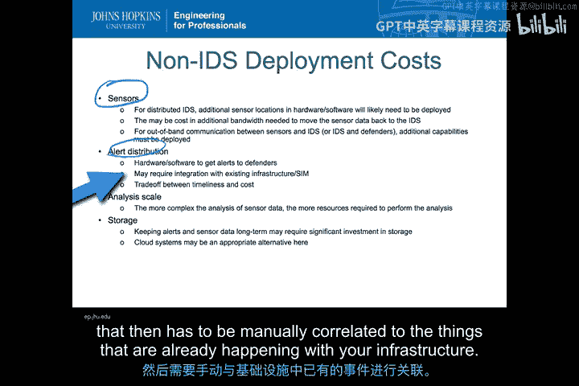

## 人员与培训成本

一旦确定了硬件和软件成本，您就必须开始考虑人力成本，特别是是否需要额外的人员，以及这些人员需要接受何种培训，才能真正利用您在IDS硬件和软件上的投资。

这通常是部署任何IDS的最大开支，即部署、维护和响应所需的人员资源。入侵检测系统需要人工环节来跟进警报并实际响应事件，以降低风险，实现在组织内降低企业风险的目标。

在人员与培训方面，存在大量权衡：

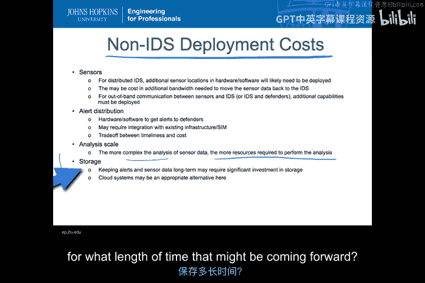

*   您可能希望使用更先进的IDS来提供更好的检测和更少的响应替代方案，然后通过IPS自动执行操作，这可能会降低人员成本，但风险是偶尔可能采取错误行动，造成自我拒绝服务，并允许对手在一定程度上控制响应周期。
*   当然，我可以采用一个IDS并大幅减少第一类错误，以减少在追踪毫无意义的警报上浪费的人员时间。这是一种通过前期投入来减少后期所需人员需求的方法。
*   最后，IDS越好用、越易于使用，就越能减少人员培训所需的专业知识，从而避免让我最专业的网络管理员一直忙于IDS工作。

因此，这种减少第一类错误的方式可以显著降低人员需求，但永远无法将人员需求降至零。即使在IPS的情况下，您仍然需要大量人员来有效地使用这些IDS。在未来的一个模块中，我们将更多地讨论如何组建CSIRT团队以及需要何种专业知识，这也是早期决定如何采购IDS时人员与培训考虑的一部分。

---

## 评估持续成本 🔄

在考虑了所有初始成本之后，我们必须开始思考随着时间的推移，维护IDS所需的持续成本是什么。

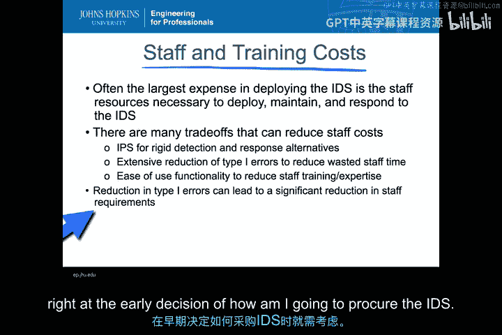

我们都习惯了那种年度许可费的概念。如果这只是我们需要担心的唯一持续成本就好了，但实际上，远不止于此。这里需要许多直接成本之外的间接成本，以长期维持功能。

以下是驱动这些持续成本的因素：

*   **威胁的变化**：威胁如何随时间变化？出现了哪些新的攻击，并已成为您风险状况的一部分？
*   **内部基础设施变化**：我的系统正在发生哪些变化？我添加了哪些新服务？部署了哪些新的关键信息？我如何进行重新架构？
*   **人员流动**：这意味着我将不得不重新培训和招聘新员工。
*   **与其他防御技术的权衡**：如果我获得了一种新的超级防御技术，我或许可以说，整个某一类警报可能不再需要这个特定的IDS了。我甚至不必担心那些特定类型的成本或传感器位置，如果我安装的额外防御技术取代了IDS的部分功能。

---

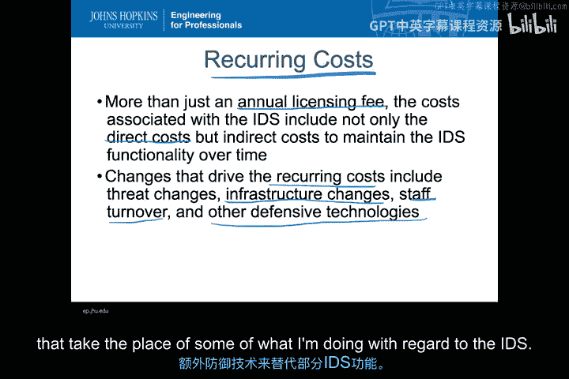

## 维持功能与成本控制

许多这些持续成本实际上归结为：我将如何维持期望的IDS功能，以持续地、可预测地降低风险，使其真正按照我希望的方式工作。

这意味着需要定期更新IDS配置，以应对不断变化的内部和外部环境因素，即各种新的威胁和攻击。为了控制成本，我需要持续调优并保持我的IDS处于最新状态。

*   **第一类错误率上升**：如果不改变IDS的配置，随着时间的推移，您会发现第一类错误率上升。如果放任不管，我会收到越来越多的误报。这是因为外部环境持续变得更加复杂，功能更多，涉及新服务，这些可能会触发IDS的现有配置。因此，每当我看到针对已知的普通服务或活动出现大量误报时，我就需要回过头来重新调优我的IDS，以将第一类错误率再次降低到合理水平。
*   **与其他防御技术的协同**：其他有助于降低风险的技术也可能改变您的IDS配置必须与这些防御技术协同工作的方式，既涉及误报，也涉及确保那些未被防火墙、访问控制等其他防御技术覆盖的攻击片段能够通过IDS配置检测到。这不仅随着IDS的变化而变化，也随着您所有防御技术的变化而变化。
*   **更新资产信息**：当然，您希望能够识别响应攻击所需的所有关键数据。这通常意味着更新IDS配置，以便列出的资产信息（例如，当警报发送给您时，您不仅希望获得IP地址，还希望该IP地址与有助于响应者根据当时所有其他情况确定优先级的关键信息相关联）需要维护。
*   **生态系统集成**：请记住，IDS是整个防御生态系统的一部分。它们协同工作以降低风险。理想情况下，您希望IDS能够与您的其他防御技术无缝集成，即插即用，以便IDS可以与防御生态系统中的所有其他方式协作。目前，供应商社区对此支持得并不好，这些技术大多仍是孤岛式的。然而，随着它们变得越来越普遍，集成的能力也会越来越强。我们将会看到这些规则集和其他防御技术开始协同运作，以便您可以通过一个统一的界面对IDS规则集和其他防御技术进行共同控制。
*   **持续的人员成本**：当然，您还有与任何这些IDS相关的持续人员成本。其中很多都集中在培训上，既包括IDS技术本身的培训，也包括当IDS实际触发特定警报时应采取的措施的培训。没有这种培训，发现如何处理事件实际上可能会抵消您期望从IDS本身获得的所有风险降低效果。基本上，如果您将IDS警报作为员工学习如何处理的培训，而没有测试、模拟或其他实践培训，那么通过加速事件响应来降低严重性的想法就大打折扣了。当然，这也受到人员流动的强烈影响，因为每次有新员工加入，他们都需要初始培训。
*   **事件处理增加**：随着发现更多的事件，通常需要更多的人员时间来应对这些事件。这是IDS在经济分析中往往被严重低估的部分。首次安装IDS并开始运行时，您并不知道自己不知道什么。因此，存在许多IDS未检测到的攻击（第二类错误），您最初也处理得不好。随着您更新IDS以覆盖越来越多的攻击基础，人员现在将需要处理从IDS发出的这些事件的警报。这实际上会导致人员资源随着时间的推移而增加，不仅仅是基于企业增长（当然，企业增长会导致人员增加），还基于随着IDS变得越来越有效而处理的事件数量和类型的增加。

---

## 错误管理成本 😓

遗憾的是，当谈到实际使用IDS的持续成本时，大部分或很大一部分成本将用于错误管理，即处理这些第一类和第二类错误。

*   **第一类错误成本**：当然，如果您从一开始就知道哪些事件是第一类错误，您就不会担心，可以直接立即将其分诊出去。但它们产生额外成本的原因在于，确认一个事件实际上是第一类错误需要大量时间，通常与解决一个真实事件所需的时间相当。这就是第一类错误（误报）带来额外成本的地方。
*   **第二类错误识别**：您的第二类错误通常通过外部报告获得。您的CSIRT不仅查看来自IDS的事件，还在寻找来自用户、客户或其他与IDS完全无关的地方报告的事件。这些外部报告有助于从IDS的角度识别第二类错误，并允许您更改IDS的配置，以便在未来开始捕获该类事件或攻击。这是一种调优IDS以引入更多真实事件的方法。

因此，您总是试图通过为第二类错误添加检测规则，并移除那些产生第一类错误的规则，来减少第一类错误和第二类错误。这是您从错误处理成本转移到IDS更新成本的持续成本。

---

## 评估效益 📈

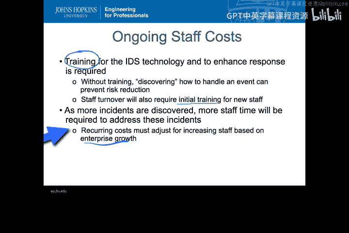

处理完到目前为止的所有内容后，您可能会想，在企业中部署IDS的成本真的很高，非常昂贵。因此，您最好从IDS中获得非常好的效益，以证明这笔巨大的初始和持续成本是合理的。

然而，评估IDS的效益极其困难。事实证明，这是经济效益分析中最困难的部分之一，即计算从部署IDS以及确保您正确使用IDS所需的所有支持结构中获得的效益。

有几种方法可以评估效益：

*   **参考类似组织**：这在实践中是最常见的方法。您可以说，我是一家大型百货连锁店，而另一家连锁店上周因为没有妥善处理事件而上了报纸头版，所以我不想上头版，因此值得投资入侵检测系统以避免上头版。所以，我会参考类似的组织来估算未检测到的事件或解决时间过长的事件所带来的成本。因为事实上，如果我有了IDS，我就能更快地解决它，对我组织的影响就会更小。
*   **内部分析**：然后，您可以进行内部分析，思考事件随时间的影响有多大？我可以期望IDS将事件响应时间减少多少？我可以利用自己过去发生的事件历史进行估算，并判断如果过去发生的任何特定事件能更早得到指示，是否会显著降低该事件的成本，这有助于我从这种特定分析中理解IDS的效益。

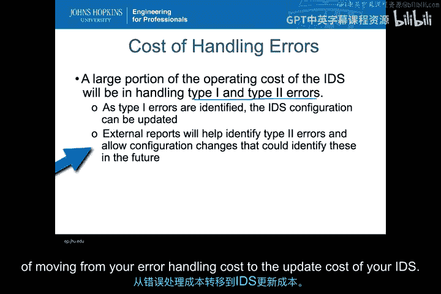

这部分分析通常以声誉而非货币效益来表达，尽管许多人会将其转化为货币效益，以便与IDS部署成本进行比较。当然，声誉成本是非常主观的，它涉及到：何时真正值得为IDS进行我们必须进行的投资。这也是使得评估IDS效益尤其困难的部分原因。

---

## 投资回报率分析

在商业世界中，这最终归结为：我们能否为安装IDS产生投资回报率。这对于我们所谓的**非功能性属性**来说尤其困难，而大多数安全类活动往往不是创利活动，它们不会对利润产生积极影响，仅仅被视为成本。因此，进行投资回报率分析实际上是在一组成本与另一组成本之间进行权衡。我的回报是解决事件的成本降低，而不是从实际安装IDS中获得某种利润效益。

因此，当您进行ROI分析时，要意识到您所做的是成本控制，即说明IDS将有助于降低风险和成本，最终转化为更低的成本。当入侵事件得到妥善处理时，成本就会降低。然而，进行ROI分析也存在一些困难：如果我已有一些措施，并且似乎在处理事件方面做得不错，我可能会说，看，我已经在团队和当前工作上投入了沉没成本。也许我可以通过简单地裁减人员或取消一些IDS来降低成本。看起来我们好像没有太多入侵事件，所以这可能行得通。但事实上，当您裁减人员后，入侵事件真的发生时，您可能会增加处理成本。这是问题的另一面：如果我真正担心的是成本削减，而IDS是一项成本，如果我不知道处理这些事件的货币效益是什么，我能削减它吗？

如前所述，利润的概念更多地与无事件运行相关：我能否更有效地交付产品和服务？由于IDS通常不预防事件，而是减少响应时间，将其直接与利润挂钩可能很困难，但这并非不可能。有一个名为DevOps和安全DevOps的组织正在开始将DevOps形式的安全工作与利润联系起来，基本上是为公司带来利润。因此，当我们在讨论如何计算某种投资回报率时，这是另一个可以提供很大帮助的领域。

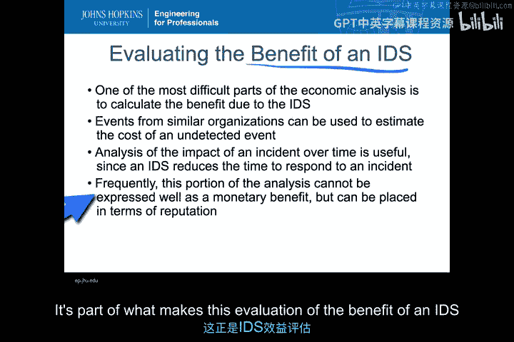

---

## 其他成本合理性考量

除了简单地看投资回报率之外，还有一些其他方法可以证明成本的合理性。

您可以实际观察您的IDS团队，并随着时间的推移观察复杂基础设施增加了您的CSIRT响应团队所需的资源。然后您可以说，对IDS的额外投资可以通过提高响应团队的效率和效果，来维持甚至降低部分成本。请记住，在这种情况下，IDS实际上只是一个帮助CSIRT团队更快、更有效地响应的工具。因此，就像所有其他工具一样，您通常可以通过随着时间的推移所能达到的效果和效率水平来证明该工具及其支持成本的合理性。

---

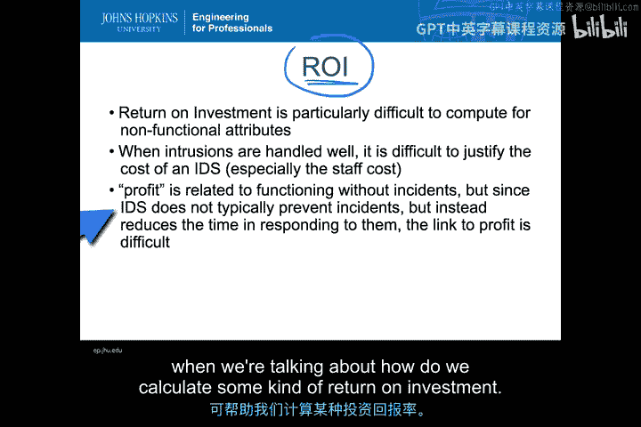

## 总结与整合 📝

最终，您必须将所有这一切整合起来。您基本上需要说，好吧，我如何真正考虑所有这些不同的因素，以确定部署IDS是否值得，以及值得投入多少。当您知道总成本，并且知道这个总成本显著高于您预期的成本节省时，您可能会考虑替代方案。也许拥有世界上最高标准的IDS并不是最好的选择，但拥有一个能帮助提高响应团队效率的工具是值得的。

真正重要的是预先明确总成本和持续成本。您看到的最糟糕的情况是，因为低估了成本而过度投资于IDS，然后在几个月甚至几年后，组织会审视并说，我们在整个IDS基础设施和生态系统上花费了太多，以达到我们期望的效果水平。然后您会进行大幅削减，这可能像钟摆一样摆向另一个极端，使您的组织无法有效了解攻击及其结果，而这一切都是以试图将成本降回来为名。

因此，预先了解成本并进行现实的估算，是确保每个人都参与其中并理解总初始成本和持续成本是什么，以及可能为CSIRT团队和整个组织在降低风险方面带来哪些效益的一种方式。预先明确这些，也将使您能够制定一系列指标，以确保随着时间的推移能够维持这种状态。

当您将所有经济效益分析整合在一起时，正如我们之前所说，经济效益分析不必取代功能或性能分析。您实际上可以同时使用所有这些分析，在性能与经济成本之间进行权衡，以便综合考虑这些因素。这就是我们处理这三种不同类型分析的原因。

---

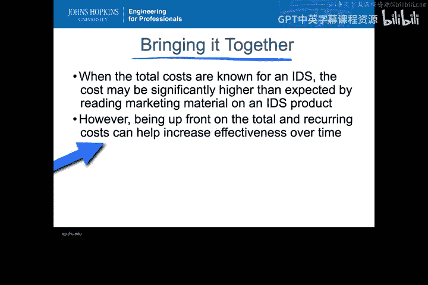

本节课中，我们一起学习了如何对入侵检测系统进行经济效益分析。我们详细探讨了初始成本的构成（包括硬件、软件、集成和人员培训），分析了持续运营与维护成本（如许可、调优、错误管理和人员流动），并讨论了评估IDS效益的挑战与方法（如同行参考、内部分析和ROI考量）。关键在于进行全面的、现实的成本效益估算，以确保投资决策的合理性，并将IDS作为整个安全防御生态系统中提升效率的工具来考量。