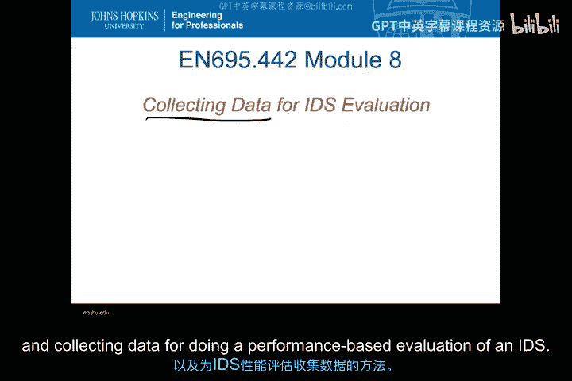
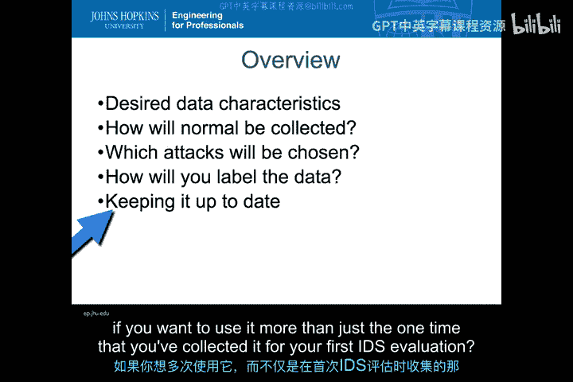
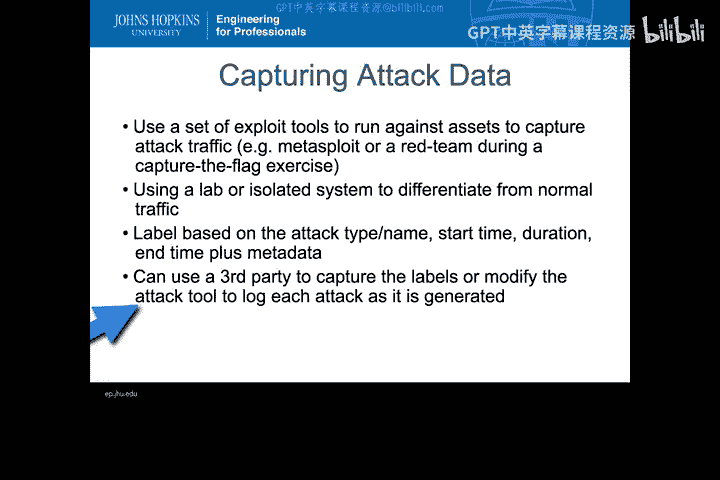
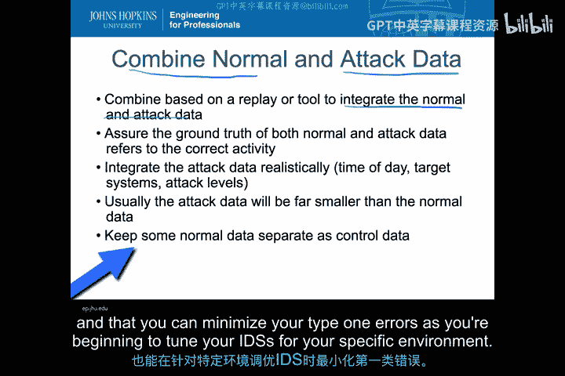
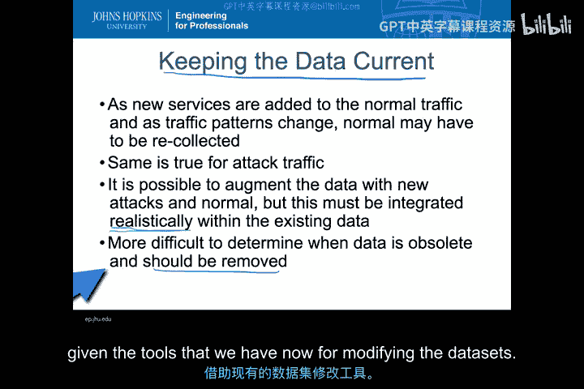
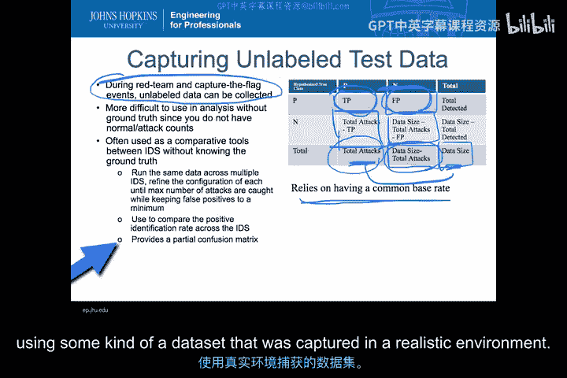
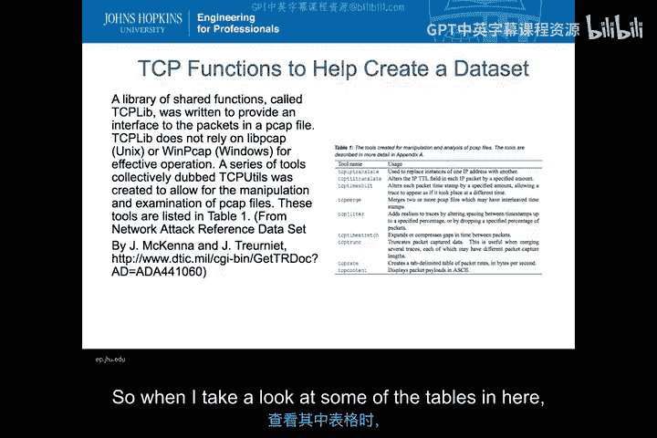
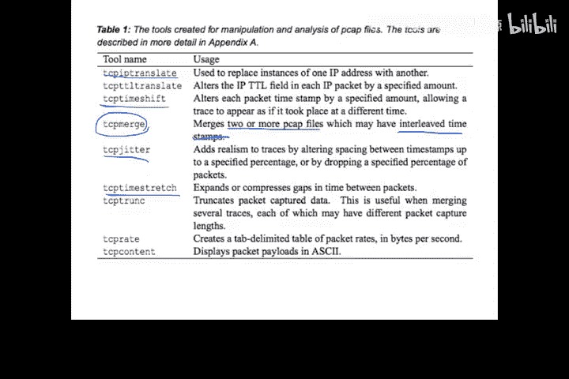
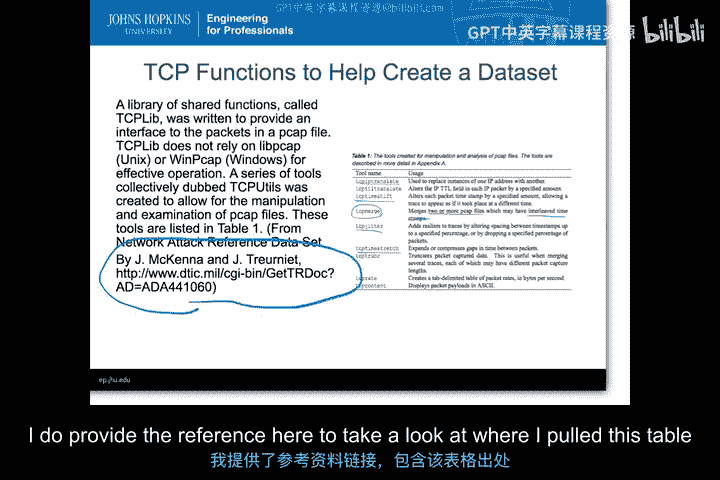
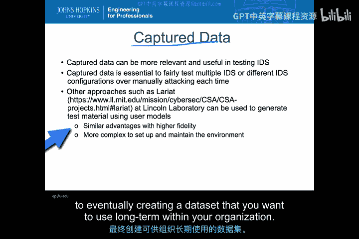

# 030：IDS评估数据采集方法 📊

在本节课中，我们将学习如何为基于性能或结果的入侵检测系统评估采集和准备数据。确保使用正确的数据是任何IDS评估分析中最关键的部分之一。我们将探讨自行采集数据与使用外部数据集的利弊，并详细介绍构建高质量测试数据集的具体步骤。

---

## 数据采集的利弊权衡 ⚖️

上一节我们提到了数据的重要性，本节中我们来看看自行采集测试数据的优缺点。

自行采集数据的主要优势在于其与自身系统需求的高度契合。外部数据集中的正常和攻击流量可能与你的系统环境毫无关系，它们通常非常通用。而自行采集数据时，你可以精确定义什么是正常行为，什么是攻击行为。你可以自己管理数据，无需依赖外部组织来确保数据的正确性、标签的准确性以及可用性。此外，你还可以包含敏感数据特征，例如内部关键资产的IP地址，这些信息你绝不会希望暴露在公开数据集中。

然而，自行采集数据也存在缺点。正确获取测试数据要困难得多，我们将在本视频中详细讨论如何生成这种测试数据。你必须自己维护和更新数据，这会消耗资源。并且，你只能基于已知的知识来构建数据，外部攻击数据库可能包含你没有专业知识或能力发起的攻击类型，因此你可能无法囊括所有希望包含的攻击数据。

简而言之，自行采集数据的优点主要围绕**正常数据**的定制化，而外部测试数据的优势则在于可能提供更全面、更新的**攻击数据**。

---

## 理想的数据特征 ✅

在开始采集前，了解理想的测试数据应具备哪些特征至关重要。

以下是构建高质量IDS测试数据集所需的关键特征：

*   **带标签的攻击与正常事件数据**：你需要知道哪些是攻击，哪些是正常流量。这是评估的基础。
*   **网络与主机数据兼备**：因为你需要权衡基于网络的IDS和基于主机的IDS的性能，两者数据都应收集。
*   **可统一的基础速率**：不同的IDS可能基于数据包、会话或进程等不同粒度发出警报。你需要能够将这些警报统一到一个共同的基础速率（如数据包级或会话级）上进行公平比较。
*   **详细的时间戳**：测试数据和标签中必须有精确的时间戳，以便将IDS警报与测试数据中的事件准确匹配。
*   **现代的攻击与正常的流量**：数据集应包含当前正在使用的攻击手法和代表现代网络环境的正常流量，过时的数据没有参考价值。

---

## 外部数据集示例：林肯实验室1999年DARPA数据集 📂

让我们以一个著名的外部数据集为例，看看它是否符合上述理想特征。

林肯实验室1999年DARPA IDS测试数据集是一个带标签的攻击数据集。其正常数据未标记，但攻击数据在单独的文件中进行了标注。该数据集主要面向基于网络的IDS，提供PCAP和TCP dump文件供重放。

然而，它存在一些局限性：
1.  **缺乏基础速率归一化**：事件被列为攻击，并给出了开始时间和持续时间，但没有逐数据包地列出哪些是正常包、哪些是攻击包。
2.  **时间戳问题**：数据使用本地时间而非GMT，如果IDS使用GMT时间，匹配会存在困难。
3.  **数据过时**：这是1999年的数据，其正常流量和攻击流量都已无法代表当今的互联网环境。

尽管如此，由于公开可用的带标签数据集很少，它至今仍被广泛使用。这个例子清晰地展示了理想特征与实际可用外部数据集之间的差距。

---

## 采集与标记正常数据 🖥️

现在，我们来看看如何自行采集和标记数据。首先从正常数据开始。

采集正常数据时，你需要在模拟正常行为的同时，使用网络和主机传感器进行收集。关键在于**在采集时同步进行标记**，因为事后回溯和重新标记所有捕获的数据将极其困难。

你需要一种方法，在发送网络流量和主机进程活动时，就为它们打上“正常”以及更细粒度的行为标签（例如，“网页浏览”、“Word文档处理”）。更细致的标签有助于在评估中分析误报的来源。

最后，你必须确保在采集期间没有任何攻击或异常数据混入。这在隔离环境中相对容易，但在监控真实生产环境以创建“正常”流量时则非常困难，因为你无法保证当时没有未被察觉的高级攻击正在发生。

---

## 采集与标记攻击数据 ⚔️

接下来，我们看看攻击数据的采集。

采集攻击数据相对直接。如果你拥有一套漏洞利用工具（无论是在主机端还是网络端），就可以在隔离环境中运行这些工具，并像采集正常数据一样进行收集。

此过程中，将所有活动标记为“攻击”数据。标签不仅应包含攻击类型名称，还应包括开始时间、持续时间和结束时间，以及其他你认为重要的特征（如利用的漏洞CVE编号）。这有助于评估IDS是否不仅检测到了攻击，还正确地对其进行了分类。

你可以使用第三方工具来捕获这些标签，或者直接修改你从互联网收集的攻击工具，使其在每次生成攻击时自动记录日志。事先规划好标记方法将使采集带标签攻击数据的工作轻松得多。

---

## 合并与整合数据集 🔀

按照上述流程，你将得到两个独立的数据集：正常数据集和攻击数据集。现在需要将它们合并成一个统一的测试集。

你需要使用重放工具或其他集成工具，将正常流量和攻击流量合并到你的系统中。必须确保合并后数据中正常和攻击活动的“真实情况”标签依然正确对应。

整合攻击数据时需要**注重现实性**。攻击的发生时间、频率不应是均匀分布的，而应模拟真实世界的模式（例如，工作时间可能遭受更多攻击）。通常，攻击数据量远小于正常数据量，这符合现实情况。

最后，建议保留一部分**纯正常数据**作为控制集，其中不掺杂任何攻击。这样，当你用这部分数据测试IDS时，产生的任何警报都明确是误报（I类错误）。这既是验证数据可重放性的好方法，也是调整IDS以减少误报的起点。

---

## 维护与更新数据集 🔄

一旦掌握了合并数据的方法，保持数据集的时效性就会相对容易。

当有新的服务或正常流量模式出现时，你可以重新采集一部分正常流量，然后将这些新的“正常”内容整合到不断增长的数据库中。对于攻击流量也是如此：如果出现了新型攻击，你可以生成这些攻击，按需调整时间戳，然后将其整合到数据集中。

这种方法允许你以增量的方式维护和更新数据，而无需每次都从头开始重新采集所有数据。关键在于要**现实地整合**新数据，确保新攻击在正确的时间、针对正确的资产发生，方式符合IDS检测的实际情况。

更困难的部分在于决定何时从数据集中移除过时的内容。例如，当某个网络服务不再使用时，或者某种攻击手法已完全过时，你能否在不完全重新生成正常数据的情况下，仅移除数据集中相关的部分？在某些情况下，借助现有的数据修改工具或许可以做到，但评估移除某些数据对整体数据集代表性的影响，通常比单纯添加新数据要复杂。

---

## 处理未标记的数据集 🏴‍☠️

有时，你可能无法直接获得带标签的数据。例如，在红队演练或夺旗赛中，正常流量和攻击流量交织在一起，且最初没有标签。你只有一个记录了所有事件的数据集，但没有“真实情况”标签。

使用这种数据集进行IDS测试要困难得多，因为你必须事后创建真实情况标签。即使你有一份关于使用了哪些攻击的高级描述，并试图在数据集中识别它们，要获得完整、准确的标签也颇具挑战性。

尽管如此，这类数据集往往是实际可用的。你仍然可以利用它们进行比较分析，即使不完全了解真实情况。方法如下：将这个未标记的数据集在多个IDS上运行。你至少可以观察到每个IDS触发了哪些警报。如果你知道攻击流中包含哪些攻击（即使不知道具体时间），就可以识别出一些**真正例**。同样，你也可以统计出**误报**（触发了但并非演练部分的警报）。

这样，你至少可以通过查看混淆矩阵中的特定行或列，来比较不同IDS的阳性识别率。你甚至可以通过一些简单的数学来估算混淆矩阵的其他部分。例如，如果你知道攻击总数（基于某种共同的基础速率，如会话数），并且统计出了真正例数，就可以计算出漏报数。同样，如果你知道数据总量和攻击总数，就可以估算出正常事件总数，进而结合误报数估算出真反例数。

这虽然不如使用带标签数据集那样精确，但仍然是使用在真实环境中捕获的数据集对多个IDS进行比较分析的一种可行方法。

---

## 使用工具整合数据 🛠️

那么，如何具体整合这些不同的数据片段呢？首先从网络侧谈起。

有许多TCP相关工具可以帮助你创建和操作数据。例如，有一个名为`TCPLib`的库，它提供了一个操作PCAP文件中数据包的接口。它允许你读取一个或多个PCAP文件并进行修改，以便将它们整合到一个共同的测试集中。

以下是`TCPLib`中一些对数据整合非常有用的工具示例：

*   **`tcp_merge`**：合并两个或多个PCAP文件。如果你有在不同时间段捕获的攻击和正常流量，可以先用时间偏移工具调整，再用此工具合并。
*   **`tcp_time_shift`**：调整PCAP文件中数据包的时间戳。例如，如果你的正常数据采集于某天，攻击数据采集于另一天，可以使用此工具将两者时间戳调整到同一时间范围内。
*   **`tcp_rewrite_ip`**：重写IP地址。你可以将原始数据中攻击的目标IP地址，替换为你测试环境中实际的资产IP地址。
*   **`tcp_expand_time` / `tcp_compress_time`**：扩展或压缩时间。可以用于调整流量回放的速度，或者模拟不同时间段的流量密度。

这些工具极大地简化了网络侧PCAP文件的操纵工作，使你能够将多个来源的数据合并、调整并最终创建一个包含所有所需特征的单一、可用的数据集。

---

## 总结与替代方案 📝

本节课中，我们一起学习了为IDS评估采集和准备数据的关键方法。

自行采集数据的价值在于，你创建的数据集能真实代表你的环境，并且可以在测试不同IDS或不同配置时重复使用。这比依赖一个可能无法反映你真实环境的公开数据集，能提供更可信的评估结果。

除了创建静态数据集进行重放之外，还有一种替代方案：建立一个**脚本化的测试环境**。在这个环境中，正常用户活动和攻击活动可以通过用户行为模型或攻击工具按需生成和重放。

这种方法的优点是，你可以更容易地修改用户模型和攻击模型，以精确代表你所期望的环境。缺点则是，测试运行时间大致是实时的，因为活动需要按脚本实时生成。而使用预录的数据集，你通常可以以快于实时的速度进行重放，从而加快测试进程。

无论选择哪种方法，目标都是建立一个能够长期、有效支持你组织内IDS评估和选型的数据基础。虽然其中涉及许多细节，例如攻击工具的选择、数据集的验证等，但掌握这些核心的采集、标记、整合与维护原则，是迈向成功评估的第一步。