# 033：导论 🎯

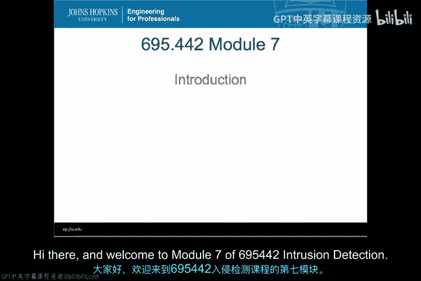

在本节课中，我们将要学习模块七的核心内容，该模块主要聚焦于大规模网络入侵检测。我们将基于之前学习的网络入侵检测系统知识，探讨如何将其应用于解决真实大型企业环境中更复杂、更宏大的问题。

## 概述 📋

通过本模块的学习，你将能够区分网络态势感知工具与网络入侵检测系统。虽然两者共享许多组件和功能，且常被宣传为同类工具，但它们实际上并不相同，用途也有差异。我们将讨论如何将异常检测应用于大规模图分析和网络分析问题，即当你的监控对象从一个单一系统或一小群系统扩展到整个大型企业网络时，你能做些什么。我们将利用这些信息，通过对网络流量进行图分析来开发警报机制。你将有机会了解如何基于这些系统创建警报。我们还将区分传统的NIDS部署与支持入侵检测的大规模网络分析，展示它们如何协同工作，以及如何区分我们目前讨论的传统部署模式和包含网络态势感知的更复杂部署。最后，我们将更深入地探讨上次提到的Security Onion产品，并开始实际配置Bro IDS，作为你在Security Onion中进行入侵检测套件配置的一部分。

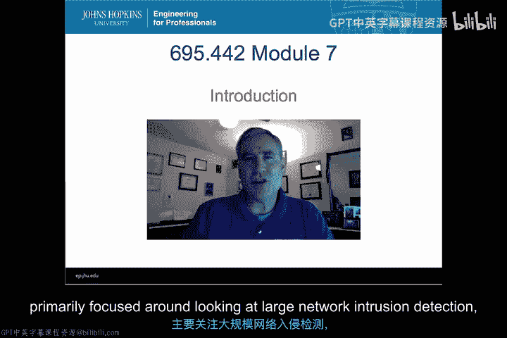

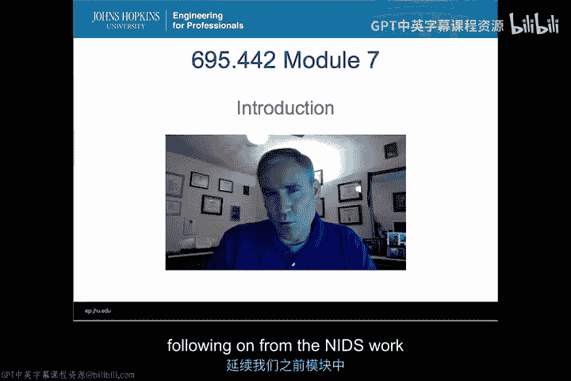

## 本模块视频内容 📹

以下是本模块你将观看的视频内容：

*   首先是当前正在观看的导论视频。
*   接下来是专门讲解网络态势感知的视频。
*   另一个视频将重点讨论大规模网络流量上的异常检测。
*   我们将深入图分析，并探讨其与大规模网络入侵检测的关系。
*   最后，我们将有一个视频更详细地介绍Security Onion，并对Bro IDS进行入门讲解。

## 各节内容预告 🔍

上一节我们概述了本模块的整体安排，本节中我们来看看每个视频将具体涵盖哪些问题。

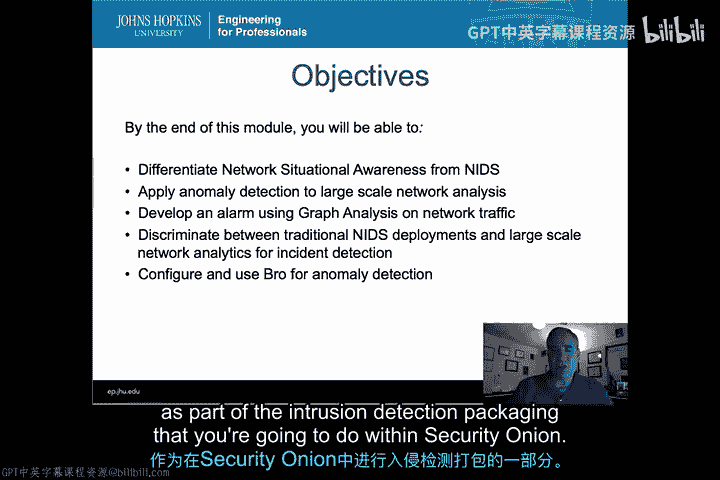

### 网络态势感知视频

在网络态势感知视频中，我们将解答以下问题：

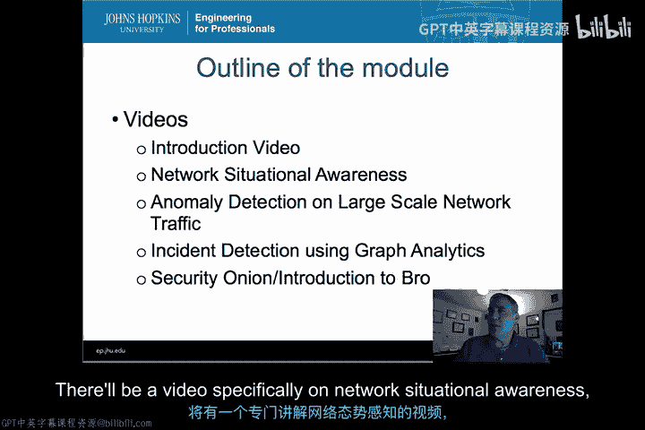

以下是该视频将回答的核心问题：

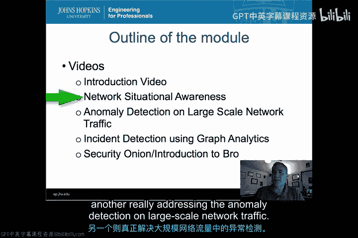

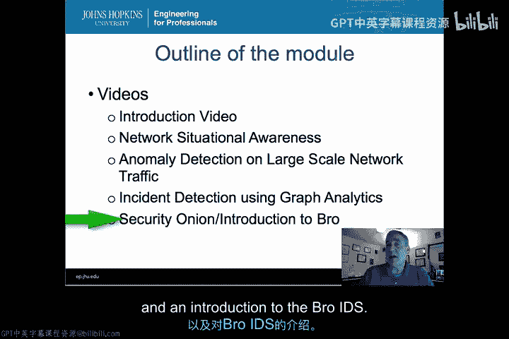

*   什么是NetSA（网络态势感知）？
*   NetSA中使用了哪些工具和技术？
*   当我们收到警报或识别出某种异常后，如何利用这些工具协助我们调查事件？
*   NetSA与网络入侵检测系统究竟有何关联？

### 大规模网络流量异常检测视频

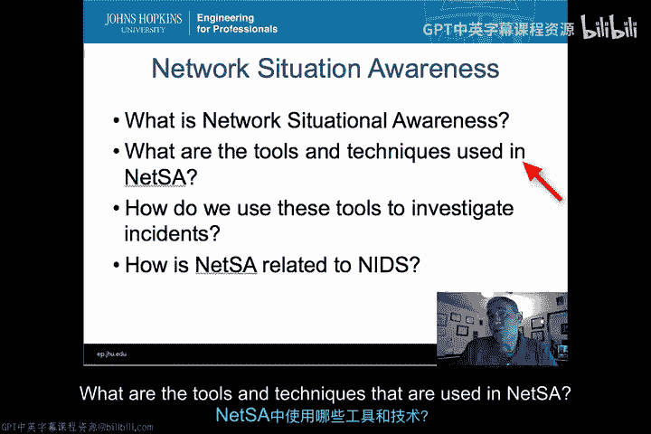

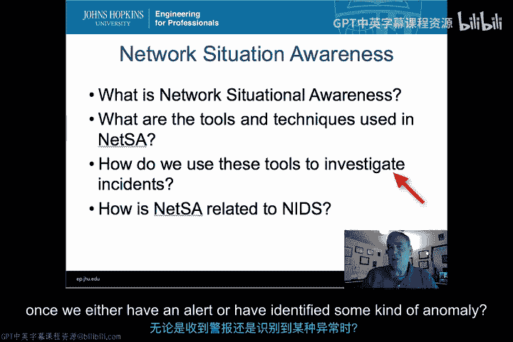

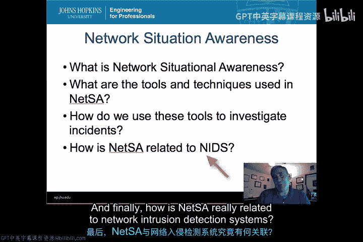

在下一个视频中，我们将在此基础上，探讨大规模网络流量上的异常检测。这将建立在利用NetSA工具帮助我们理解其特性和功能如何协助识别异常的基础上。

以下是该视频将深入讲解的内容：

*   回顾IP数据流是什么。我们过去曾简单讨论过Netflow和其他网络流量摘要，但这里将更详细地探讨IP数据流。
*   讨论你可能遇到的不同类型和格式的流数据。
*   讲解如何实际监控大规模虚拟机环境（例如商业云环境），这种环境会给你部署和使用IDS或NetSA类产品带来一些复杂性。
*   探讨这与流量流的关系，即从IP数据流构建到流量流，并利用这些流量流中的容量指标来帮助我们识别异常。这将引导我们进入行为分析和异常检测领域。
*   最后，讨论如何结合使用Netflow、元数据和NIDS来进行这种大规模异常检测。

### 图分析视频

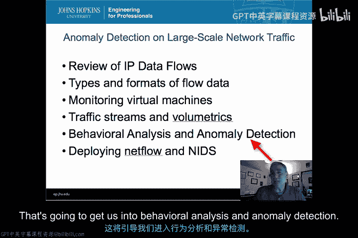

在接下来的视频中，我们将深入图分析。图分析是构建分类器以识别不同类型入侵的一个日益重要且不断发展的领域。

以下是该视频的学习路径：

*   从最基础开始，讨论什么是图。
*   讲解如何从Netflow数据构建图。
*   介绍如何在初期保持相对简单，以便我们能从这些数据中提取出一些异常。
*   讨论分析这些图的具体方法。
*   讲解如何利用图中的连通性来帮助我们定义正常行为。
*   最后，稍微拓展到研究领域，探讨局部性以及如何将局部性用于图分析，以帮助我们识别正常状态，从而开始识别异常。

### Security Onion 与 Bro IDS 视频

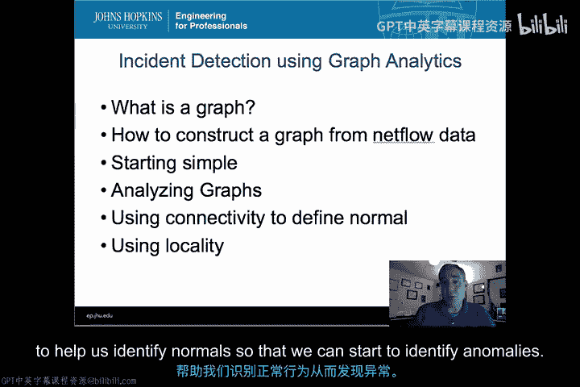

在我们完成上述内容，深入了解了图分析之后，将有一个视频帮助你进一步了解Security Onion的更多功能，并专门开始配置Bro，以便你能将其作为一个网络入侵检测系统进行评估，这是你在后续课程实验练习中将要进行的一部分。

以下是该视频的要点：

*   讨论Security Onion的组件。
*   介绍可用的分析工具。
*   讲解一些部署模式。
*   然后进入我之前提到的Bro IDS入门介绍。

## 总结 ✨

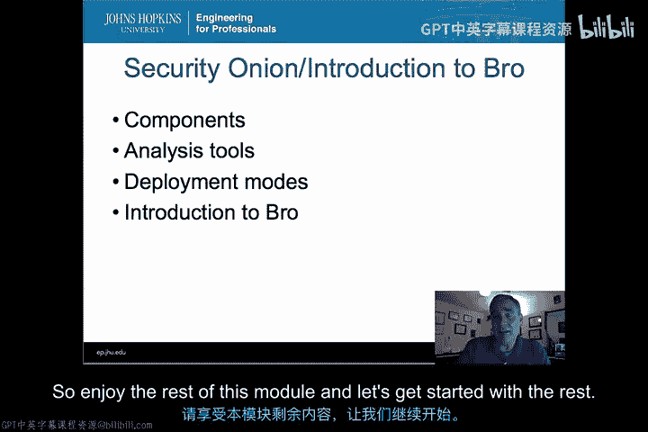

本节课中我们一起学习了模块七的导论内容。这是一个将更深入探讨IDS现实部署、利用NetSA协助识别IDS中的异常，并最终推动我们在实际动手实验中在评估环境下使用IDS的模块。这是一个承前启后的重要环节，旨在将理论知识应用于更复杂的实际场景。