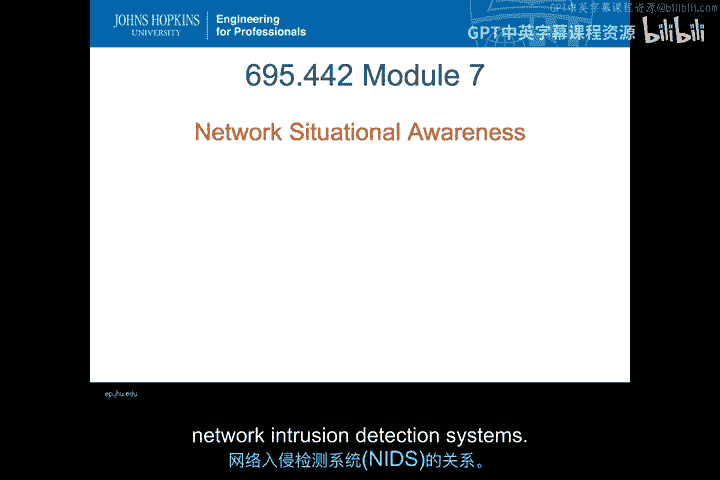
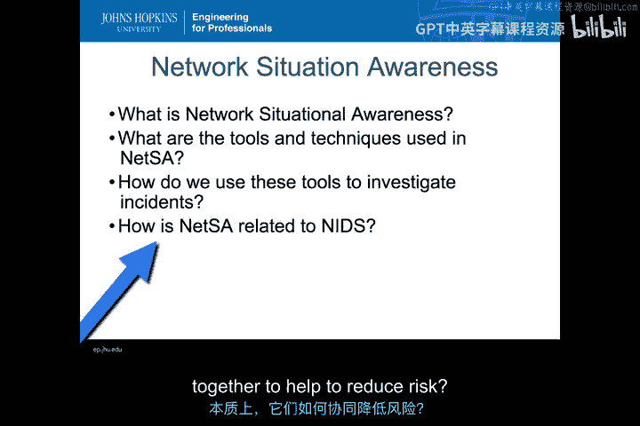
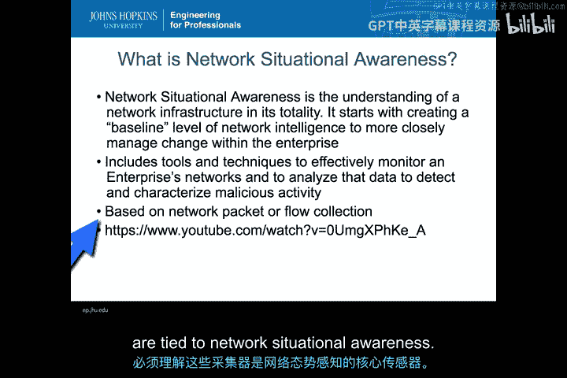
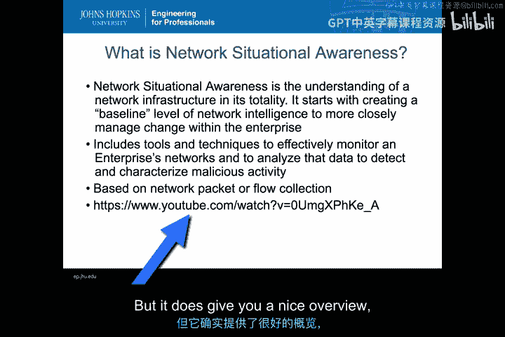
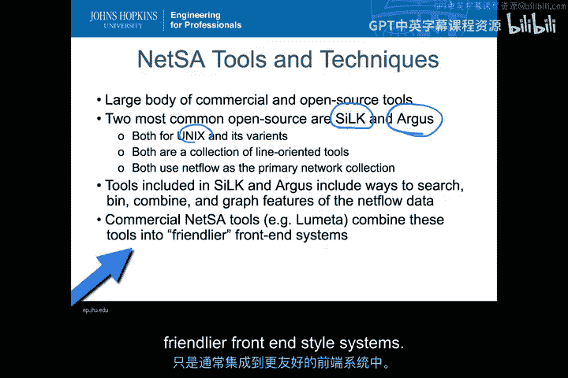
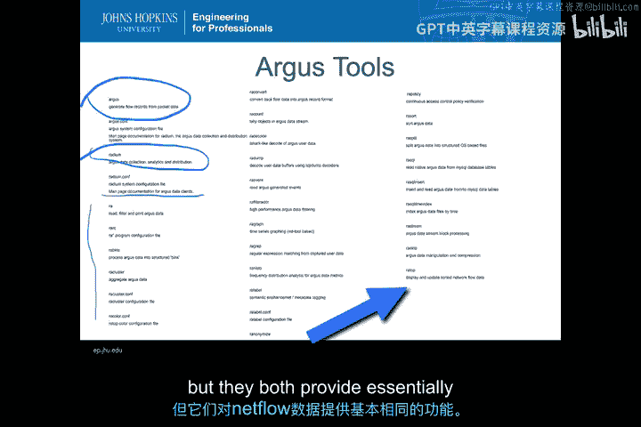
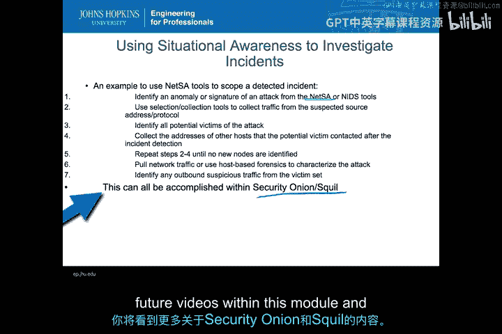
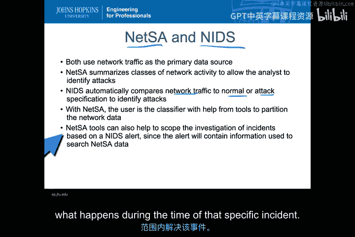

# 034：网络态势感知 🔍

在本节课中，我们将学习网络态势感知（NetSA）的概念、工具及其与网络入侵检测系统（NIDS）的关系。我们将了解如何利用NetSA工具来全面掌握网络状况，并辅助进行安全事件调查。

---

## 什么是网络态势感知？

上一节我们介绍了入侵检测的基本概念，本节中我们来看看网络态势感知。网络态势感知是对网络基础设施及其整体运行状态的全面理解。它的核心是从建立网络情报的基线水平开始，以便更精细地管理企业内的变化。

与入侵检测不同，网络态势感知并非专门针对潜在恶意软件发出警报。它旨在提供基础设施内所有活动的全景视图，使用户能够识别出需要关注的问题或异常情况，无论这些异常是安全相关的还是其他类型的。NetSA包含一系列用于有效监控企业网络的工具和技术，包括用于检测特征活动的分析和分析工具，无论这些活动是恶意的还是良性的。因此，尽管NetSA本身并非专门的入侵检测系统，但其工具和技术允许用户处理收集到的所有网络态势感知数据，以更好地理解网络状况。

NetSA几乎总是基于网络数据包或某种流（flow）收集。理解这一点至关重要，因为这些是本质上与网络态势感知相关联的传感器。一些使用NetSA作为输入的现代工具也可能从主机收集信息，但这在目前并不典型。

---

## NetSA工具与技术概览

为了更全面地了解构成网络态势感知的要素，可以观看Lameta的YouTube视频。该视频概述了一个五步流程，有助于收集和理解网络数据的来源，以及如何利用这些数据来了解IP地址和漏洞，从而获得网络活动的基线视图。从Lameta的简介中也可以看到，一个非常常见的工具就是使用网络数据。这是另一个例子，说明我们并非依赖基于主机的数据来理解态势感知，这也是为什么它是一个NetSA工具。它至少从一个角度为你提供了网络态势感知的良好概览。

实际上，有非常广泛的商业和开源工具可以帮助处理网络态势感知。我们刚刚在前一张幻灯片中简单提到了Lameta，现在让我们谈谈一些可以免费使用的开源工具。

以下是两种最常见的开源网络态势感知工具：

*   **SiLK**：这是一套用于NetFlow收集的全面分析工具集。
*   **Argus**：这是另一个设计用于Unix及类Unix系统的工具。

与Lameta不同，这些工具主要是面向命令行的工具集合，而非具有高级用户界面的商业工具。两者都以NetFlow作为主要的网络收集方式，并处理传入的NetFlow数据。这些工具包含的功能可以将系统上收集的NetFlow数据分解为搜索、分类、合并和图形化展示等操作。这不仅允许你获得所有数据的概览，还能让你选择数据的子集，深入探究你可能想了解更多细节的特定活动。如前所述，商业工具也做同样的事情，只是它们倾向于将这些功能整合到更友好或前端式的系统中。

---

## 深入SiLK与Argus工具集

正如之前所说，SiLK工具集是一套非常全面的NetFlow收集分析工具。它支持分析流水线处理的概念，能够处理SiLK流记录以自动化常见任务，并接近实时事件报告。这些报告不一定是关于入侵的，这与入侵检测系统不同，但它是一种接近实时查看你可能想要报告的内容的方式，并可以将这些数据输入到某种安全信息与事件管理（SIEM）系统中。

SiLK包含的工具示例如下：

*   **导入/导出库**：用于以标准可共享格式导入和导出数据，以便将NetFlow数据共享到日志仓库，或将其他类型的NetFlow数据引入系统。
*   **注释系统**：允许用户标记所收集的数据类型。
*   **图形前端工具**：帮助用户处理数据并以可读方式呈现。
*   **Python库**：帮助在Python环境中完成许多工作，而不仅仅是命令行脚本。
*   **DNS信息查询工具（如`yaf`）**：用于专门查看和深入分析DNS信息。
*   **二维统计可视化Python库**。
*   **SiLK工具本身**：包含各种可用于数据的筛选和过滤工具的命令行工具。
*   **警报报告系统**：帮助实现之前提到的接近实时的分析流水线。
*   **IPF中介器**：允许将另一种流收集器与SiLK工具一起使用。
*   **YAF工具**：本身就是一个以标准格式收集NetFlow数据的工具。

Argus与SiLK类似，将许多同类工具集成到另一个框架中。它基本上也是同类型的东西。Argus将收集和分析工具作为其自身的一部分，而不像SiLK那样将`yaf`与基本SiLK工具分开。用户可以直接使用Argus生成流工具，然后使用`ra`（基于配置）进行分析和分发，同时仍然可以使用所有常用的读取、过滤和处理功能来处理Argus收集的NetFlow风格数据。

使用Argus可以完成以下操作：

*   **计数与转换**。
*   **转储各种数据片段并进行图形化**。
*   **使用正则表达式**。
*   **创建频率分布**。
*   **进行多种排序和拆分**，例如使用MySQL将数据存入数据库格式。
*   **流式块处理**。
*   **操作和压缩数据本身**。
*   **显示和更新NetFlow数据**。

Argus和SiLK是两个完全不同的工具集，使用方式需要不同的学习路径，但它们都在NetFlow数据上提供了基本相同的功能。

---

## 利用NetSA工具调查事件

这些态势感知工具最重要的用途之一，就是在IDS实际发出警报后帮助调查事件。让我们逐步了解一个简单的流程，说明在从NIDS检测到事件后，如何使用NetSA工具。

1.  **识别攻击**：首先，当然是从NIDS工具识别出某种异常或基于签名的攻击。或者，如果用户正在查看NetSA的活动图并注意到异常，也可以直接通过NetSA发现。这意味着用户扮演了分类器的角色来确定攻击。无论通过何种方式确定了攻击。
2.  **提取相关流量**：接着，用户将获取所有一直在收集的NetFlow数据，并使用选择工具，尝试仅提取与攻击相关的流量，特别是来自可疑源地址和协议的流量。这样可以更好地了解与攻击签名相关的所有流。
3.  **识别关联节点**：在这些流中，找出该特定系统与之通信的所有其他节点。这可以识别出攻击的潜在受害者，范围可能超出最初发现的异常或签名。
4.  **收集关联主机地址**：再次使用流工具，收集潜在受害者联系过的其他主机的地址，以了解企业内部谁与谁进行了通信。
5.  **迭代扩展调查范围**：每次发现作为此事件一部分进行通信的新节点时，都重复这些步骤，将它们添加到可能与此次入侵相关的主机和流集合中。
6.  **深入取证**：利用这些流，去获取网络中可能存在的更详细的数据包或PCAP捕获，或者直接在被影响的主机上进行基于主机的取证，以真正描述攻击特征。
7.  **检查外联流量**：最后，可以使用这些NetFlow工具，查找受害者集合中任何主机的出站可疑流量。可以检查这些受害机器是否以令人担忧的方式与基础设施外部进行通信，例如可能存在命令与控制（C2）情况，或者信息可能从站点内部泄露。

好消息是，所有这些步骤也可以在Security Onion系统中完成，这是本模块中将使用的系统。它使用Sguil提供了一个相当不错的图形化方式来完成这些步骤，以便从异常或警报出发，利用NetFlow数据的收集来解析或调查可能发生的事件。在本模块后续视频和动手实验中将看到更多关于Security Onion和Sguil的内容。

---

## NetSA与NIDS的关系

最后，让我们讨论一下NetSA与网络入侵检测系统（NIDS）之间的关系。我们已经简单谈到了在解决NIDS警报时使用NetSA的情况。现在让我们进一步探讨它们的关系以及为何需要同时使用两者。

首先，NIDS和NetSA都将网络流量作为其主要数据源。因此，它们都使用相同的数据源来生成警报或展示正在发生的情况的视图。

具体来说，NetSA**汇总网络活动**，为用户提供围绕各种可能异常或NIDS警报部分的上下文信息。而在NIDS中，用户通常只能获得来自NIDS的关于正在发生的特定元素的警报。NetSA可以帮助用户构建上下文，理解系统在遭受攻击（根据收到的NIDS警报）之前、期间和之后发生了什么。

NIDS会自动将网络流量与正常或攻击规范进行比较（无论它是异常检测系统还是基于签名的系统），以识别攻击。**这不是NetSA的工作，而是NIDS的工作**。但因此，NIDS会给出警报，但不会提供关于该警报调查所需的所有信息。幸运的话，NIDS会提供主机名和与该NIDS警报相关的数据包捕获信息，但它不会提供所有下游节点，也不会提供使用NetSA调查事件时所能获得的全面信息。

在NetSA中，**用户是分类器**。NIDS内置了分类器来比较网络流量与正常或攻击流量。但对于NetSA，用户需要基于那些帮助可视化和以易于理解的方式处理数据的工具，自己进行这种比较。

这种关系中最重要的一点是，**NetSA工具有助于界定事件调查的范围**。用户可以查看系统间通信的所有对话。如果网络的某些部分或基础设施的某些部分未受这些攻击影响，就可以将它们排除在调查范围之外，从而在理解哪些系统实际上需要修补、修复、观察流量甚至了解哪些信息被窃取方面节省大量时间。

因此，虽然NetSA并非本课程的主要焦点，但将NetSA与NIDS结合使用，是以一种能帮助你在特定事件发生期间所反映的控制范围内解决事件的方式来使用NIDS的重要步骤。

---

## 总结

本节课中，我们一起学习了网络态势感知（NetSA）的核心概念。我们了解到NetSA旨在提供网络活动的全景视图，帮助识别异常。我们介绍了两大开源工具集SiLK和Argus，它们用于处理和分析NetFlow数据。我们还探讨了如何利用NetSA工具逐步调查由NIDS发出警报的安全事件。最后，我们明确了NetSA与NIDS的关系：NIDS负责自动检测并发出警报，而NetSA则为警报提供上下文、辅助界定调查范围，使用户能够更高效、更全面地进行事件响应与取证分析。结合使用两者，能显著提升网络安全监控与事件处理的能力。