# 035：大规模网络流量异常检测 🚨

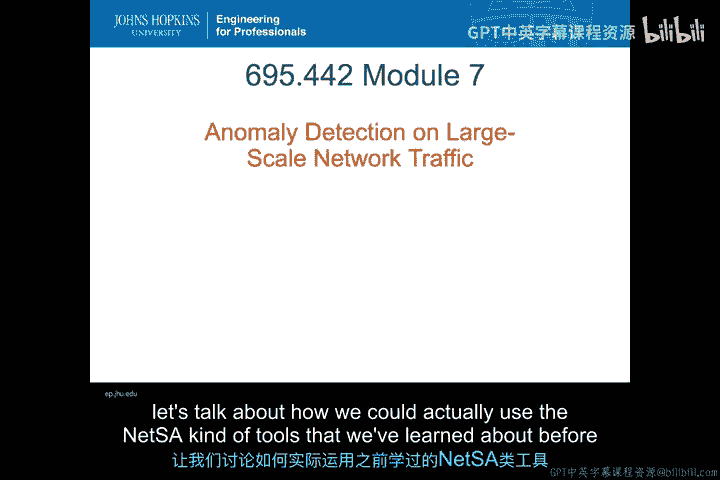

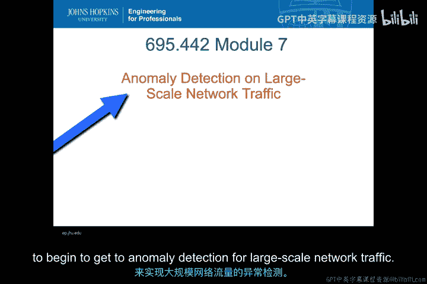

在本节课中，我们将学习如何利用之前介绍的网络态势感知工具，对大规模网络流量进行异常检测。我们将从IP数据流的基础概念开始，逐步深入到流量监控、行为分析，并最终探讨如何部署NetFlow和NIDS来实现有效的异常检测。

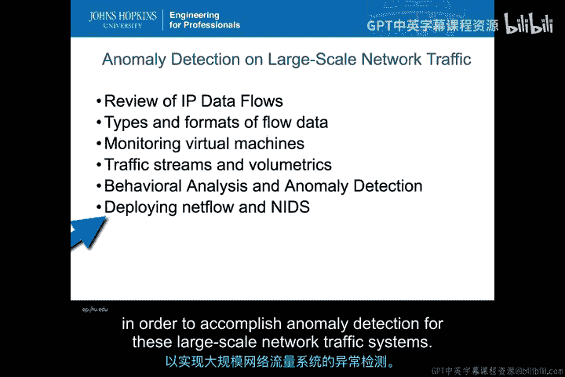

## IP数据流回顾 📡

上一节我们介绍了网络态势感知的基本工具，本节中我们来看看网络流量的核心——IP数据流。IP数据流是任何NetSA、NIDS或类似收集系统的基础。

IP数据流是**单向的**。它是一组具有共同特征的数据包集合。这些特征通常包括：
*   源IP地址
*   目的IP地址
*   源端口
*   目的端口
*   服务类型

这五个元素共同**唯一地标识**了一个特定的IP数据流。我们正是通过这种方式，将收集到的数据包按照这些共同特征分组，从而开始分析从源到目的地的所有活动。

在收集网络数据时，显然会有大量数据包交织在这些IP数据流中。我们的做法是，根据上述四个共同特征，将所有收集到的数据包“分箱”到对应的IP数据流中。

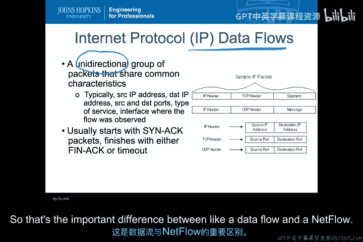

此外，我们通常认为数据流有开始和结束。例如，对于一个TCP会话，它会以一个SYN数据包开始，并以一个FIN/ACK数据包、超时或重置结束。本质上，IP数据流是通过提取数据包的头部信息来进行特征化的。但数据流本身也包含每个数据包的**载荷**。它不是一个NetFlow数据包或记录。IP数据流代表了实际流经网络的所有数据包及其所有比特的特征。这是数据流和NetFlow之间的重要区别。

## 流的开始与结束 🔄

流通过协议中的初始化和关闭过程来开始和结束。

在标准的TCP通信中，当主机A要与主机B通信时，首先发生的是主机A向主机B发送一个**SYN**数据包。当主机B收到SYN数据包后，会发回一个**SYN-ACK**数据包进行确认。至此，TCP连接建立，常规数据包可以开始流动。这个协议过程被视为一个IP数据流的**开始**。

要完成一个IP数据流，通常如果主机A试图结束它，会发送一个**FIN**，并收到一个**ACK**。主机B也可能发送一个FIN来正常关闭连接。

然而，在许多攻击中，事情并不总是正常发生。例如，如果主机A正在攻击主机B，它可能只发送一个SYN消息，并**伪造**发送源地址。这样，SYN-ACK实际上会去往一个完全不同的地方。由于从未收到ACK回复，协议的这一部分就不会发生。主机B会等待它应该收到的ACK，如果始终未收到，最终会**超时**。但如果主机A反复对主机B进行此操作，主机B用于保存所有这些SYN数据包（即半开连接）的资源最终可能会耗尽，导致其崩溃或网络流量失败。这就是传统的SYN洪水攻击。

类似的情况也可能发生在流的结束阶段。如果主机A正在发送数据但从未发送FIN数据包，那么主机B将持续等待该会话继续，直到最终超时并在内部终止连接。因此，如果没有收到这些信号，实际上可以通过超时或其他方式终止连接。当然，主机B也可以发起FIN消息。实际上，甚至可能出现主机C**伪造**主机B的身份发送RST消息，从而重置主机A和主机B之间的连接。这些来自第三方的RST攻击本质上是在重置或破坏正在进行的连接。

因此，当尝试确定流的开始和结束时，必须考虑到流可能开始的所有不同方式（如半开连接）和结束的问题（如关闭连接问题），以便流的起止点能真实反映主机A和主机B可能看到的数据流情况。这就要求流量收集器必须足够理解协议，知道各种可能导致超时、乱序、不同顺序到达或被攻击重置的情况。流量处理必须考虑所有这些因素，才能合法地理解主机A和主机B之间的流。

## 流与会话的区别 🤝

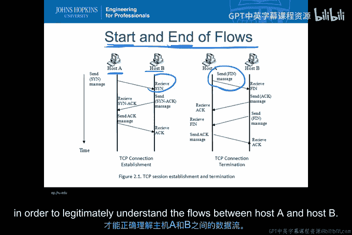

需要明确的是，在前面的讨论中，我们提到主机A和主机B之间各有两个独立的流：从A到B的流和从B到A的流。这是两个独立的**IP数据流**。

而**会话**则是双向的流集合。当我们讨论协议图以及来回通信时，我们指的是TCP或IP**会话**。大多数会话至少包含两个流：一个方向一个。因此，当我们收集IP流数据时，需要理解该流数据只代表了**一半的对话**。就像打电话时只能听到一方说话，而听不到对方听到的内容——这就是一个数据流。每个从源到目的地的方向都是一个这样的流。

会话则涉及源和目的端口及IP地址的互换。会话是相关的，但并非同一个会话；它们实际上是两个独立的IP数据流。此外，请记住，作为TCP正常工作的方式，流和会话在时间上可以**重叠**，数据包可能**乱序**到达，在一个流内可能被**复制**或**丢失**。网络中存在许多问题，TCP和主机内的协议会修复这些网络工作方式相关的问题。但如果我是被动收集，我无法在IP数据流的收集中主动通信。因此，如果我丢弃了一个数据包，或者错过了关于此会话的某些重要信息，那么在我的数据流中可能会出现异常，而积极参与两个连接的主机A和B可能永远看不到这个异常。

## NetFlow：IP数据流的摘要 📊

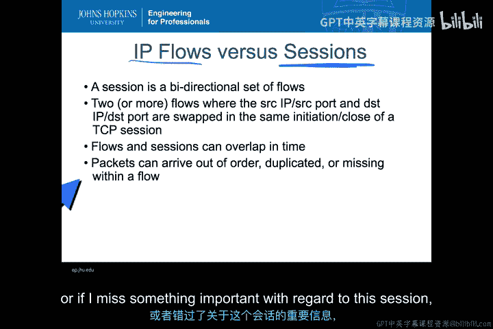

如前所述，IP数据流与NetFlow**不同**。IP数据流是源和目的地之间、在特定时间、具有特定源端口和目的端口的**单向**数据包集合。而**NetFlow是IP数据流的摘要**。

通常，该摘要内置了初始化和终止条件，即认为特定流有开始和结束。同样，这些是单向连接，因此NetFlow记录仍然是**单向的**，是从源到目的地，而不是反方向。

以下是一个NetFlow连接的示例记录，通常包含：
*   日期和时间
*   持续时间（开始时间和持续时间）
*   协议
*   源IP地址和目的IP地址
*   源端口和目的端口
*   数据包数量
*   字节数
*   流数量（基于从该主机源/目的地址/端口发生的终止条件）

您可能会注意到有两个独立的流记录。这两个记录的源/目的端口和IP地址正好互换，这意味着它们是一个会话的两半。因此，对于NetFlow数据，通常需要看到源和目的互换，并将这两个NetFlow记录放在一起，以理解两个主机之间的双向对话。

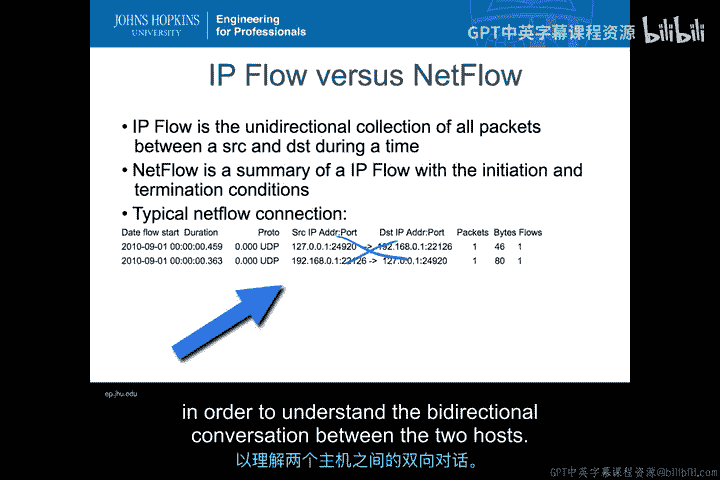

## IP数据流的类型与格式 🗂️

IP数据流有许多不同的类型和格式。最常见的类型当然是我一直在讨论的**NetFlow**。NetFlow由思科发明，至今仍是IP数据流最标准的摘要形式。这就是为什么许多人在谈论IP数据流时会使用NetFlow数据这个同义词。但请理解，IP数据流包含数据包数据，而NetFlow不包含；它是一个考虑了IP数据流初始和终止条件的摘要。

除此之外还有很多其他例子：
*   Extreme Networks 的 **sFlow**
*   Foundry Networks
*   Huawei Technologies
*   Juniper
*   BlueCoat

它们都有略微不同的格式，收集的信息大多与NetFlow相同，但格式可能不同，在标志位或数据包数据流的某些特征收集上可能略有差异。运行在这些不同流类型上的工具通常是**特定于**该IP数据流类型的。因此，当谈论网络态势感知工具或Net工具时，它们将针对特定类型的IP数据流收集（无论是NetFlow、Packeteer还是任何其他类型）而设计。

此外，除了这些摘要格式，当然还有常规的**PCAP数据**，它基本上是所有数据包的原始集合。您可以创建使用过滤器的PCAP子集，从而获取特定流中代表的所有数据包。当我收到某种警报并获得该警报的NetFlow指示器时，这非常有用。然后，我可以过滤我的PCAP数据，仅提取与警报相关的特定数据包（在特定时间段内，具有特定源/目的地址和端口的数据包），进而查看IP数据流内部实际流动的攻击内容。

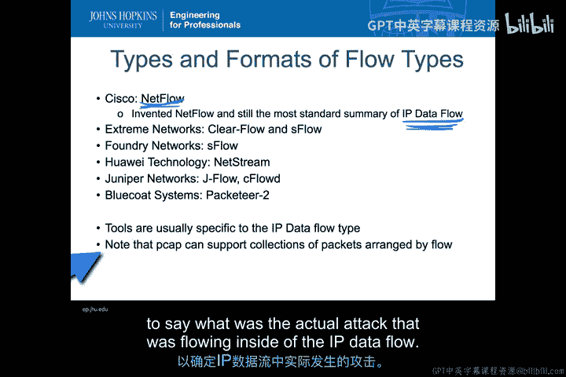

## 为何通常使用单向流？ ➡️

我们为什么不更多地讨论双向流？为什么不让我们所有的工具都自动使用连接的两端并以这种方式进行特征化？

虽然需要双向流来理解完整的上下文，但生成双向流的**成本可能非常高**。需要将A到B的流量与B到A的流量在时间、端口、IP地址以及数据包可能经过的不同路径和不同传感器上进行大量关联。因此，通常我们不会在单个记录中收集双向流，我们总是可以在之后将它们组合起来，但由于在接近实时的情况下进行这种关联的成本和难度，我们通常不会以那种方式收集。

此外，在创建双向流时，还存在数据包和会话去重、关联各种流以及数据包载荷以确认各种反向流是否正确的问题。这是一项需要大量工作的事情，通常只在您想要深入调查特定攻击或事件时才需要做，而不是一般性收集的内容。

事实上，对于NIDS来说，**单向流往往就是您真正需要的**。以我之前描述的SYN攻击为例，如果我有一个流，其中我只寻找SYN数据包，并且没有看到来自攻击者主机的其他数据到达目的地，那么不难得出结论：我可能正在遭受来自该特定主机的SYN攻击。特别是如果我有很多不同的NetFlow记录，每个记录都显示来自不同源地址的一个SYN数据包，我可能会认为这些源地址是伪造的，或者它们来自某种僵尸网络，其中所有不同的元素都试图建立半开连接以耗尽特定目标的资源。因此，对于这类情况，基本上只需要单向流。

后续分析才是您真正需要双向流的地方，因为您希望了解流量的双方，并且在攻击期间，了解受害者如何响应传入的数据包非常重要，而不仅仅是您有一个单向流。

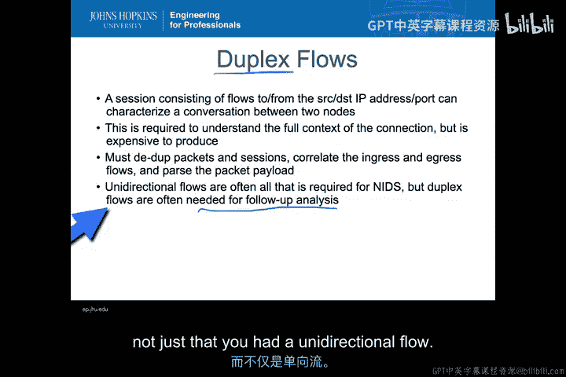

## 监控虚拟机环境 ☁️

目前，关于NetSA的一个非常重要且较新的发展是：如何利用流监控/IP数据监控来监控**虚拟机环境**。

请记住，在虚拟机环境中，您可能有一个连接到多个虚拟机的单一接口。因此，我在互联网上收集的数据包，用于区分所有数据流的五元组看起来都来自同一个源地址，但实际上，它们可能来自接口内部的许多不同虚拟机。这是因为虚拟机通常不直接通过主机进行网络地址转换，NAT本质上允许每个虚拟机拥有唯一的IP地址，但托管所有这些虚拟机的主机会提供一个公共地址，当流量外出或从接口返回时，它会转换到这个地址。

因此，如果我在系统的物理接口进行监控，我可能无法分辨哪些数据包实际上来自哪个虚拟机——它们看起来都来自同一个主机。想象一下大型云环境，我可以在单个硬件平台上运行数十个或更多的虚拟机，其中一些属于不同的组织，或者由各种组织运行的不同虚拟机，这些机器的运行特征可能完全不同。我将需要能够以某种方式区分这些IP流，以便理解谁在和谁通信。

所以我可能希望从内部交换机导出流，以便在这些“粗”流中进行区分。

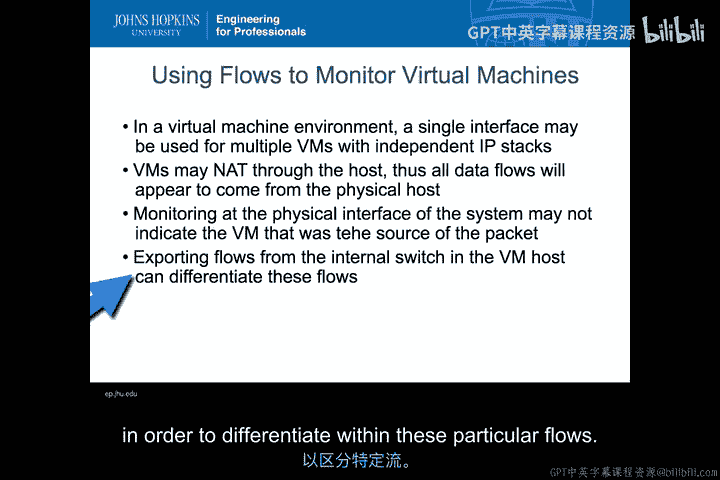

## 虚拟机流量监控方案 🖥️

让我们简单勾勒一下这可能如何工作。

我可能有一系列虚拟机都运行在一个公共平台（即我的**管理程序**）之上。这些是我的虚拟机，其中一台可能是Windows，一台可能是Linux，我可以运行各种不同的系统。每个虚拟机都有一个唯一的IP地址，因此它们在IP地址上彼此唯一。但当它们通过管理程序时，所有这些地址都会被转换到管理程序的IP地址。这就是我从这些特定主机外部看到的全部。

那么我能做什么呢？在管理程序内部实际执行此操作的**交换机**处，我可以直接进行数据流收集。如果我在交换机的这个位置进行数据流收集，那么我将获得来自各个主机的所有独立IP地址，而不是在外部收集时只获得单个IP地址。因此，如果我能从这里收集，我将获得更多信息。

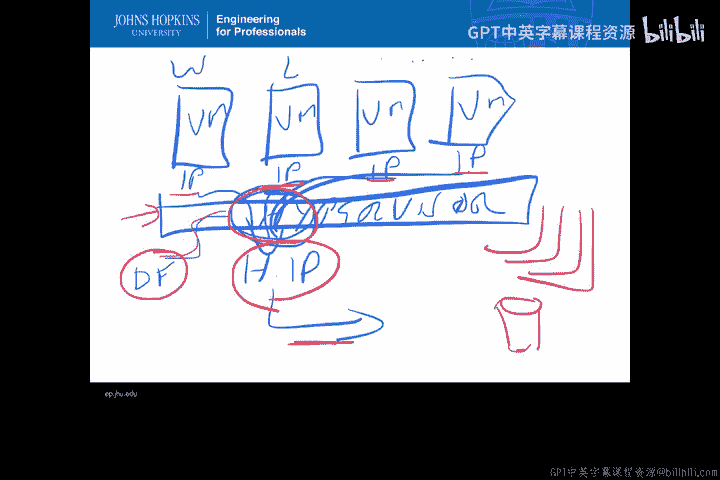

但这意味着我的每个管理程序都必须有自己的数据流收集器，并且这些数据必须发送到所有不同主机之外的某个地方。当然，我可能有很多这样的主机，因此每个主机都需要自己的收集器，这些收集器都将汇集到某种中央存储库，我可能将其用于我的IDS或态势感知工具。

## 流量流与容量分析 📈

从之前的例子可以看出，基本上我将有相当大量的流量流从这里产生。很多数据包，很多不同的区域，数据包会在带宽内的各种不同区域到达。这意味着我可以对我的流量流进行一些**容量分析**，以了解可能发生的异常情况，这些异常超出了单个IP数据流内部可能获得的数据。

我可以利用这些带有时间戳的流来获取**速率**，例如数据包速率。我可以基于每个IP或每个链路来计算速率，以便理解在一天中的任何给定时间、一周中的哪一天、一月中的哪一周，我的正常数据包速率是多少。这样我就能理解哪些情况不属于我的正常数据包速率。这些数据包速率可以按网络聚合，也可以向下钻取，以便查看特定源和目的地址相关的流，或者仅查看像我的Web服务器这样的源地址，并询问：到我的Web服务器的流是什么样的？到我的客户端的流是什么样的？从我的外部路由器看外部流是什么样的？或者我可以说，在我整个内部LAN的带宽内，通过将所有内容聚合在一起，带宽看起来如何？

由此，我可以对传入的数据包速率进行大量的容量分析和统计分析。在路由器和交换机处**采样这些速率**是观察正常行为的一种非常紧凑的方法。这里的正常行为实际上被定义为在一天中的特定时间、一周中的特定日子、一年中的特定季节，该特定时间的正常数据包速率是多少。因此，正常行为可能会在白天和夜晚、周末和工作日、购物季和非购物季之间发生变化。因此，了解这些特定区域的容量情况，并使用网络态势感知工具绘制图表，是开始发现我系统内异常的第一个简单方法。

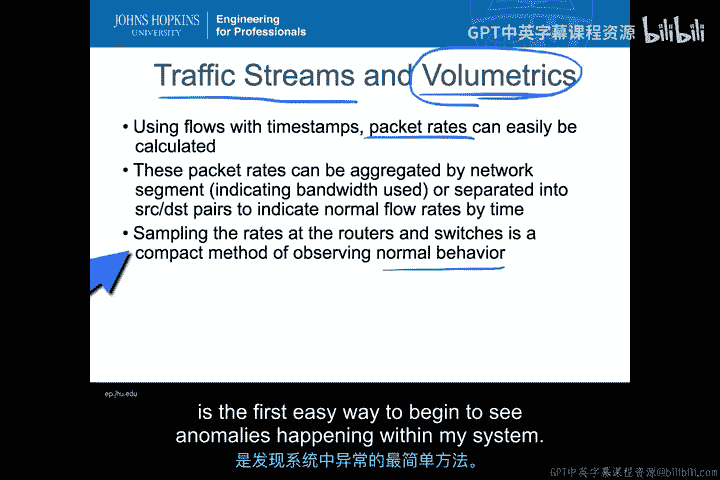

## 基于容量的异常检测 ⚠️

如果我这样做，并且仅从带宽、容量的角度进行观察，利用这些按主机和时间计算的速率，我可以看到与速率直接相关的异常。显然，我收集的数据规模越大，异常需要越明显才能被观察到。

让我们看一下下面图表中的这个例子。我基本上有一个正常的流量模式集。然后突然，在某个特定时间，流量上升到高位并大致保持平稳。不需要非常复杂的分析就能看出：哦，那段时间显然发生了什么事情。这可能是一次攻击，也可能是某些其他配置更改，甚至可能是每个人在同一时间对网站产生了兴趣。但这种在特定分钟内突然出现的情况意味着它可能不像您预期在瞬时拥塞中那样缓慢上升。

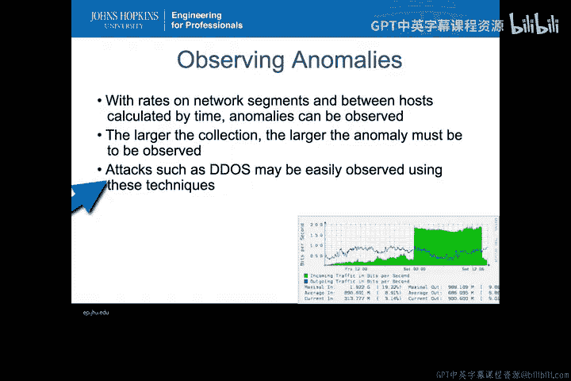

这就是为什么使用容量分析和这类异常检测，特别是**DDoS攻击**，即使使用网络态势感知工具中非常简单的容量技术，也可以相当容易地观察到。

## 从NetSA到NIDS警报 🚨

现在，我们谈谈网络态势感知和NIDS之间的关系。这里的理念是，如果我能利用NetSA识别或观察到某种攻击，我应该能够对该情况发出警报。一旦我能描述其特征，我就能描述变化是什么，并将其转化为NIDS警报。这样，我就可以从需要人工判断是否遭受攻击的态势感知，过渡到工具本身可以判断是否遭受攻击的NIDS工具。

对于像DDoS这样的事情，这相当容易。我只需为一天中某个时间或某种连接类型的正常带宽设置一个**阈值**。任何超过该阈值的情况都会生成警报。当然，这并不总是意味着我将遭受攻击。在任何一天，都可能有许多原因导致我获得意想不到的额外活动。但这可能是我想要调查的事情。因此，这是一种合理的触发器和警报或异常，我希望将其作为我的NIDS警报的一部分。

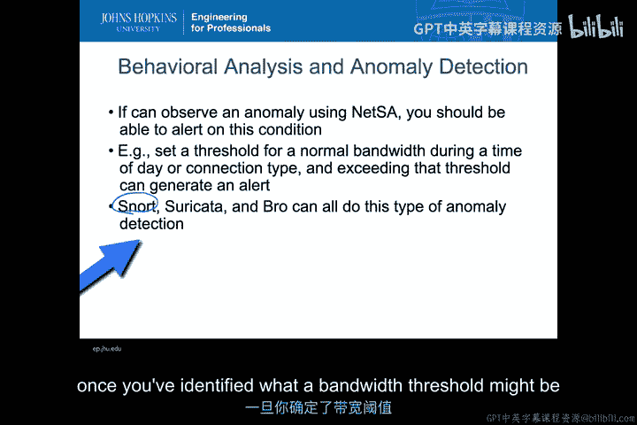

当然，Snort、Suricata、Bro都可以进行这种类型的异常检测。因此，尽管我们大多认为Snort是一个签名检测工具，但它也可以对像DDoS这样的事情进行这种基于阈值的异常检测，一旦您确定了您所收集流量的带宽阈值可能是什么。

## 利用NetSA确定基线 📉

关于NetSA的一个好处是，它实际上可以帮助您确定基线。因为使用NetSA工具，我将获得图表，这些图表本质上显示了我的正常行为随时间的变化。因此，我可以利用这些观察结果来帮助绘制我的NIDS阈值。

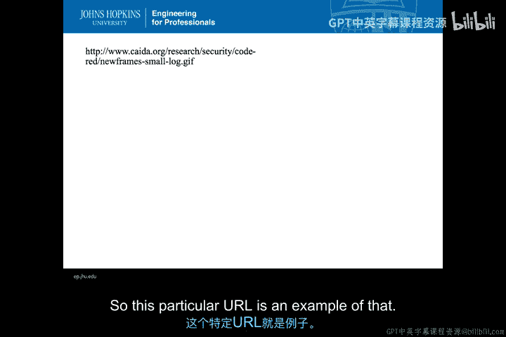

设置阈值确实有些挑战，因为它们确实会变化，并且在任何高使用率的日子您都可能收到误报。但基本上，如果您想象您的图表中，日常带宽使用情况大致如此，并且可能随着时间的推移开始变得更大，我仍然可以说有夜间阈值和白天阈值。因此，我可以设置几个不同的阈值区域，并根据一天中的时间更改它们。如果我收到越来越多的警报，我会开始提高这些阈值，以应对我的网络上可能实际发生的变化，这些变化必须考虑在内。

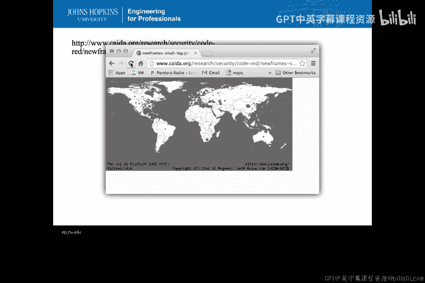

这些阈值对于许多事情都非常有用，甚至超出了单个企业使用基于流量的简单阈值分析的范围。您可以获得显示蠕虫如何在全世界传播的图表。这个特定的URL就是一个例子。

## 部署IDS与NetFlow收集器 🛠️

最后，我将如何在我的组织中部署某种IDS和某种NetFlow，以便让我能够进行一些真正有趣的调查，这些调查将跟随IDS警报而来？

这里有一个我简单勾勒出的例子。这是我的外部网络（可以是互联网或其他任何地方）。这是我的**边缘路由器**，它将我的企业连接到那个外部网络。流量通过我的边缘路由器进入我的企业，通常流经某种防火墙、交换机或ASA等设备。

我可以将我的IDS被动分路点直接连接到这里，以查看通过这个特定元素从外部世界进入的所有流量，检测所有可能发生事件的入站流，或者可能泄露信息的出站流。

但流数据（NetFlow）我可能更希望从我的内部交换机获取，以便我的NetFlow收集也能获取发生在DMZ和我后端客户端之间的事情。因为当我从IDS警报展开调查，并希望开始利用NetFlow收集数据调查时，它很可能会指示在我网络内部流动的事情。

因此，虽然IDS可能只需要查看外部世界以及进出外部世界的流量（假设此时我们忽略内部威胁），但网络流数据需要来自内部所有主要的阻塞点，以便我开始更好地了解我企业内部的网络态势感知。如果我的NetFlow数据只在这里（边缘）收集，与我的IDS在同一位置，那么我将无法很好地了解许多从不与外部网络通信的内部系统。例如，只与我的DMZ通信的客户端，甚至是经过NAT转换的客户端——如果我的客户端通过某些内部设置进行NAT转换，我甚至无法在此处获得唯一的IP地址来理解我的NetFlow数据发生了什么。

因此，当考虑在您的基础设施中同时放置IDS和NetFlow收集器时，您不必也不应该将它们放在完全相同的位置。您可以将它们放在不同的位置，这样当您基于警报进行调查时，我可以获得关于整个企业范围内态势感知图景的更完整信息。

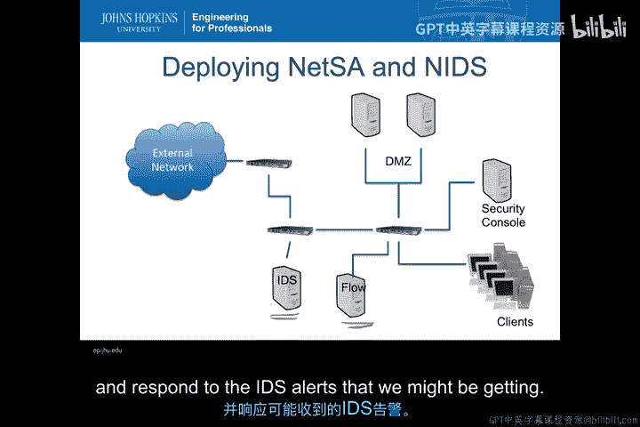

本节课中我们一起学习了如何将IP数据流、NetFlow摘要、虚拟机环境监控以及容量分析结合起来，为大规模网络流量构建有效的异常检测机制。我们看到了如何利用网络态势感知工具确定行为基线，并设置阈值以触发NIDS警报，从而将人工观察转化为自动化检测。最后，我们探讨了在实际网络中协同部署IDS和NetFlow收集器的策略，以确保在调查警报时能获得全面、深入的网络流量视图。