# 036：基于图分析的事件检测 📊

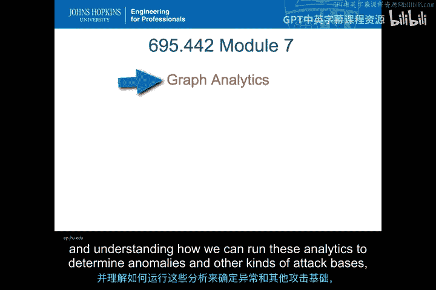

在本节课中，我们将学习如何将网络流量数据转化为图结构，并利用图分析技术来检测网络中的异常行为和潜在攻击。我们将从图的基本概念开始，逐步探讨如何构建、分析网络流量图，并利用其特性生成入侵检测警报。

---

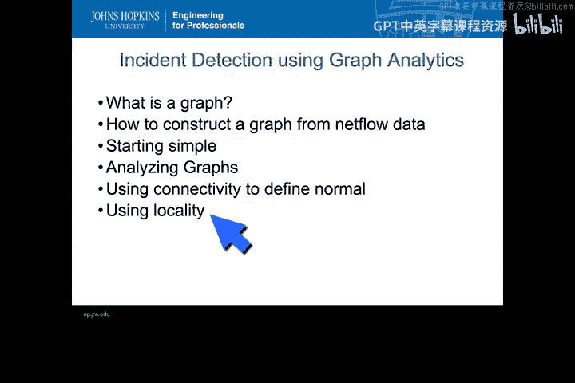

## 什么是图？🔗

上一节我们提到了网络态势感知与入侵检测系统的关联。本节中，我们来看看图分析的基础概念。

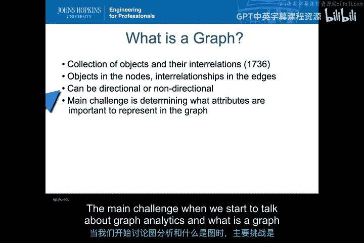

图，在最简单的层面上，是**对象及其相互关系的集合**。这个概念自1736年就已存在，最初用于描述连接不同陆地的桥梁。在图论中，对象被称为**节点**，对象间的相互关系被称为**边**。

图可以是**有向的**或**无向的**。有向图意味着关系具有方向性，例如从节点A流向节点B。在网络流量分析中，IP数据流天然形成有向图，因此方向性非常有用。

图分析的主要挑战在于确定**哪些属性构成唯一的节点**，以及**希望用边表示节点间的何种关系**。即使是简单的网络流数据，也有多种方式来定义节点和边，选择正确的定义方式对于后续发现异常和理解网络正常行为至关重要。

---

## 构建网络流量图 🌐

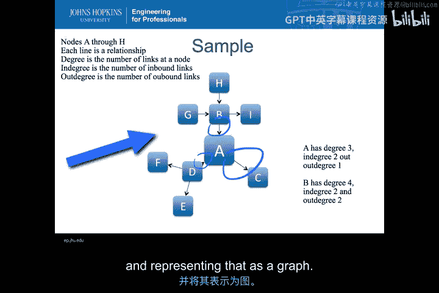

了解了图的基本概念后，我们来看看如何从网络流数据中构建图。

任何标识符都可以关联为一个节点，任何连接都可以标识为一条边。通常，节点可以是**源IP地址**。这样，一个IP地址就对应一个节点。流入该IP地址的所有流量构成了该节点的**入度**，流出的所有流量则构成了**出度**。

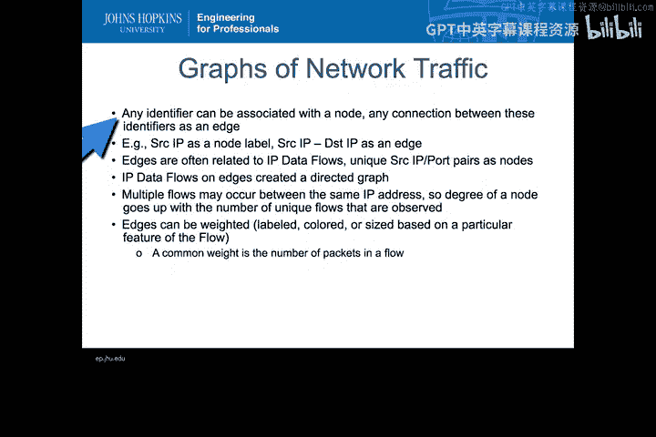

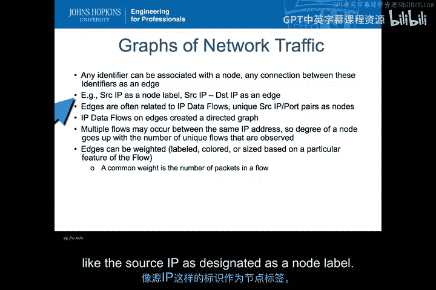

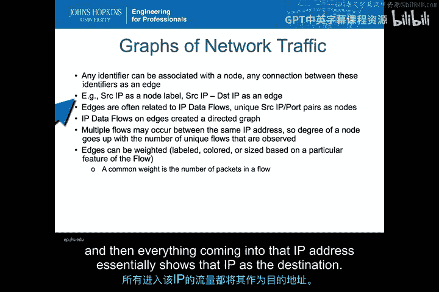

边通常与IP数据流相关，可以是从一个主机到另一个主机的数据流集合，**不考虑端口号**。也可以选择**基于端口号**来构建唯一的边，不同的选择会得到不同的图特征。

重要的是，IP数据流在边上创建了一个有向图。因此，**入度**和**出度**是基于IP数据流图的两个重要元素。当然，相同的IP地址之间可能存在多个流。节点的度可以随着观察到的**唯一流数量**或连接的**唯一其他节点数量**而增加。

此外，边可以根据任何数值特征进行**加权**。一种非常常见的方式是使用该流中的**数据包数量**作为权重。例如，从A到B的边可能很“细”（数据包少），而从B到A的边可能很“粗”（数据包多）。这种权重可以帮助我们判断节点间的通信是否正常。

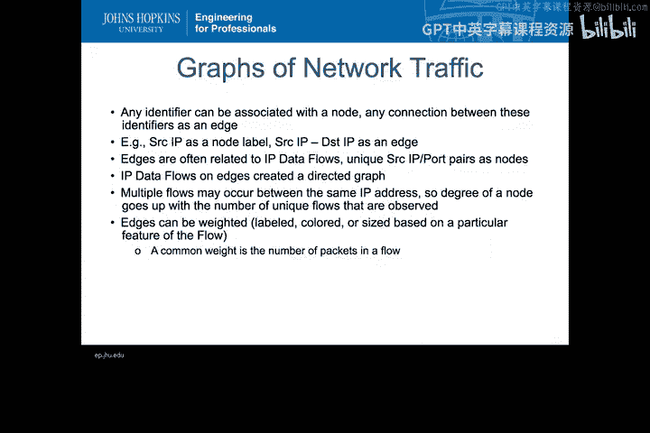

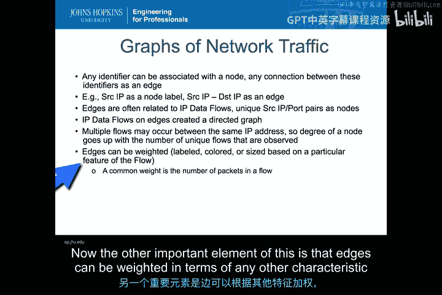

---

## 分析图特征以检测异常 🕵️♂️

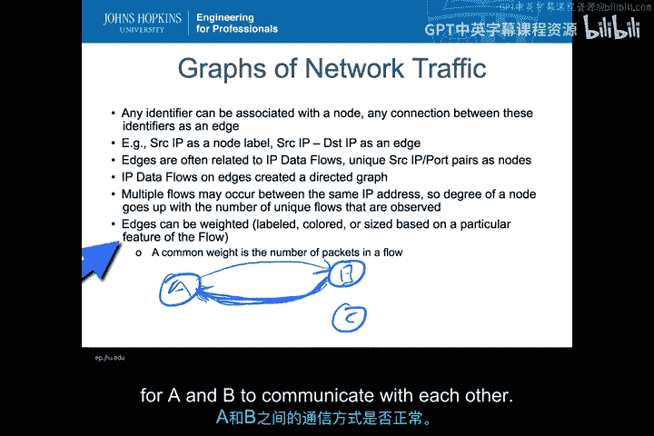

构建好图之后，我们可以通过分析图的各种特征来发现异常或攻击。

图特征可以指示异常。例如：
*   如果图是部分连接或完全连接的，这告诉我们在该图中节点通常与哪些其他节点通信。
*   如果部分连接的图中突然出现了新的连接，这可能就是一个需要调查的异常。
*   我们可以根据特定端口将图划分为从不连接的子图。例如，某些节点可能在特定端口上通信，但在其他端口上从不通信。
*   节点间**单向**或**双向**的连接模式也可以作为判断系统运行正常与否的依据。

然而，这些边可能会随时间变化。就像数据量会随时间变化一样，节点的连接性也可能随时间变化，这使得判断某个连接是否异常变得复杂。但所有这些分析对于发现各种攻击都非常有用。

有许多工具可以帮助我们进行可视化图分析。例如，**Fvz** 这类工具使用IP流数据进行可视化，帮助你直观理解节点间如何通信。这种表示方式通常比简单的网格图更容易发现图异常。

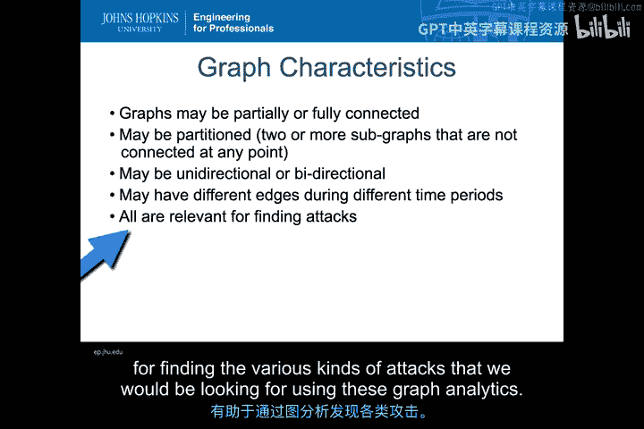

---

## 从图分析到入侵检测警报 🚨

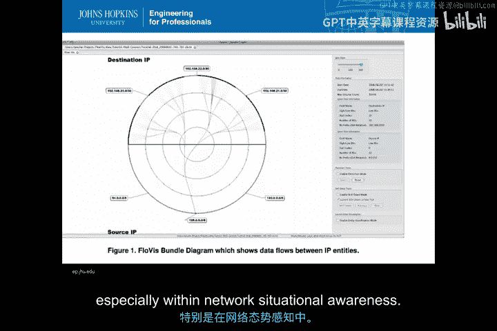

现在，我们已经将IP数据流表示为图，并可以检测图中的异常。接下来，我们看看如何将这些异常转化为入侵检测系统的警报。

其核心思想是：在近乎实时地读取更多数据流并将其添加到图中时，能够识别出添加特定流是否会创建异常图条件。例如，通过观察IP数据流图的**分区**（即网络中功能分离的部分），每个新连接都可以被检查是否连接了图中原本孤立的区域。

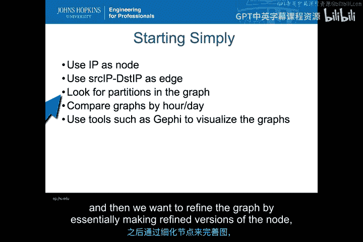

以下是生成警报的步骤：
1.  计算并识别具有正常分区的图。
2.  记录每个独立的流。
3.  判断是否有任何流在不连通的分组之间添加了连接。
4.  如果存在，则发出警报，将这两个节点参数与新建立的连接一起作为NIDS警报输出。

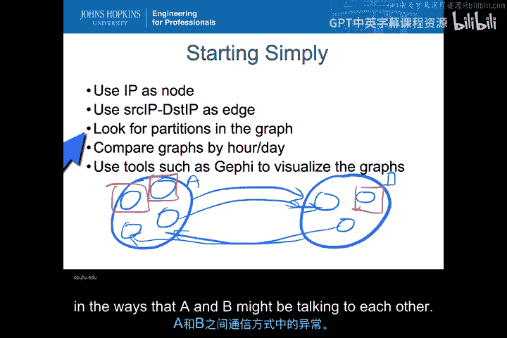

**举例说明**：假设企业网络中有A和B两个从不交互的节点组。任何组内的连接都是正常的。然而，如果突然出现一个节点作为A组和B组之间的中介，建立了前所未有的连接，那么这三个新数据流就可以触发警报，因为它们被添加到图中时创建了异常条件。

---

## 利用图分析识别节点功能 🖥️

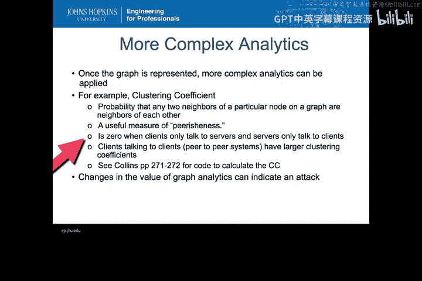

我们可以进一步利用图分析来确定节点的类型。

具有不同功能的节点将具有不同的流图特征。如果我们知道特定功能（如邮件服务器）的流图特征，我们就可以判断一个节点是否在运行该功能，无论它是否被设定如此。

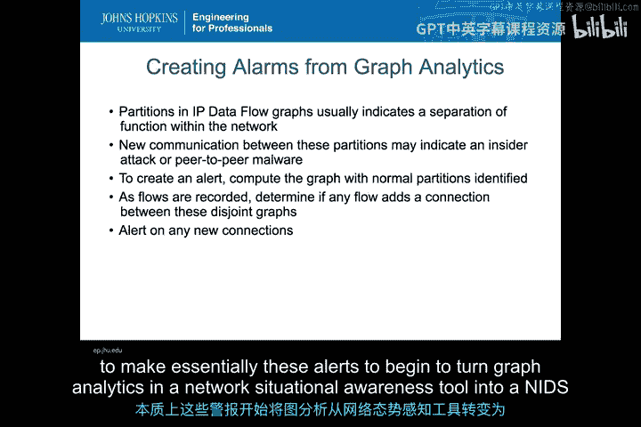

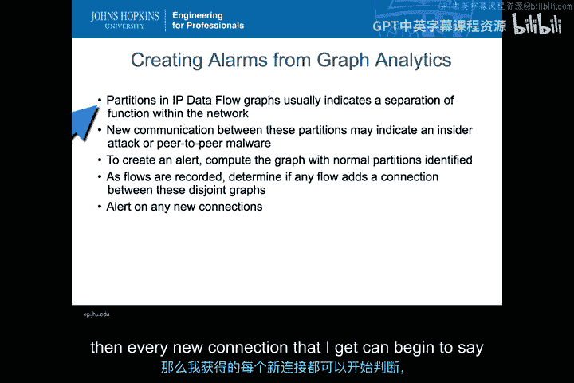

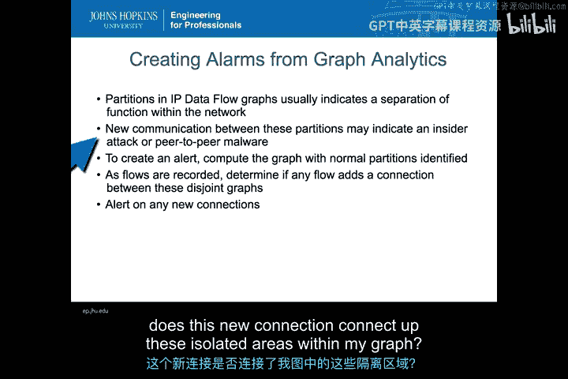

例如，一个DMZ中的邮件服务器可能有一个目的端口25，并与许多外部主机通信。如果我们看到一个内部主机突然开始从一系列其他主机（甚至包括连接正式邮件服务器的相同主机）接收端口25的连接，我们就可以从图特征得出结论：这个内部主机正在作为邮件服务器运行。这可能意味着一个恶意服务被安装，绕过了官方邮件服务器的安全参数。这种方法同样适用于Web服务或其他任何服务。

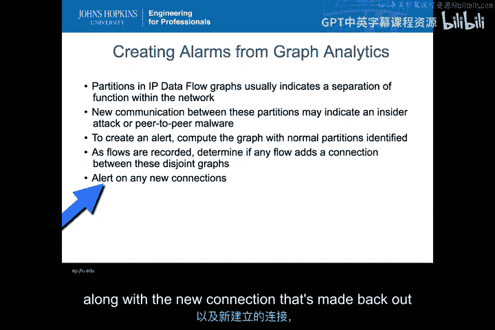

---

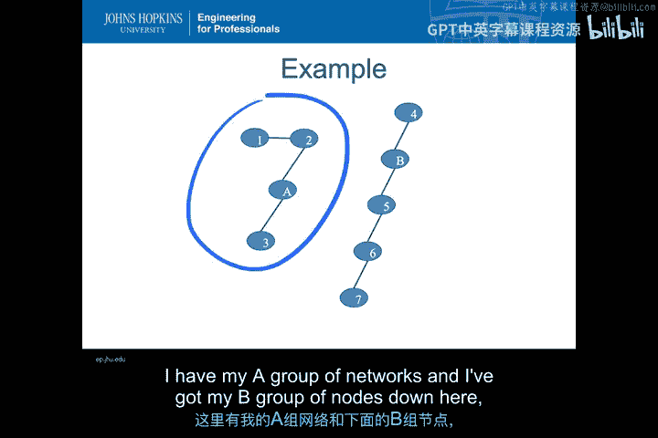

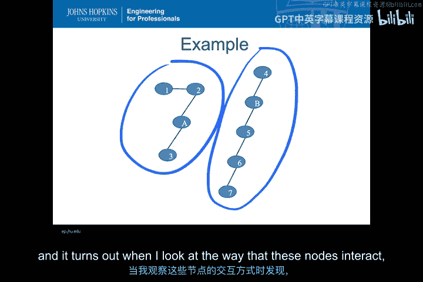

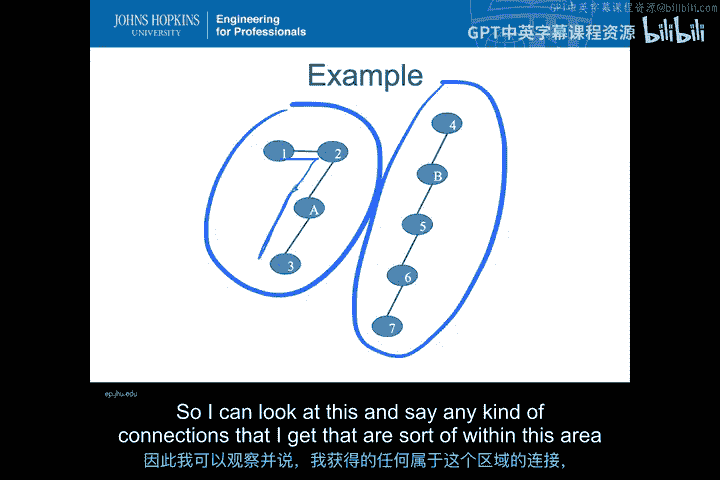

## 局部性：一种更通用的异常检测方法 📈

除了基于端口和IP地址来表征节点，我们还可以使用**局部性**作为检测不相连子图间新连接的通用方法。

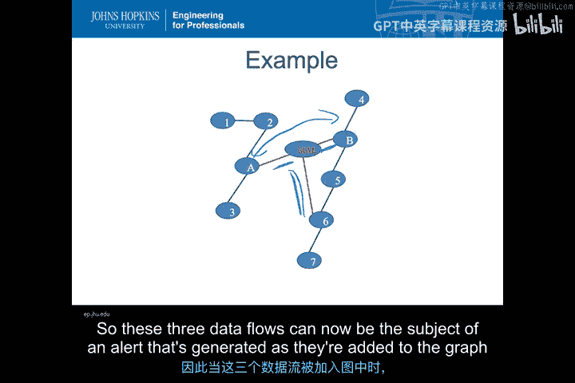

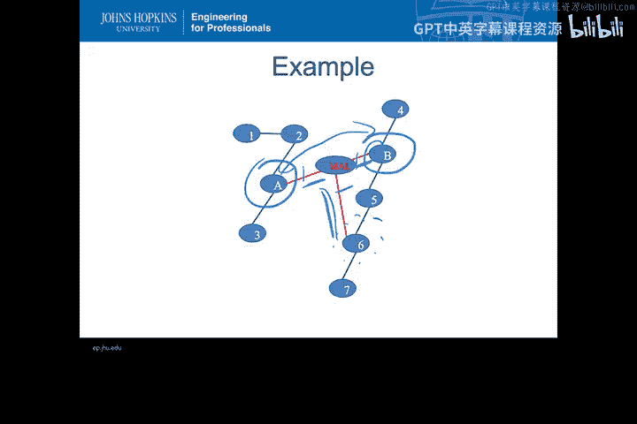

局部性考虑到，大多数系统随时间推移主要与相同的系统集合通信。通常需要7到10天来建立一个新节点引入系统后的正常行为基线。在此之后，新系统连接数量的突然急剧增加，可能表明网络中存在恶意行为。

我们可以将局部性视为与**建立新连接的速率**相关。当一个新节点刚加入时，我们对其知之甚少，新连接速率很高。但随着正常行为模式建立，该速率会迅速下降到较低水平并保持稳定。此时，新连接速率的突然激增（就像在寻找DDoS攻击时查看流量激增一样），可能表示安装了恶意软件或其他意外软件。

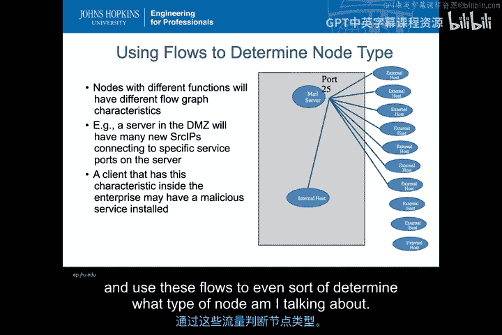

利用IP数据流图，这种方法可以非常有效和高效地发现试图在企业内部传播的恶意软件。

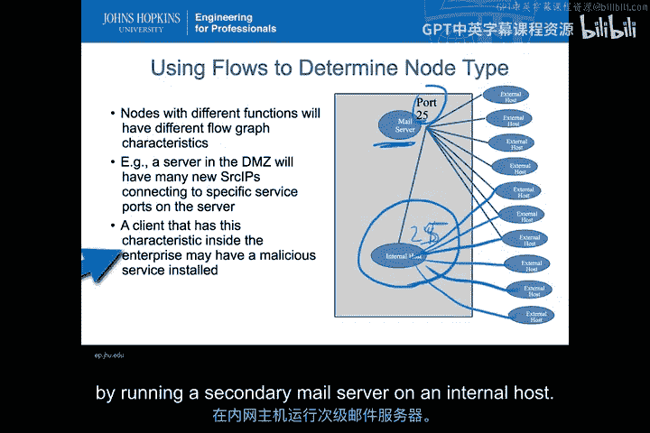

我们甚至可以更进一步。如果我们知道一个新系统将与已有的其他系统相似，我们可以通过假设这个新系统将具有与同类IP集合中其他系统相同的IP局部性，来加速这个过程。虽然这可能会带来一些额外的误报（I类错误率初期可能较高），但它能提高在节点刚引入系统时就检测到攻击的概率。

---

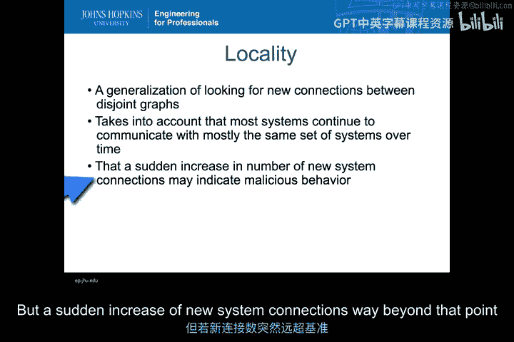

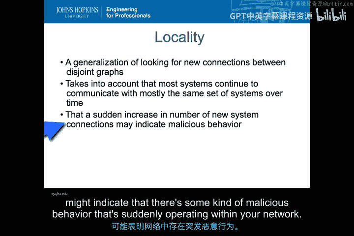

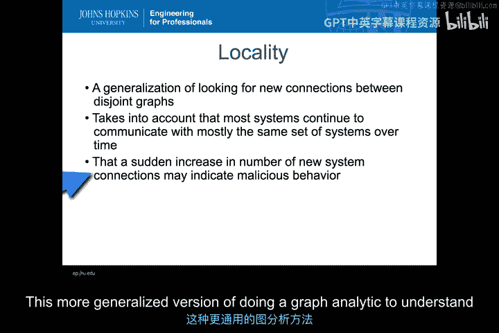

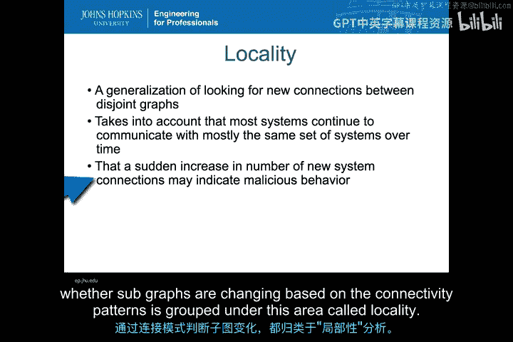

## 总结 📝

本节课中，我们一起学习了基于图分析的事件检测。

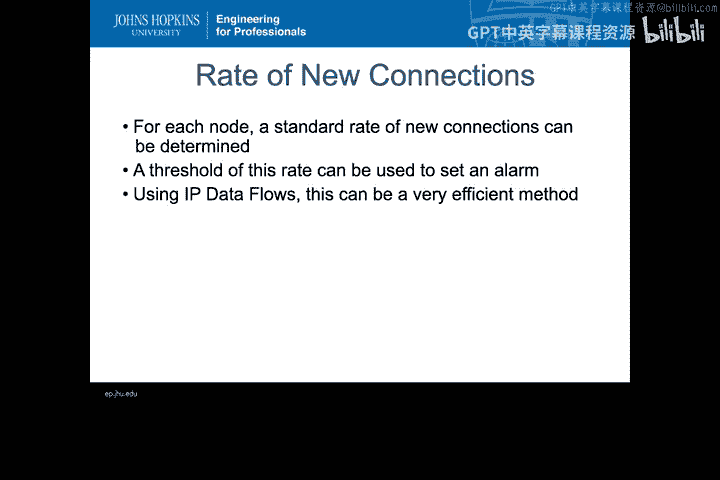

我们从图的基本定义开始，了解了如何将IP网络流数据构建成有向图，其中节点代表IP地址，边代表数据流。我们探讨了**入度**、**出度**和**边权重**等重要概念。

接着，我们学习了如何通过分析图的**连接性**、**分区**和**特征**来识别异常行为，例如从未连接的子图间出现新连接。这可以直接转化为网络入侵检测系统的警报。

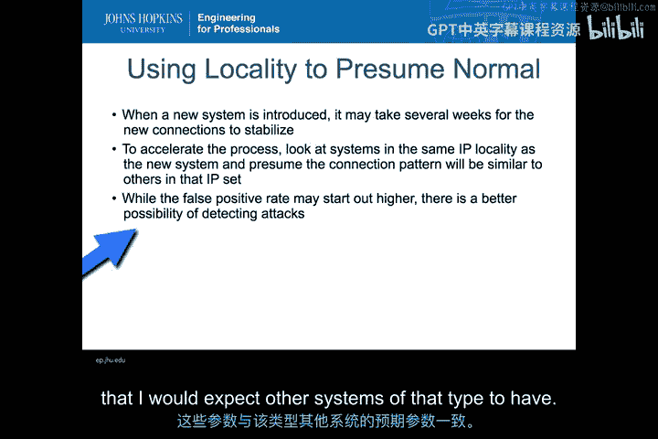

此外，我们还看到如何利用图的特征来**推断节点的实际功能**（如识别未授权的邮件服务器），以及如何使用**局部性**这一更通用的概念来检测新连接速率的异常激增，从而发现恶意软件传播等活动。

最后，我们了解到图分析正成为网络态势感知中的重要工具，并与大数据技术结合，用于分析大规模企业网络。像**KADA**这样的组织正在引领这一领域的发展，利用图分析来理解恶意软件的传播和攻击模式。

通过将网络流量转化为图并应用这些分析技术，我们能够在传统的基于签名的检测之外，建立一种强大的、基于行为模式的异常检测能力。