# 037：Security Onion与Bro实验 🧅

在本节课中，我们将学习Security Onion平台及其核心组件，特别是作为网络入侵检测系统的Bro。我们将了解Security Onion的架构、功能以及Bro如何分析网络流量。

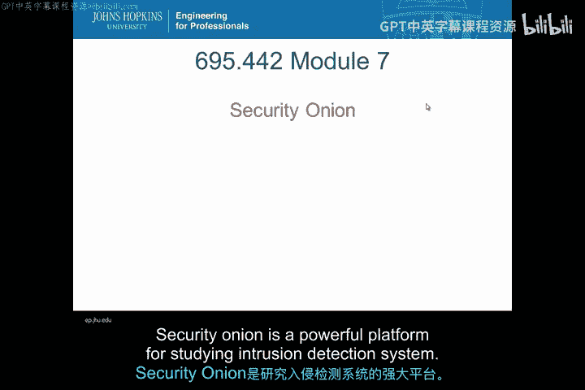

---

## 概述

Security Onion是一个用于研究入侵检测系统的强大平台。它集成了多种安全工具，能够进行全面的网络监控和分析。

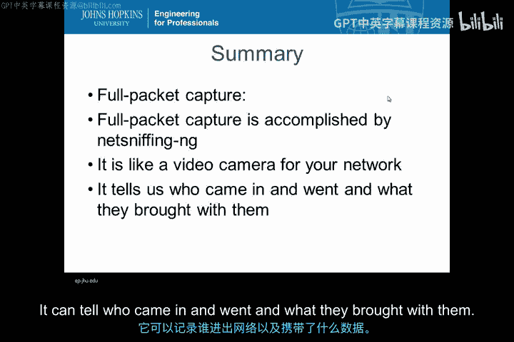

## Security Onion简介

Security Onion是一个功能强大的入侵检测系统学习平台。

简而言之，Security Onion能够执行全数据包捕获。这就像为你的网络安装了一个摄像机。你可以知道谁进出网络，以及他们携带了什么。

## Security Onion的三大组件

Security Onion包含三个主要组件。

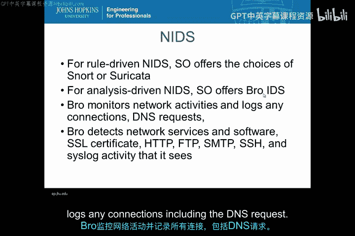

以下是这三个组件的详细说明：

1.  **入侵检测系统**：包括网络入侵检测系统和主机入侵检测系统。
2.  **强大的分析工具**。
3.  **全数据包捕获**功能。

对于基于规则的网络入侵检测，Security Onion提供了Snort和Suricata。对于基于分析的网络入侵检测，Security Onion提供了Bro IDS。

Bro监控网络活动，并记录所有连接，包括DNS请求。

对于基于主机的入侵检测，Security Onion提供了OSSEC。OSSEC可以执行日志分析、文件完整性检查、策略监控和实时警报。

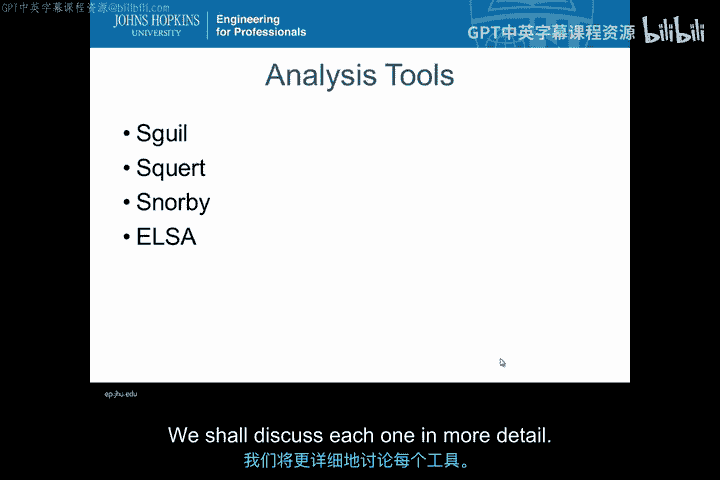

全数据包捕获功能就像摄像机。它告诉我们谁进出网络，以及他们携带了什么。

Security Onion中的分析工具包括Sguil、Squert、Snorby和ELSA。

ELSA代表企业日志搜索与归档。我们将在后面更详细地讨论每一个工具。

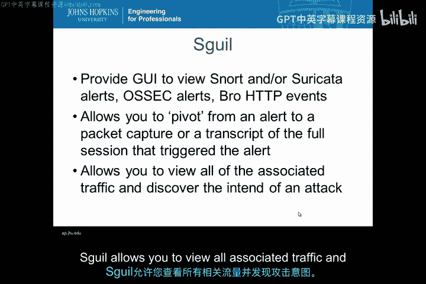

## 分析工具详解

上一节我们介绍了Security Onion的组件，本节中我们来看看其核心分析工具的具体功能。

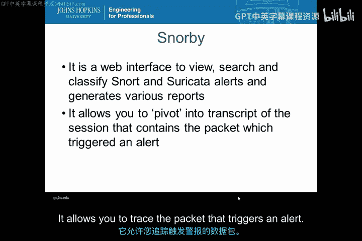

*   **Sguil**：提供了一个良好的界面来查看Snort和Suricata警报。例如，它允许你将警报关联到数据包捕获。Sguil允许你查看所有相关的流量，并发现攻击意图。
*   **Squert**：是Sguil数据库的一个Web应用程序。它提供了网络数据的可视化。
*   **Snorby**：是一个用于查看、搜索和分类警报以及生成报告的Web界面。它允许你追踪触发警报的数据包。

*   **ELSA**：代表企业日志搜索与归档。它允许你梳理Security Onion收集的数据。ELSA提供了对相关系统日志数据的可见性，并提供强大的图形显示。

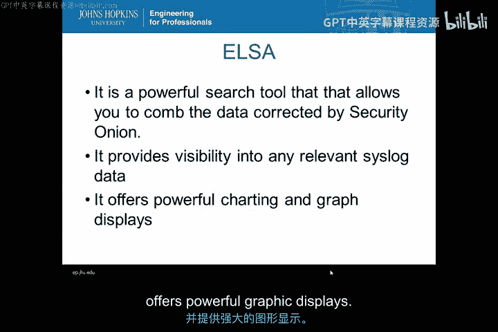

## 服务状态与部署

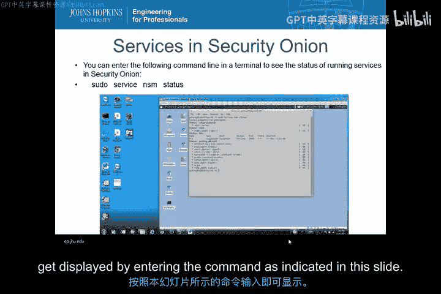

这是Security Onion服务状态的显示界面。你可以登录到你的Security Onion虚拟机，并通过输入本幻灯片中指示的命令来获取此显示。

Security Onion有多种部署方案，具体取决于你的应用和组织需求。对于你的Security Onion虚拟机，它被设置为独立安装。

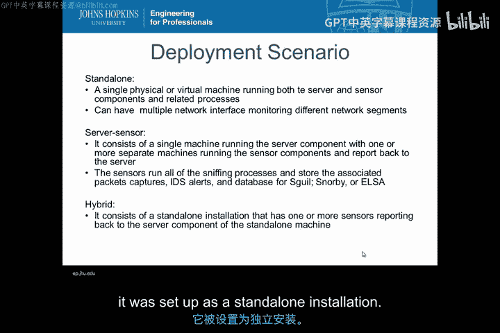

## Bro网络入侵检测系统

在接下来的几张幻灯片中，我们将更详细地讨论作为网络入侵检测系统的Bro。

Bro是一个网络流量分析器。它是一个事件驱动的入侵检测系统。Bro包含许多协议分析器。Bro提供网络与社区情报的实时关联。

现在请注意，这是一个重要的概念，让我重复一遍：**Bro提供网络与社区情报的实时关联**。

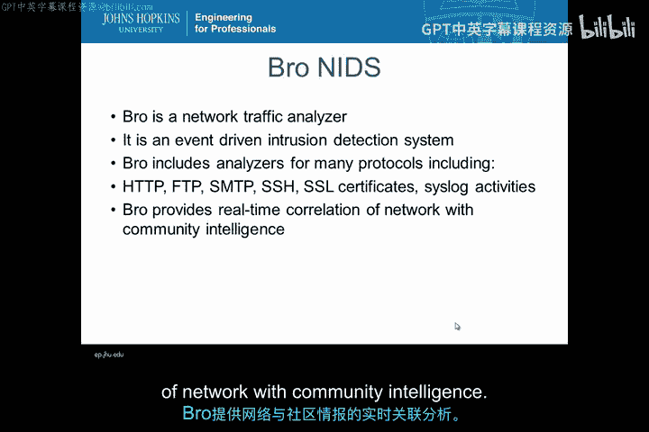

## Bro的重要文件

本幻灯片描述了Security Onion中Bro的重要文件。你应该对Bro的配置文件、日志文件的位置有一些了解。Bro使用许多内置脚本。由于你使用的是我们为你准备的Security Onion虚拟机，你无需担心Bro的安装。

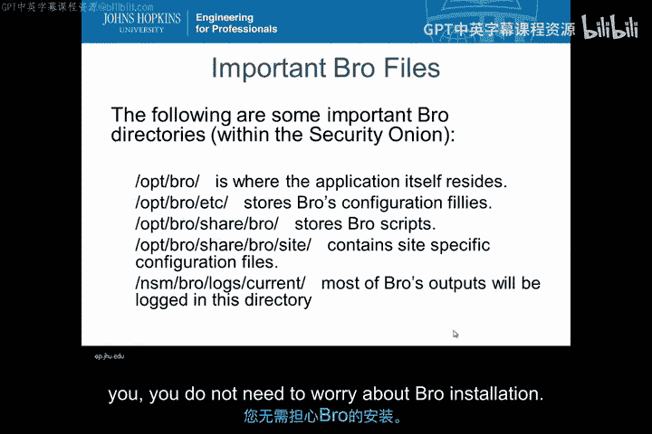

本幻灯片为你提供了一些关于Bro的阅读链接和参考资料。我包含了一个YouTube视频供你观看，你可以看到Security Onion的创建者Doug Burke的讲解。

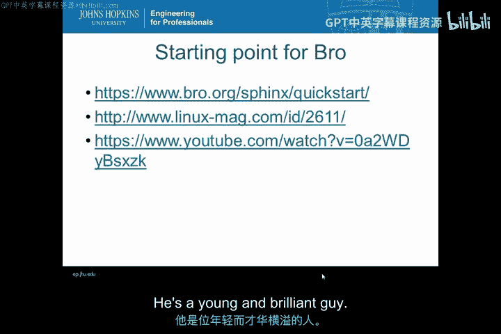

## Bro日志与脚本

本幻灯片总结了Security Onion中Bro的日志文件。Bro日志文件位于目录 `/nsm/bro/logs/` 下。你应该登录到你的Security Onion虚拟机，查看该日志目录下有哪些文件。

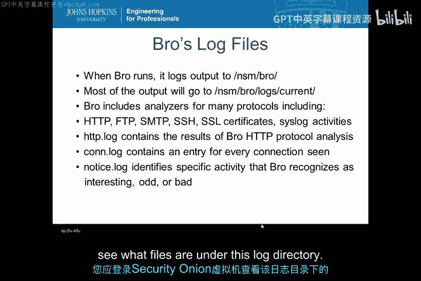

Bro实际上是一种编程语言。它使用 `.bro` 文件扩展名来表明该文件是一个Bro脚本。Bro为网络分析提供了许多内置脚本。

本幻灯片描述了Bro的脚本类型及其位置。

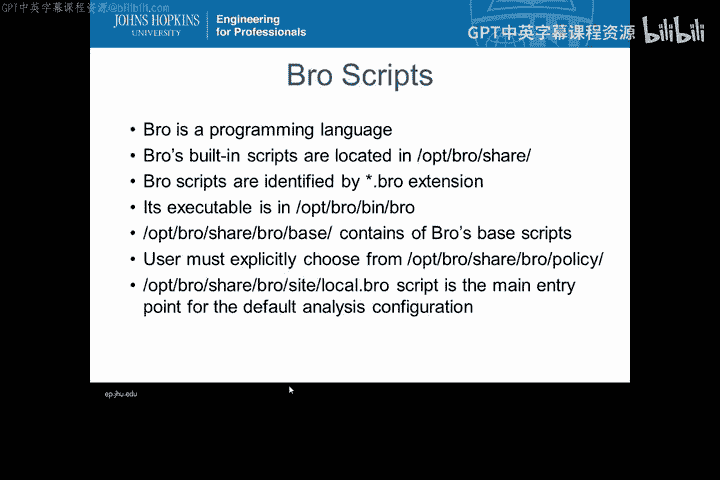

## 示例：DNS异常检测

最后这张幻灯片是Bro如何进行DNS异常检测的一个例子。我们将在后续的实验作业中讨论这个例子。

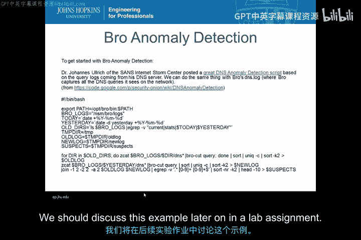

---

## 总结

本节课中，我们一起学习了Security Onion入侵检测平台。我们了解了它的三大核心组件：入侵检测系统（如Snort、Suricata、Bro、OSSEC）、分析工具（如Sguil、Squert、Snorby、ELSA）以及全数据包捕获功能。我们重点探讨了Bro作为事件驱动的网络分析器，如何通过脚本和日志提供网络活动的实时关联与深度可见性。这些工具共同构成了一个强大的网络监控与安全分析环境。