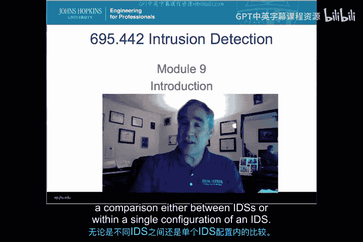
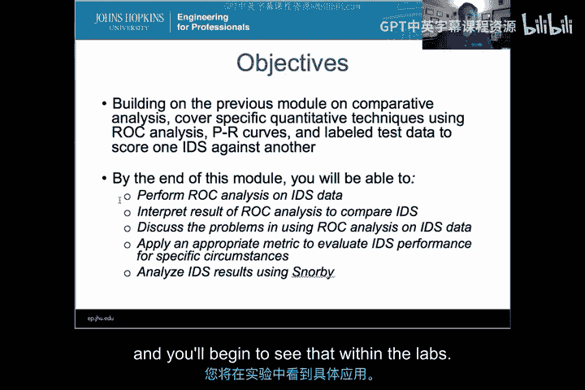
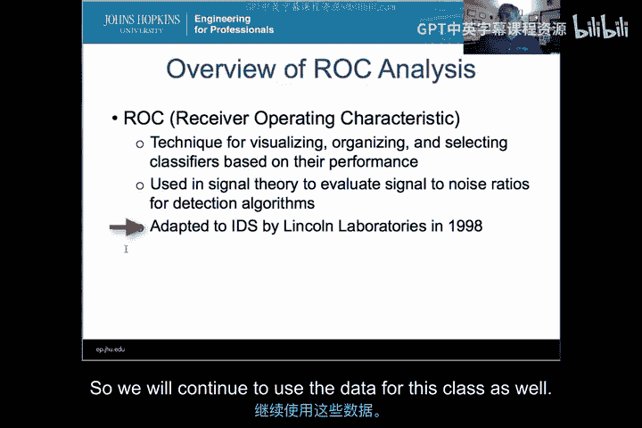
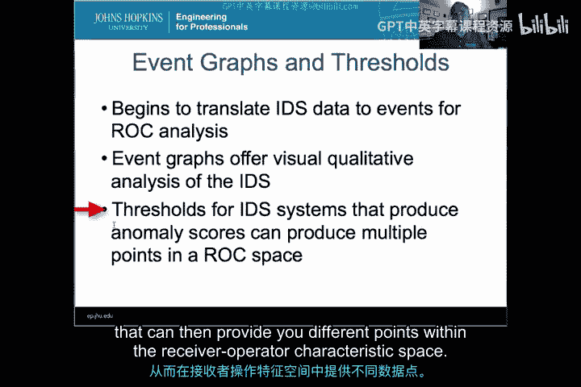
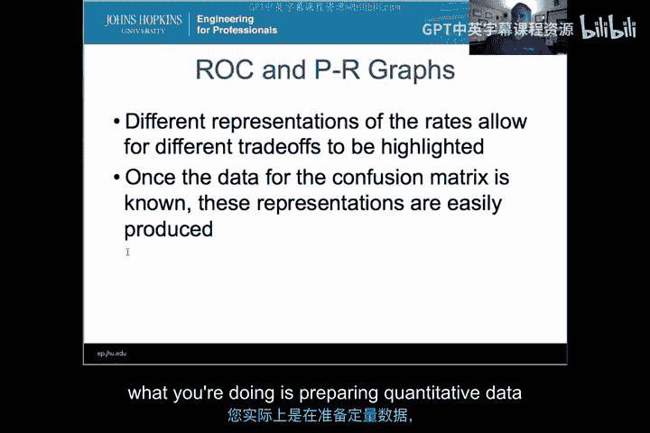
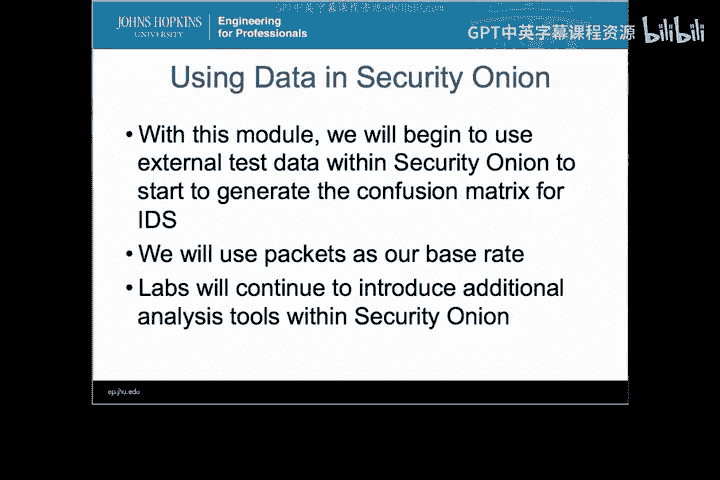

# 038：ROC分析 🎯

在本模块中，我们将学习如何对入侵检测系统（IDS）的性能进行定量分析。我们将重点介绍接收者操作特征（ROC）分析，这是一种利用测试数据生成的数值来量化比较不同IDS或同一IDS不同配置性能的方法。通过学习，你将能够对IDS数据执行ROC分析、解读结果、选择合适的评估指标，并在实验环境中应用这些知识。

---

上一节我们概述了本模块的目标，本节中我们将深入了解ROC分析本身。

## ROC分析概述 📊

ROC分析是一种用于**可视化、组织和基于性能选择分类器**的技术。它最初应用于信号理论，用于研究信号降噪中的不同分类器。1998年，林肯实验室将其引入，用于对当时DARPA资助的不同入侵检测系统进行**比较分析**。这成为了IDS历史上首次进行定量分析的尝试。尽管当时的数据集存在一些问题，但至今仍被广泛使用，我们本课程也将使用它。

---

了解了ROC分析的起源后，我们来看看如何将IDS的原始事件转化为适合分析的数据。

## 事件图与阈值 📈

事件图通常提供一种**视觉定性分析**。你可以通过观察事件图直观判断分类器的好坏。然而，为了进行定量分析，我们需要使用**阈值**。通过设置不同的阈值，我们可以将IDS事件转换为**异常分数**，从而在ROC空间中生成不同的数据点。这些数据点是后续定量比较的基础。

---

从事件图得到数据点后，我们需要一个标准化的结构来组织这些数据，这就是混淆矩阵。

## 混淆矩阵：定量分析的基石 🧮

混淆矩阵是**所有分析技术的基础**。它包含四个核心元素：
*   **真阳性（TP）**：攻击被正确检测到。
*   **假阳性（FP）**：正常流量被误报为攻击。
*   **真阴性（TN）**：正常流量被正确忽略。
*   **假阴性（FN）**：攻击未被检测到。

通过收集测试数据并填充混淆矩阵，我们就为ROC分析、精确率-召回率分析等准备好了**定量数据**。

---

有了混淆矩阵，我们就可以进行更深入的比较和分析。

## 比较与成本效益分析 ⚖️

基于同一IDS的不同配置，我们可以生成**多个混淆矩阵**并进行比较。在IDS领域，ROC分析本质上是一种**成本效益分析**。这里的“成本”可能指误报（FP）带来的运维负担，而“效益”则指正确检测（TP）带来的安全提升。通过这种方式，我们可以对**多个IDS进行定量比较**。

---

在进行比较时，我们更关注比率而非原始数据，这引出了误差率的概念。

## 误差率的重要性 🔢

在分析IDS性能时，**误差率比原始数据更重要**。我们通过计算**真阳性率（TPR）** 和**假阳性率（FPR）** 等指标来表征性能。这些比率消除了数据规模的影响，使得不同系统间的比较更加公平和有意义。

---

最后，我们将学习如何利用这些比率生成直观的图表。

## 生成ROC与精确率-召回率图 📉

通过计算不同阈值下的TPR和FPR，我们可以绘制出**ROC曲线**。同样，我们也可以绘制**精确率-召回率曲线**。这两种图形化表示方法能够突出显示IDS性能中不同的权衡关系，例如检测率与误报率之间的平衡。

---

## 实验与应用 🛠️

在本模块的后续实验和整个学期中，我们将开始在Security Onion中收集和使用外部测试数据，为其中的IDS生成真实的混淆矩阵。我们将以**数据包**作为基准率进行计算。请注意，选择合适的基准率对于此类分析至关重要。

---

本节课中，我们一起学习了ROC分析的基础。这是一个注重细节的模块，涉及如何对IDS进行定量分析。请花时间观看视频、完成练习和作业，这将帮助你掌握在Security Onion或任何其他IDS测试环境中使用真实数据进行定量分析的技能。