# 040：事件图与阈值设定 📊

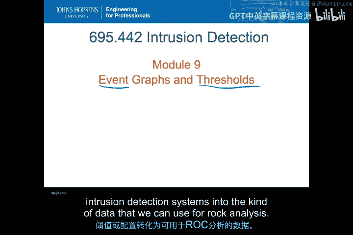

在本节课中，我们将学习如何将入侵检测系统（IDS）产生的原始事件数据，通过事件图可视化和阈值设定，转化为可用于ROC（接收者操作特征）分析的数据。我们将重点理解异常检测系统的评分机制、如何通过调整阈值来改变系统灵敏度，以及如何构建混淆矩阵来量化分类器的性能。

上一节我们介绍了ROC分析的基本概念，本节中我们来看看如何将入侵检测系统的输出转化为ROC分析所需的格式。

## 从异常检测到ROC分析

ROC分析的思想最初源于对异常检测系统的评估。因为异常检测系统会为每个检测到的事件输出一个**异常分数**，这暗示我们可以通过改变接受事件的**分数阈值**来调整系统的行为。

**核心公式：**
`事件分类 = (分数 > 阈值) ? “异常” : “正常”`

这与基于签名的检测系统不同，后者通常只给出“告警”或“无告警”的二元结果，没有可调节的阈值或连续的匹配分数。不过，我们后面会看到，ROC分析同样可以应用于签名检测系统。

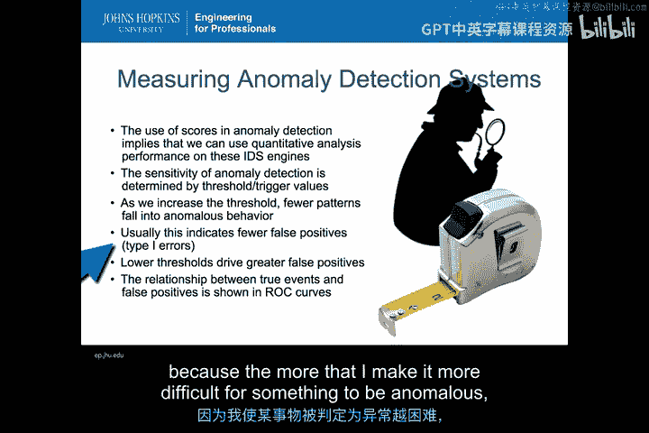

回到异常检测系统，其**灵敏度**正是通过调整这些阈值来决定的。

*   **阈值越高**，事件被判定为异常的门槛就越高，系统越不敏感。
*   **阈值越低**，事件越容易被判定为异常，系统越敏感。

通过调整阈值，我们可以控制系统对“异常程度”的敏感度。提高阈值意味着更少的行为模式会被归为异常；降低阈值则意味着更多行为会被归为异常。这通常会导致更少的误报（第一类错误），因为提高阈值使得正常行为被误判为异常的可能性降低。反之，较低的阈值会推高误报率。这种**真实事件检出率**与**误报率**之间的权衡关系，正是ROC分析所关注的核心。

## 事件图可视化

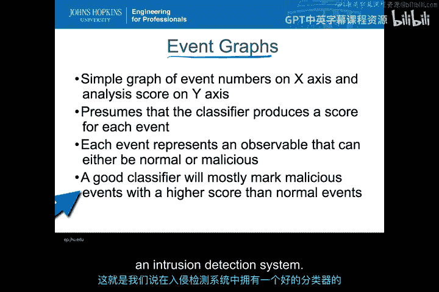

在异常检测系统中，这一切都始于**事件图**。这是一个非常简单的图表：
*   **X轴**：事件编号（通常是时间顺序）。
*   **Y轴**：分析分数（即异常检测系统返回的分数，通常在0到1之间）。

这假设我们的分类器会为它发现的每个事件（如每个数据包、每个会话）产生一个分数。我们可以将这些分数绘制在图上，每个点代表一个可观测事件，其真实类别可能是正常或恶意。

**重要的一点是**：除了分类器给出的分数，我们还必须知道每个事件的**真实类别**（Ground Truth）。即，它到底是真正的异常/攻击，还是正常的良性行为。一个优秀的分类器会给恶意事件打高分，给正常事件打低分。这就是我们所说的“好的入侵检测分类器”。

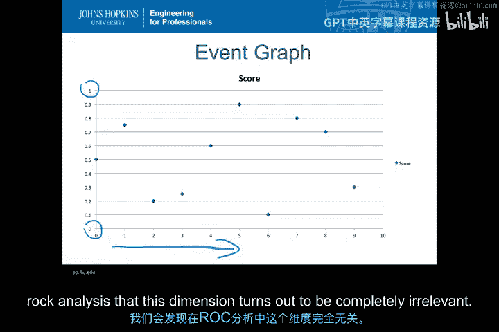

以下是某个异常检测系统生成的一个简单事件图示例：

如图所示，Y轴分数在0到1之间。底部的数字是事件编号。可以看到，一些事件聚集在上方（更可能是异常），另一些聚集在下方（更可能是正常）。如果这是一个表现良好的分类器，这种聚类现象就会很明显。

## 标注真实类别与设定阈值

接下来，我们需要在事件图的每个点上标注其真实类别。

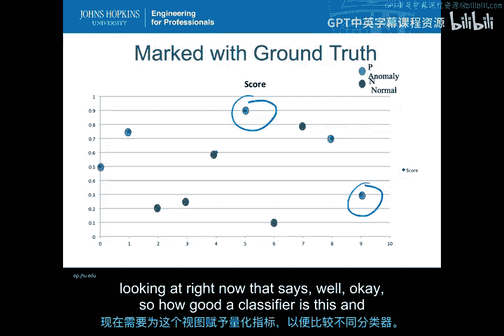

在上图中：
*   **蓝点（P）**：代表系统中的真实异常事件。
*   **绿点（N）**：代表系统中的真实正常事件。

在一个完美的分类器中，所有蓝点都应位于分数1的位置，所有绿点都应位于分数0的位置。但如图所示，这个分类器并不完美：有一个绿点得分很高，而一个蓝点得分很低。理想情况下，那个高分绿点应该在0分，那个低分蓝点应该在1分。

仅通过可视化观察标注了真实类别的事件图，我们就能定性地评估分类器的好坏。但我们需要一个更**定量**的方法来评估和比较不同的分类器。

为了实现定量分析，我们需要引入**混淆矩阵**。

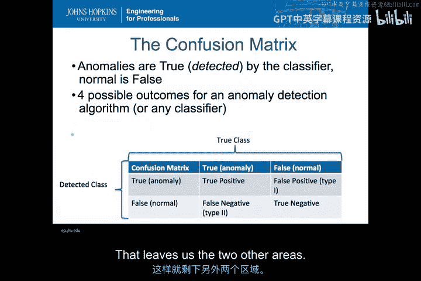

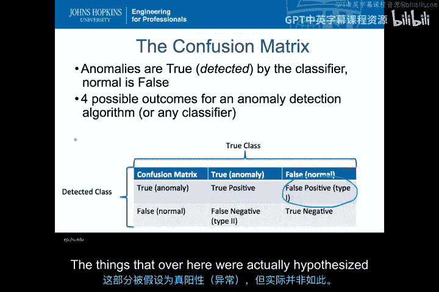

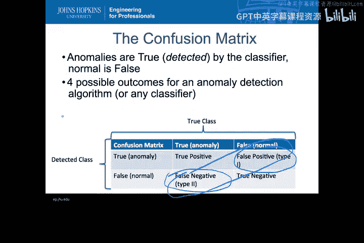

对于任何配置了特定阈值的异常检测算法或分类器，都有四种可能的结果：
1.  **真正例（TP）**：检测为异常，且确实是异常。
2.  **真负例（TN）**：检测为正常，且确实是正常。
3.  **假正例（FP）**：检测为异常，但实际上是正常（误报，第一类错误）。
4.  **假负例（FN）**：检测为正常，但实际上是异常（漏报，第二类错误）。

混淆矩阵的对角线（TP和TN）代表正确分析的事件。另一条对角线（FP和FN）则代表分类器产生的错误。

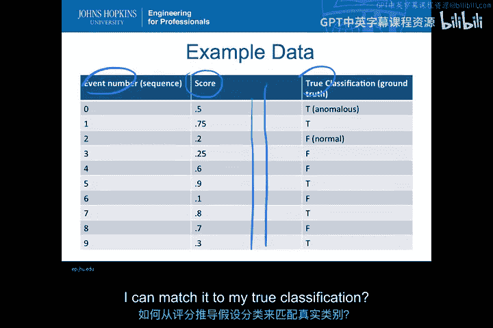

## 从分数到假设类别：设定阈值

我们回到数据。对于每个事件，我们有事件编号、分数和真实类别。但我们只有分数，没有“假设类别”。

如何从分数得到假设类别呢？答案是通过设定一个**阈值**。我们在事件图上画一条水平线作为阈值。例如，将阈值设在0.42：
*   分数**高于**0.42的事件，**假设为异常**。
*   分数**低于**0.42的事件，**假设为正常**。

设定阈值后，我们就能统计混淆矩阵的所有四个元素：
*   **真正例（TP）**：蓝点且高于阈值（本例有4个）。
*   **真负例（TN）**：绿点且低于阈值（本例有3个）。
*   **假正例（FP）**：绿点但高于阈值（误报，本例有2个）。
*   **假负例（FN）**：蓝点但低于阈值（漏报，本例有1个）。

这样，仅仅通过绘制一条阈值线并创建假设类别，我们就构建出了完整的混淆矩阵。

## 多阈值与ROC曲线

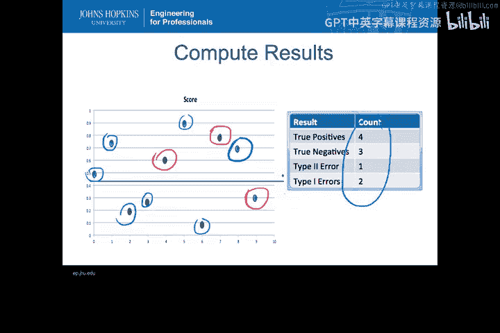

我们刚才构建的混淆矩阵是针对**单个阈值点**的。每次选择一个新的阈值，都可能得到一个新的混淆矩阵。当然，如果阈值移动的幅度很小，没有跨越任何已有事件的分数，混淆矩阵就不会改变。但每次阈值跨越一个事件的分数时，就会产生一个新的混淆矩阵。

因此，我们能得到的唯一混淆矩阵的最大数量，等于数据中**唯一分数值的数量加一**。数据点越多，理论上可以绘制的不同混淆矩阵就越多，从而为我们的分析增加分辨率。这并没有改变分类器本身，只是围绕数据移动了阈值。

为了演示这一点，我们将示例数据按分数排序（事件编号此时已无关紧要）。

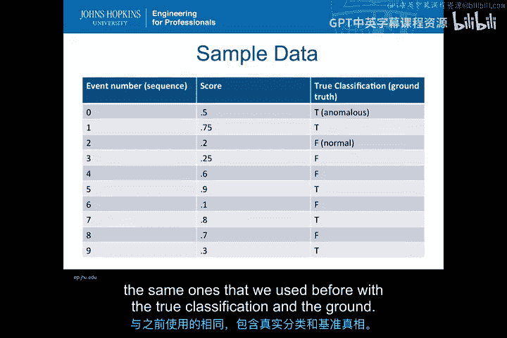

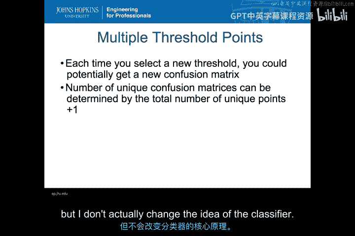

排序后，我们可以轻松地知道可以在哪里绘制阈值（例如，在0.05之前、在0.05和0.1之间，依此类推）。我们必须确保真实类别始终与对应的分数匹配，以便进行有效计数。

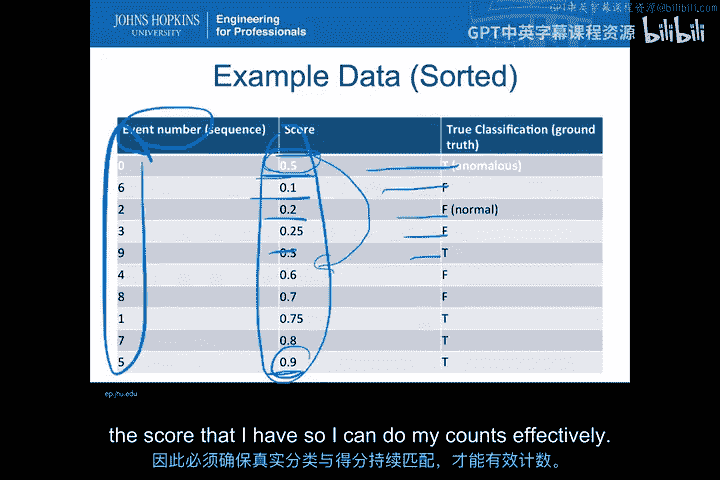

在数据图中，我们从非常低的阈值点开始，逐步上移阈值点，尽可能多地创建阈值。通过这种方式，我们可以计算出每个阈值对应的假正率（FPR）和真正率（TPR），它们直接由混淆矩阵的计数计算得出。

**注意**：如果阈值恰好落在某个分数上，只要处理方式一致（例如，始终将等于阈值的情况计为“高于”或“低于”），你仍然会得到一个有效的混淆矩阵和ROC空间中的有效点。

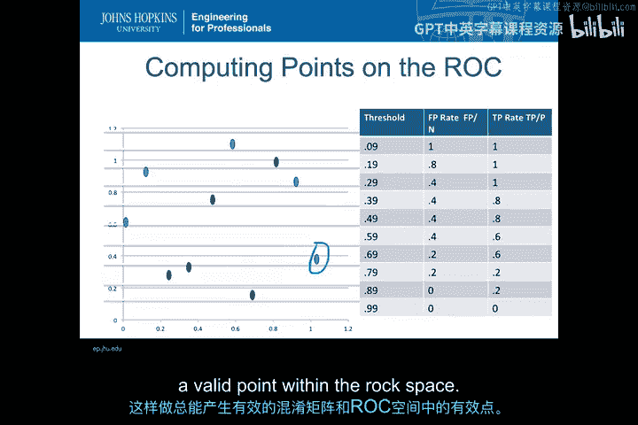

根据所有不同的阈值，我们最终可以绘制出第一条**接收者操作特征（ROC）曲线**。在本例中，它是一条穿过数据点的奇特阶梯函数，展示了在0到1的范围内，该分类器在真正率和假正率之间的权衡关系。

图中仍可画出对角线。对角线上的一些点（例如阈值为0.79和0.9时）表明，在这些阈值下，分类器的表现与随机猜测无异（因为TPR ≈ FPR）。这很容易理解：如果阈值设得太低或太高，基本上所有点都会被归到同一侧，没有起到分类作用。

但对于那些在阈值上下都有点的设置，我们就能在ROC曲线上看到权衡。我们可以开始判断哪些点较好。例如，图中0.29和0.64附近的点，能以相对较低的假正率获得较高的真正率。这样，我们就能开始看出对于一个特定分类器，哪些可能是较好的阈值点。

## 固定分类器的比较

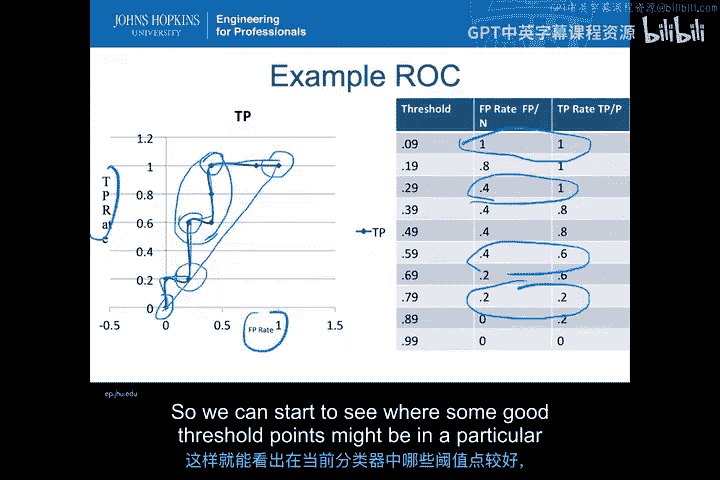

我们创建了一条曲线，因为我们可以为单个分类器基于不同阈值生成ROC空间中的多个点。但是，如果你的系统无法调整阈值（例如基于签名的IDS，没有阈值概念），你仍然可以通过基于现有IDS配置生成一个特定的混淆矩阵，从而在ROC图上得到一个**单一点**。

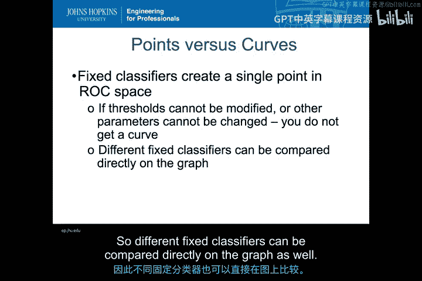

不同的固定分类器可以直接在ROC图上进行比较。例如，回顾之前我们将阈值设在0.42的例子，那会得到一个特定的假正率和真正率，对应于ROC空间中的一个单一点。这个点完全有效，可以用于不同IDS之间的比较分析。

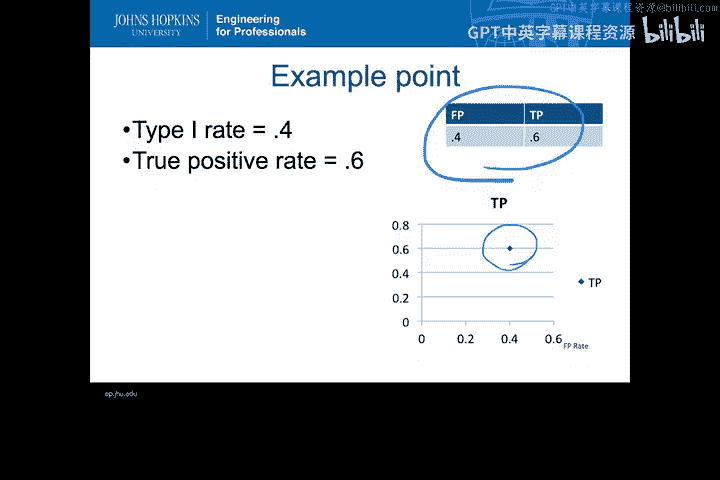

**本节课总结**

在本节课中，我们一起学习了如何将入侵检测数据转化为可用于ROC分析的形式。关键步骤包括：
1.  理解异常检测系统的**分数输出**和**阈值**概念。
2.  通过**事件图**可视化事件分数。
3.  利用**真实类别（Ground Truth）** 标注事件。
4.  通过设定**阈值**，将连续分数转化为二元假设类别。
5.  基于阈值构建**混淆矩阵**，计算真正例、假正例等。
6.  通过**系统性地调整阈值**，生成多个性能点，最终绘制出**ROC曲线**。
7.  理解即使对于没有阈值概念的固定分类器（如签名IDS），也能在ROC空间中表示为**单个点**进行比较。

掌握这些步骤，是定量评估和比较不同入侵检测系统或配置性能的基础。