# 041：基于IDS配置的多重混淆矩阵 📊

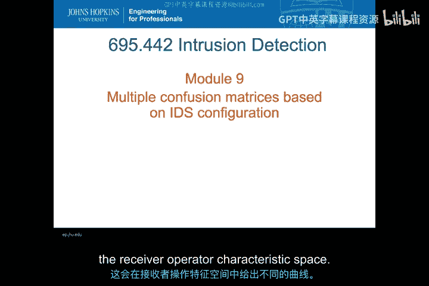

在本节课中，我们将继续上一模块的内容，深入探讨基于多种入侵检测系统（IDS）配置或多重不同IDS的混淆矩阵比较。我们将学习如何在接收者操作特征（ROC）空间中，通过不同的曲线来评估和比较这些系统。

---

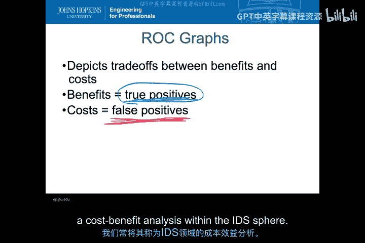

上一节我们介绍了ROC图的基本概念，特别是真阳性与假阳性之间的权衡。在IDS领域，这实际上是一种成本效益分析：效益体现在发现真正的攻击事件（真阳性），而成本则体现在需要处理的误报（假阳性）。

为什么这是一种成本效益分析？效益很好理解：部署IDS就是为了发现真正的安全事件。而误报之所以是成本，是因为每当出现一个误报，安全团队都需要投入资源去调查和确认它是否真的是一个真实的安全事件。如果误报过多，团队可能会将大量资源浪费在追踪那些并非真正攻击的事件上。因此，在ROC分析中，我们常将其视为IDS领域内的成本效益分析。

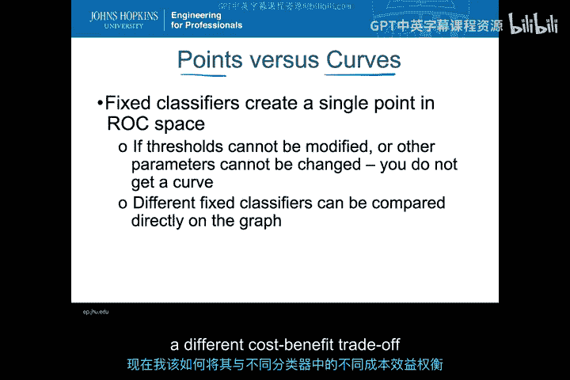

---

在成本效益分析的框架下，我们已经讨论了单个点与曲线的概念。现在，我们可以将其视为一种评估不同分类器性能的方法。

如果一个分类器的参数是固定的，它只能在ROC空间中产生一个**单点**。这意味着我们只能获得一种固定的成本效益权衡。例如，一个点可能具有较高的真阳性率（TPR）和中等水平的假阳性率（FPR）。我们需要将这个点与另一个分类器产生的、具有不同权衡关系的点进行比较。

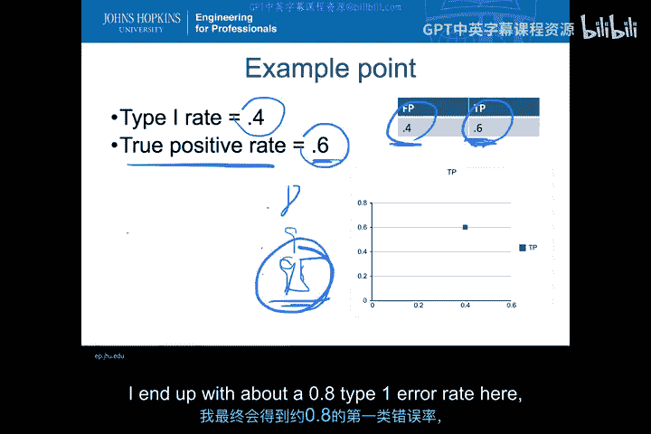

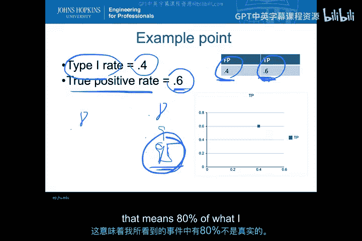

让我们回到之前的例子。假设一个分类器在ROC空间中的点是 `(FPR=0.4, TPR=0.6)`。

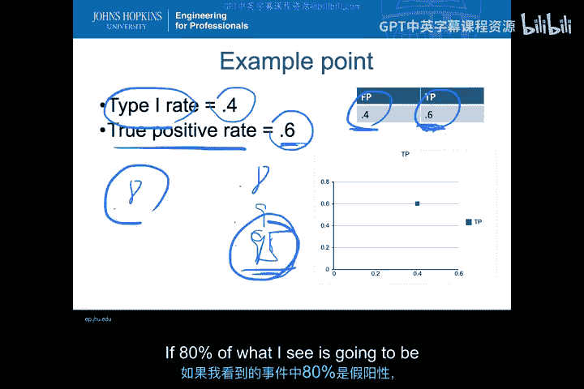

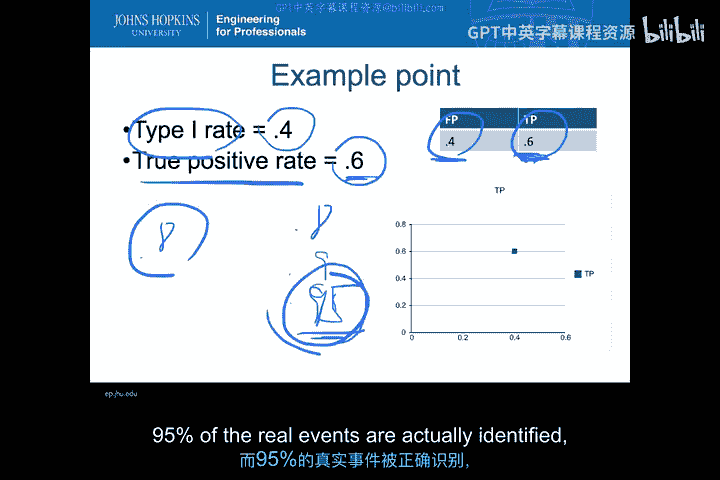

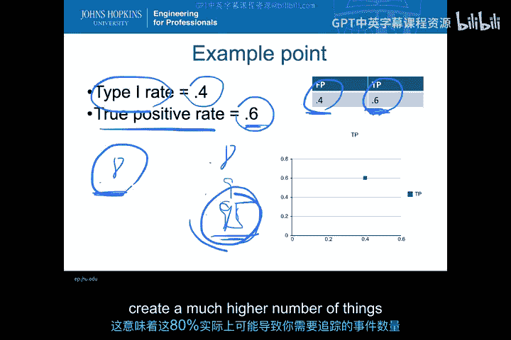

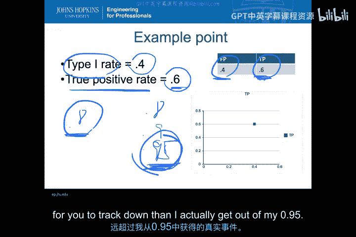

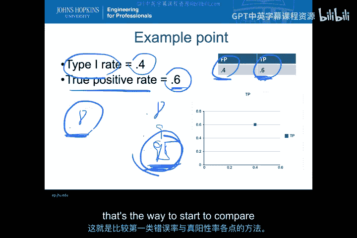

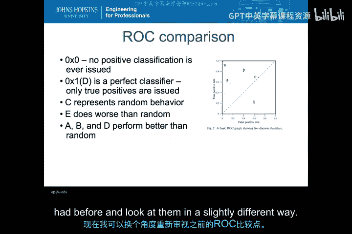

*   **真阳性率（TPR）为0.6**：这意味着该IDS能检测到约60%的真实攻击事件。但同时，它会漏掉约40%的真实攻击（第二类错误）。
*   **假阳性率（FPR）为0.4**：这意味着在所有被标记为“攻击”的警报中，有40%实际上是误报。安全团队需要花费大量时间去调查这些误报。

这就是该分类器的权衡点。现在，如果另一个分类器的点是 `(FPR=0.8, TPR=0.95)`，虽然它能检测到95%的真实攻击，但其80%的警报都是误报。考虑到正常流量通常远多于攻击流量，这个80%的误报率可能会产生海量的调查任务，其成本可能远超检测到更多攻击带来的效益。

因此，在进行成本效益分析时，我们需要仔细权衡不同点的假阳性率和真阳性率。

---

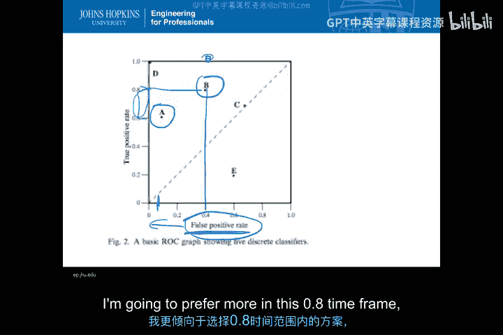

现在，我们可以用成本效益的视角重新审视之前提到的几个比较点。

以下是几个分类器性能点的比较：
*   **点D**：性能极差，在任何情况下都不会考虑。
*   **点C**：性能不佳，提供的价值有限。
*   **点A**：假阳性率很低。虽然只能检测到60%的真实攻击，但需要追踪的误报很少。
*   **点B**：真阳性率比A点略高，但假阳性率也大幅上升（超过40%）。

从成本效益的角度看，在大多数企业环境中，**点A** 通常是更优的选择，因为它能最小化误报带来的资源消耗。除非在某些极端情况下（例如，必须确保捕获所有零日攻击），我们才会倾向于接受更高的误报率以换取极高的检测率（类似**点B**的特性）。

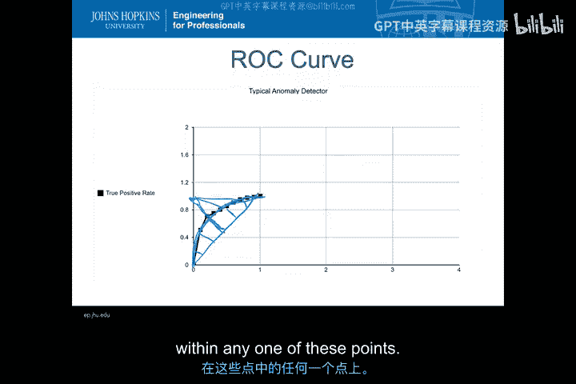

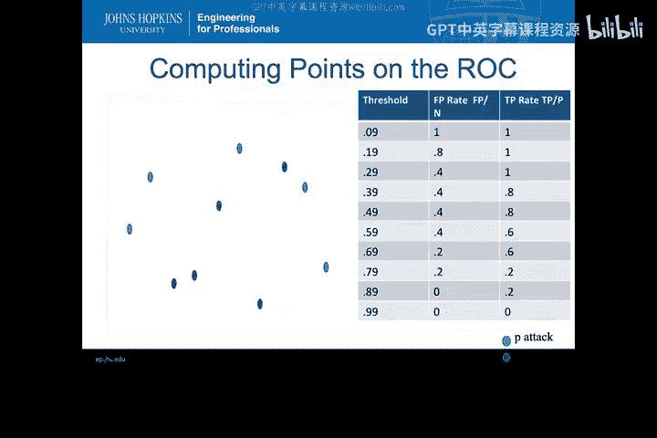

---

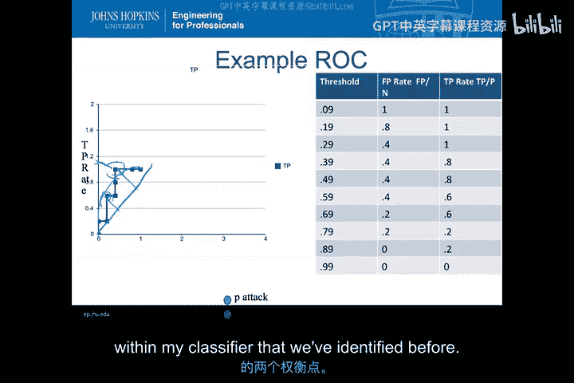

如果一个分类器有可调节的参数（例如，异常检测的阈值），那么它就能在ROC空间中生成一条**曲线**，而不仅仅是一个点。这为我们提供了更大的灵活性。

通过调整阈值，我们可以在曲线上选择不同的操作点。例如，可以选择一个点来最大化真阳性率，也可以选择另一个点来最小化假阳性率。这样，我们就可以在同一分类器内部的不同配置之间进行成本效益权衡分析，其方式类似于比较两个不同IDS的单个点。

典型的ROC曲线看起来像一个阶梯函数，其整体性能优于从(0,0)到(1,1)的对角线（随机分类器）。曲线上的点离这条对角线越远，通常意味着分类器性能越好。另一种衡量方式是计算曲线上每个点到完美分类点 `(0,1)` 的距离，距离越短越好。

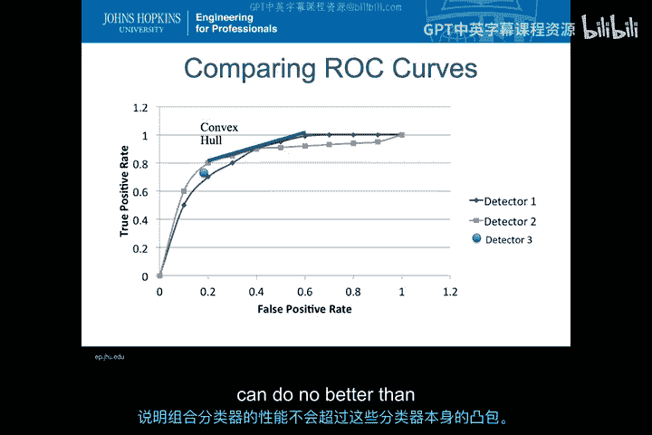

回顾我们之前计算过的示例数据，其ROC曲线也符合这些特征。我们可以通过计算到对角线的最大距离或到完美分类点的最小距离，来识别曲线上最佳的权衡点。

---

当我们拥有多个不同的IDS时，情况会变得更加复杂。假设有三个检测器，它们各自有不同的ROC曲线。

通过观察曲线，我们可以发现：
*   **检测器1** 在高假阳性率、高真阳性率区域表现更好。
*   **检测器2** 在保持较高真阳性率的同时，能更好地最小化假阳性率。
*   **检测器3** 是一个单点分类器，其性能点位于检测器1和2之间的某个位置。

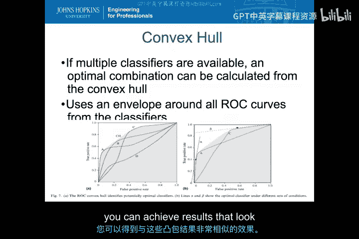

那么，我们是否应该选择检测器3？答案通常是否定的。因为如果我们关心低假阳性率区域，检测器2的性能始终优于检测器3；如果我们关心高检测率区域，检测器1又优于检测器3。检测器3的单一操作点无法提供优于其他两个检测器可变曲线的灵活性。

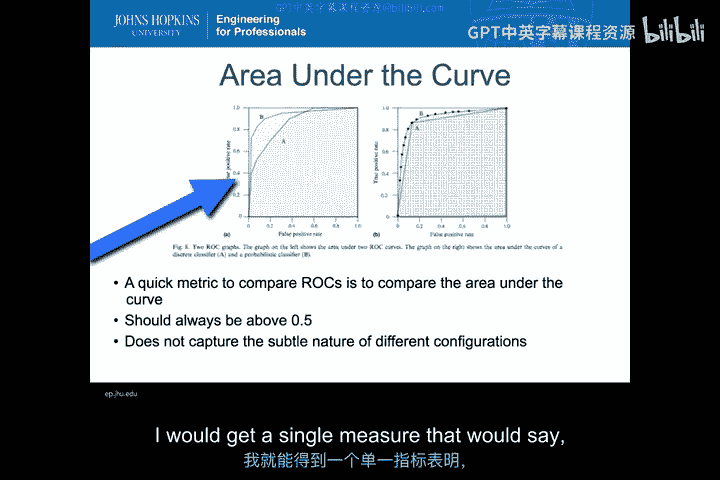

此外，我们还可以考虑**组合分类器**。理论上，如果我们有多个分类器，可以绘制它们所有ROC点的**凸包**。这个凸包边界代表了组合这些分类器所能达到的最佳性能上限。

在实际的入侵检测中，组合不同的IDS工具可能很困难，因为这涉及到算法层面的融合，而不仅仅是并行运行两个工具。然而，在一些模块化系统（如Bro/Zeek）中，通过加载不同模块，确实可以实现接近凸包理论效果的分类性能提升。

---

另一种快速比较多个ROC曲线的方法是计算每条曲线下的**面积（AUC）**。

AUC提供了一个单一的度量值，用于衡量分类器在所有可能阈值下的整体性能。AUC值越大，通常意味着分类器的平均性能越好。在上图的例子中，即使分类器A在某个特定区域表现稍好，但分类器B的AUC值更大，表明其整体性能更优。

---

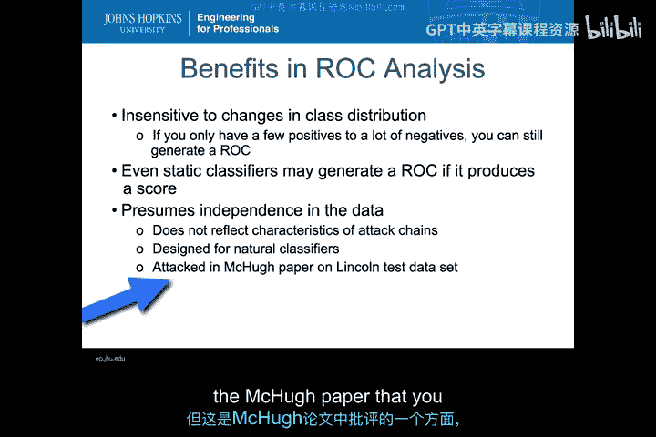

现在，让我们总结一下使用ROC分析进行IDS比较的益处和注意事项。

**益处：**
*   由于使用**比率**（TPR和FPR），ROC分析对**类别分布的变化不敏感**。即使测试数据中正常流量远多于攻击流量，我们仍然可以生成有意义的ROC曲线进行比较。
*   即使是静态的、基于签名的IDS也可以进行ROC分析。如果它能输出置信度分数，可以生成曲线；如果不能，至少可以生成一个ROC空间中的点。通过更换不同的规则集（视为不同配置），甚至可以为同一个签名IDS生成多个点。

**注意事项与挑战（McC论文中提及）：**
*   **信号与噪声的界定**：在入侵检测中，区分“攻击”与“正常”比传统信号处理中提取信号更复杂。
*   **可调检测函数的缺乏**：许多检测器只提供一个固定的操作点。
*   **度量基准问题（基本比率谬误）**：我们应该按时间、按数据包、还是会话来计算攻击和正常事件？例如，一次DDoS攻击可能包含成千上万个会话，但算作一次攻击。我们通常选择**按数据包**作为基准，但这仍然存在争议。
*   **数据独立性假设**：ROC分析假设数据点之间是独立的。但在入侵检测中，攻击往往由一系列相关事件（攻击链）组成，这违反了独立性假设，可能影响ROC分析的有效性。

尽管存在这些挑战，ROC分析目前仍然是**定量比较和评估不同入侵检测系统分类器性能的最佳工具之一**。虽然现在也常用精确率（Precision）和召回率（Recall）构成的PR曲线，但它们同样基于混淆矩阵，并未完全解决上述所有问题。

---

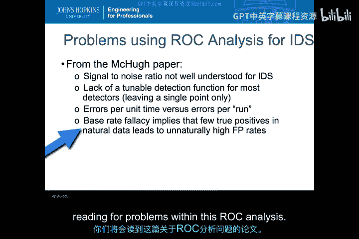

本节课中，我们一起学习了如何基于多重IDS配置进行混淆矩阵比较。我们深入探讨了ROC空间中的点与曲线分析，理解了如何将其视为成本效益权衡的工具，并学习了比较不同ROC曲线的方法（如观察凸包和计算AUC）。同时，我们也认识到在实际入侵检测应用ROC分析时存在的局限性和挑战。掌握这些知识，将帮助你更科学地评估和选择适合特定环境需求的入侵检测系统。