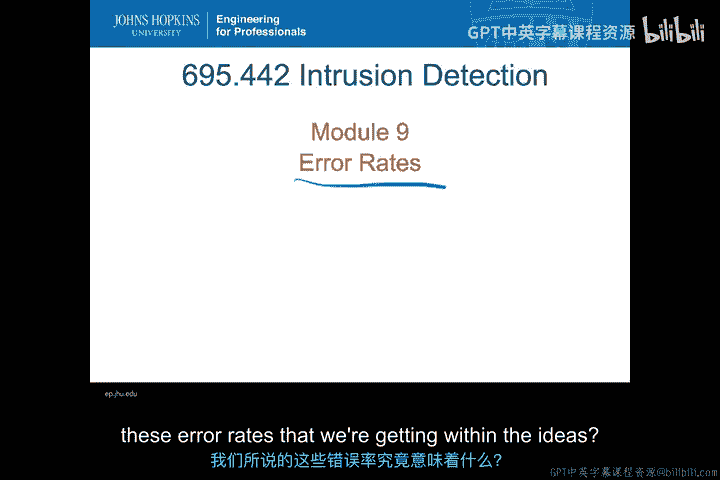
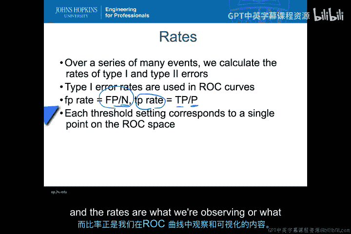
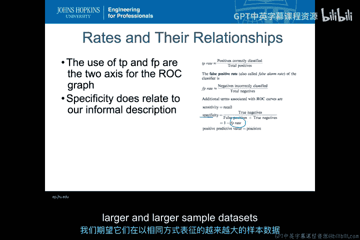
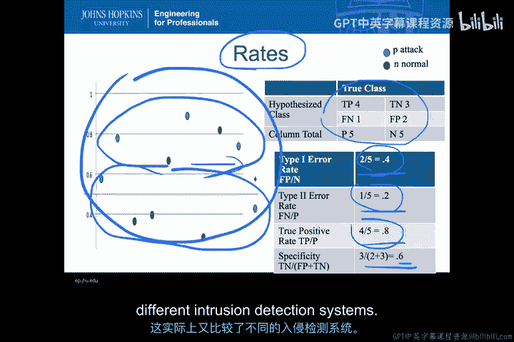

# 042：误报率与漏报率 📊

在本节课中，我们将深入探讨分类器中的错误率。这是所有ROC分析和定量分析的基础。理解这些错误率的真正含义至关重要。

---

## 概述

现在，我们稍微转换一下话题，讨论分类器中的错误率。由于这是我们所有ROC分析和定量分析的基础，因此有必要回过头来更深入地思考一下，我们在入侵检测系统中得到的这些错误率究竟意味着什么。

---

## 错误率与ROC分析基础

当我们谈论“率”时，意味着在一系列大量事件中，我们可以计算出第一类错误和第二类错误相对于总数的比例。其核心思想是，在进行此类定量分析时，我们相信无论数据量多大、事件数量多少，我们得到的第一类和第二类错误率在同类数据中都将保持一致。

因此，我们拥有的数据越多，使用的数据集越大，我们对这些第一类或第二类错误的分辨率就越高、越精确。但所有这些ROC分析都基于一个事实：这些错误率直接与我们使用的特定分类器的配置相关，并且与我们正在运行的具有相同特征的数据相关。

我们使用相同的数据来比较不同的入侵检测系统，因为我们希望“正常”事件的分布是相同的。在我们所有的样本数据中，我们假设这种分布代表了最终将在实际系统中使用的环境。

第一类错误率，当然就是我们用于ROC曲线的误报率。而真阳性率，正如我所说，完全与这里的N（正常事件真实数量）或另一情况下的P（异常事件或攻击事件的真实数量）相关。如果这些数字增加，那么这些计数也应该增加，而比率应保持相对一致。

每个阈值都对应ROC空间中的一个点。这意味着数据被用来计算这些比率，而这些比率正是我们在ROC曲线本身中观察或可视化的内容。

---

## 混淆矩阵中的其他指标

之前我们讨论了诸如特异性等概念。在各自数据集和分类器中计算的比率，一旦我们知道了这些比率并从混淆矩阵中获得了数字，就可以提取出许多其他类型的信息。

我们已经讨论了真阳性率和误报率，但你还会遇到像**特异性**这样的指标。特异性是**真阴性数除以（误报数 + 真阴性数）**，或者等于**1减去误报率**。

其含义是，我们在识别事件方面的特异性程度，与我们讨论基于签名的系统时所用的非正式描述相关，它反映了当我们在混淆矩阵中拥有这组定量值时所能达到的水平。

当我们讨论可以进行的许多其他类型的计算时，你会发现它们几乎都属于创建某种比率的概念。即使是特异性，以及我们讨论的其他元素，也都是相对于某种总数、起始值或某种比率而言的。因此，我们可以开始思考所有这些值——无论是特异性、准确率、精确率还是召回率。

因为这些指标都与比率相关，我们期望它们在特征相同的、越来越大的样本数据集上保持一致。

---

## 实例分析与重要性

在我们一直使用的简单示例中，我们可以看到，我们计算出的这些错误率（如0.4、0.2）和特异性（0.6）不仅对我们在此创建的事件图有意义，而且如果我们继续延长这个事件图，在更长的时间段内持续创建事件，混淆矩阵中的这些数字都会增加，但我们期望这里的这些数字（包括特异性数字）能保持一致，并且随着数据量的增加，能越来越准确地反映分类器在该数据上的特性。

这就是为什么使用比率来计算ROC曲线中的所有各种指标是如此重要，而不是直接使用事件图。想象一下，查看一个包含数亿个不同事件的事件图，我们试图在其中可视化地划分这些事件的类别。如果你有数百万个事件需要组织，你永远无法做到这一点。

因此，对比率进行量化，有助于我们在比较不同类型入侵检测系统时，更仔细地对这些事件进行分类。这就是为什么尽管ROC分析存在一些问题，但进行一种能够随着我们获得越来越多的测试数据和真实数据而保持一致性和精确性的分析，这一概念在尝试对所有不同分类器进行定量比较时非常有价值，而这实际上也就是对不同入侵检测系统的比较。

---

## 总结

本节课中，我们一起学习了入侵检测系统中分类器错误率的核心概念。我们明确了误报率与漏报率的定义及其在ROC分析中的基础地位，探讨了如何通过混淆矩阵计算特异性等关键指标，并理解了使用比率而非原始计数进行定量比较的重要性。这些知识为我们后续评估和选择入侵检测系统提供了坚实的定量分析基础。