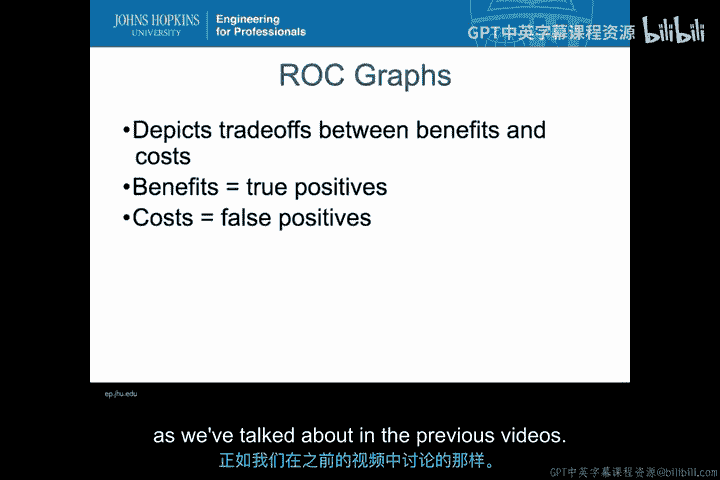
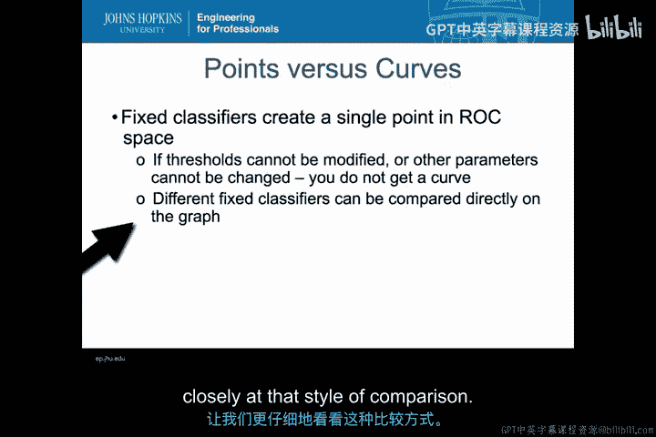
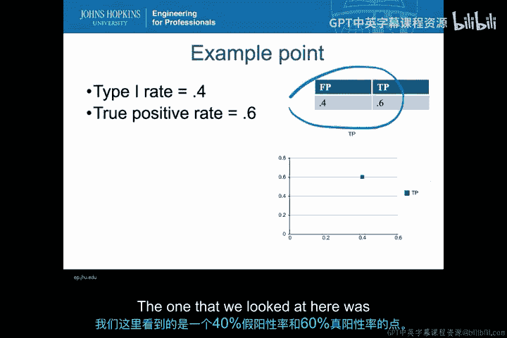
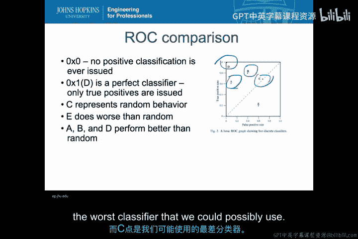
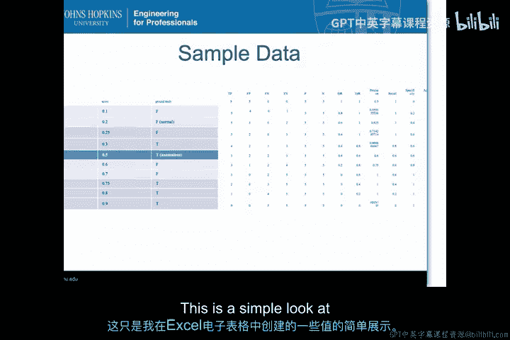
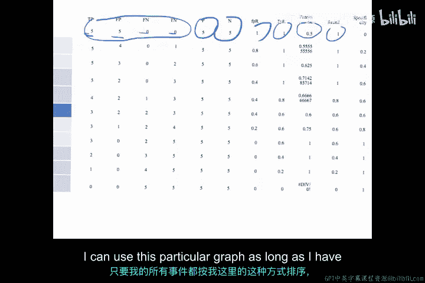
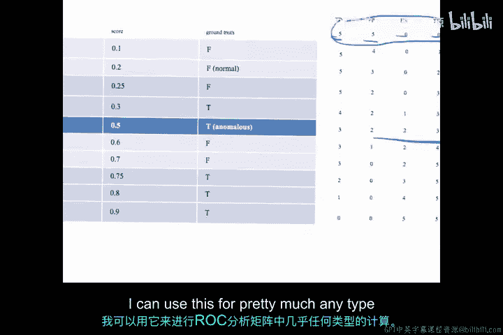
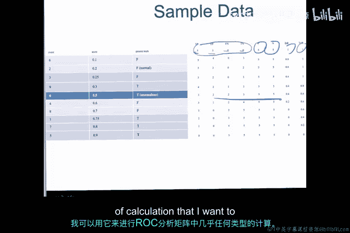
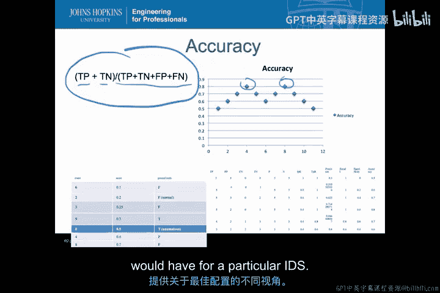

入侵检测：P43：ROC曲线与P-R曲线 📈

在本节课中，我们将学习如何使用ROC曲线和P-R曲线来更具体地评估入侵检测系统。我们将探讨如何计算相关指标，并利用这些图表进行成本效益分析。

上一节我们介绍了ROC空间中的点与曲线。本节中，我们将更深入地探讨这种比较方式。

以下是关于成本效益分析的示例点回顾。

我们之前讨论的示例点具有40%的误报率和60%的检测率。我们分析了不同点的优劣，其中A点在成本效益上优于B点，D点是理论上可能无法达到的理想点，而C点则是可能的最差分类器。

现在，让我们更定量地查看我们创建的样本数据。

以下是按分数正确排序的事件列表。

这些事件已按分数排序，并且每个事件都关联了真实标签。基于这些元素，我可以以网格形式计算出所有关心的指标值。

以下是一个Excel表格中的计算示例。

在此表格中，我为每个阈值点计算了以下值：
*   **真阳性**
*   **误报**
*   **漏报**
*   **真阴性**

这四个值构成了我的混淆矩阵。其中，P列总计了正确分类为阳性的事件，N列总计了正确分类为阴性的事件。由此，我可以计算出**误报率**、**检测率**、**精确率**、**召回率**和**特异性**。只要我的事件按此方式排序，我就可以使用这个表格进行任何ROC分析相关的计算。

基于这些计算，我可以轻松绘制出ROC曲线。

我所做的只是取检测率列和误报率列，绘制出之前见过的相同图形。现在我可以查看所有样本点，并分析在ROC图中哪些点是最优的。

现在，我可以对精确率和召回率进行完全相同的计算。

你会注意到这里的图形分布有所不同。完美的分类器会位于右上角，即精确率和召回率都达到最大值的位置。我可以查看哪些点最接近这个理想位置，从而从精确率-召回率的角度权衡最佳点。我们将在下一个视频中更详细地探讨如何分析P-R曲线中的具体点。

另一个你应该至少熟悉的概念是**准确率**。准确率是利用混淆矩阵得出的一个单一数值，旨在反映真阳性和真阴性之间的权衡。

其公式为：
`准确率 = (真阳性 + 真阴性) / 所有事件`

在我的样本数据中，有两个点的准确率同样最高。观察这些点会发现，它们与在P-R曲线或ROC曲线上看起来是良好权衡点的位置密切相关。

通过这种分析，我可以比较准确率、P-R曲线和ROC曲线。每一种都为我提供了关于所列IDS不同配置之间比较的略微不同的可视化视角。如果我拥有多个IDS，我可以像绘制多条ROC曲线一样，绘制多组此类信息，并在准确率、P-R分析和ROC分析之间进行比较。

一旦计算出这些比率，我就可以生成所有这些指标的可视化图表，无论是准确率、精确率-召回率还是特异性。每一种都能为我提供一个不同的视角，帮助我根据特定IDS的要求确定最佳配置。

本节课中，我们一起学习了如何利用ROC曲线和P-R曲线对入侵检测系统进行定量评估。我们回顾了成本效益分析，通过样本数据计算了混淆矩阵的各项指标，并生成了相应的可视化图表。最后，我们还介绍了准确率的概念及其与其他评估指标的关系。这些工具为我们从不同角度理解和选择IDS的最佳配置提供了有力支持。