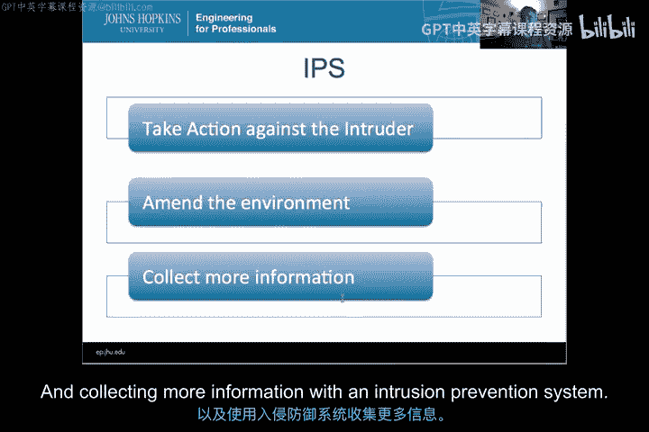

# 044：响应机制导论

在本节课中，我们将开始学习入侵检测系统（IDS）的响应部分。我们将了解不同类型的响应机制、相关的安全策略，以及如何将响应功能整合到企业安全能力中，以有效降低风险。

---

上一节我们介绍了IDS的分析引擎，本节中我们来看看IDS的第三个主要组成部分：响应机制。

欢迎来到入侵检测课程。这是第11模块。本模块我们将开始聚焦于IDS的响应部分。请记住，入侵检测系统包含三个主要部分：传感器部分、分析引擎（或特征引擎、分类器）以及响应部分。现在，我们将深入探讨不同类型的响应、响应所涉及的不同策略，以及响应可以被使用的各种方式。

在本模块结束时，我们希望您能够：
*   区分IDS可用的各种响应机制。
*   将响应选项与安全策略**具体关联**。
*   描述使用**自动响应**（将IDS转变为IPS的特殊响应类型）的风险。
*   演示使用Roc和PR图、Security Onion数据的能力。
*   使用Sguil操作和调查警报。

本模块的核心要点在于，入侵检测系统可以通过多种方式与响应团队进行通信。警报类型应支持IDS的用户，而响应行动的范围可以从**被动**端延伸到**主动**端。

在介绍视频之后的第一个视频中，我们将讨论响应需求。我们将把用户和用户类型映射到其目的，以理解如何为任何特定的IDS响应引擎设定需求。我们将在该视频中更详细地探讨这一点，但核心是关于映射和确定响应需求。

在接下来的视频中，我们将讨论响应类型，对比被动与主动响应，并主要关注**被动响应**选项。在此之后的视频中，我们将更直接地关注IPS部分，讨论如何对入侵者采取直接行动、修正环境以及通过入侵防御系统收集更多信息。

最后，我们将讨论使用入侵防御系统的**风险**和注意事项。IPS确实是一种特殊情况，但作为商业产品和免费软件产品中IDS领域日益增长的部分，了解何时以及如何使用IPS中可能采取的主动响应机制至关重要。

本模块的全部内容都围绕IDS的响应部分展开。学完本模块，您将能够将IDS的功能整合到企业级能力中，通过使用事件响应来有效降低风险。祝您在本模块学习顺利，让我们开始吧。

本节课中我们一起学习了IDS响应模块的概述、学习目标以及后续内容的安排，明确了响应机制在IDS中的关键地位及其从被动到主动的频谱。