# 045：响应机制要求 🚨

在本节课中，我们将探讨入侵检测系统（IDS）中响应机制的一些基本要求。我们将了解不同类型的警报、接收这些警报的用户，以及如何根据使用IDS的初衷来匹配警报类型与目的。

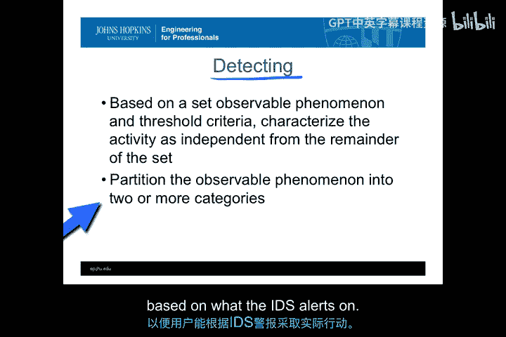

## 警报类型 🔔

上一节我们回顾了IDS的基本定义，本节中我们来看看IDS如何通过警报来体现“检测”这一行为。检测到异常后，必须通过某种方式通知用户，否则检测就失去了意义。因此，警报的呈现方式和内容信息是IDS定义的核心部分。

IDS本质上是一个分类器，它将可观察的现象分类为警报或非警报。检测行为必须将代表警报的类别，连同适当的信息，呈现给合适的用户，以便用户能根据警报采取行动。

现有的IDS系统通常会产生三种通用类型的警报：

以下是三种主要的警报类型：

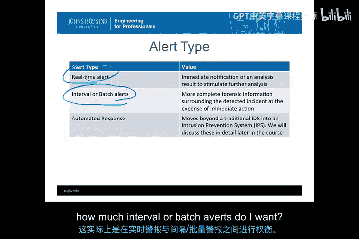

1.  **实时警报**：指立即通知用户。虽然快速响应很重要，但过早发出警报可能导致两个问题：一是用户在没有足够上下文的情况下收到警报，不知如何应对；二是在结合更多上下文信息后，可能发现该活动实际上是正常行为。
2.  **间隔或批量警报**：这类警报会整合多个不同指标，形成更完整的取证信息后再发出。与基于数据包或进程执行的实时警报不同，间隔警报更关注会话或进程的整体运行情况，能提供更全面的信息和事件上下文，从而更确信事件确实在发生。
3.  **自动响应**：除了实时或间隔警报，IDS还可以直接、自动地采取响应行动。这本身也是一种警报类型，因为它意味着系统检测到事件并将在无需人工干预的情况下进行处理。自动响应功能非常先进，以至于这类系统常被称为入侵防御系统（IPS）而非单纯的IDS。IPS可以在实时或间隔警报的基础上添加自动响应。

实时警报的优势在于能以最快速度通知用户，从而加快响应速度、缩短响应时间，以限制事件可能造成的损害。间隔或批量警报则能提供更完整的信息，不仅能指导响应者行动，还能减少实时警报可能产生的误报（I类错误）。这本质上是在实时警报与间隔警报之间进行权衡。

## 警报用户 👥

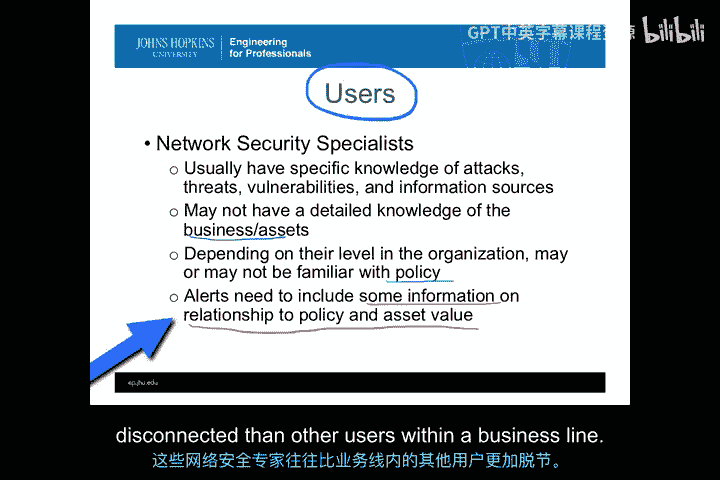

了解了警报类型后，我们来看看哪些用户会接收并处理这些警报信息。通常有三类用户会接收并响应IDS警报。

以下是三类主要的警报用户：

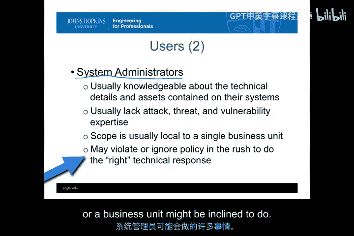

1.  **网络安全专家**：这类用户通常是负责网络、防火墙和网络服务的IT安全人员。他们非常了解攻击、威胁和漏洞，并且与事件响应团队（CERT）联系紧密。然而，他们通常对组织内各项业务的资产价值缺乏深入了解。因此，发给他们的警报应包含额外信息，以帮助他们理解事件与策略及资产价值的关系。这类用户技术精湛，但与企业业务和资产的连接相对稀疏。
2.  **系统管理员**：这类用户负责管理组织内的各种服务器和终端用户系统。他们更了解其系统的技术细节和资产价值，并且通常与业务部门保持一致，因为业务运行依赖于这些系统和服务的正常功能。然而，他们通常缺乏对相关系统所面临攻击、威胁和漏洞的了解，更关注系统正常运行时间和服务可用性，而非安全性。他们的工作范围通常局限于单个业务单元，激励措施是帮助业务成功，而不一定是防范安全威胁。
3.  **调查人员**：这类用户通常隶属于法律、合规、安全或物理安全部门，旨在查明试图损害组织的内部或外部人员。他们负责采取法律或人力资源（HR）行动来解决事件，而非技术响应。因此，他们通常是技术理解最浅的一类用户，可能过于依赖IDS警报的第一印象，而忽略其局限性。但他们最熟悉证据相关的政策和程序，知道如何将技术数据转化为法律或HR层面的可操作事项。他们需要的警报应能指明时间、人员和活动，以便撰写法律或HR响应报告。

## 警报目的与用户映射 🎯

除了不同的用户类型，使用IDS警报本身也有不同的目的。我们已经在前面的模块中讨论过一些，现在让我们结合三种主要目的来回顾一下。

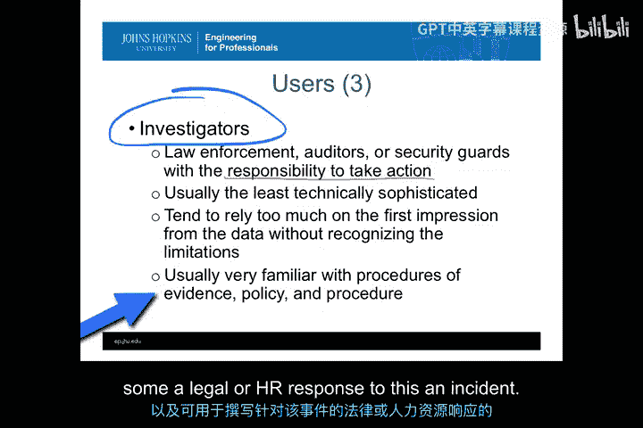

IDS警报主要有三种用途：

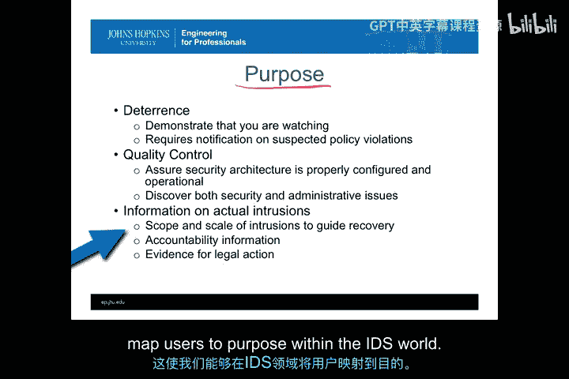

1.  **威慑**：通过展示监控能力，对可疑的策略违规行为发出通知。
2.  **质量控制**：用于确保安全架构配置正确且运行正常。
3.  **事件响应**：用于对实际入侵采取响应行动，例如了解事件范围和规模、确定责任方或为法律行动收集证据。

现在，我们可以将不同的用户类型与警报目的进行映射，形成一个简单的矩阵。

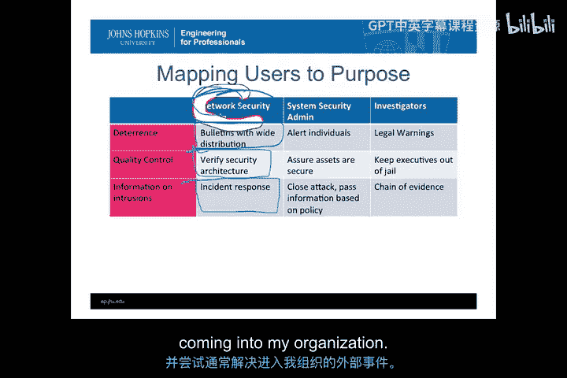

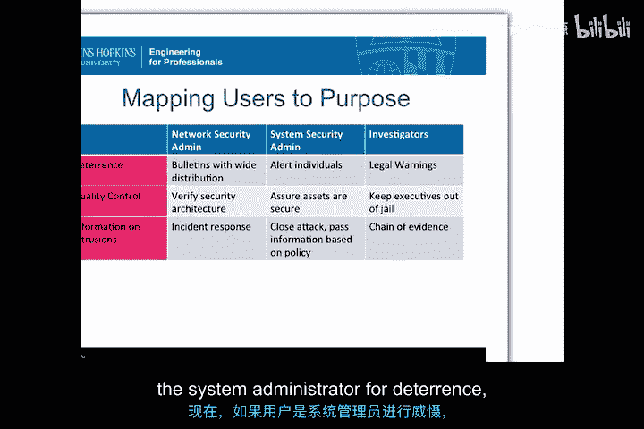

以下是一个用户与目的映射的示例：

*   **网络安全管理员**：
    *   **威慑**：利用IDS警报制作广泛分发的公告，以产生威慑效果。
    *   **质量控制**：验证网络安全架构。
    *   **事件响应**：与CERT团队沟通，通常解决面向外部的、进入组织的网络相关事件。
*   **系统管理员**：
    *   **威慑**：在业务单元内部向个人发出警报。
    *   **质量控制**：主要在主机或资产层面确保单个资产的安全。
    *   **事件响应**：关闭攻击、进行防病毒工作、清理系统，主要在主机层面操作。
*   **调查人员**：
    *   **威慑**：利用IDS警报创建法律警告，告知用户其行为可能违法或导致HR问题（如解雇、罚款）。
    *   **质量控制**：从调查员角度看，可能涉及确保高管不触犯法律等。
    *   **事件响应**：与CSIRT团队合作，利用IDS警报建立证据链，为HR响应、法律响应或刑事响应提供法律依据。

## 其他用途与要求 📝

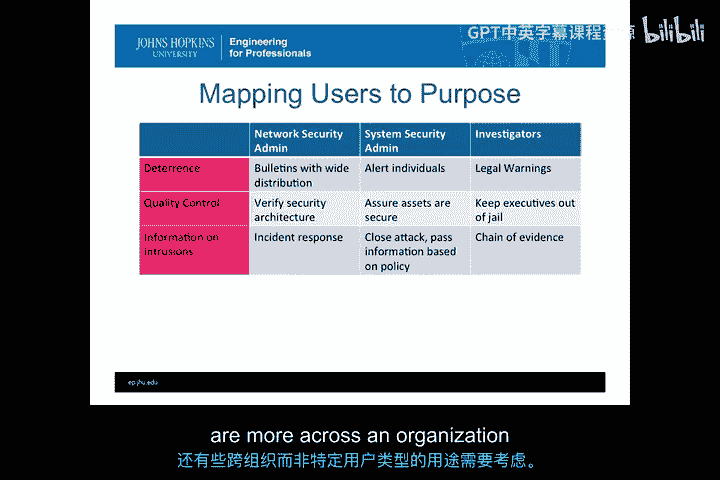

除了上述针对特定用户的目的，IDS还有一些跨组织、不特定于用户类型的其他用途和要求。

以下是IDS的一些其他重要用途：

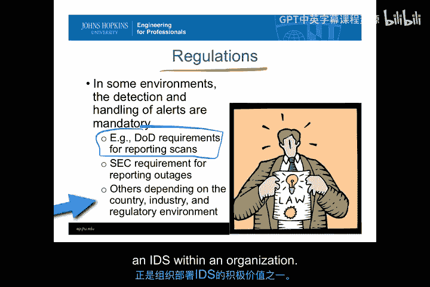

1.  **满足法规要求**：在某些监管环境中，IDS可以帮助完成受监管的任务。例如，美国国防部要求报告所有扫描活动，而基于网络的IDS擅长检测扫描，因此可以利用其IPS功能自动报告扫描，从而满足监管要求。同样，对于报告服务中断的要求，IDS也能提供帮助。
2.  **维持态势感知**：在大型环境中（如国家响应团队），可使用IDS来了解当前的攻击态势。
3.  **用于培训**：可以注入不同类型的攻击、创建事件，用于培训和演练响应团队。
4.  **支持法律行动**：为法律行动收集证据。
5.  **用于研究**：研究攻击环境、进行分类或识别不同类型的IDS。
6.  **用于测试与评估**：在测试框架中使用IDS，以评估其他非IDS防御措施的效果。
7.  **监控临时暴露的漏洞**：当某些遗留或已知易受攻击的服务必须运行时，使用IDS来监控其是否正遭受攻击。

## 总结 📚

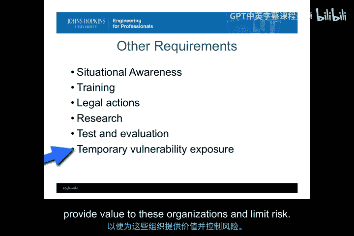

本节课中，我们一起学习了入侵检测系统响应机制的核心要求。我们探讨了三种主要的警报类型（实时、间隔/批量、自动响应）及其优缺点，识别了三类主要的警报用户（网络安全专家、系统管理员、调查人员）及其不同需求。我们还通过映射矩阵，了解了如何将警报目的（威慑、质量控制、事件响应）与不同用户相匹配。最后，我们介绍了IDS在满足法规要求、维持态势感知、培训、研究等方面的其他重要用途。理解这些要求，对于有效部署和利用IDS来为组织提供价值并降低风险至关重要。