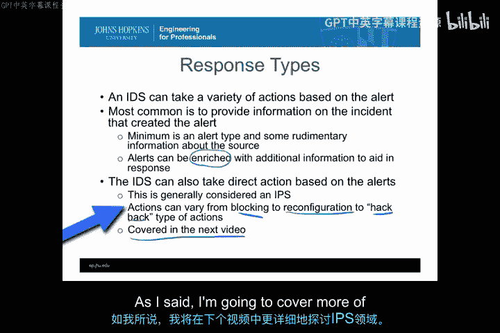
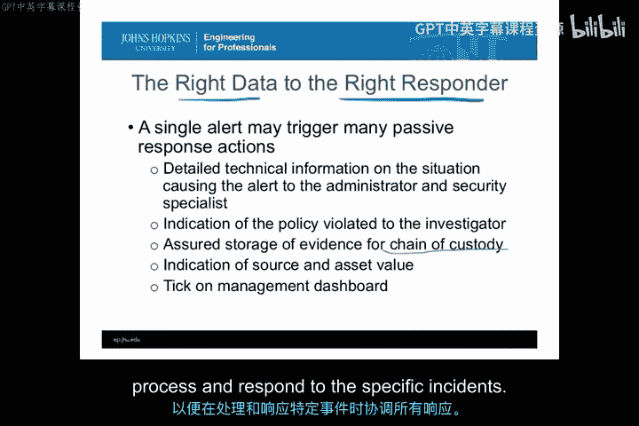
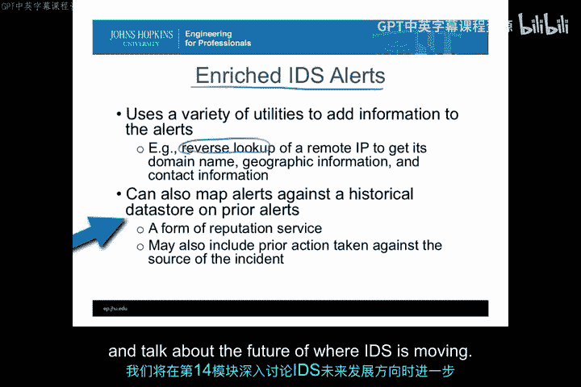
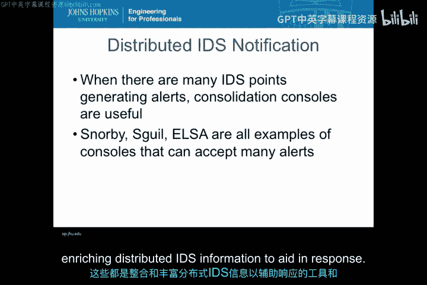
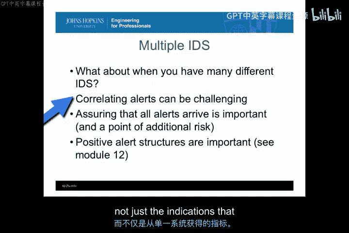
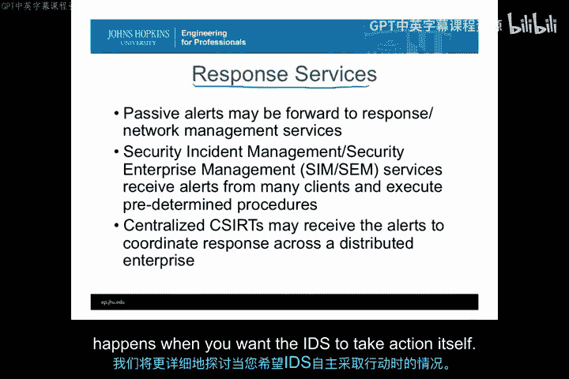

# 046：响应类型分类 🛡️

在本节课中，我们将要学习入侵检测系统（IDS）的响应类型。我们将详细探讨被动响应与主动响应的区别，并深入了解被动响应的不同类型及其相关问题。通过本课，你将理解如何根据不同的警报信息，为不同类型的用户提供定制化的响应。

---

在上一节中，我们讨论了IDS的目的、用户以及部署IDS的一些基本要求。本节中，我们将更深入地探讨响应类型本身。

IDS可以根据产生的警报采取多种行动。到目前为止，本课程中最常见、我们接触最多的类型是提供触发警报事件的相关信息。一个IDS警报可以包含多种信息。

**最基本的信息**通常包括警报类型和一些关于来源的基本信息。例如，如果是网络IDS，可能是IP地址；如果是基于主机的IDS，可能是进程名或登录用户。然而，可以通过添加额外信息来丰富这些响应，使响应使用者能够更快地采取行动，而无需自行查找信息。

需要明确的是，当IDS在收到警报后执行额外进程以丰富信息时，它确实在执行一些直接操作。但这通常不被视为IPS会采取的基于响应的直接行动，因为这些额外信息属于被动响应的一部分。它并没有改变环境或导致环境发生变化。

一个例外情况是，如果丰富信息的行为导致了环境的重配置或从环境中收集了额外信息（例如，在发现可疑事件后，原本基于网络流数据的IDS突然开启全包捕获功能）。这更偏向IPS的范畴。但如果丰富信息是基于静态表或外部查询（如Whois数据库），我们仍将其视为被动响应模式，因为它没有在基础设施内部采取会导致事件差异或缓解的行动。

IPS基于警报采取的直接行动则多种多样，从常规的阻断连接、关闭连接，到环境重配置，甚至延伸到组织外部进行“反击”以影响攻击者。我们将在下一个视频中更详细地探讨IPS的世界。

---

## 被动响应选项 📊

本节中，我们将更多地讨论被动响应选项。首先需要明确，即使采取了被动通知，这并不排除同时采取其他行动。被动监控和存档应始终是主动响应模式的一部分。因此，即使我们计划采取主动响应（如下一视频所述），也应进行某种形式的记录和警报，这属于被动响应选项。

在考虑被动响应选项时，首先要思考的是通知发生的位置是本地还是远程。

*   **本地响应**：指在分析引擎本地，即事件被检测到的同一系统或区域内进行通知。例如，打印到纸张或屏幕。这种方式较少受到拒绝服务和信息丢失的影响，因为它不依赖网络或其他外部基础设施。当然，这要求响应者就在系统本地，因此在拥有多个分散IDS的大型企业中效果不佳。
*   **远程响应**：指检测发生后，向不同系统或远程系统的用户发送通知。这种方式虽然可能面临拒绝服务或信息丢失的风险，甚至可能因为阻塞IDS的直接响应而导致第二类错误，但它更适合将警报集中发送到响应者所在的中心位置。

如果你有多个不同的IDS，并且它们需要将信息发送到单一节点，那么本质上就需要某种**聚合器或聚合功能**。这个功能会接收来自多个IDS分析引擎的响应，并将其置于上下文中，以便响应团队能够审查所有警报并进行关联分析。

市面上有支持工具来完成这项工作，例如IBM的Arcite或Splunk等工具，它们可以从多个来源获取信息，将其置于统一时间线，并运行分析以创建更高级别的关联。

---

## 为正确的响应者提供正确的数据 📨

在所有通知中，**将正确的数据提供给正确的响应者**至关重要。这意味着从IDS分析引擎输出并进入响应的数据，必须包含特定用户类型为提供响应所需的信息。

因此，**单个警报**可能触发多种不同类型的被动响应警报或行动：

*   **技术团队**：可以向CERT团队、网络管理员或安全专家发送关于情况的详细技术信息。
*   **调查人员**：可以向调查员类型的用户发送基于同一警报的另一组信息，以开始调查政策违规情况。
*   **证据存储**：可以以符合法律要求的方式存储证据，以便采取人力资源或法律行动。
*   **管理层**：可以将同一警报转化为管理仪表板上的一个信号灯图表或标记，供只想知道当前是否有事件正在被响应的管理者了解态势。

如你所见，单个警报不一定只生成一组信息。我可以根据警报为响应中可能需要采取行动的每个用户类型定制信息。

**警告**：一旦开始将同一警报发送给许多不同的用户以尝试执行多种响应行动，可能会在这些不同用户类型之间产生协调问题。请记住，不同IDS信息用户的目标和目的有时是冲突的。例如，一个旨在威慑并希望提供可能警示攻击者他们正被监视的信息的人，可能与试图为起诉收集证据的调查员目标相悖。

因此，如果要为多个响应者提供正确的数据，必须确保存在某种标准操作程序，以便在处理和响应特定事件时协调所有响应。

---

## 丰富的IDS警报 🔍

当前IDS商业工具和研究中最重要领域之一就是**丰富IDS警报**的概念。其核心思想是，你可以利用IDS警报中的信息，不仅收集外部信息，还能运行分析，从而在更广泛的信息范围内触发额外的关联和信息融合。

丰富信息的工具多种多样，从简单的IP地址反向查询，到更高级的应用，如使用Splunk分析将警报与历史信息结合，以了解之前发生的一切。你可以将这些不同类型的警报映射到数据存储，创建信誉服务，或包含许多更复杂的项目来丰富IDS警报本身。

这是当今IDS产品开始关注的方向。其他类型的大数据分析与基于云的分析之间的交互，是我们看到丰富IDS警报的另一个发展方向。我们将在第14模块讨论IDS未来走向时进一步探讨。

---

## 分布式IDS通知与聚合 🧩

当我们谈论分布式IDS通知时，如果有许多不同的IDS点生成警报，那么整合不仅有用，甚至可能是必需和必要的。

正如我们在Security Onion中看到的，Snorby、Sguil、ELSA等控制台就是例子，它们可以接受多种不同类型的警报，并将其组合在一起，以便你能够调查底层数据包结构，以及更适合响应核心警报的内容。

因此，从实验中获得的部分价值在于，当你拥有分布式或多个IDS向控制台报告时，如何利用这些信息进行更深层次的分析，并开始理解特定事件的根本原因。这些都是组合和丰富分布式IDS信息以辅助响应的工具和示例。

---

## 不同类型IDS警报的关联挑战 ⚙️

在我们讨论分布式IDS的很多内容时，我们假设生成的是相同类型的警报。但是，当你拥有许多不同类型的IDS（基于主机的、基于网络的、基于签名与基于异常的），并且它们具有不同的基础速率时，情况会如何？有些是基于网络流和会话的，有些是基于数据包的，还有些是基于内存、Tripwire或系统内其他活动的。

当你试图关联这些不同类型的警报时，可能会非常具有挑战性。确保所有警报都能到达很重要，但这带来了额外的风险。使用多种不同类型的IDS，然后试图确定从一处获得的网络警报如何与在另一处发现的主机活动相对应，这在今天并非自动化过程。你不能简单地购买一个产品就说“把我所有的IDS连接起来，给我一个事件全貌”。这是研究领域的一部分，是研究社区正在探索的方向，但在商业产品中还不多见。许多大数据分析的根本基础，正是获取所有这些不同类型的数据并寻找它们之间的关联，以便更好地响应整个事件，而不仅仅是从一个特定系统获得的指示。

---

## 外部响应服务 🌐

最后，还有一种思路是将你的响应转发到组织外部，交给其他类型的响应或网络管理服务。有许多组织会接收你所有的IDS警报，在你的组织外部进行处理，并提供关于应采取何种响应行动的信息。

使用响应服务而非自己处理所有事务的价值在于，响应服务通常可以评估警报以确定哪些是第一类错误。因此，我们之前讨论的减少第一类错误或误报的所有额外工作，基本上可以外包给组织外部。他们还可以比较你从其他外部客户那里获得的警报，并执行预定的程序来帮助保护你的组织。例如，在DDoS攻击期间进行带宽限制。

此外，你可能不是为了解决事件，而仅仅是出于信息目的，决定将警报发送到集中的CERT，并在分布式企业内协调响应。这在政府组织中很常见，例如美国国土安全部的US-CERT，就是一个中心化组织，他们不采取直接行动，而是接收警报并向各个部门和机构提供建议和响应行动。

因此，使用响应服务是提升聚合水平的一种方式，它汇集来自多个组织的警报以了解正在发生的情况。另一个例子是“网络安全望远镜”这样的组织，它接收来自许多不同组织的自愿提供的防火墙和IDS记录，并提供互联网范围内攻击类型的视图或态势感知。这对于确定针对你组织的攻击是定向攻击，还是你只是众多受害者之一（并未被特别针对）非常有价值。

这些都是响应服务利用IDS整合跨多个组织信息的不同方式。

---

## 总结 📝

本节课中，我们一起学习了IDS的被动响应类型。我们了解到，被动警报可以以多种方式使用：创建针对不同用户类型和响应选项的定制化信息；可以跨不同类型或分布式的IDS进行聚合；还可以将其发送到组织外部，以便在多个组织之间进行态势感知和整合。在下一视频中，我们将深入探讨当希望IDS自身采取行动时的更多具体细节。