# 047：入侵防御系统(IPS) 🛡️

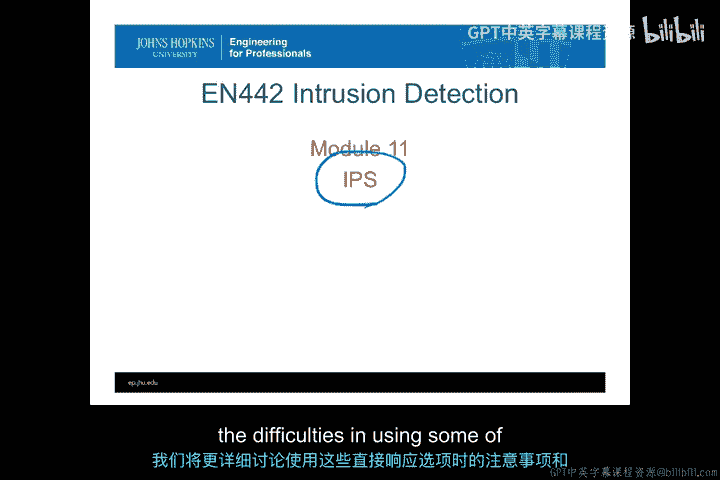

在本节课中，我们将要学习入侵检测系统（IDS）中更主动的响应选项，即所谓的入侵防御系统（IPS）。与仅被动检测和报告攻击的IDS不同，IPS能够采取主动措施来缓解或阻止安全事件的发生。我们将探讨不同类型的自动化响应措施，并了解它们如何运作。

上一节我们介绍了入侵检测的基本概念，本节中我们来看看更主动的防御系统——IPS。

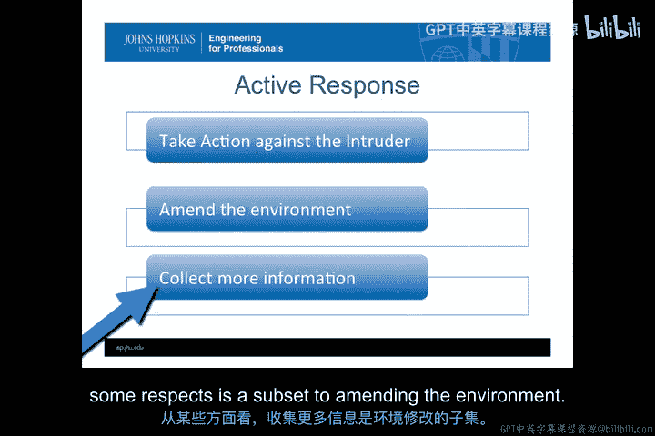

## 主动响应的三种类型 🎯

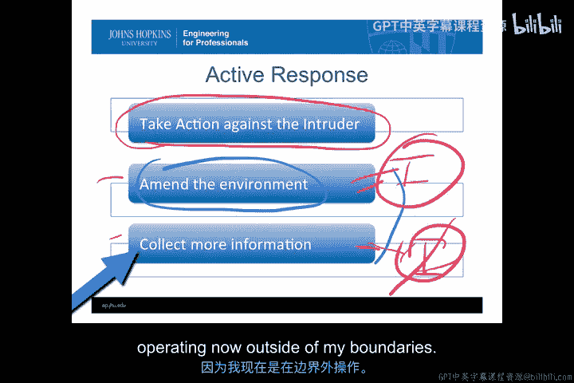

IPS通常提供三种主动响应类型，按攻击性从强到弱排列如下：
1.  **针对入侵者采取行动**：在自身管理边界之外对攻击者进行反击。
2.  **修改环境**：在自身管理边界内，根据检测到的攻击改变系统环境以阻止攻击。
3.  **收集更多信息**：改变环境以收集更详细的攻击信息，此操作对入侵者不可见。

“针对入侵者采取行动”最为激进，因为它超出了自身的管理控制范围。“修改环境”是在自身可控范围内采取直接行动。而“收集更多信息”是“修改环境”的一个子集，但其改变对入侵者是隐蔽的。

## 针对入侵者采取行动 ⚔️

这是最激进的响应方式，即直接反击攻击者。许多组织认为这是一种“报复”手段，但这种方式风险极高。

以下是需要考虑的几个关键点：
*   **攻击源可能被伪造**：入侵者可能利用其他受害系统发动攻击，你的反击可能伤害到无辜的第三方。
*   **增加自身风险**：自动化反击可能被入侵者利用来攻击他人，导致你的组织面临拒绝服务（DoS）攻击或法律责任的更高风险。
*   **自动化与手动执行的权衡**：如果组织计划手动执行此类反击，那么将其自动化可以加快响应速度。但如果手动都不会采取的行动，则绝不应该将其自动化。

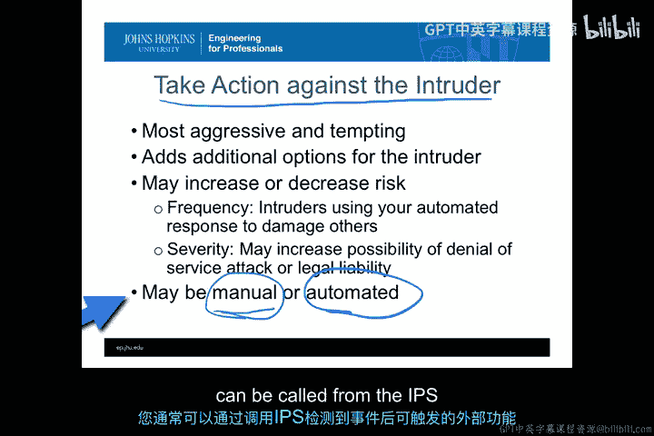

即使商业IPS系统不直接提供“反击”选项，它们通常也允许调用外部脚本或程序。这意味着你仍然可以配置系统，在检测到攻击时执行自定义的反击操作。

有时，IPS会采用**用户驱动的自动化响应**。系统准备好反击程序，但需要用户点击确认来发起。这让人为高风险操作承担责任，是一种更谨慎的做法。

历史上曾有过特殊案例，例如向攻击者的家人发送邮件告知其攻击行为，从而有效阻止了攻击。这说明了此类外部直接行动的多样性。

## 何时考虑外部自动化响应？ ⚖️

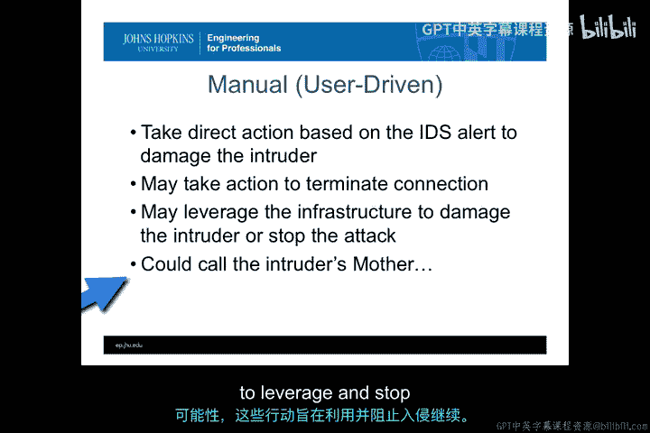

在决定实施边界外的自动化响应时，需满足以下条件：
*   **攻击速度极快**：人工响应无法跟上攻击节奏。
*   **针对极高价值资产**：仅当核心、高价值资产面临风险时才启用。
*   **响应条件明确且一致**：每次满足特定条件时都执行，无需额外评估。
*   **最小化附带损害**：响应行动应精准，避免波及无辜用户或系统。

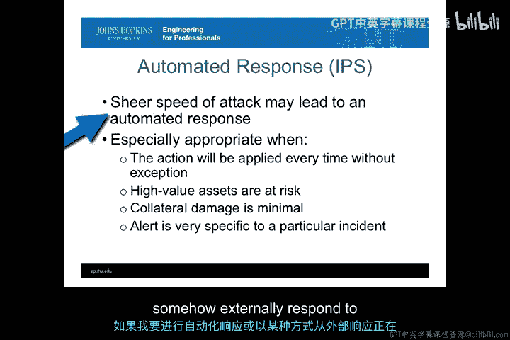

## 收集更多信息 🔍

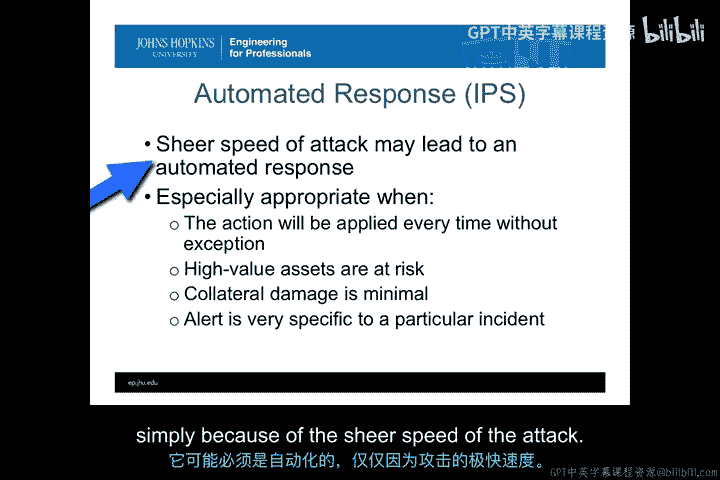

这是一种常见的IPS响应，即在检测到可疑活动时，自动开启更多信息收集功能。

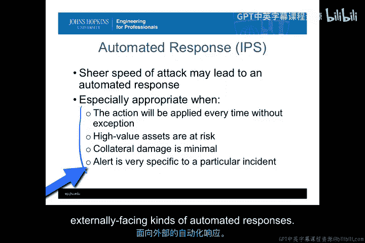

以下是具体应用场景：
*   **基于网络流（Netflow）数据触发数据包捕获**：平时不开启全量抓包以节省资源，仅在特定警报触发时开启，获取更详细的流量信息。
*   **触发主机级信息收集**：当网络IDS发现某主机可疑时，自动在该主机上开启详细的系统调用跟踪或日志记录功能。

收集更多信息的目的通常是确定入侵的来源或目标，以便制定更有效的响应策略。但需注意，开启更多监控功能本身也可能增加新的攻击面，或消耗过多系统资源导致拒绝服务。

## 转移攻击（诱捕系统） 🎣

另一种常见响应是将已识别的攻击流量，在不被入侵者察觉的情况下，**转移**到一个专门设计的、无害的“诱捕”系统中。

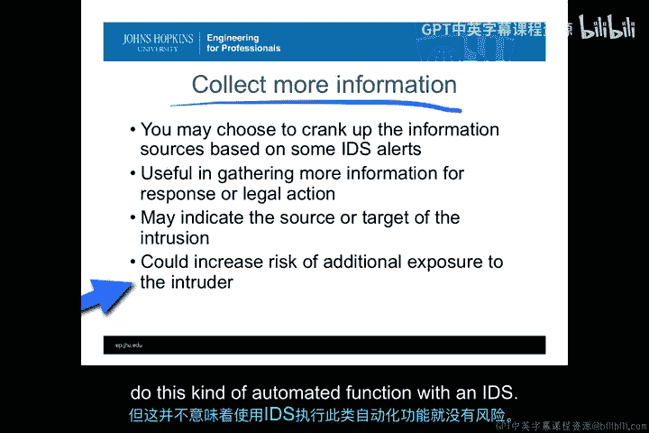

*   **蜜罐（Honeypot）/蜜网（Honeynet）**：通常作为主要诱饵主动吸引攻击者。
*   **鱼缸（Fishbowl）**：并非主动吸引攻击者，而是在检测到针对真实系统的攻击后，将攻击流量**转移**至此进行观察和分析。其优点是不会使自身成为更显眼的靶子。

转移攻击有助于：
*   追溯攻击者来源。
*   收集攻击证据。
*   分析攻击者意图和下一步可能的目标。

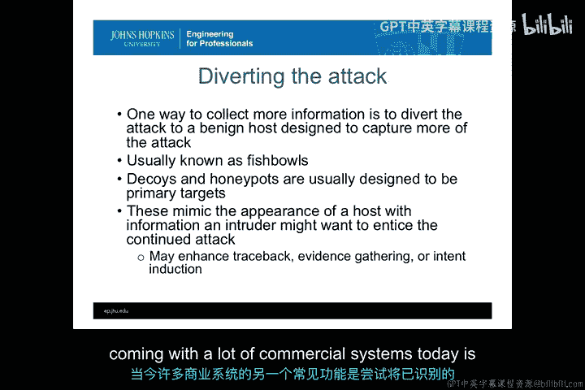

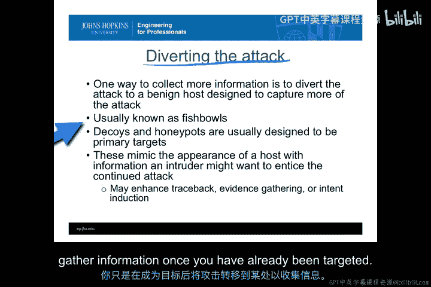

## 修改环境以阻断攻击 🚧

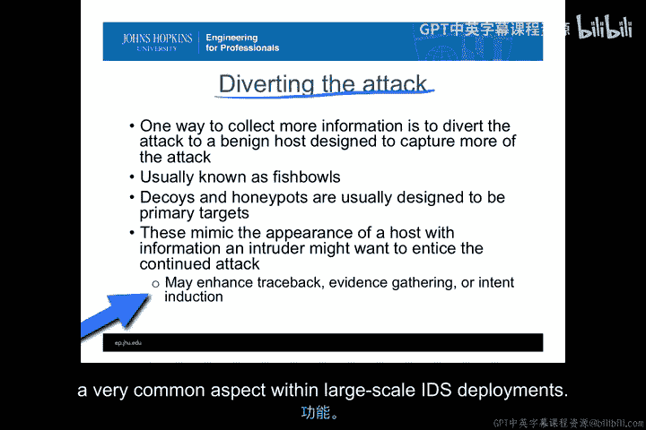

IPS可以利用生成的警报，自动**修补已检测到的漏洞**或关闭相关服务。这对于因遗留系统等原因无法永久关闭的漏洞尤其有用。

其工作流程是：IPS识别出正在被利用的漏洞 -> 自动采取临时措施（如关闭服务、应用虚拟补丁） -> 为管理员争取时间，以决定是否实施永久性修复。

**风险提示**：攻击者如果知道你采用这种策略，可能会故意触发大量警报，导致系统频繁自动关闭服务，从而对你自己的组织造成**拒绝服务攻击**。

## 自适应响应（调整IPS自身） 🔄

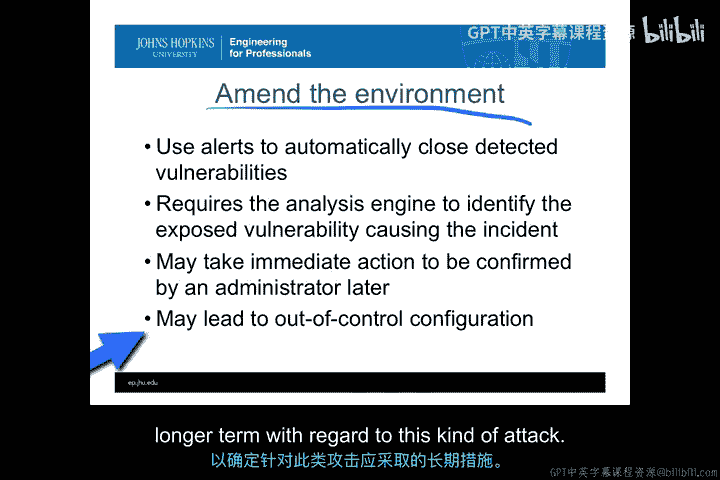

这是一种特殊的“修改环境”，即IPS根据警报和响应历史，**自动调整其自身的配置**。

这可以表现为：
*   **学习并自动化重复的响应**：如果某种手动响应总是被采用，IPS可以学习并将其转化为未来的自动化响应。
*   **调整检测灵敏度**：根据反馈，自动调整分析引擎，减少误报（Type I错误）或漏报（Type II错误）。
*   **基于机器学习的异常检测系统**正是这种原理，它们从历史活动和事件分类中学习，不断优化检测模型。

这形成了一个**反馈循环（Feedback Loop）**：`IPS输出 -> 响应行动 -> 反馈 -> 优化IPS配置`，从而随时间提高IPS的有效性。

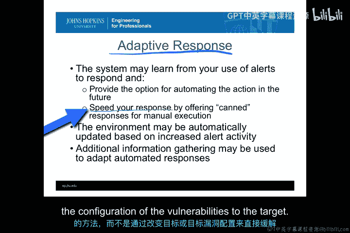

但需警惕，如果自动化程度过高，攻击者可能通过精心构造的攻击来“训练”你的IPS，使其朝着有利于攻击者的方向调整。

## 总结 📝

本节课中我们一起学习了入侵防御系统（IPS）的核心功能。我们了解到，IPS的主动响应主要分为三大类：直接对抗入侵者、修改自身环境以及收集更多信息。具体措施包括自动化反击、转移攻击流量、自动修补漏洞以及通过自适应学习优化自身配置。

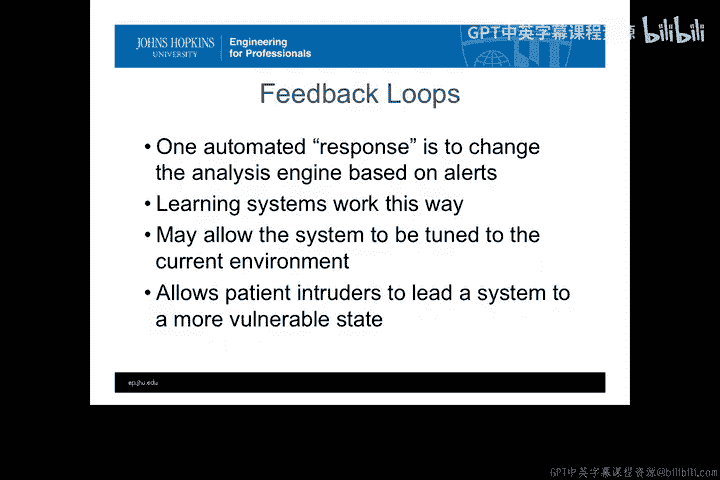

关键在于，IPS本质上是一个强大的自动化执行器，几乎可以将任何你能想象到的手动响应操作自动化。然而，正如我们将在下一节深入探讨的，这种强大的能力也伴随着显著的风险和需要注意的事项。赋予系统自动行动的权力，必须经过审慎的评估和设计。