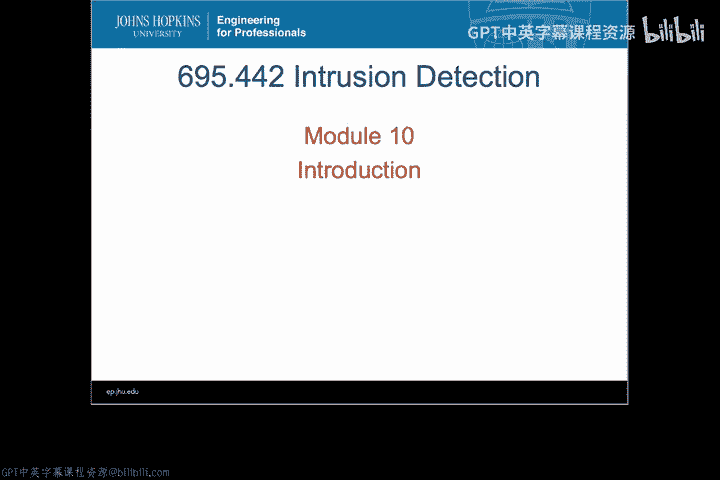
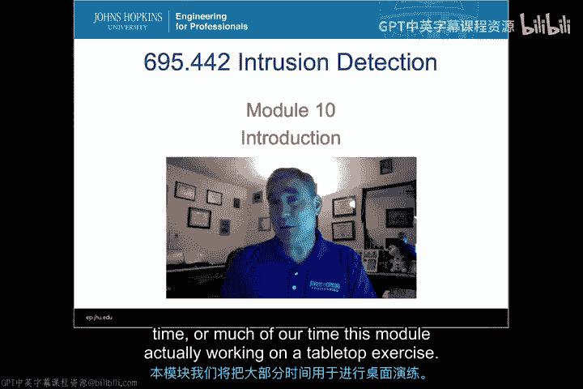
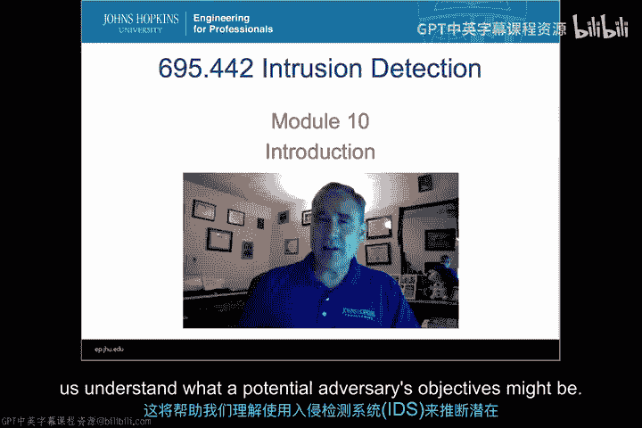
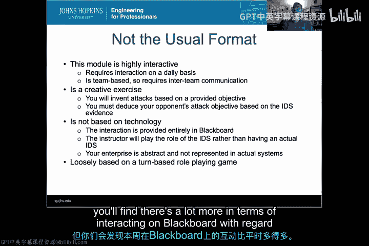
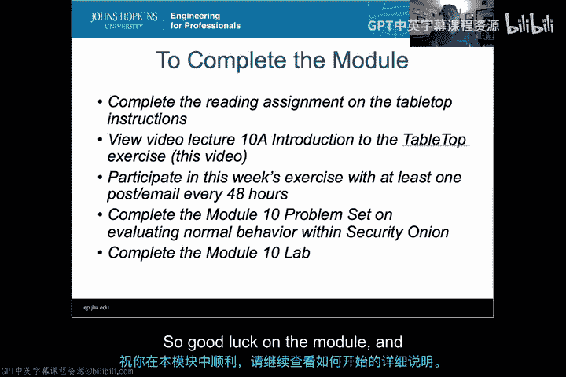

# 049：桌面演练导论

在本模块中，我们将通过一个高度互动和创造性的桌面演练，来深入理解使用入侵检测系统的实际挑战。我们将学习如何配置抽象的IDS、制定攻击计划、评估警报并推测攻击者目标，同时为后续的量化分析准备数据。

## 🎯 模块概览与目标

欢迎来到入侵检测课程的第10个模块。本模块的形式将与之前及之后的模块截然不同。我们将花费大量时间进行一项桌面演练，以帮助我们理解在实际环境中使用入侵检测系统（IDS）的真正难度，并尝试推断潜在攻击者的目标。

## 🔄 模块形式与要求

上一节我们介绍了本模块的总体目标，本节中我们来看看其具体形式和参与要求。

本模块高度互动，需要每日参与才能成功达成演练目标。这是一个基于团队合作的练习，本周你们将与小组成员协作，尝试处理IDS警报和攻击，以完成演练目标。

以下是本模块的几个关键特点：
*   **创造性练习**：达成目标的方式多种多样，鼓励创造性的攻防思路。
*   **非技术性抽象**：本次练习不基于具体技术。我们不会使用Security Onion或配置真实的IDS，而是抽象掉具体的技术语法，专注于理解使用IDS的核心逻辑。
*   **回合制角色扮演**：整体框架类似于回合制角色扮演游戏，但在Blackboard平台上的互动会比往常更加频繁。

## 📚 核心学习目标

尽管我们希望本周的练习充满趣味，但其背后有明确的学习目标需要达成。

到本模块结束时，你应该能够：
1.  理解如何在不同的IDS方案间进行选择，并了解决策在受限环境下的可能结果。
2.  根据高级原则配置一个抽象的IDS，从而对在实际环境中操作真实IDS形成初步预期。
3.  为达成特定目标制定攻击计划。**公式：攻击计划 = 目标 + 步骤 + 规避策略**。本课程的重点不是学习攻击，但理解如何攻击及规避IDS检测是理解IDS工作原理的重要部分。
4.  评估抽象的IDS警报以选择适当的响应，并假设攻击者的目标。这正是本练习的核心难点之一：仅以IDS作为主要触发器来判定攻击目标的困难性。

## ✅ 完成模块的任务清单

为了顺利完成本模块，你需要完成以下几项任务。

以下是具体的任务列表：
1.  **阅读演练说明**：仔细阅读桌面演练的指导文件，了解其运作方式。
2.  **观看教学视频**：观看本视频之后关于演练后勤细节的教学视频。
3.  **积极参与演练**：你必须在每48小时内至少发帖一次，但如果可能，最好每天参与。**代码示例（参与频率）**：`if (time_since_last_post > 48h) { required_to_post(); }`
4.  **完成问题集与实验**：在演练间隙，需要完成模块10的问题集和实验，即在Security Onion中评估正常行为。这旨在为下周创建ROC和PR图表进行量化评估准备数据。**核心概念**：建立行为基线。

## ⚠️ 重要注意事项

本模块将非常不同，强度高且耗时。请尝试在参与演练和完成Security Onion相关工作之间平衡你的时间。

本周没有额外的阅读材料，也没有额外的讨论。因此，这是一个需要处理事项较少但每项强度更高的模块。祝你在本模块中顺利，请继续查看如何开始的详细说明。

## 📝 总结

本节课中，我们一起学习了第10模块——桌面演练的总体安排。我们了解到这是一个以团队为基础、高度互动且富有创造性的非技术性练习，旨在通过抽象化的方式，让我们深入体验配置IDS、规划攻击、分析警报和推断攻击者目标的完整过程。同时，我们还需要在Security Onion中完成建立行为基线的实验，为后续的量化分析打下基础。请准备好迎接这个紧张而充实的一周。