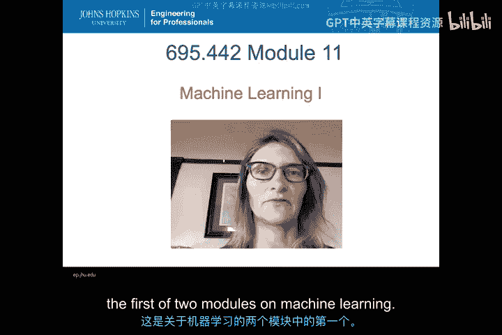
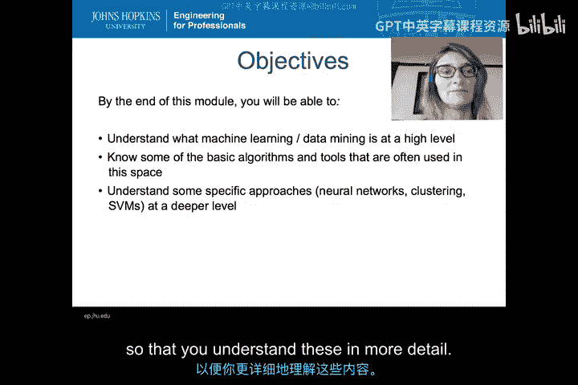
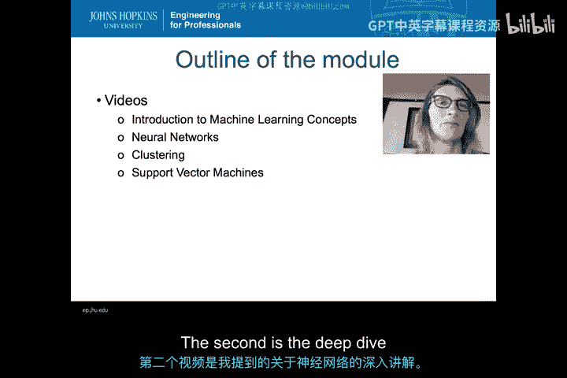

# 051：机器学习导论 🧠

在本节课中，我们将学习机器学习的基础概念。我们将了解什么是机器学习与数据挖掘，掌握该领域的一些关键术语，并初步认识几种核心算法与常用工具。课程最后，我们将深入探讨神经网络、支持向量机和聚类算法。

---

大家好，欢迎来到第11模块，这是关于机器学习的两个模块中的第一个。

本模块旨在介绍机器学习。我希望在模块结束时，你能理解什么是机器学习，什么是数据挖掘，以及该领域的一些关键概念。这样，当你与该领域的其他人交流时，你会对他们使用某些术语时的含义有所了解。

你还应该了解该领域中一些可用的基本算法。算法数量众多，我不会详细涵盖所有算法，但你会对其中一些关键算法以及该领域常用的一些工具有所了解。现在有许多工具可用，因此你无需从头开始编程，也无需理解所有底层数学原理。你可以直接使用工具，告诉它“我想构建一个决策树”，然后让工具为你完成。

此外，在模块结束时，我们将深入探讨几种算法，以便你更详细地理解它们。具体来说，我们将稍微了解一下神经网络、支持向量机和聚类算法，以便你更深入地理解它们。

---

基于以上内容，本模块有四个主要视频供你学习。

以下是视频内容列表：

*   第一个视频从非常高的层面介绍机器学习概念。
*   第二个视频是我提到的关于神经网络的深入探讨。

---

本节课中，我们一起学习了机器学习模块的总体目标与结构。我们了解到，本模块旨在介绍机器学习与数据挖掘的基本概念、关键术语、核心算法及常用工具，并承诺后续会对神经网络等算法进行深入讲解。接下来，我们将从第一个视频开始，正式进入机器学习的世界。