# 052：机器学习基础概念精讲 🧠

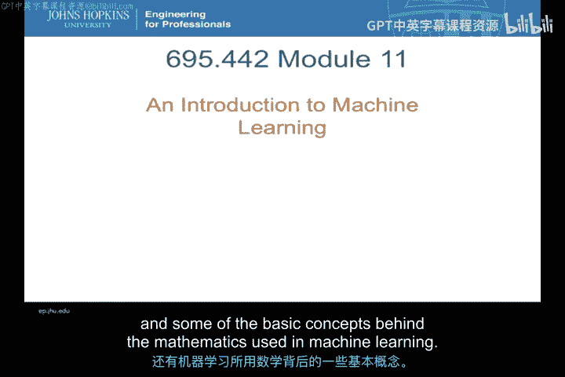

在本节课中，我们将对机器学习进行一个非常简要的高层次介绍。我们将了解什么是机器学习、其背后的一些基本概念，以及机器学习所用数学中的一些基本思想。

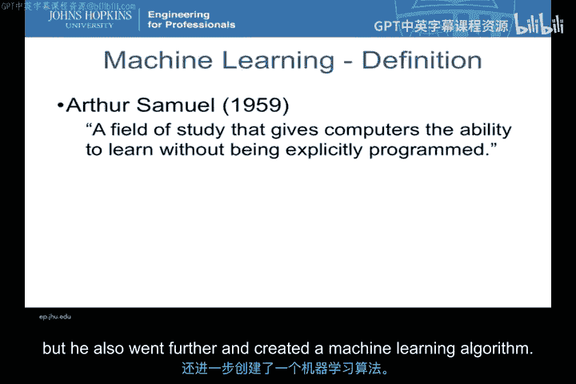

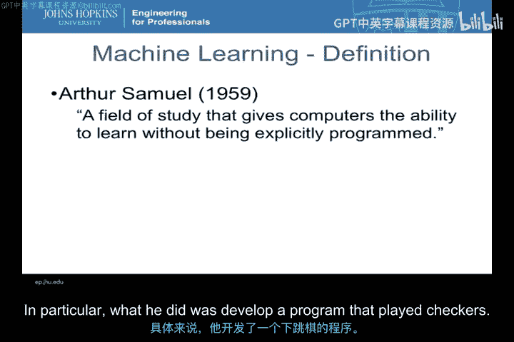

## 什么是机器学习？🤔

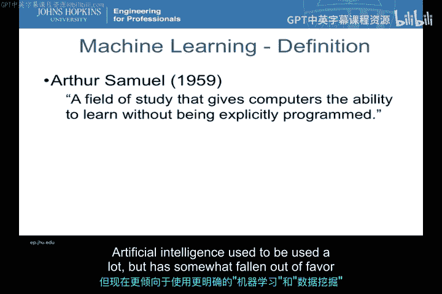

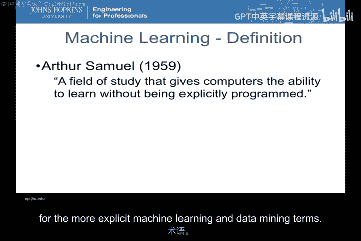

机器学习最早由亚瑟·塞缪尔于1959年定义，它是一个研究领域，赋予计算机无需明确编程就能学习的能力。他不仅提出了这个定义，还进一步创建了一个机器学习算法。具体来说，他开发了一个下跳棋的程序，其学习下棋的方式是通过与自己反复对弈，直到学会最终获胜的最佳策略或走法。事实上，这个程序后来击败了康涅狄格州的跳棋州冠军。

自那时起，已经开发了许多不同的机器学习算法，我们将在本模块中更详细地介绍其中的几个。

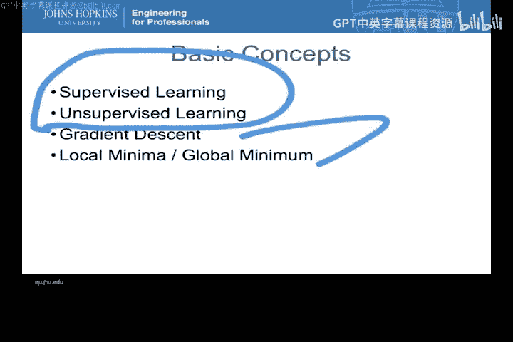

我们还注意到，人们使用了多个不同的术语。我一直在使用“机器学习”，“数据挖掘”也是一个非常常用的术语。“人工智能”过去经常使用，但现在某种程度上更倾向于使用更明确的“机器学习”和“数据挖掘”术语。另一个你经常会看到的术语，尤其是在工业界而非学术界，是“分析”或“数据分析”。在本模块中，我将把这些术语基本互换使用。

## 机器学习的基本概念 📚

机器学习中有哪些基本概念？我将重点介绍两个关键概念。

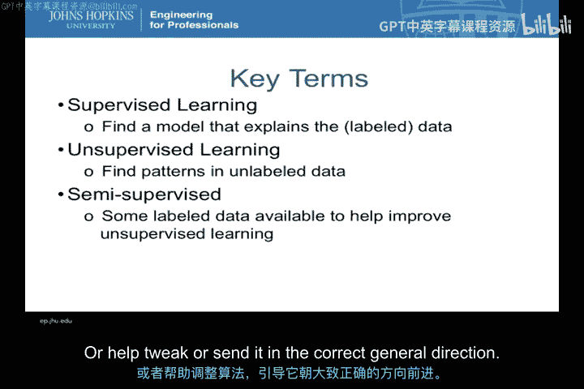

第一个是**学习算法**。这主要涉及你是在进行**监督学习**还是**无监督学习**。关键在于你拥有什么样的数据，这将影响你可以使用什么算法，从而影响你采取的学习方法。我稍后会详细解释。

第二个关键概念是**梯度下降**。这与**局部最小值**和**全局最小值**这些术语相关。这是学习背后数学原理的一个非常关键的概念。我将更详细地解释这些术语的含义，但不会深入其背后的数学细节。需要理解的是，这个概念实际上支撑了你将看到的所有学习方法。

## 学习算法详解 🧮

那么，我所说的学习算法具体指什么？本质上，你的学习算法，无论你使用哪种学习方法，都可以分为两类：**监督学习**和**无监督学习**。

在**监督学习**中，你有一个模型或需要找到一个模型来解释你的**标记数据**。例如，我们看到的林肯实验室数据，所有这些数据我们都知道其真实情况——我们知道数据是正常的还是攻击。因此，我们拥有标记为“正常”或“攻击”的数据。我们可以使用监督学习方法，因为我们可以告诉算法“是的，你预测对了”或“不，那不对”，算法可以利用这些反馈来学习并提高预测能力。

相比之下，**无监督学习**没有标记数据。它的方法是在数据中寻找模式。它是否能检测到一些相似性或聚类，从而根据数据空间中的某些类别或特征，说这部分数据是自相似的，而另一部分数据基于其他特征也是自相似的？然后我们可以利用这些发现来进一步了解我们的基础数据集。

实际上还有第三种方法结合了前两者，即**半监督学习**。在这种情况下，你使用无监督学习，但拥有一些标记数据，并能够利用这些标记数据来帮助无监督学习算法进行调整，或引导其朝着正确的总体方向前进。

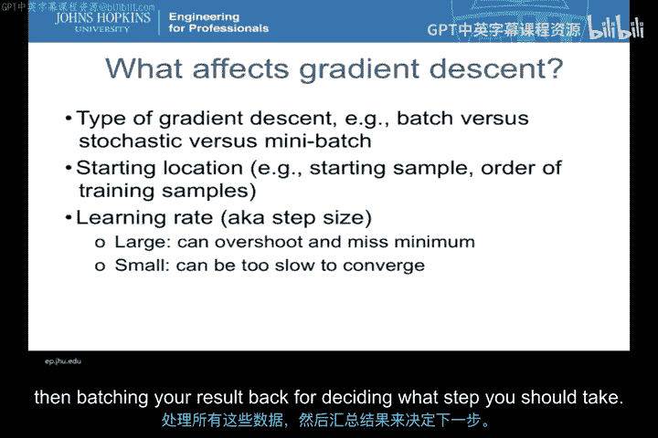

## 梯度下降与优化 🏔️

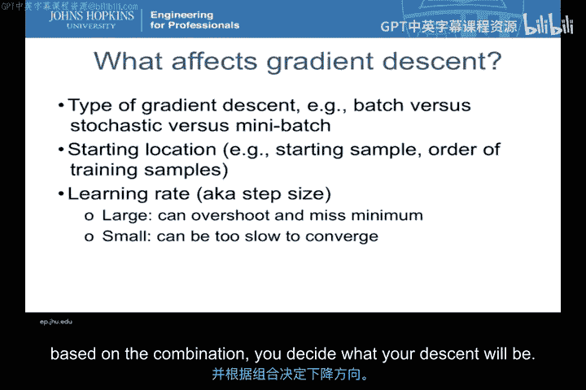

这就是学习算法。那么关键术语“梯度下降”是什么意思？这主要关注学习算法从概念基础上是如何学习的。

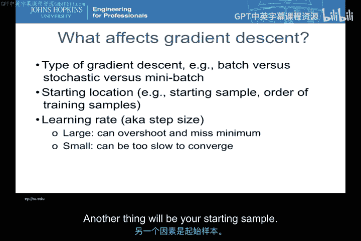

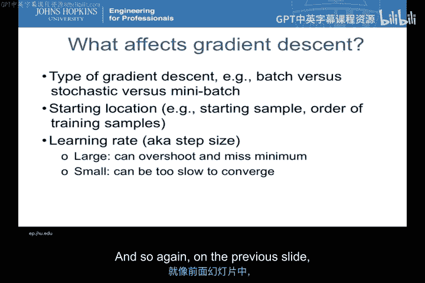

想象你正在处理一个二维空间，我们称之为 `θ₀` 和 `θ₁`。你可以将这个空间映射出来，你有一些输入值，根据 `θ₀` 和 `θ₁` 的值，你会得到某个结果。这个结果要么接近你的预期，要么不接近，这被认为是你的**损失函数**或**误差函数**。假设这个轴是 `J`，它是 `θ₀` 和 `θ₁` 的函数。

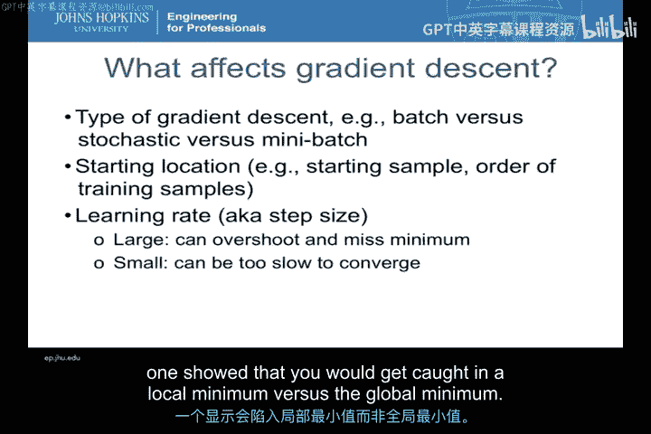

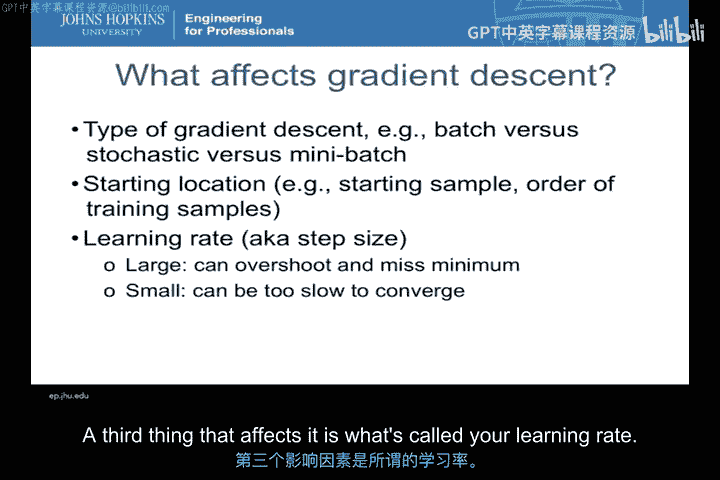

你想要做的是最小化你的误差或损失。因此，你最终想要学习到的点是这里的 `θ₀` 和 `θ₁`，也就是最低点。这个最低点也被称为**全局最小值**，这确实是你的最优解。它是最优的，因为它具有可能的最小误差。

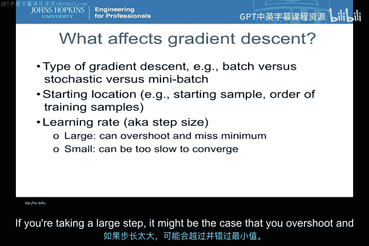

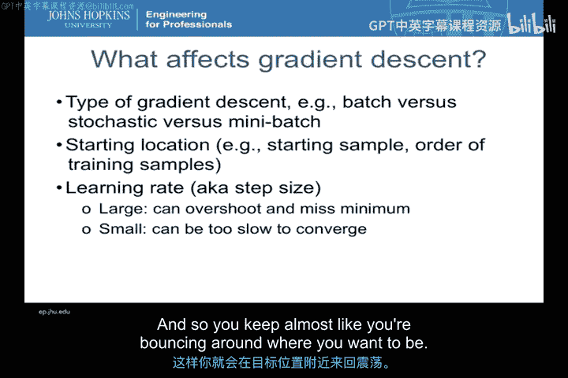

算法使用梯度下降实际工作的方式是，你从某个点开始。你随机选择一个起点，即 `θ₀` 和 `θ₁` 的一些初始值，以及数据集中的一个起始样本。假设那个样本从这里开始。从那里开始，随着算法学习，它实际上在做的是**梯度下降**。它正在下山，试图找到误差最小的点。

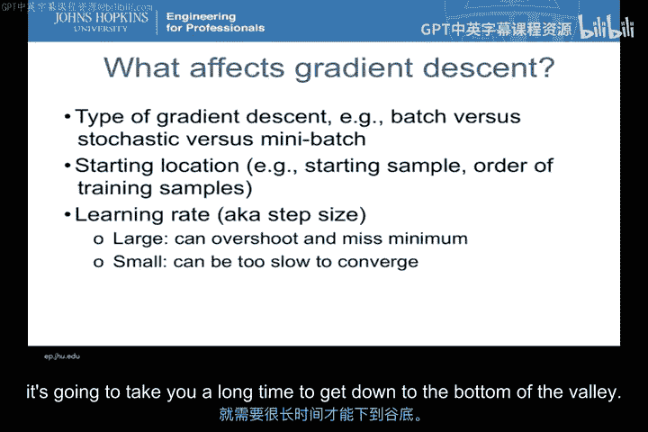

如果你把它想象成一座山，你在山上，想要下到山谷深处，但你可能因为树木或地形轮廓而看不到它，你会采取什么方法？你可能会采取的方法是，你的下一步将是**最陡下降**的方向，因为你知道你要下到山谷的最深处。所以从这里，你可能会走到这里。那可能是你的下一步。然后你重复这个过程，现在你更低了，你下一步要采取什么步骤？你想继续下降，你永远不会往回走，因为那会增加你的误差，使你离问题空间的最终解决方案更远。也许你的下一步是走到这里，然后最终下到这里。

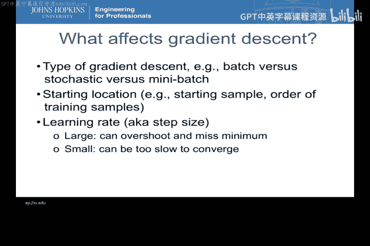

这是针对全局最小值的情况。问题之一是你有一个很大的空间。可能发生的情况是，你可能会被困在某个实际上不是全局最小值的地方，但由于这种梯度下降方法，你无法脱身。这被称为**局部最小值**。例如，这里的空间。它不是最优的，但它已经降到了空间的很低处，从那里开始，你往任何方向走都意味着要往回走，而由于你只能下降，所以你被困住了，无法摆脱那个最小值。

例如，如果你的起点恰好在这里，你很可能会采取这样的步骤，然后最终被困在局部最小值中，而不是找到最终的答案。因此，这是使用机器学习技术时需要考虑的一些问题，你需要确保你选择的变量、你调整的不同参数都以某种方式设置，以尝试找到这个全局最小值，而不是陷入局部最小值。

## 影响梯度下降的因素 🔧

那么，有哪些因素会影响你的梯度下降方法，并可能根据你特定学习算法的不同运行给出不同的结果呢？

以下是几个关键因素：

*   **梯度下降类型**：你使用的是**批量**、**随机**还是**小批量**梯度下降？例如，批量方法意味着你同时处理大量输入样本，基于所有样本的组合来决定你的下降步骤。随机方法则一次处理一个样本。小批量方法则每次使用一小部分样本，例如每次10个样本。
*   **起始位置**：这可能是基于 `θ₀` 和 `θ₁` 的随机变量，这些通常在开始时随机设置。你的初始样本也会决定你在整个空间映射中的起始点，从而影响你最终可能找到的解决方案。正如上一张幻灯片所示，我们从两个不同的位置开始，一个显示你会陷入局部最小值，而另一个则可能找到全局最小值。
*   **样本顺序**：例如，如果你使用随机学习，训练样本的顺序将定义你采取步骤的位置，以及你最终可能被困住还是找到最优解。
*   **学习率**：你可以将其视为你的步长。你是迈一大步下山，还是迈一小步？如果你的步长太大，可能会导致你越过最小值，就像在你想要到达的点附近弹跳；或者如果空间非常复杂，你甚至可能跨过某个上升部分，然后进入另一侧的最小值。相反，如果你的学习率太小，步长太小，收敛到一个解决方案将需要很长时间。想象一下，如果你下山时步长很小，你需要很长时间才能到达谷底。

因此，这些是进行梯度下降时需要考虑的因素，也是你必须权衡的不同取舍。

## 机器学习算法概览 📊

机器学习领域有大量的算法，这里我只介绍一些特别用于入侵检测的算法。

*   **神经网络**：这是一个非常有趣的算法，实际上我们下一个模块将深入探讨神经网络。在神经网络内部，也有许多不同的类型。
*   **聚类**：这是另一个常用的关键算法。同样，我将有另一个模块更详细地介绍聚类，特别是**K均值聚类**。我会简要介绍**DBSCAN**，然后重点介绍**K最近邻**。我在这里特别提到DBSCAN，因为它在考虑性能、执行速度等多个不同参数时，已被证明是聚类中效果较好的算法之一。
*   **支持向量机**：我将在未来的模块中简要介绍，这是另一种进行机器学习的方法。支持向量机本质上提供了一种通过超空间划分数据的平面，将数据分为两类。还有一种叫做**单类支持向量机**的方法，它可以从只有一类数据（而不是两类数据）创建支持向量机。我提到这一点是因为它在入侵检测领域进行异常检测时特别有用。
*   **朴素贝叶斯**：这是一个非常常用的算法。它本质上是查看概率：给定你当前查看的特征值（例如，在我们的数据中，可能是源IP、目标IP、源端口、目标端口），这个输入属于特定类别的概率是多少？例如，这个输入是特定类型攻击的概率是多少，或者是正常流量的概率是多少？这是基于从先前数据中观察到的先验概率。朴素贝叶斯的一个问题是它假设所有变量都是独立的，而这通常并非如此。
*   **进化计算**：这是另一种处理机器学习的方法，同样包含大量不同的算法子集，如遗传算法、遗传编程、人工免疫系统、群体行为等。这个领域很有趣，特别是遗传算法，因为它试图模拟基因的工作方式。你会有本质上由二进制1和0组成的“基因”，你希望将这个基因与另一个基因结合，通过交叉、变异等方式进行，这实际上模拟了自然界中通过遗传物质进行进化的过程。遗传编程采用了完全相同的方法，但将其应用于程序本身，而不是数据和模型。
*   **决策树**：这是另一种常见的机器学习方法。对于决策树，本质上你创建一棵树，表示：如果我看到这个特定变量是这个值，就走这个分支；否则，如果是另一个值，就走另一个分支，并依此类推。
*   **集成学习与随机森林**：决策树是一种非常流行且似乎效果很好的方法。随机森林由多个决策树组成。每个决策树是通过可能随机选择特征空间的某个子集创建的。然后，随机森林获取所有这些不同决策树的结果，将它们组合起来得出最终答案。集成学习本质上做完全相同的事情，但不特指决策树，它可以是任何算法集合。例如，你可能有两三种不同类型的神经网络，然后获取这些不同神经网络的结果，通过某种方法（可能是投票法或其他形式的组合）将它们组合在一起，从而基于所有子组件的结果得出你认为的最终答案。
*   **逻辑回归**：这是一种标准的统计技术。它对大量二进制数据进行建模（例如，1代表正常，0代表攻击），根据所有特征分配权重，这样当你看到一个未知样本时，它会提供一个介于0和1之间的结果，这实际上是你刚刚观察到的流量是正常的概率。
*   **关联规则挖掘**：在这个概念中，你试图挖掘能解释你所观察内容的规则，例如，如果你看到X，那么Y。
*   **贝叶斯网络**：这是另一种非常常见的方法。对于贝叶斯网络，我们查看我们拥有的特征，找出这些特征之间的关系，然后将它们与概率模型结合起来。
*   **马尔可夫模型/过程**：在这种情况下，你有一个状态，基于输入，你有一定的概率转换到另一个状态。

以上总结了你将在机器学习领域，特别是其在入侵检测中的应用中观察到的一些算法。

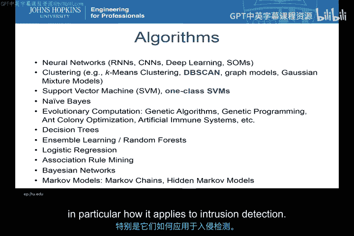

## 机器学习工具 🛠️

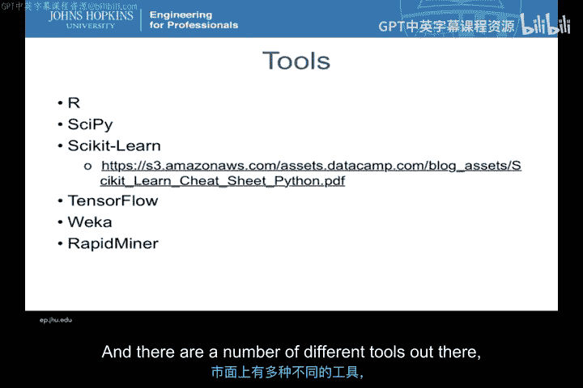

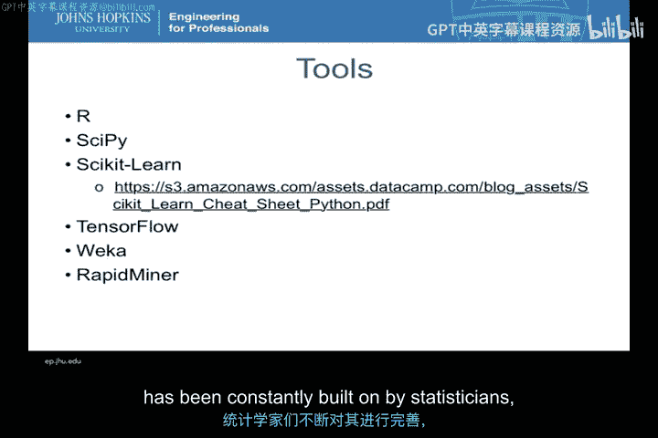

现在让我们看看一些可用于进行机器学习的工具。市面上有很多不同的工具，其中大多数实际上是免费的。

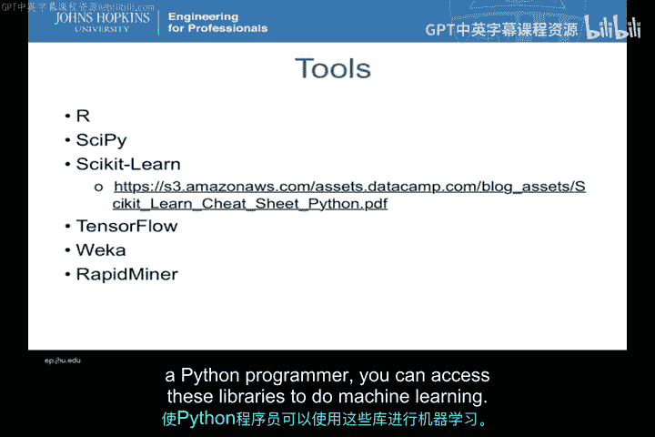

以下是几个主要的工具：

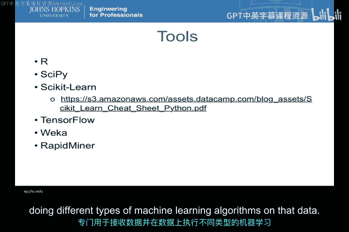

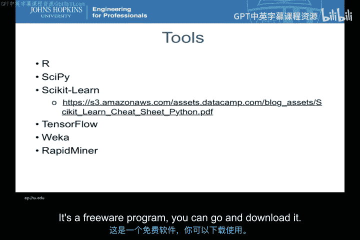

*   **R**：这是一个非常常见的工具，实际上是一个统计软件包，已经使用了几十年，不断由统计学家构建，内置了许多功能，使你能够轻松地进行逻辑回归或任何数据挖掘算法。R本质上是一种自己的编程语言，与Python非常相似。
*   **Python相关库**：说到Python，接下来的三个工具都与之相关：SciPy、scikit-learn和TensorFlow。这些都是与Python相关的库，使得作为Python程序员，你可以访问这些库来进行机器学习。scikit-learn这里有一个链接指向一个非常好的速查表，你可以使用它来执行一些机器学习方法。
*   **WEKA**：这与其他的非常不同，因为它有一个图形前端，专门用于接收数据并对该数据执行不同类型的机器学习算法。它是一个免费软件程序，你可以去下载。有一本与之配套的免费书籍可以帮助你学习如何使用它。
*   **RapidMiner**：对于小型示例可以免费使用。我相信如果你的数据行数少于10,000行（例如，尝试使用我们的林肯实验室数据集，即使从流级别汇总来看，也远远超过10,000行），你就可以免费使用RapidMiner来分析该特定数据集。对于更大的数据集，则需要根据用户数量和要处理的数据量付费。

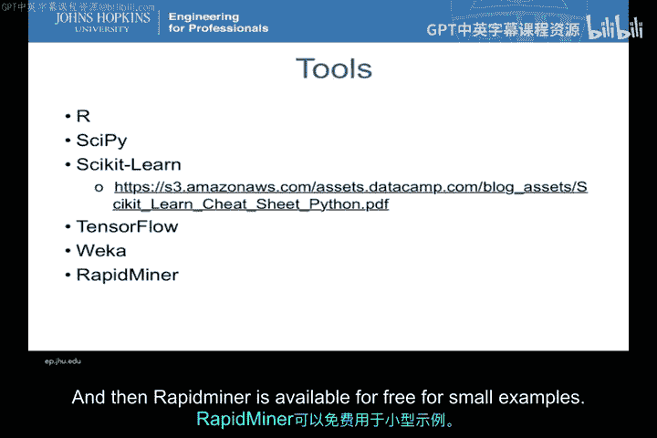

我鼓励你去看看RapidMiner的网站。它的首页有一个非常棒的视频，在一分钟内演示了使用RapidMiner进行数据挖掘是多么容易。他们特别演示了一个决策树：他们从Excel电子表格中获取关于泰坦尼克号乘客的数据（他们幸存或未幸存），然后查看了幸存乘客与未幸存乘客之间的相似性，并判断如果你是一名泰坦尼克号乘客，你是否可能符合用于将某人放入救生艇的标准。我确实鼓励你去看一下那个视频。

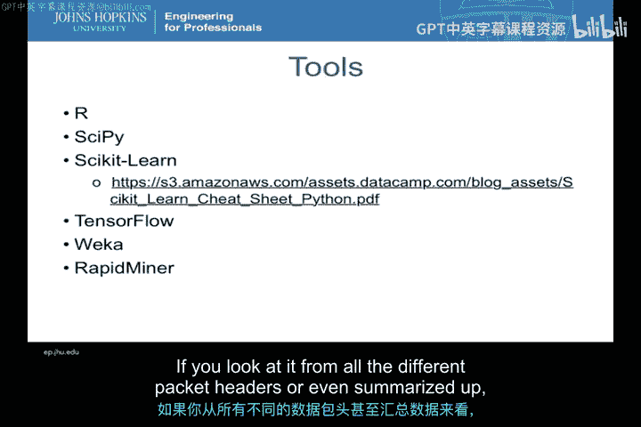

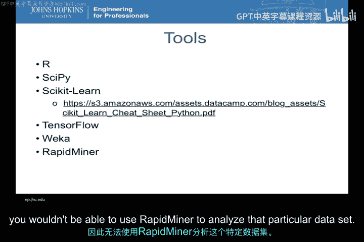

## 总结 📝

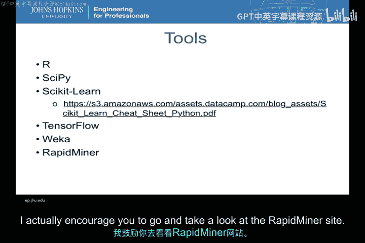

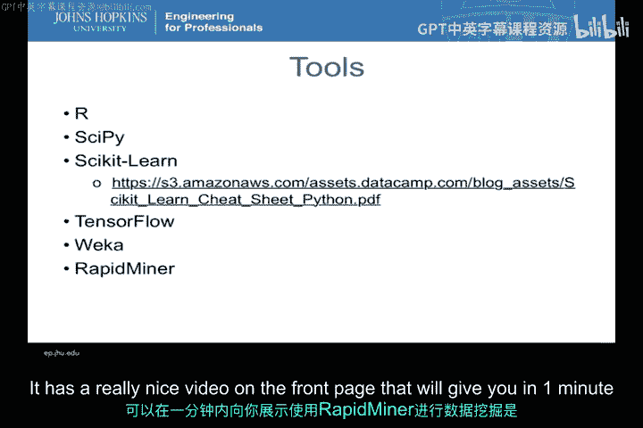

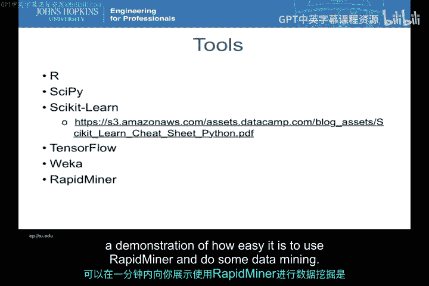

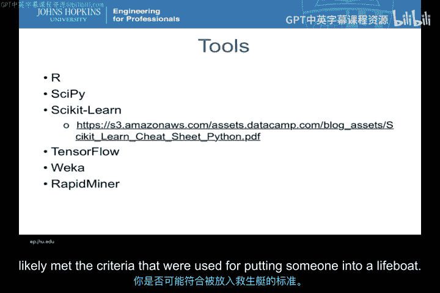

本节课中，我们一起学习了机器学习的基础概念。我们从机器学习的定义和历史讲起，了解了其核心在于让计算机无需明确编程即可学习。我们重点探讨了两个核心概念：**学习算法**（分为监督学习、无监督学习和半监督学习）和**梯度下降**（包括全局最小值、局部最小值以及学习率等影响因素）。接着，我们概览了多种常见的机器学习算法及其在入侵检测领域的潜在应用，例如神经网络、聚类、支持向量机等。最后，我们介绍了几种实用的机器学习工具，如R、Python生态库（scikit-learn, TensorFlow）、WEKA和RapidMiner，为实际动手操作提供了资源指引。理解这些基础概念是进一步探索复杂机器学习模型及其在网络安全中应用的重要第一步。