# 053：神经网络原理与应用 🧠

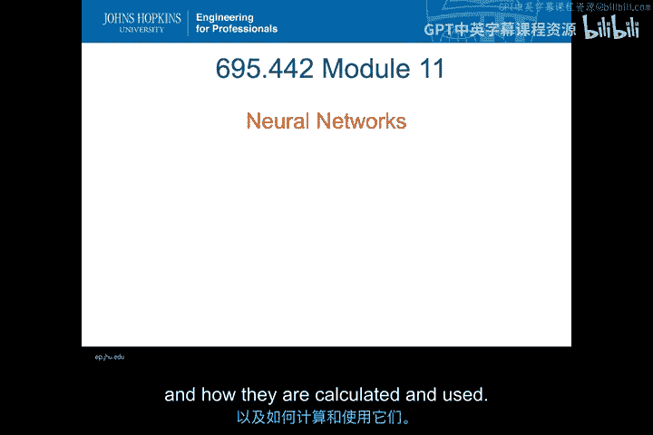

在本节课中，我们将学习神经网络的基本概念。我们将了解什么是神经网络，其发展历史，以及它们是如何被计算和应用的。

---

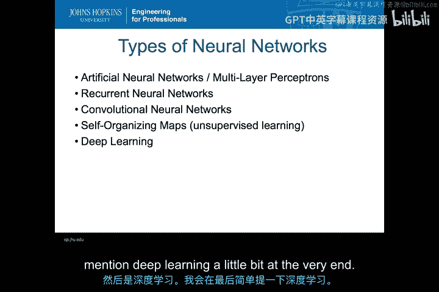

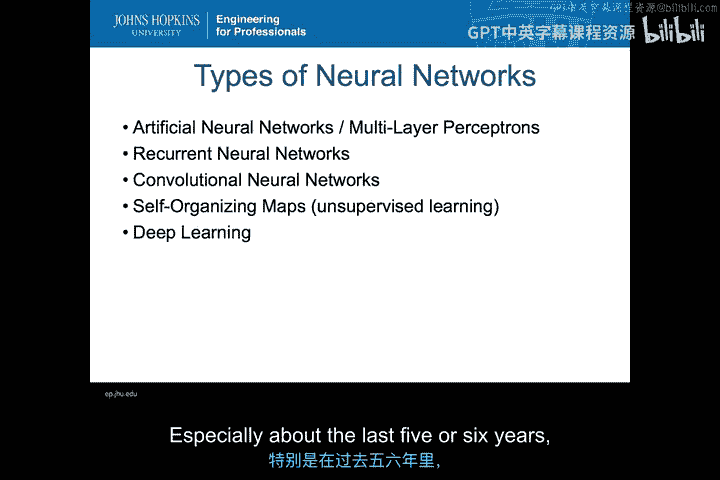

## 神经网络概述

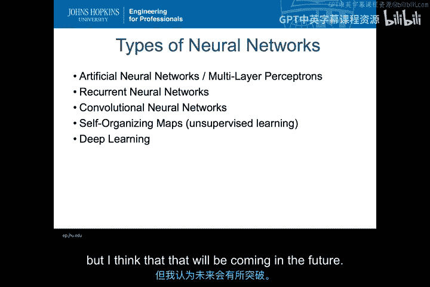

神经网络有多种不同类型。本讲座将重点介绍**人工神经网络**，它有时也被称为**多层感知机**，尽管现在这个术语已不常用。其他类型的神经网络，如循环神经网络、卷积神经网络、自组织映射和深度学习，都以此为基础发展而来。

上一节我们介绍了神经网络的整体概念，本节中我们来看看其生物学基础。

---

## 生物神经元的工作原理

神经网络的概念实际上基于大脑的工作原理。下图展示的是灵长类动物脑组织样本中神经元的**高尔基染色**切片。你可以清晰地看到神经元，深色部分是细胞体，延伸出的长触须是轴突和树突，它们与其他细胞形成连接。每个人的大脑都由无数这样的神经元构成，而神经网络正是试图模拟大脑的工作方式以实现其功能。

在深入探讨神经网络的结构之前，我们先了解一下神经元本身如何工作，这有助于理解神经网络为何如此设计。

下图展示了一个神经元的示意图。细胞体延伸出许多被称为**树突**的结构，它们负责接收来自其他细胞的信号。当另一个细胞释放某种**神经递质**时，这些递质会积聚在神经元之间的液体间隙中，并与树突上的受体结合。

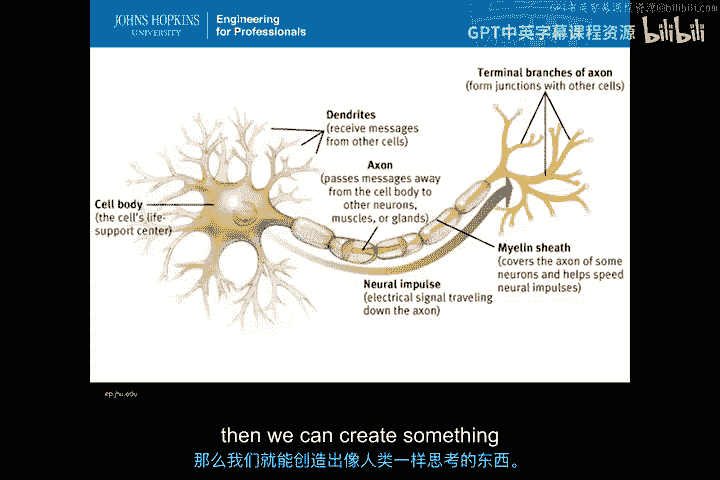

一旦有足够多的神经递质结合到树突上，细胞就会被**兴奋**，产生一股电流。这股电流沿着**轴突**一直传递到末端的**终末分支**。这种兴奋被称为**神经冲动**。在终末分支处，会释放神经递质，进而连接到其他神经元。通过这种方式，电信号在大脑中传递，我们的思想、视觉、语言等一切活动都以这种电信号序列的形式运作。

我们利用这种基础的生物学理解，在计算机上模拟神经元的工作方式，其理论是：如果我们能做到这一点并构建起来，就能创造出像人类一样思考的东西。

---

## 感知机：单个神经元的模型

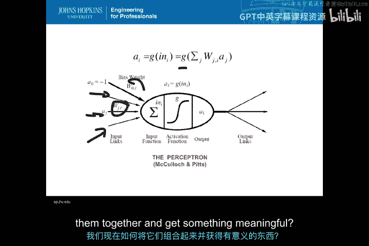

那么，我们如何在计算机中模拟一个神经元呢？这最初由**麦卡洛克和皮茨**完成，其原始模型被称为**感知机**，它本质上模拟了单个神经元的工作方式。

感知机的工作流程如下：
*   你有多个不同的输入。
*   每个输入都会乘以一个**权重** `W`。
*   所有加权后的输入被求和。
*   求和后的结果通过一个称为**激活函数**的函数处理，该函数决定输出值。一个典型的基础激活函数是 `tanh`。
*   经过激活函数后，产生一个输出。这个输出可以连接到其他感知机，从而形成链式结构。

用数学公式表示，感知机的输出 `y` 可以描述为：
`y = g( Σ (w_i * x_i) + b )`
其中：
*   `g` 是激活函数。
*   `x_i` 是各个输入。
*   `w_i` 是对应的权重。
*   `b` 是**偏置权重**，它有助于进行数学上的调整，使模型工作得更好。

以上就是单个感知机的工作原理：它接收所有输入，通过一个函数处理，并生成输出。

---

## 构建神经网络：连接多个感知机

了解了单个感知机的工作原理后，我们如何将它们组合起来以获得有意义的结果呢？

通过组合多个感知机，我们可以构建出神经网络。如下图所示，神经网络包含以下层次：
*   **输入层**：由数据集中所有特征构成。例如，在林肯实验室数据集中，输入特征可能包括目的IP地址、源IP地址、目的端口、源端口等。每条记录都会被分解为这些特征，输入层的每个节点对应一个特征。
*   **隐藏层**：包含多个感知机（神经元）。输入层的每个特征值会向前传递到隐藏层的每一个神经元。
*   **输出层**：通常由一个或多个感知机构成，生成最终的输出（例如，判断一个网络流是“正常”还是“恶意”）。

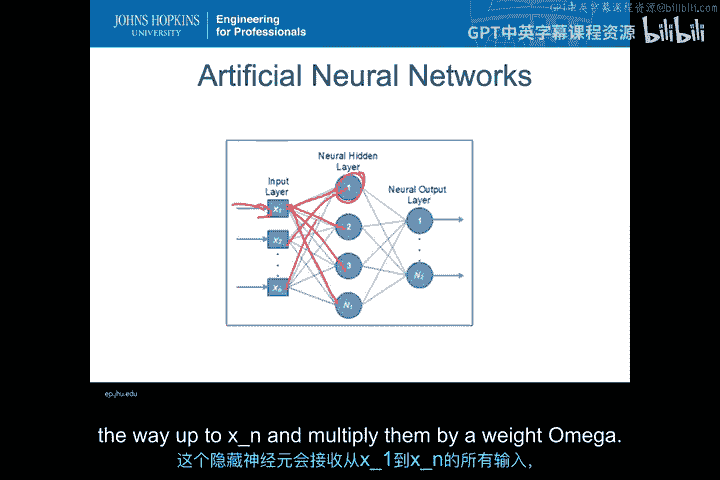

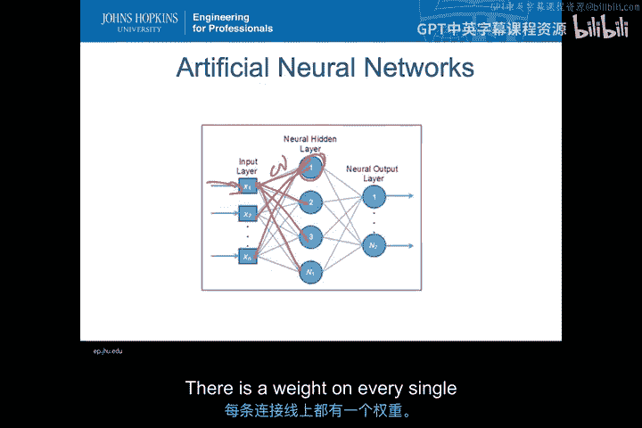

数据在网络中的流动过程如下：
1.  输入值 `x1, x2, ..., xn` 从输入层出发。
2.  它们沿着连接线传递到隐藏层的每个神经元。**每条连接线都有一个权重 `ω`**。
3.  在每个隐藏层神经元中，所有输入值乘以对应的权重后求和，然后将结果通过**激活函数**处理，生成该神经元的输出。
4.  这些输出又作为输入，传递到输出层的神经元，再次经过加权求和与激活函数处理，最终产生网络的输出。

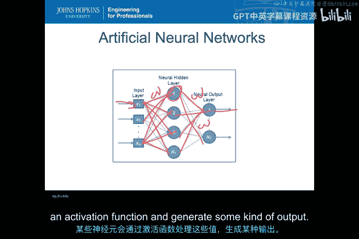

网络结构可以更复杂：
*   你可以有**多个隐藏层**，而不仅仅是一个。
*   每个隐藏层可以包含**任意数量**的神经元，不同层的神经元数量可以不同。

---

## 训练神经网络：反向传播算法

以上解释了神经网络如何工作，但还没有说明如何训练一个神经网络。最初，所有权重通常是随机分配的，因此网络的输出很可能不是我们想要的。那么，如何训练它呢？

神经网络需要**带标签的数据**进行训练。以林肯实验室数据为例，我们知道哪些流是攻击，哪些是正常行为。我们可以将一条流的所有特征作为输入送入网络，假设输出层只有一个神经元，输出0表示“恶意”，输出1表示“正常”。

训练过程如下：
1.  输入一条样本数据，网络产生一个输出（例如0.7）。
2.  我们知道正确答案（例如是正常行为，应为1），因此计算**误差**（例如 1 - 0.7 = 0.3）。
3.  我们采用**反向传播算法**：将这个误差**反向传播**回网络。
4.  根据误差，使用**梯度下降法**计算并**调整网络中各条连接线上的权重**。调整的目的是减少当前样本产生的误差。
5.  对训练集中的下一条样本重复此过程。
6.  当训练集上的平均误差小到可接受的程度时（例如，所有正常样本的输出都大于0.8，所有恶意样本的输出都小于0.2），停止训练。
7.  使用未见过的测试数据来评估训练好的网络性能。

**梯度下降法**在这里至关重要。我们通过计算误差函数对各个权重的**偏导数**，来确定权重调整的方向和幅度，逐步向误差的最小值（理想情况下是全局最小值）移动，从而找到一组最优的权重。

---

## 实践中的神经网络与深度学习

在实践中，神经网络，特别是**深度学习**网络，可以非常复杂。如下图所示，一个深度学习网络可能拥有大量输入、多个隐藏层，且每层神经元数量各异。

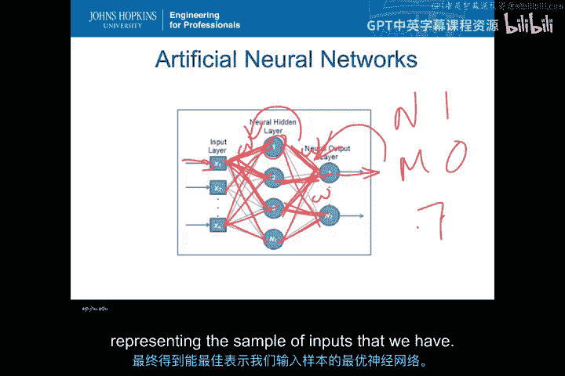

深度学习在**视觉处理**领域表现尤为出色。在网络中，不同的神经元可能学会识别非常具体的模式，例如有的神经元专门识别人脸，有的识别猫，有的识别对角线。每一层都在进行更抽象的特征提取和识别。

在入侵检测领域应用深度学习仍是一个开放的研究课题，目前取得了一些有限的成功，但未来有望看到更多进展。对机器学习和入侵检测感兴趣的同学，可以深入研究这一方向。

---

## 总结

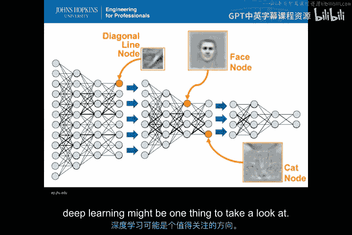

本节课中，我们一起学习了神经网络的核心知识。我们从其生物灵感——神经元的工作原理出发，介绍了**感知机**作为单个神经元的基本模型。接着，我们探讨了如何通过连接多个感知机构建**多层神经网络**，并详细解释了数据在网络中的前向传播过程。最后，我们学习了如何使用带标签的数据和**反向传播算法**（结合**梯度下降法**）来训练神经网络，调整权重以最小化误差。我们还简要提及了更复杂的**深度学习**及其应用前景。理解这些原理是应用神经网络解决实际问题（包括入侵检测）的重要基础。