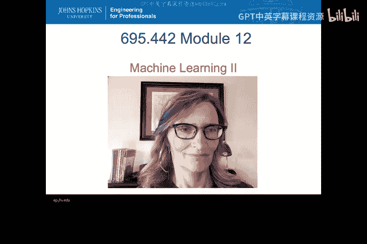
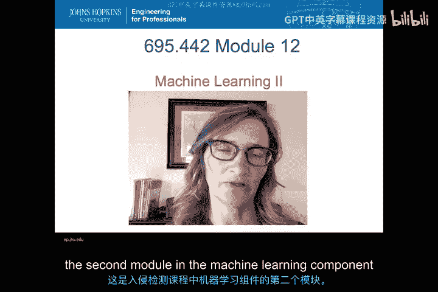
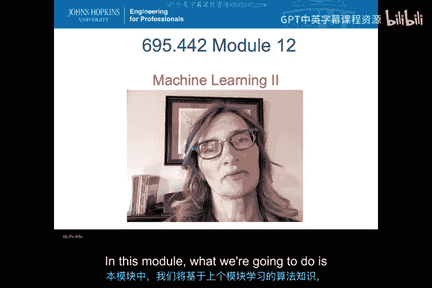
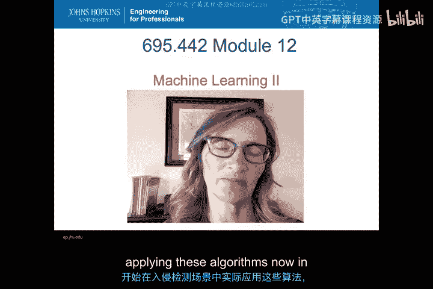
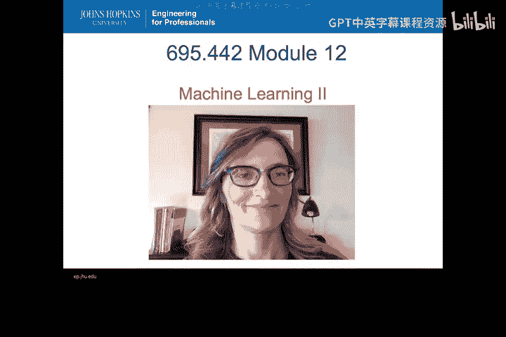
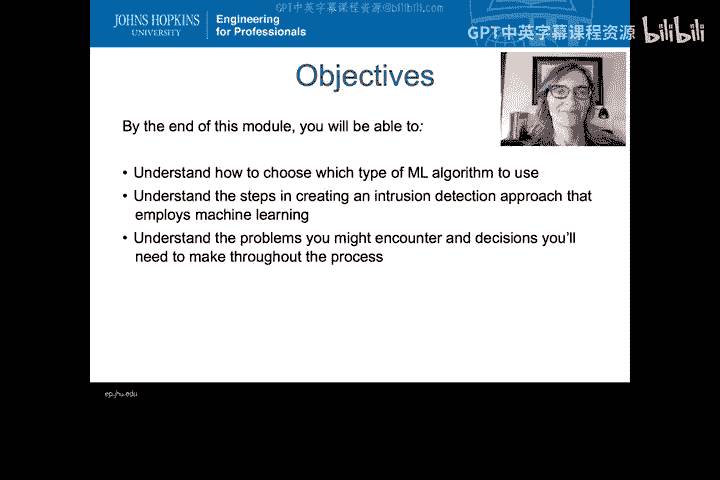
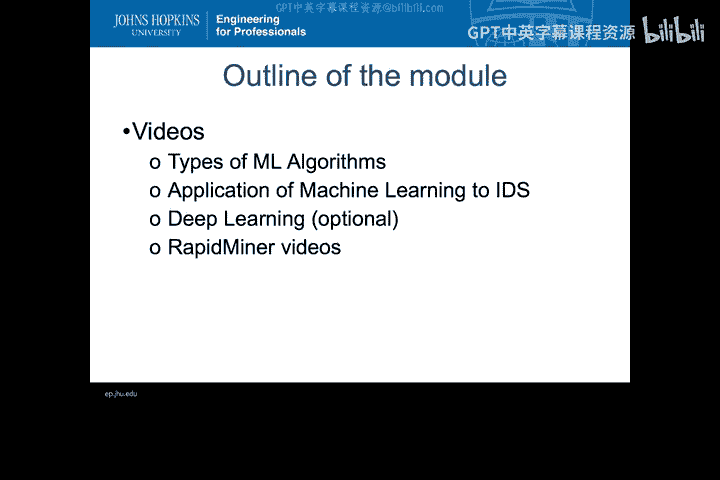

# 056：机器学习算法应用导论 🚀

在本节课中，我们将要学习如何将机器学习算法应用于入侵检测的具体问题。我们将探讨如何选择合适的算法，了解应用过程中的关键步骤，并认识可能遇到的挑战与权衡。

上一模块我们介绍了机器学习的基础算法。本节中，我们将开始把这些算法应用到入侵检测的上下文中，并了解实现这一目标所需的条件。

## 模块目标 🎯

本模块的学习目标有三项：
1.  理解如何选择应使用的机器学习算法。共有四种主要类型，每种类型用于回答不同的问题。目标是理解在入侵检测问题中应选择这四种类型中的哪一种。
2.  理解创建采用机器学习算法的入侵检测方法所涉及的步骤。需要考虑哪些因素，以及在此过程中可能遇到的问题。
3.  了解在使用机器学习算法时需要做出哪些决策，如何做出这些决策，以及其中的权衡。

这些是您将在本模块中遇到的高级目标。

## 课程内容安排 📚

本模块包含多个视频：
*   第一个视频以标准讲座形式，介绍可供选择的不同类型的机器学习算法。
*   第二个视频同样以讲座形式，探讨机器学习在入侵检测问题中的应用，包括您将遇到的步骤和需要考虑的一些问题。
*   第三个是可选视频，关于深度学习。内容链接至杰里米·霍华德今年一月的Enigma演讲。他精彩地概述了深度学习的工作原理，并以一种非常有趣且不寻常的方式将其应用于计算机安全问题，鼓励人们以新方式思考问题，从而应用新算法。
*   最后，我们将观看一系列关于RapidMiner的短视频。RapidMiner是一个机器学习工具集。我们将在作业和实验中使用它，将一些机器学习技术应用于入侵检测问题，以感受其工作原理以及我们必须真正考虑的一些事项，而无需自己开发任何算法，我们可以使用现成且免费提供的工具。

本节课中，我们一起学习了将机器学习应用于入侵检测的初步框架，包括算法选择、实施步骤和可用工具。接下来，我们将深入探讨不同类型机器学习算法的特点与适用场景。