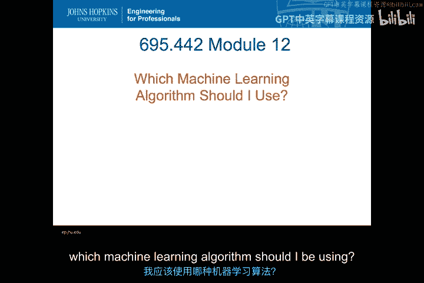
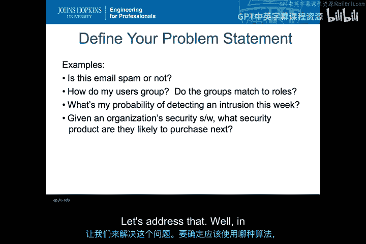
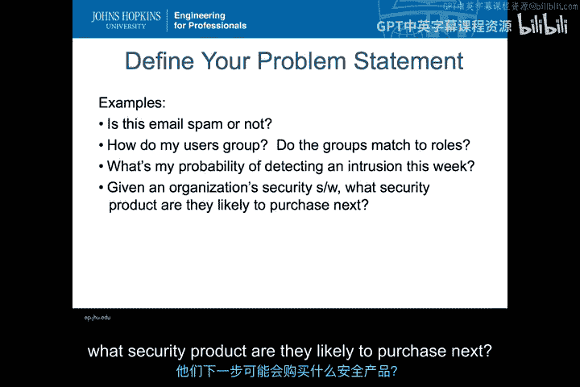
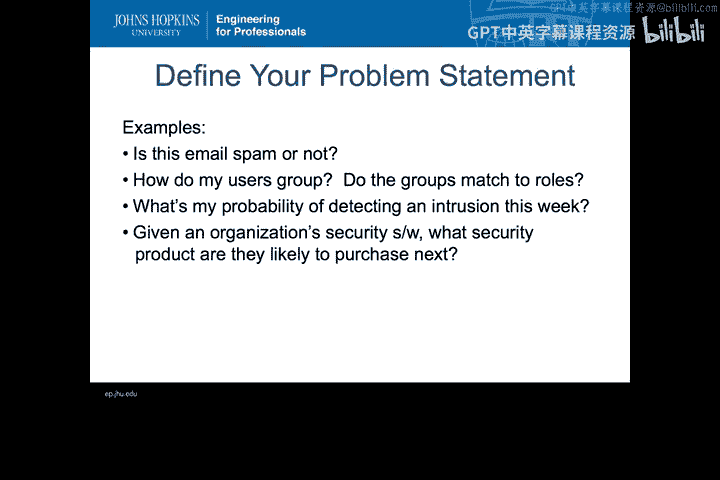
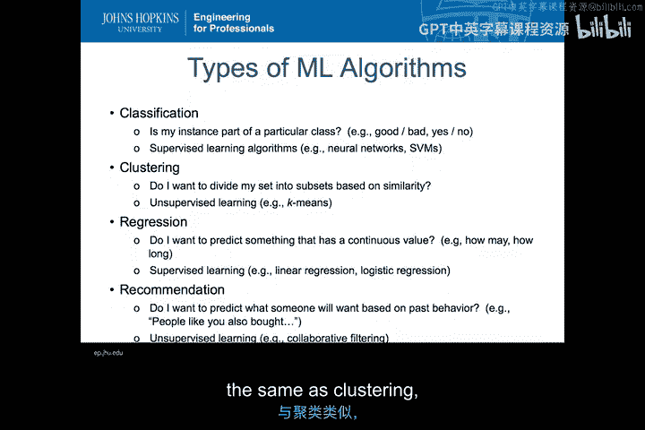
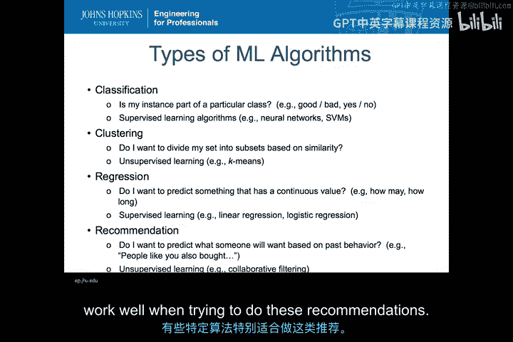
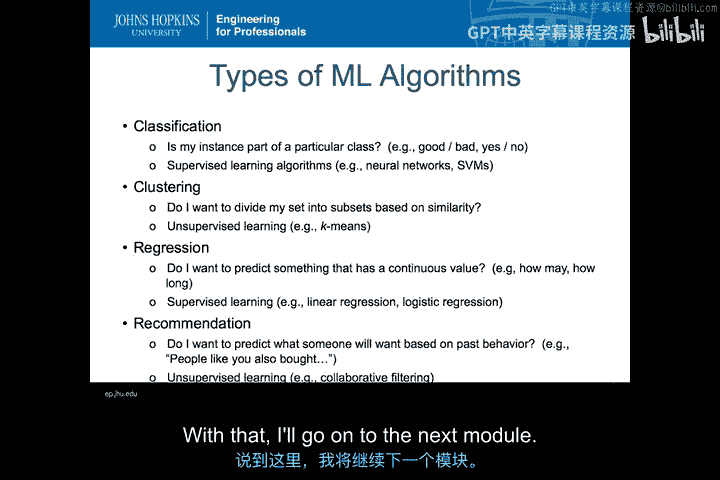

# 057：机器学习算法选型策略 🧠

在本节课中，我们将要学习如何为入侵检测问题选择合适的机器学习算法。我们将探讨不同类型的机器学习算法，了解它们各自解决的问题，并确定在入侵检测场景中最适用的算法类型。

---

在考虑将机器学习应用于入侵检测问题时，我们首先需要问的问题是：我应该使用哪种机器学习算法？让我们来探讨这个问题。

为了确定你应该使用哪种算法，你首先需要确定你的问题是什么，即你试图解决什么。因此，你的第一步将是定义你的问题陈述。

以下是一些问题陈述的例子：
*   这封电子邮件是垃圾邮件吗？
*   我的用户如何分组？这些分组是否与角色匹配？
*   本周我检测到入侵的概率是多少？
*   给定一个组织的安全软件，他们下一步可能购买什么安全产品？

这些都是非常不同的问题陈述，它们需要不同的解决方法和不同的机器学习算法。那么，我们可以为这些不同的问题应用哪些可能性呢？

---

从高层次来看，你可以认为有四种不同类型的机器学习算法：**分类**、**聚类**、**回归**和**推荐**。它们各自以不同的方式运作，解决不同的问题。

上一节我们介绍了问题定义的重要性，本节中我们来看看这四种主要的算法类型。

以下是四种主要的机器学习算法类型及其解决的问题：

1.  **分类**
    *   **核心问题**：我的实例是否属于某个特定类别？例如，我观察的对象是“好”还是“坏”？答案是“是”或“否”吗？你是在尝试对某事物进行分类吗？他们是民主党人、共和党人、自由主义者还是独立人士？你如何确定某事物属于哪个类别？
    *   **算法类型**：要回答这些问题，你需要**监督学习算法**。监督学习算法意味着你拥有已标记的训练数据，你知道实际的输出，你可以学习不同输出的样子，并尝试确定决定这些特定输出的特征。例如，我们在上一个模块中看到的**神经网络**和**支持向量机**就是监督学习算法。虽然存在不同的监督学习算法，但如果你试图进行**分类**，通常你会希望使用这类学习算法。

2.  **聚类**
    *   **核心问题**：我是否想根据相似性将我的集合划分为子集？在这种情况下，你关注的是：我有一个大群体，我想确定其中的子集是什么，以及这些子集有什么特征。
    *   **算法类型**：这是一种**无监督学习**方法。同样，我们在上一个模块中看到过，我们研究了**K均值算法**，它能够将一个集合划分为不同的子集。

3.  **回归**
    *   **核心问题**：我想预测一个具有连续值的事物。例如，某物的数量是多少？某事需要多长时间？或者某个连续值。我能确定那个值是什么吗？
    *   **算法类型**：它与分类类似，但分类是离散的，而回归处理的是连续值。与分类一样，它也是**监督学习**。但在这种情况下，你将使用的算法是**线性回归模型**或**逻辑回归模型**，或任何其他类型的回归模型。

4.  **推荐系统**
    *   **核心问题**：我是否想根据某人过去的行为来预测他们将做什么？例如，你在亚马逊上看到的“购买此商品的顾客也购买了……”这类信息就是推荐系统。
    *   **算法类型**：它也是一种**无监督学习算法**，与聚类类似。在尝试进行这类推荐时，有特定类型的算法效果很好，**协同过滤**就是一个例子。

---

在入侵检测的背景下，我能想到的唯一例子类似于：如果我的安全组织拥有特定的软件集，我下一步可能购买什么？这不是我们在这门课中真正要研究的内容。

我们真正可能关注的是**分类**。我们想知道，当我们看到某些行为时，它是恶意的还是非恶意的？它是一次入侵吗？

---

本节课中我们一起学习了为机器学习项目选择算法的基本策略。我们首先强调了**明确定义问题陈述**的重要性。接着，我们探讨了四种主要的机器学习算法类型：用于判断类别的**分类**、用于发现数据自然分组的**聚类**、用于预测连续值的**回归**以及用于预测偏好的**推荐系统**。最后，我们明确了在入侵检测领域，**分类**算法（例如判断行为是否恶意）是最核心和最常用的方法。理解这些算法类型及其适用场景，是成功应用机器学习解决安全问题的第一步。