# 058：机器学习在入侵检测中的应用 🧠

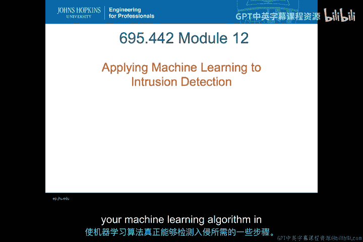

在本节课中，我们将要学习如何将机器学习算法实际应用于构建入侵检测系统。上一节我们介绍了如何选择机器学习算法，但选择算法只是第一步。本节中，我们将深入探讨从定义问题到最终部署模型的完整流程，了解其中涉及的关键步骤和挑战。

---

## 概述

成功应用机器学习进行入侵检测远不止选择一个算法。它涉及一个包含多个关键阶段的严谨流程，包括问题定义、数据准备、模型训练与测试。本节将概述这些步骤，并详细讨论每个阶段的具体任务和常见陷阱。

---

## 机器学习应用流程概览

从高层次看，流程主要分为**训练**和**测试**两个阶段。但在这之下，还有许多具体步骤需要完成。

正如上一模块所提到的，你需要做的第一件事是**定义问题陈述**。除非你知道要解决什么问题，否则你无法选择算法或数据。你必须首先明确定义问题。

一旦定义了问题陈述，你就可以去**识别可用的数据集**。这里，问题陈述和可用数据集之间存在关联。例如，如果你的问题陈述是识别主机上的恶意软件，但你唯一可用的数据集是网络流量数据，那么你将无法使用该数据来解决主机恶意软件检测问题。因此，两者之间需要平衡。有时你想解决的问题可能因缺乏可用数据而无法解决；反之，你可能会发现一些可用数据集可以用来解决其他非常有趣的问题。

在确定了问题陈述和用于解决该问题的可用数据集后，你需要深入研究这些数据。具体来说，你需要确定几件事：
1.  **类别属性或特征**：你可以用什么作为模型的输入，或者用来判断某物是否属于你想要识别的类别。
2.  **类别标签**：你的训练数据集中的所有数据都需要有标签。例如，如果你要在一组网络追踪数据中寻找攻击，你需要将每条追踪数据标记为正常流量或攻击流量。这就是你的两个类别：正常和攻击。

然后，例如，如果你有NetFlow数据，你需要查看该NetFlow数据中的所有属性。

---

## 识别可用数据集的挑战

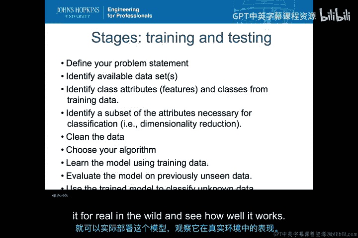

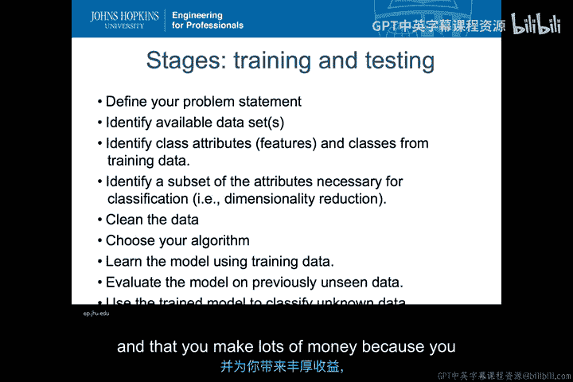

现在，我想深入探讨上一张幻灯片中提到的一些步骤。首先要深入讨论的是**识别可用数据集**。这方面存在很多问题。

你可能会认为这应该很容易，但实际上极其困难。在入侵检测领域，**几乎没有有用的公开数据集**。以恶意软件为例，如果你想编写一个在主机上运行以检测软件是否为恶意软件的程序，你需要什么数据？你需要干净的数据（不包含任何恶意软件）和恶意数据。你从哪里找到这些数据？你有几个选择：一是将一台机器放在互联网上，开始收集各种恶意流量。但问题是，该软件可能会反过来利用你的机器感染其他机器，因此你需要非常小心地设置。另一个问题是，你只能检测到当前在野外出现的攻击，而你可能需要一个能够检测当前未攻击你系统的威胁的系统。

这就是为什么在本课程中，我们一直使用林肯实验室数据集。它有很多已知问题，数据也快有二十年历史了，不再能代表当今的互联网流量。但它是**带标签的数据**且**公开可用**，这非常难得。

另一个问题是需要**代表性数据集**。这是什么意思？例如，如果我有一个数据并用它来训练模型，然后我将该模型用在另一个不同的网络上，那么这两个网络的特征是否足够相似，以至于在一个网络上训练的模型能在第二个网络上正常工作？我使用的数据是否代表了我模型将要部署的环境？

还有一个问题是**数据集不平衡**。例如，如果一个类别（如正常流量）占97%，另一个类别（如攻击流量）占3%，这实际上会影响你的准确率测量，因为在这种情况下，用于衡量程序在判断真阳性、假阳性等方面的效果的攻击流量数据非常少。

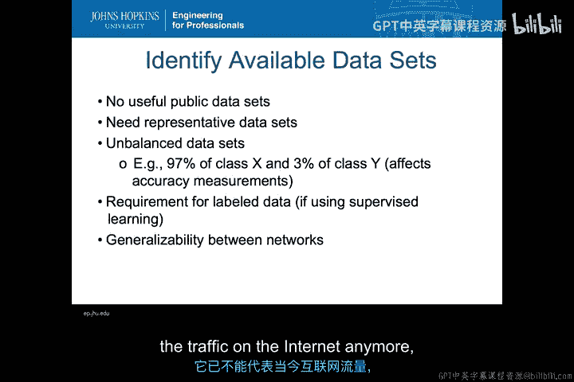

此外，如果你使用的是监督学习方法（这在构建入侵检测系统时尤其常见），就需要**带标签的数据**。带标签的数据很难获得。例如，你可能能够从计划部署入侵检测系统的网络中收集流量。很好，现在你有了所有这些真实的网络流量，但你如何判断哪些流量是攻击流量？因此，获取带标签的数据非常困难。

最后一点是**网络间的泛化能力**。我之前在代表性数据集中提到过这一点，你开发的模型不一定能推广到开发环境之外。因此，在尝试识别合适且可用的数据集时，存在许多不同的问题。

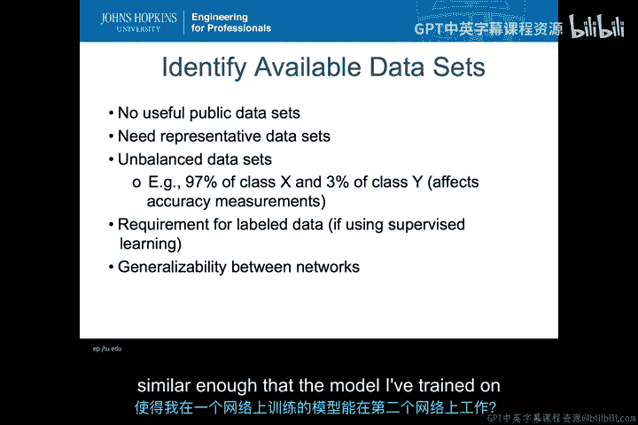

---

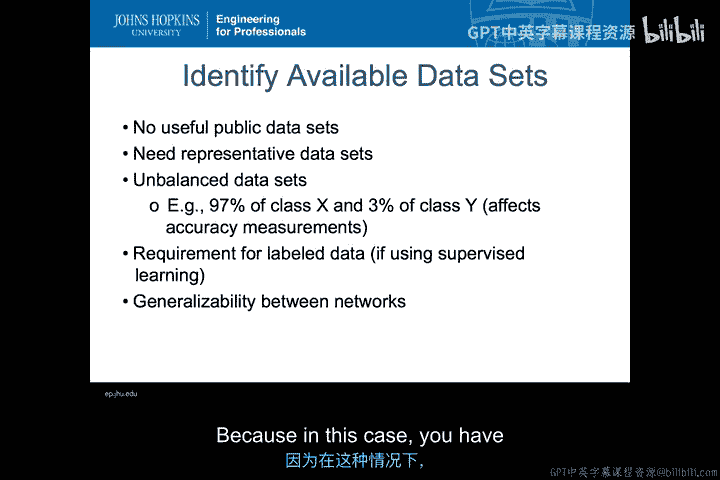

## 确定特征

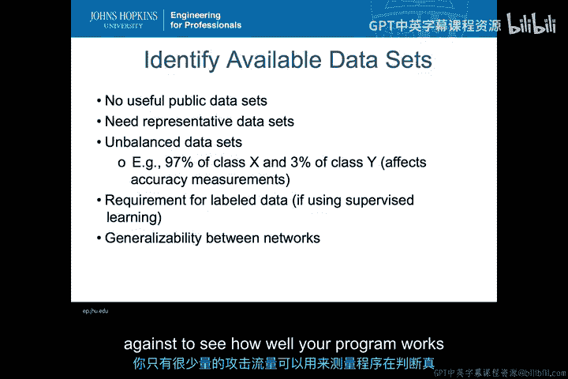

一旦确定了数据集，下一个问题就变成了：我们想用数据中的哪些**特征**来构建模型？哪些特征最有可能决定某物是攻击还是良性的？

让我们思考一下林肯实验室数据。我们有pcap文件，假设我们将其转换为NetFlow文件。现在我们需要标记每个流：它是攻击还是正常。然后，我们是否要将NetFlow记录中的每个字段都用作特征？可用的特征很多，而这仅仅是标准NetFlow v5的情况。如果你查看Argus及其能够生成的属性，它提供了比标准NetFlow更多的信息，因此你可以获得许多不同的特征。哪些特征适合判断某物是良性还是攻击？

你是否应该使用现有数据来计算新特征？特征是否独立？它们是否相关？这实际上会影响算法的性能以及它学习到的关系。

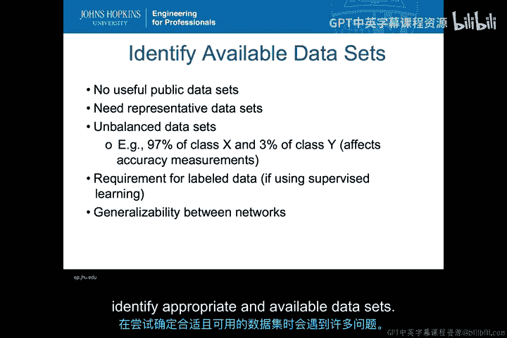

你使用的算法能否识别流之间的关系？它是否应该能够识别流之间的关系？还是应该将所有事物视为完全独立的？

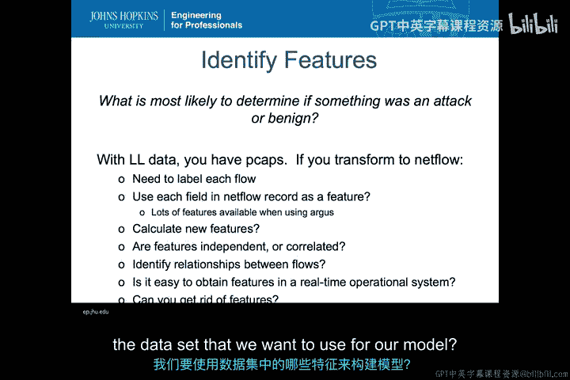

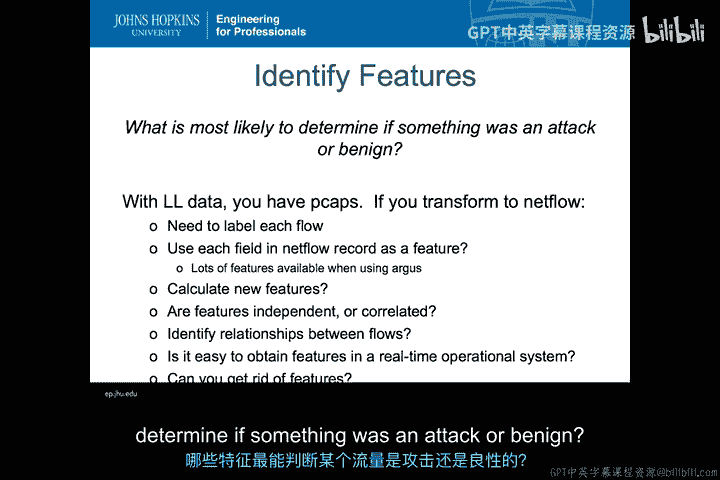

在实时操作系统中获取特征是否容易？例如，如果你正在计算NetFlow记录，对于机器学习算法来说，数据量可能更小，但生成网络流记录需要一段时间，因为你必须等到整个流开始和结束。因此，在你实际能够进行想要的分析之前，可能有一段很长的时间。

另一个问题是，如果你试图计算新特征，例如，你能以多快的速度完成这些计算？

最后，**你能去掉一些特征吗**？这就是我之前提到的**降维**。很可能你不想使用所有可用的特征。那么，是否存在你不需要的特征？有不同的统计技术可以确定，一旦你有了模型，哪些特征实际上没有贡献，从而可以移除这些特征并重新训练。

---

## 数据清洗

我之前还提到需要**清洗数据**。这是什么意思？

数据并不总是完美的。通常它存在问题。数据中可能存在**重复项**。有时系统可能出现小故障，产生了两个相同的东西。可能存在**缺失数据**。例如，你可能有一个完整的NetFlow记录，但由于某种原因源端口缺失了。你如何处理这些缺失数据？数据可能被**错误输入**。如果你使用的不是像NetFlow这样生成的数据，而是由人工输入的数据，例如，有人输入“M”而不是“Male”。如果你期望在每一行看到“Male”或“Female”，却看到了“M”，算法该如何处理？你应该做的不是让算法去处理，而是提前清洗数据，确保所有内容实际上是一致的，你已经处理了缺失数据并移除了任何重复项。

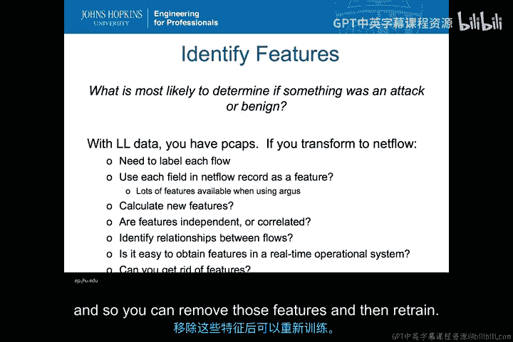

RapidMiner（我们将在作业中使用）有一个关于数据准备的非常好的培训视频。如果你访问他们的培训视频网站，寻找关于数据准备的视频，它会详细讨论清洗数据需要做什么，以及它具备的一些相关功能。

---

## 选择算法

现在，**选择你的算法**。我猜你以为我们在上一讲已经完成了这一步。嗯，不完全是。

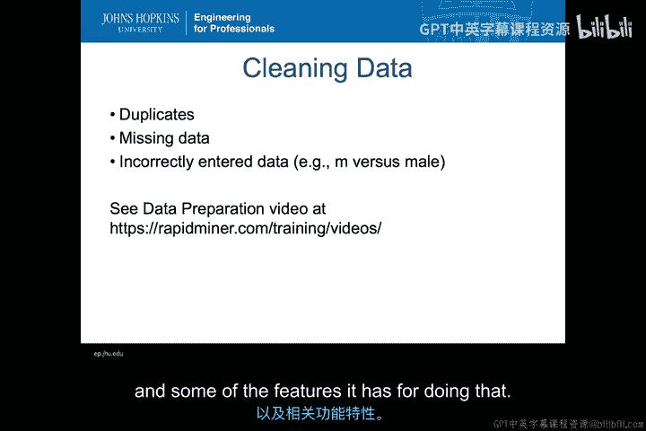

第一个问题实际上是：你是在尝试解决**分类**、**聚类**还是**回归**问题？我基本上说过，如果你在做入侵检测，很可能是在做分类问题。

但除此之外，选择使用什么算法还需要知道什么？

你的算法性能将取决于**应用和实现**。你希望有一个性能非常好的算法，不仅是在准确性方面（我在本幻灯片中也提到了），还包括速度方面。例如，你可能已经注意到，Snort在相同网络流量上运行两次时，并不总是得到相同的结果。这可能是因为Snort实际上因为无法跟上所需的处理速度而丢包了。那么，你能找到一个简单、快速运行且开销不大的算法吗？

与此相关的是**算法复杂度**。本质上，你能有一个在**O(n)** 线性时间内运行的算法吗？例如，而不是在**O(n²)** 时间内运行。你能拥有的最快算法是什么？

你希望你的算法是**流式处理**还是**离线处理**？特别是在训练阶段，最初你可能使用离线算法进行训练，然后获取模型并确保该模型可以用于流式处理方法，即边读取流过的数据边给出结果。

**增量更新能力**。这实际上不是从性能角度更新算法，而是说我的数据已经改变，我需要随之改变。因此，你可能会开始看到一些以前没见过的东西，或者代表攻击的略有不同的特征，而你的模型没有正确建模。有没有办法更新你的模型，使其能够随着时间的推移持续训练，同时还能给出结果？这样，随着时间的推移，即使数据分布发生变化，你的模型也能适应。

**混合方法**。你也可以采用混合方法，不是只使用一种算法，而是结合多种算法以获得更好的结果。

你的算法的**可解释性**如何？从某种意义上说，例如，如果你使用神经网络，你只会说某物是攻击或正常。但是，为什么？为什么某物被标记为攻击或正常？有没有办法设置你的算法，使其能够向用户解释：“我认为这是攻击，原因如下……”？

当然，最后是**准确性**。你希望你的算法在检测攻击方面具有非常高的准确性，同时具有较低的误报率，这样你就不会让系统管理员疲于处理大量误报。

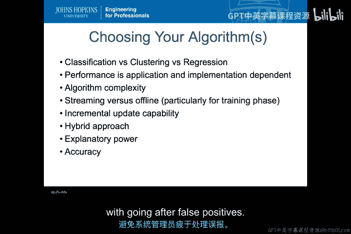

---

## 测试模型

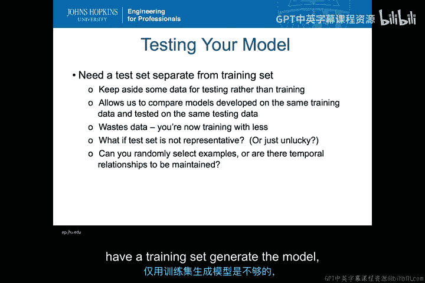

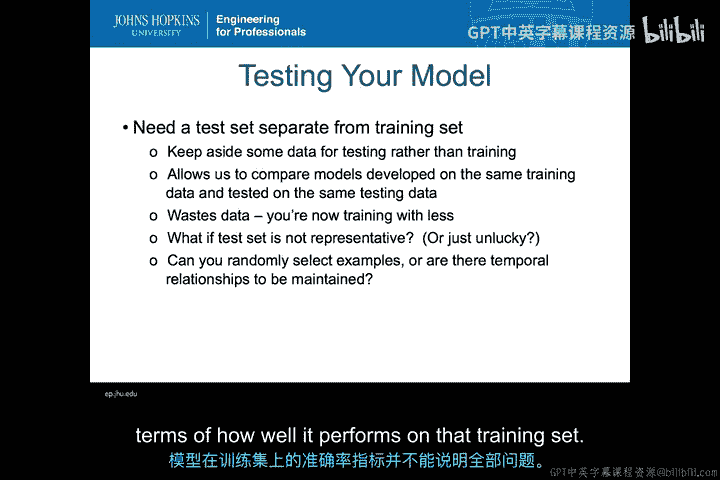

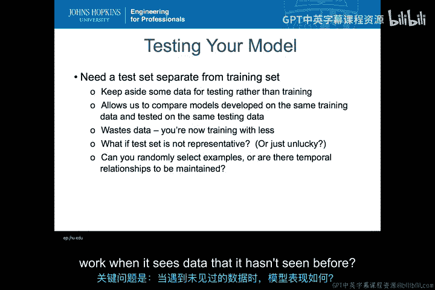

现在我们已经训练了模型，我们必须**测试**模型。

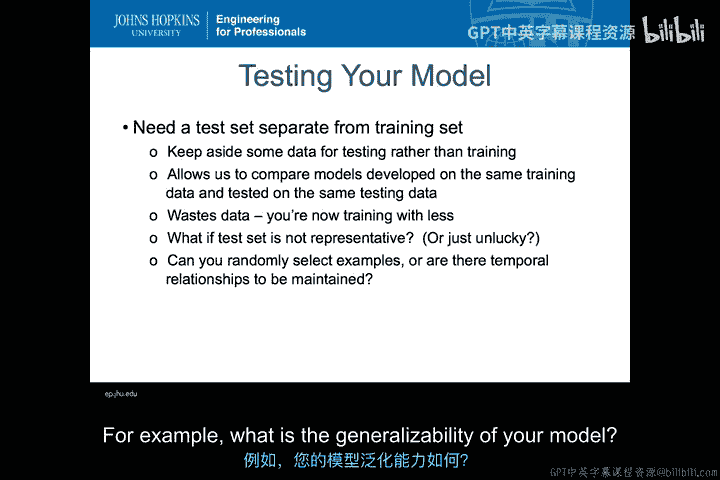

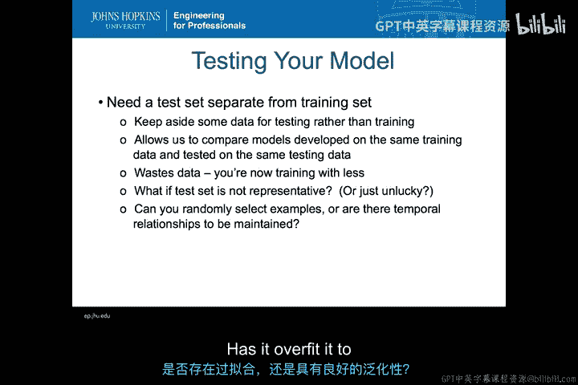

我们需要一个与训练集**分开的测试集**。仅仅使用训练集生成模型，然后让模型在该训练集上给出准确率读数是不够的。问题是，当它看到以前未见过的数据时，它的实际表现如何？这就是模型的**泛化能力**：它是**过拟合**了已有的数据，还是具有**泛化性**？

因此，你要做的是确保留出一些数据用于测试，而不是将所有数据都用于训练。

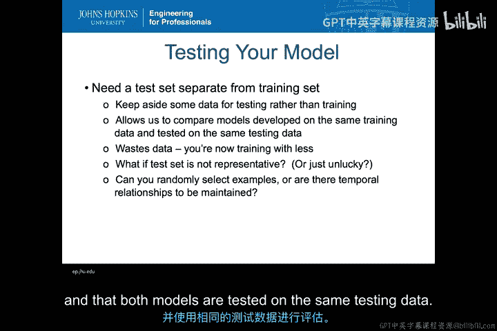

如果你试图比较几个不同的模型，你还需要确保在比较这些模型时，在所有情况下（或N个模型的情况下）使用相同的训练和测试数据，以确保比较是公平的。你要确保两个模型都在相同的训练数据上开发，并且都在相同的测试数据上进行测试。

然而，问题在于，从某种意义上说，这会**浪费数据**。我的意思是，你现在用更少的数据进行训练。如果我有100个样本可以用于训练，但需要留出20个用于测试，那么我可能只用80个样本进行训练，用20个进行测试。这样你就“浪费”了那20个样本，因为你将它们用于测试，而如果用于训练，它们本可以改进你的模型。因此，这里也存在一个平衡。

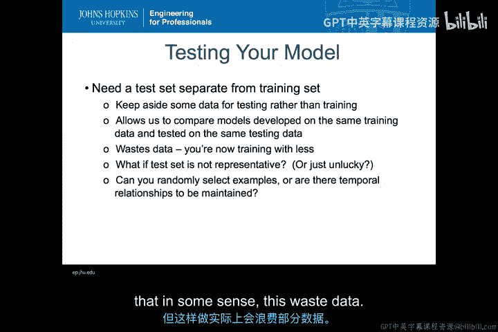

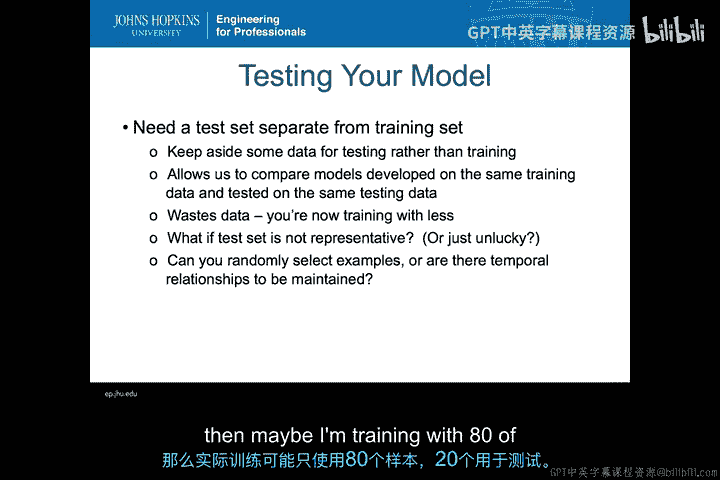

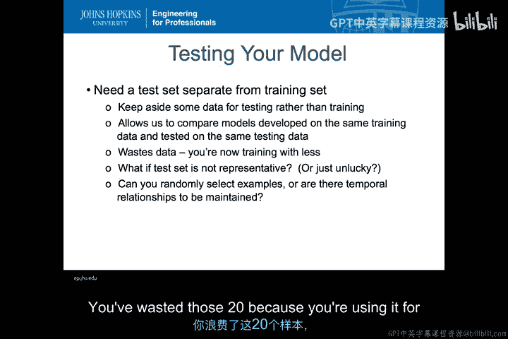

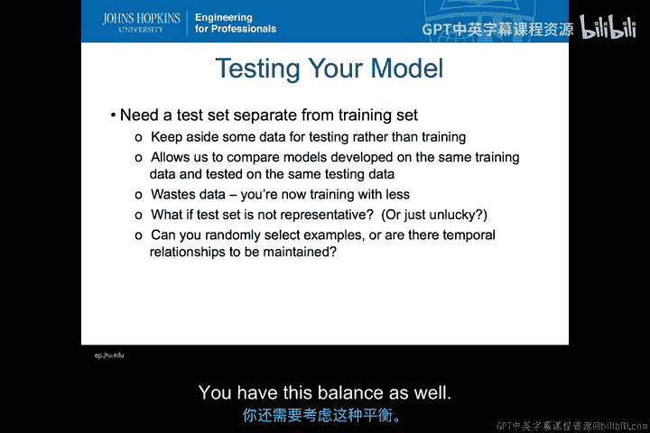

接下来的问题是，如果你的测试集**不具有代表性**怎么办？假设你从100个例子中随机选择20个作为测试集。如果你碰巧生成的测试集实际上并不具有广泛的代表性，而你只是运气不好，选择了一个要么显示你的算法特别好，要么显示你的算法特别差的测试集，那会怎样？

另一个问题是，你能像我刚才提到的那样随机选择例子吗？还是需要保持**时间关系**？你究竟应该如何从训练集中选择测试集？

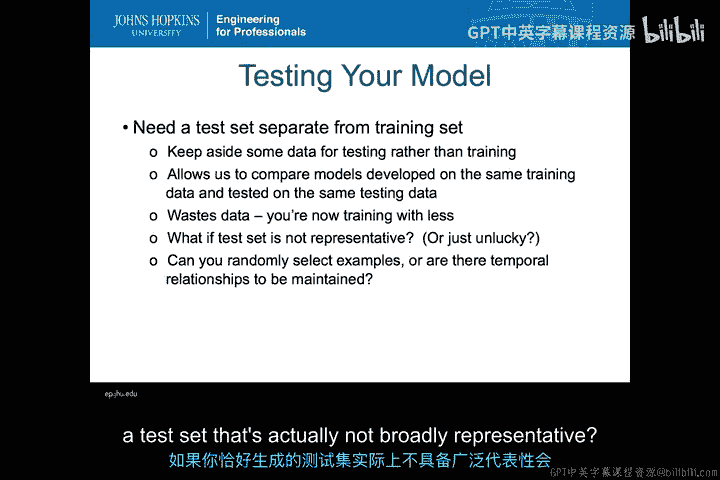

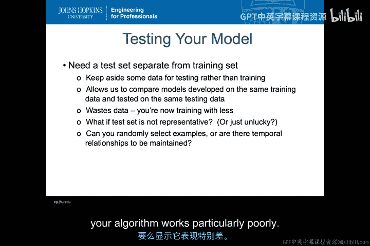

---

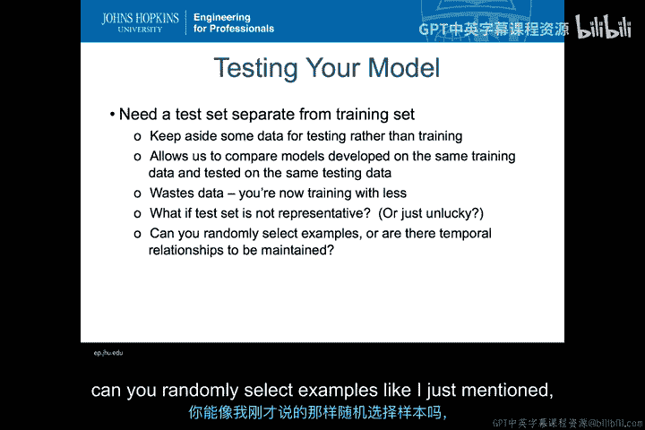

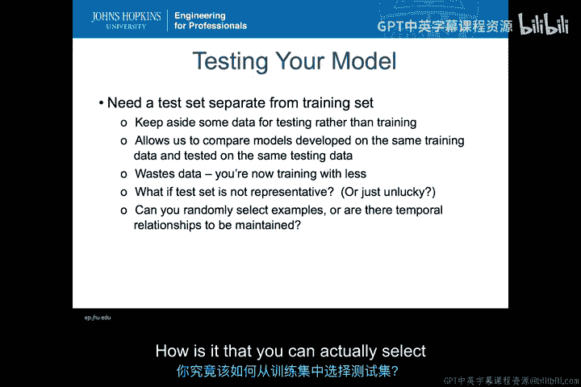

## 交叉验证

测试中使用的一种试图解决其中一些问题的方法叫做**交叉验证**。

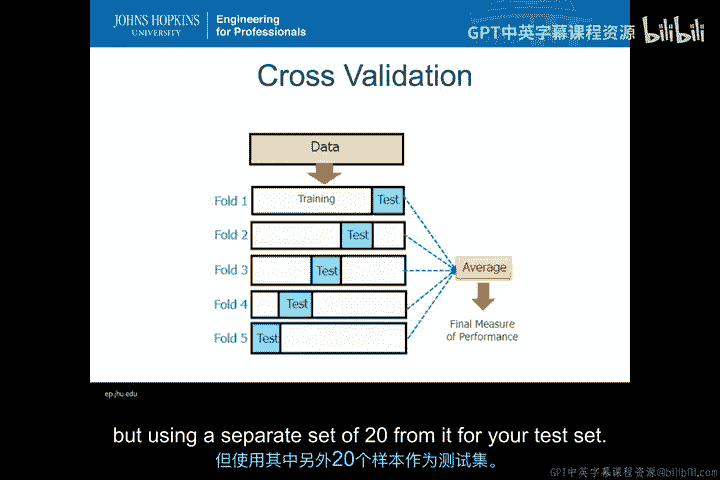

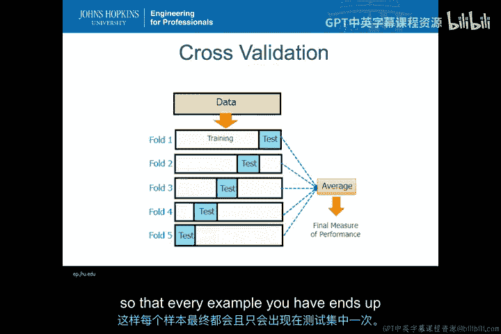

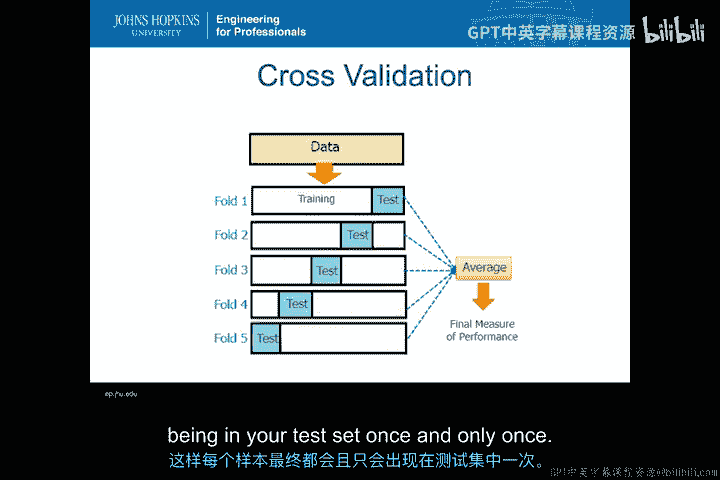

假设你有一个包含100个示例的数据集。你要做的是取一个包含80个示例的集合，然后取20个作为测试集。然后你会有所谓的**第二折**，即使用另一组20个示例作为测试集，同样地，进行第三折、第四折和第五折。这样，你拥有的每个示例最终都会在测试集中出现一次且仅一次。

在这种情况下，这被称为**五折交叉验证**。这意味着你将训练你的模型五次：第一次，你将在第一折可用的训练集上训练，然后测试；然后你将使用第二折的训练数据重新训练模型，然后测试；同样进行第三、四、五折。然后，你对所有这些结果取平均值，作为最终的性能度量。

我们发现，通常这是确定模型在实际检测（在我们的案例中是正常流量与攻击流量）方面表现如何的非常好的方法。最常见的是**十折交叉验证**。人们倾向于创建十折，然后运行10次模型的训练步骤和测试集，并平均这些结果。另一个常用的方法是**留一法交叉验证**，这几乎就是它听起来的样子：你训练除一个示例外的所有数据，并在该示例上测试；然后你训练除另一个不同示例外的所有数据，并在该示例上测试，对你的所有不同示例都这样做。这样做的缺点当然是需要花费很长时间，这就是为什么人们倾向于使用更少的折数，例如交叉验证中的十折。

因此，当试图确定一个模型（特别是机器学习模型）的工作效果时，无论是在入侵检测环境还是其他环境中，这是一种常用的方法。

---

## 总结

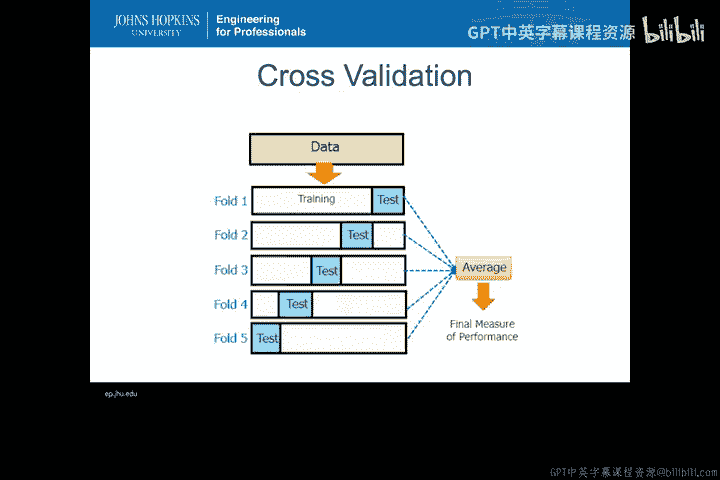

本节课中，我们一起学习了将机器学习应用于入侵检测的完整流程。我们从定义问题开始，探讨了寻找合适数据集的巨大挑战，特别是带标签和代表性数据的稀缺性。接着，我们讨论了如何从数据中确定和选择有效的特征，以及数据清洗的重要性。然后，我们深入研究了选择算法时需要考虑的多个维度，包括性能、速度、复杂度和可解释性。最后，我们重点介绍了模型测试的关键性，以及如何使用交叉验证来更可靠地评估模型的泛化能力，避免过拟合。记住，构建一个有效的入侵检测系统是一个迭代且严谨的过程，每个步骤都至关重要。在接下来的作业中，我们将实际应用这些概念，亲身体验整个过程是如何运作的，以及其中可能遇到的陷阱。