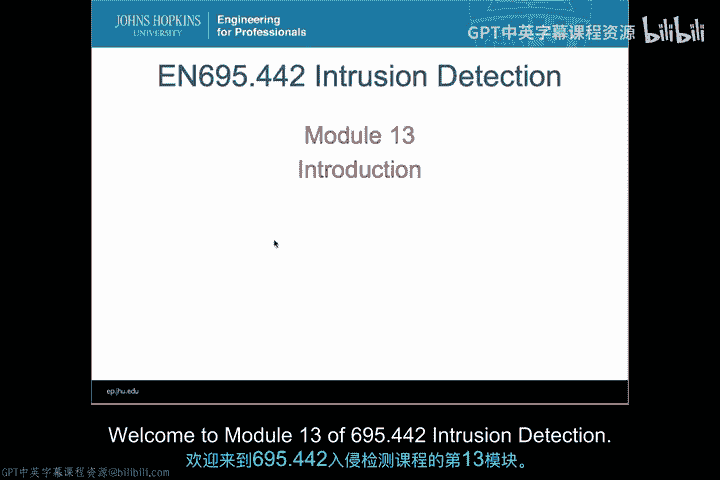
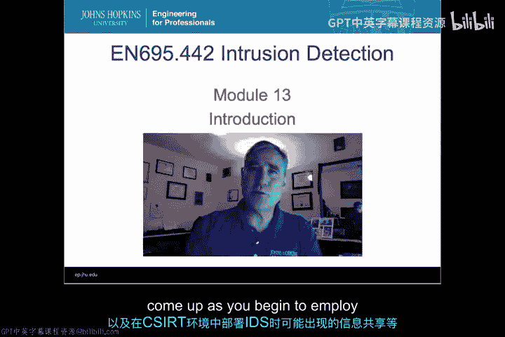
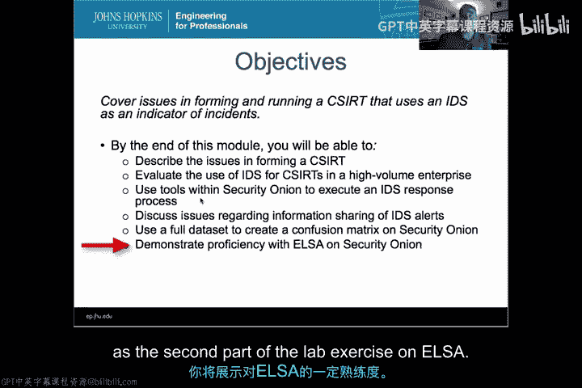
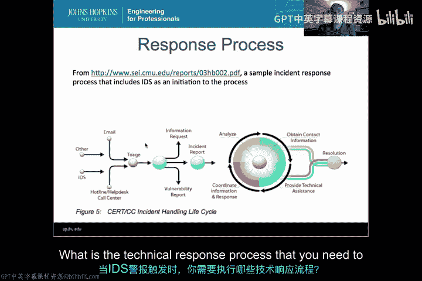

# 059：CSIRT导论 🚨

在本节课中，我们将要学习计算机安全事件响应团队（CSIRT）的相关知识。我们将探讨如何组建和运行一个CSIRT，特别是如何将入侵检测系统（IDS）作为事件指标整合到其工作流程中。课程将涵盖团队组建、技术响应流程以及信息共享等核心议题。

---

上一模块我们讨论了在CSIRT环境中使用IDS的技术挑战。本节中，我们来看看CSIRT本身。

首先，我们来谈谈本模块的学习目标。

以下是本模块将涵盖的核心内容：
*   描述组建CSIRT时出现的问题，特别是围绕使用IDS的CSIRT流程所产生的问题。
*   评估在高流量环境中为CSIRT使用IDS的情况。
*   使用Security Onion中的工具来执行IDS响应流程。
*   讨论关于共享IDS警报信息的问题。
*   使用之前的数据集在Security Onion上生成对比报告，比较不同的IDS。
*   在实验练习中，展示对ELSA的熟练使用。

---

接下来，我们将具体讨论如何组建一个CSIRT团队。

我们将探讨一些超越上模块所谈内容的问题，并更详细地了解CSIRT应具备的权限、可组建的CSIRT组织类型以及可供选择的不同方案。

---

上一节我们介绍了响应流程中的人为因素。本节中，我们从技术角度来看看响应流程。

当IDS警报触发时，你需要执行的技术响应流程是什么。

---

然后，我们将有一个关于信息共享的视频。

我们将探讨共享IDS收集的数据以及其他事件报告所涉及的问题，包括在本地、全球以及行业内部共享的不同选择。随着此类信息越来越多，其全球共享的价值日益凸显，我们也将了解当前全球信息共享的发展方式。

在本模块中，你将重新回到响应事件的技术层面，并学习如何具体使用你的IDS来响应这些事件。

---

本节课中，我们一起学习了CSIRT的基本概念、组建要点、技术响应流程以及信息共享的重要性。这些知识为你在实际环境中有效整合和运用IDS进行安全事件响应奠定了基础。