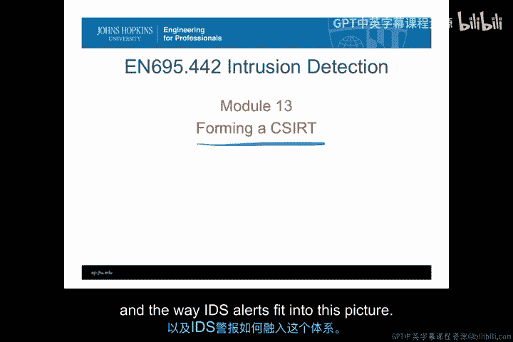
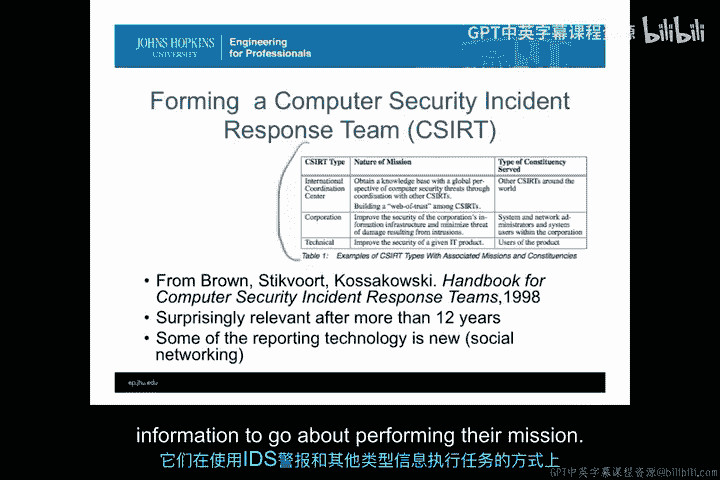
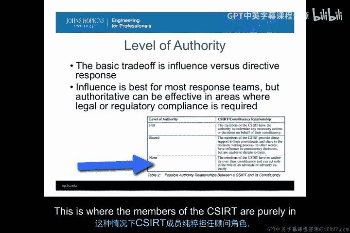
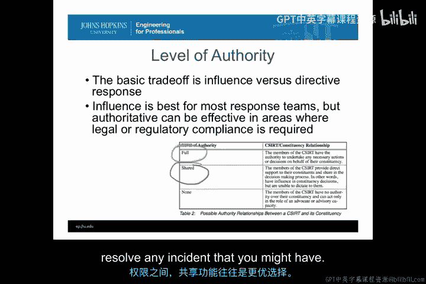
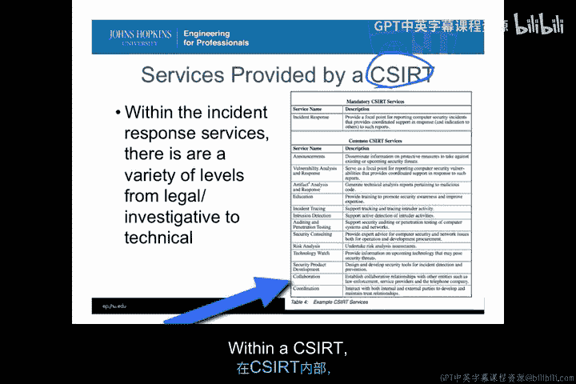
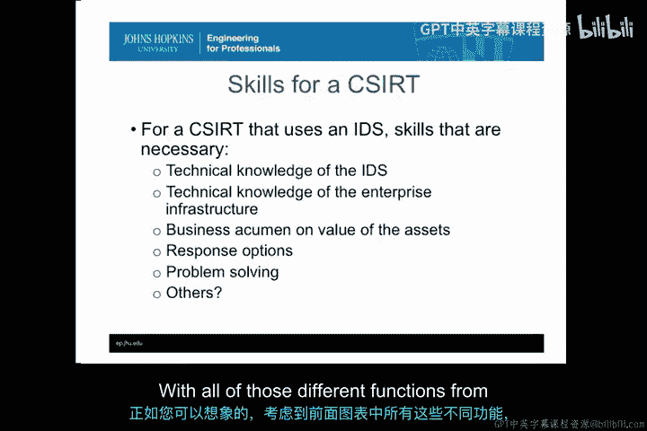
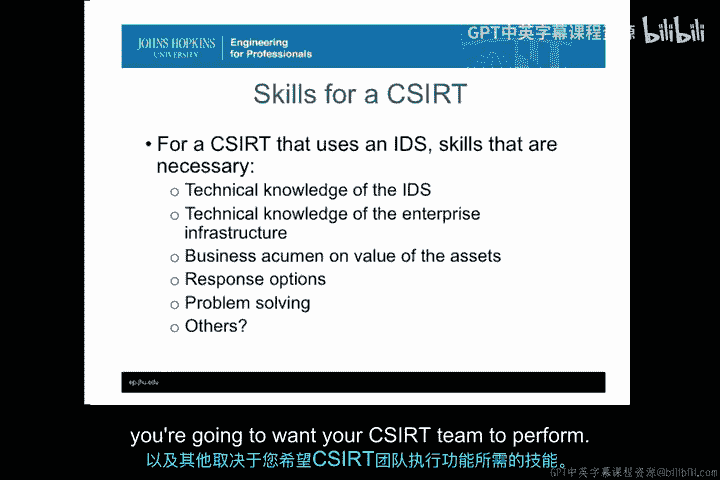
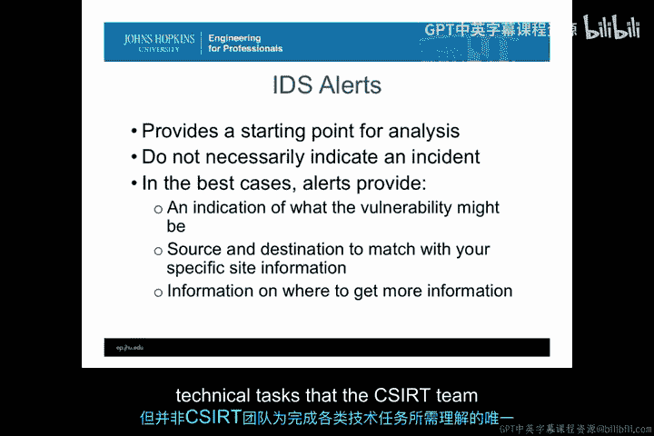

# 060：组建计算机安全应急响应组(CSIRT) 🛡️

在本节课中，我们将深入探讨组建计算机安全应急响应组（CSIRT）的技术细节。我们将了解组建CSIRT的不同选项、历史上CSIRT的组建方式，以及在大型组织中CSIRT可以执行的各种功能。课程将涵盖CSIRT的权限级别、功能、提供的服务、所需技能、其动态运作特性，以及入侵检测系统（IDS）警报如何融入这一体系。

## CSIRT的类型 🌐

上一节我们介绍了CSIRT的基本概念，本节中我们来看看CSIRT的不同类型。根据其服务范围和目标，CSIRT主要可以分为三种基本类型。

以下是三种主要的CSIRT类型：

*   **国际协调中心**：这类CSIRT在全球范围内运作，在国家或国际层面进行协调。例如，美国CERT/CC就属于此类。它们没有特定的组织或服务对象，而是拥有广泛的、能够以可信方式向其报告信息的组织网络。这类中心运作的核心是**信任**。它们必须能够保密接收到的信息，并向其服务范围内的成员提供预警，同时在不暴露其成员敏感信息的前提下与其他国际CSIRT团队共享情报。

*   **企业/组织CSIRT**：这类CSIRT直接隶属于公司、企业或其他独立实体，其使命是**改善企业信息基础设施的安全并降低风险**。这是目前最常见的一种CSIRT类型。它们为组织内部的系统和网络管理员提供支持，可以是建议性的，也可以是直接性的。它们还负责将组织底层的安全信息向上传递至管理层。

*   **技术产品CSIRT**：这类团队通常直接与某个特定的产品（开源或商业）相关联，服务于该产品的用户。例如，微软的响应团队就属于此类。它们的职责不是保护微软公司内部的IT网络，而是响应其特定IT产品（如Windows、Word）中的各种安全问题。几乎所有主要的IT技术产品都有此类响应团队，负责处理报告的漏洞、错误等，以持续提升产品安全性。

这三种类型代表了CSIRT在组织形式上的完整谱系。它们在使用IDS警报和其他信息执行任务的方式上存在差异。

## CSIRT的权限级别 ⚖️

了解了CSIRT的类型后，接下来我们需要探讨组建CSIRT时的一个基本权衡点：**权限级别**。CSIRT团队将拥有多大的权力？

这里的核心权衡在于 **“影响力”** 与 **“指令性响应”** 之间。

*   **影响力**：意味着CSIRT团队提供建议、指导，甚至是具体的技术步骤。
*   **指令性响应**：则意味着政策被更改，相关方必须在规定时间内执行CSIRT团队的指令。

在这两者之间也存在一些中间状态，例如CSIRT可以影响那些真正拥有指令权限的部门去制定新政策。

从历史经验来看，对于响应团队而言，**影响力模式通常更佳**，因为它往往能赢得更多信任。而信任是CSIRT成功运作、获取IDS之外直接报告的必要条件。

以下是几种常见的权限级别：

*   **完全权限**：CSIRT成员拥有代表其服务对象采取任何必要行动的完全权力。这在网络CSIRT团队中较为常见，他们可以更改任何网络配置。
*   **共享权限**：CSIRT成员可以提供直接支持并施加影响力，但通常需要通过中介或政策代表来执行指令，以强制系统进行更改。我们称之为共享权限，因为CSIRT团队定义行动方案，但不具备强制执行的权力。
*   **无权限（纯咨询角色）**：CSIRT成员纯粹扮演顾问角色。这在一些集体性的CERT（如CERT/CC）中很常见，他们发布建议和信息，但无法强制任何人进行更改。

在这三种权限级别之间，存在一个权衡：**信任程度** 与 **基于CSIRT所学事件信息所能获得的快速保护能力** 之间的权衡。

拥有完全权限可以实现最快的响应加速，但需要其他领域管理员的合作。因此，在建立信任以改善系统安全与行使权力以快速解决事件之间，**共享权限模式往往是更优的选择**。

## CSIRT提供的服务 📋

明确了权限级别后，我们来看看CSIRT具体能提供哪些服务。根据CSIRT的组建类型，其提供的服务范围非常广泛。

基本上，只有一项服务是强制性的，这也是事件响应团队的核心：

*   **事件响应服务**：为报告计算机安全事件提供一个联络点，并在响应过程中提供协调支持，向相关方通报事件报告情况。这是构成一个事件响应团队的根本。事件可能来自服务对象、外部实体或IDS系统。

然而，为了达成更广泛的使命，CSIRT可能提供许多其他服务：

*   **公告与发布**：向服务对象发布信息，传播防护措施。这是希望服务对象遵循的建议，以帮助他们恢复、预防或处理正在发生的事件。
*   **漏洞分析与响应**：当收到可能存在事件的迹象时，分析被利用的漏洞，并以此为基础制定缓解措施，提升组织安全。这通常涉及CSIRT内部一个专门负责逆向分析恶意软件和理解漏洞的技术团队。
*   **恶意软件（攻击样本）分析与响应**：专门处理如何逆向分析可能出现的恶意软件。这项专业技能非常稀缺，但将其组织上置于CSIRT内部，可以实现事件迹象、恶意软件逆向分析和CSIRT启动的恢复流程之间的紧密衔接。
*   **教育与培训**：通过培训和教育建立与服务对象的信任，帮助他们在事件发生时成为良好的利益相关者，并提升整个组织的专业技能，确保在事件响应中使用共同语言。
*   **事件溯源**：尝试追踪入侵者活动至源头，找出责任人。这需要CSIRT与调查人员合作，以了解事件的根本原因。
*   **入侵检测支持**：支持IDS系统本身。虽然不要求IDS支持必须放在CSIRT内，但CSIRT团队深度参与入侵检测/防御软件的部署和配置非常有价值，因为来自这些系统的警报是启动CSIRT流程的起点。
*   **审计与渗透测试**：在事件发生前主动寻找可能发生事件的地方，通过渗透测试确定基础设施的薄弱环节。这既能加强基础设施，也能让CSIRT在事件发生时预知组织的弱点所在。
*   **安全咨询**：由于CSIRT团队通常会成为组织内最好的安全专家，让他们就安全和网络问题提供专家建议是发挥其才能的好方法。
*   **风险分析**：在CSIRT团队内部进行风险分析，是最大化利用团队经验的好方法。
*   **技术瞭望**：努力让CSIRT团队了解最新技术，理解其如何改变安全威胁。这既有助于CSIRT自身的事件响应，也有助于组织在部署新技术时进行风险缓解。
*   **安全产品开发**：当CSIRT的运营人员与安全工具、事件检测的IT开发人员协同工作时，这一点尤其有价值。IT领域的DevOps理念会将其视为一项要求，以便运营和开发人员能够根据CSIRT所经历的事件环境变化，快速调整和适应安全产品。
*   **协作与协调**：与组织内部和外部的其他响应团队进行协作与协调。虽然这不一定是必需服务，但当组织需要与其他组织合作解决事件时，CSIRT内部的协作与协调就变得非常必要。

## CSIRT所需的技能 🧠

考虑到上一节提到的众多功能，可以想象，要找到具备所有所需技能的人员非常困难。这些技能很难在单一个体身上找到，甚至作为一个团队来招聘也很困难。

因此，CSIRT团队通常需要通过培训、教育和在职学习，在内部培养这些技能。

以下是CSIRT所需的一些核心技能：

*   **IDS技术知识**：理解警报，并知道如何执行由IDS/IPS警报启动的事件响应流程。
*   **企业基础设施技术知识**：能够评估事件的范围，并正确判断该事件是否重要到需要响应。
*   **商业头脑**：了解资产的价值，理解事件和迹象在组织内发生的背景，以便确定优先级并采取适当的响应措施。
*   **多种响应方案知识**：熟悉针对给定事件可能采取的多种不同响应方式（如阻断、关闭服务、调整服务、转移攻击、设置蜜罐等）。
*   **强大的问题解决能力**：这是一项通用的、几乎在任何地方都需要的职业技能。

此外，根据你希望CSIRT团队执行的具体功能，可能还需要其他专业技能，例如**逆向工程技能、汇编语言技能、恶意软件分析技能、大数据处理技能**等。

## CSIRT的动态特性 🔄

CSIRT团队从来不是静态的。与我们在本课程中讨论的许多其他事物一样，CSIRT不是你一次性创建就可以放任不管的。

在确定如何处理突发情况、事件频率和严重性的增减、组织变化与增长时，需要考虑许多因素，这些因素都会影响CSIRT的性质。

以下是一些影响CSIRT动态特性的因素：

*   **事件发生率**：难以预测，导致CSIRT经常会经历资源过剩或不足的时期。这在处理误报和减少系统内第一类错误时尤其相关。
*   **攻击技术演进**：入侵者不断发明新方法，攻击技术日益精进。因此，报告给CSIRT的事件类型和复杂性会随时间变化。组建CSIRT时的技能可能不足以应对新的攻击方法。
*   **技术进步**：不仅仅是攻击技术，防御技术本身也在进步。CSIRT必须具备技术专长以跟上移动计算、云计算、物联网等新技术的步伐。
*   **法律法规变化**：在许多国家，不断制定和变化的法律法规明确规定了CSIRT可以做什么、不可以做什么，特别是关于隐私、网络数据收集等方面的法律。
*   **其他业务需求**：经常会出现CSIRT资源被其他紧急业务需求占用的情况。在将CSIRT专长应用于其他业务需求与在事件响应中需要其专长之间取得平衡，始终会影响CSIRT的动态运作。

在所有情况下，请记住：**IDS警报始终只是分析的起点，它们从未完成分析**。是CSIRT的技能、权限和组织能力真正开始解决事件。

因此，虽然IDS警报提供了起点，但它们并不一定意味着发生了事件（可能是误报，也可能对组织不重要）。在最佳情况下，警报能提供关于**漏洞、攻击源和目的地的信息**，以便CSIRT据此确定适当的响应范围，并获取更多信息，从而将警报与CSIRT内部的技能和组织职能联系起来，以管理已创建的各项功能。

## 总结 📝

本节课中，我们一起学习了组建计算机安全应急响应组（CSIRT）所涉及的技术问题、所需技能和能力以及技术要求。我们看到，了解IDS和IDS系统的知识固然重要，但这并不是CSIRT团队为了完成其可能承担的广泛技术任务而需要理解的唯一内容。CSIRT的成功运作还依赖于明确的类型定位、恰当的权限平衡、全面的服务设计、持续的技能培养以及对动态环境的适应能力。