# 061：IDS响应流程标准化 🛡️

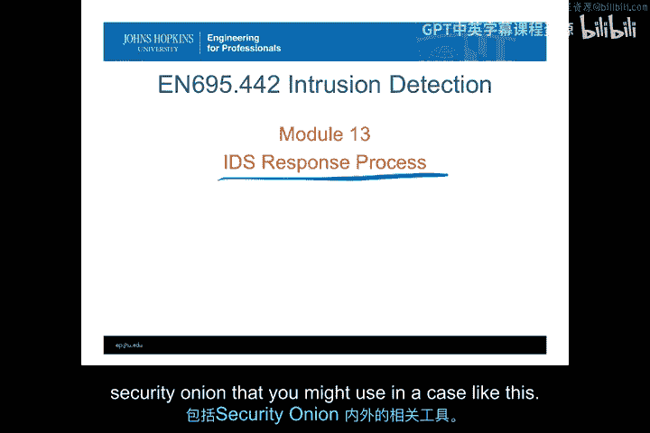

在本节课中，我们将学习一个技术性的入侵检测系统响应流程。我们将探讨当组织内部的安全响应人员收到IDS警报后，可以且应该采取哪些步骤来启动调查。课程将涵盖如何处理警报、如何确定漏洞是否存在、如何寻找支持性信息，并通过一个具体示例来演示如何解决某类警报。最后，我们将讨论事件关联、控制台以及一些在Security Onion内外可用的工具。

## 概述：从警报到响应 🚨

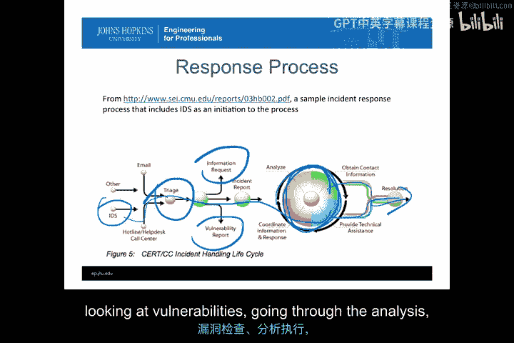

上一节我们介绍了IDS警报的分类和处理原则。本节中，我们将深入探讨一个标准化的技术响应流程。这个过程始于一个进入初步分类流程的IDS警报，随后进入分析阶段，最终目的是解决问题，提供技术援助或获取联系信息以解决事件。我们将重点讲解如何执行技术性的分类功能，包括查看信息、分析漏洞，并最终达成解决方案。

## 确定漏洞是否存在 🔍

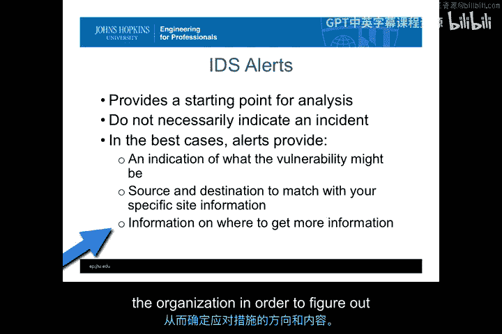

收到IDS警报后，我们首先要判断这是否是一个误报，或者是一个需要我们采取行动的真实警报。在分类过程中过早地假设其为误报，可能会导致我们错过追踪特定证据的机会，从而无法从技术上解决事件。因此，我们倾向于先采取行动进行调查。

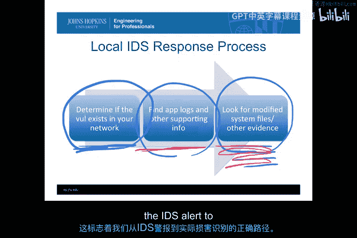

### 调整IDS规则集

为了确定系统中是否存在漏洞，我们通常需要从调整Snort（或泛指基于签名的IDS）规则集开始。以下是具体步骤：

*   **移除无关系统的警报**：如果您的组织只运行Windows和Linux系统，却收到了针对Mac系统的警报，那么这些警报很可能没有意义。通常，我们需要调低那些针对我们未运行的操作系统（例如，在Windows系统中看到Unix风格的警报）的警报级别。
*   **谨慎处理不确定的警报**：如果您不确定某个警报是否相关，应暂时保留它。但在处理了多起类似事件并确认它们并非真实事件后，应尽可能将其从规则集中移除。

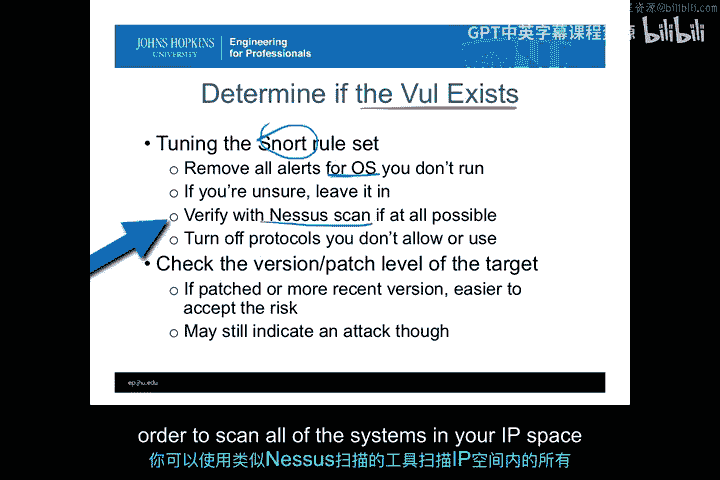

### 验证漏洞存在

您可以使用类似Nessus的扫描工具，扫描您IP地址空间内的所有系统，以了解漏洞所在的位置，以及哪些系统和攻击面正在被传入的规则集所警报。

### 关闭不必要的协议和服务

除了调整规则集，您还应关闭不允许或不使用的协议。例如：

*   **关闭未使用的端口**：如果您的组织内部没有支持端口25（SMTP）的系统（因为已有邮件网关），那么就不应该让端口25的流量进入您的网络。
*   **精简服务器软件**：服务器通常运行特定的软件。如果不在服务器上进行开发，就没有理由在服务器上保留编译器、各种编辑工具或其他不必要的服务。应尽可能关闭和移除这些服务，这有助于减少来自IDS的虚假警报。

### 检查目标系统的补丁和版本

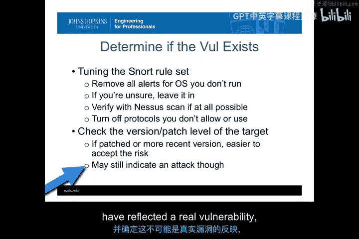

您需要检查警报目标系统的补丁和版本号。如果警报所针对的漏洞在目标系统的当前补丁级别上并不存在，那么这很可能是一个误报，可以将其从系统中排除。

**注意**：仅仅因为版本号不匹配，并不意味着这不是一次真实的攻击。它仍然可能是一次真实的攻击尝试。除非您非常确定目标的版本和补丁级别，并且知道该漏洞不可能存在，否则仍应保持保守态度，进行调查。

## 寻找支持性信息 📊

一旦确定目标系统存在漏洞，并且攻击是针对受支持的操作系统，接下来就需要了解攻击的范围和规模。这通常意味着对目标进行某种取证，使用其他工具和日志文件来寻找IDS警报之外的支持性信息。

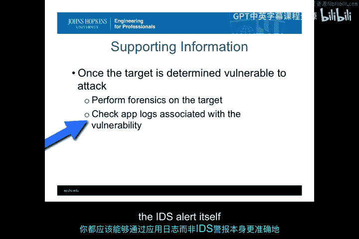

### 检查应用日志

您需要检查与漏洞相关的应用程序日志。与受攻击主机上漏洞相关的应用程序日志，更有可能提供关于具体哪些内容受到影响（是完整性攻击还是机密性攻击）的详细信息。这比IDS警报本身更能说明问题。

### 监控被修改系统的活动

有时，您可能没有详细的应用程序日志。这时，您需要监控被攻击系统的活动，寻找可疑行为。例如：

*   **异常出站流量**：如果一台历史从未有端口25活动的主机，突然开始发出大量加密流量，这很可能表明系统信息被收集并以加密形式外传。
*   **横向移动**：监控受攻击主机与基础设施内其他受信任主机之间的活动。如果发现攻击主机与其他主机有通信，这可以帮助您了解攻击可能波及的系统范围。这对于自我传播的恶意软件尤其重要。

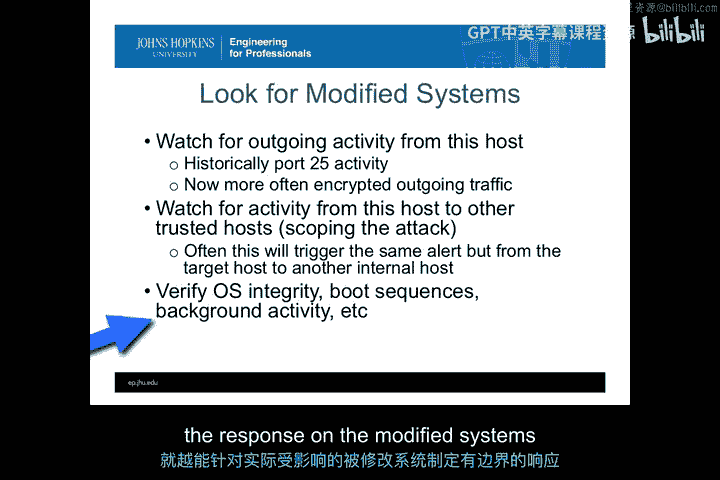

### 捕获和分析恶意软件

如果能捕获恶意软件并进行逆向工程，您就能确切知道攻击对目标机器造成了哪些影响。这可以极大地加快您对系统中该恶意软件的响应速度。否则，您必须做最坏的打算，假设操作系统的任何部分（如启动序列、后台活动或进程）都可能受到了影响。

您捕获的攻击活动越多，对其细节了解得越深入，就越能限定对实际受影响系统的响应范围。

## 示例：NFS Mount攻击调查 🧪

现在，我们通过一个具体示例来演练上述步骤。假设我们使用Snort作为IDS，收到一个警报，目标是Solaris主机上的端口映射器（Port Mapper）。这立即引发了一个问题：这可能是来自外部的NFS Mount攻击吗？

### 分析警报

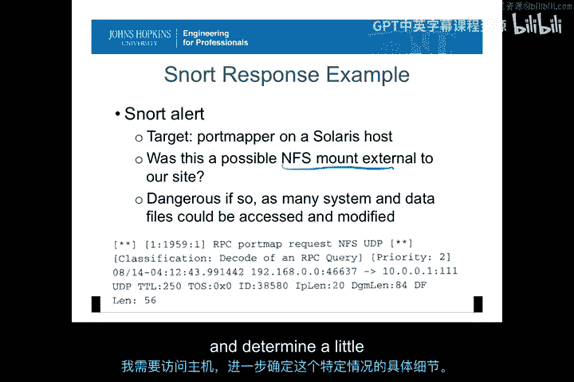

如果假设这是一次针对我们系统的NFS Mount攻击，其危险性可能很高，因为攻击者可以访问和修改各种系统及数据文件。以下是相关的Snort警报信息：

*   **警报内容**：RPC portmap request, NFS UDP
*   **优先级**：2
*   **源地址**：组织外部
*   **目标地址**：组织内部

仅从这个警报数据，我们无法立即判断这次NFS Mount攻击是否成功。Snort告诉我们这是一次尝试，但未指明结果。

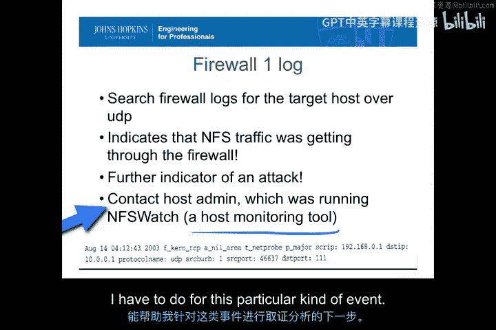

### 验证防火墙日志

第一步是确认这次攻击是否真的通过了防火墙到达了目标主机。我们可以根据Snort警报中的信息（UDP协议、源/目标地址）搜索防火墙日志。如果能在防火墙日志中找到完全匹配的记录，就证实了这是一次从外部到内部的攻击尝试。

### 检查主机日志

接下来，我们需要联系主机管理员，检查主机上是否有相关的监控日志。幸运的是，系统管理员运行了一个名为`NFSwatch`的工具，它可以记录NFS服务器上的所有活动。

通过分析`NFSwatch`的输出，我们可以查看在警报时间点附近，是否有成功的NFS读/写或挂载操作。例如，输出可能显示有RPC授权数据包交换，但没有检测到NFS写数据包或成功的挂载操作。

### 得出结论并采取行动

在这种情况下，我们能够确定这很可能是一次探测（probe）或未成功的攻击。虽然这次没有造成数据更改，但它是一次外部探测，并引发了有价值的调查。因此，这不是一次误报。

基于此，我们可以：
1.  **锁定系统**：关闭或进一步锁定这个NFS服务器，防止未来的RPC授权探测升级为攻击。
2.  **更新防火墙规则**：修改防火墙规则，作为反馈循环的一部分，防止此类探测影响基础设施中的其他系统。
3.  **保留Snort规则**：由于这是真实事件，我们不应移除这条Snort规则。

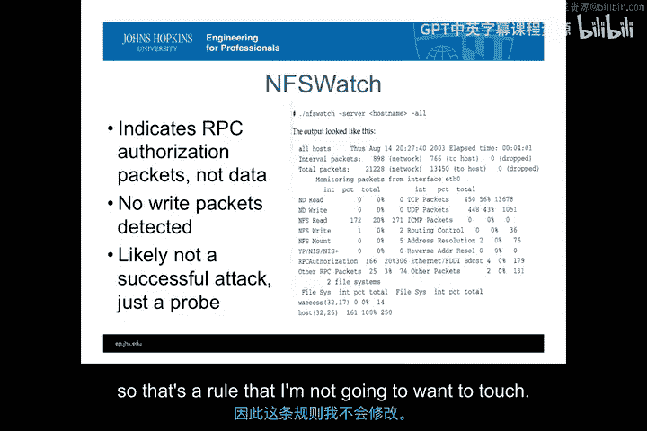

这个例子展示了如何从一个IDS警报出发，通过多种日志文件，来确定基础设施中实际发生的攻击类型和范围。

## 事件关联与自动化工具 🤖

当这类评估规模扩大时，我们立即会面临严重的事件关联问题。我们需要将数百台机器上的警报关联成单个事件，以理解攻击在整个组织内的成功范围。

幸运的是，存在自动化工具来收集和分析多个数据集。例如：

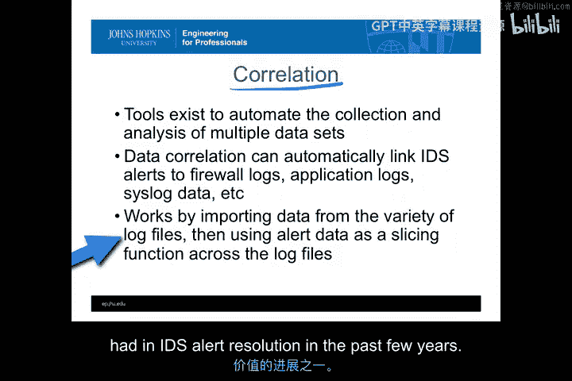

*   **Security Onion内的工具**：可以对这些警报运行分析。
*   **Splunk等工具**：可以导入来自各种日志文件的数据，然后使用警报数据作为切片函数，在所有日志文件中查找可能与某个警报相关的所有信息。这本质上是将警报作为自动化切片工具，在一个巨大的数据存储（如Hadoop风格的数据存储）中进行查询。

这是过去几年中，在IDS警报解决方面更有价值的一项进展。

### 从事件构建到事件

理论上，我们希望将所有IDS警报视为对各种事件的警报。我们需要收集这些事件，并开始将它们关联成整合的攻击。通过查看一系列未经授权的结果和所使用的恶意软件工具，我们可以推断攻击者可能的目标。

这个过程与我们之前在模块10的练习中所做的完全一致：我们查看来自IDS警报的事件，将它们组合成一系列攻击，通过取证查看未经授权的结果，试图构建一个记录，以说明攻击者是谁以及攻击目标是什么。

### 控制台工具

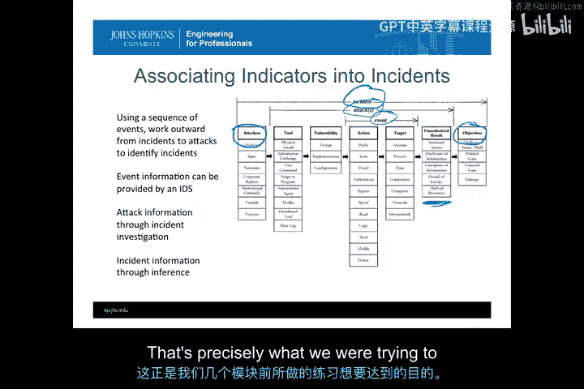

您已经见过一些有助于整合这些信息的工具，例如Snorby和OSSIM控制台。它们简化了警报信息的提取，并将其与您需要用于逆向工程攻击过程的详细数据包信息关联起来。如今，许多这类工具都是基于Web的，易于使用，并添加了分析功能（如您在使用Sguil时所见的）。

### 数据包捕获与分析

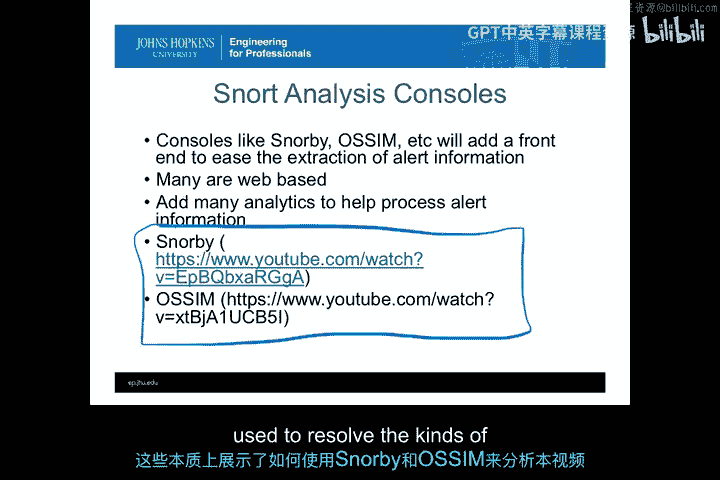

特别是在基于网络的IDS领域，它必须与某种数据包捕获和分析程序配对使用。您可以直接从事件跳转到与之相关的直接数据包捕获。有许多工具（如NetWitness）允许您重放TCP数据包，以理解应用程序内的用户活动是什么样的。这有助于您真正确定攻击的范围，并推断攻击的目标。

## 总结 📝

本节课中，我们一起学习了如何从标准的IDS警报出发，通过技术调查，最终完全解决安全事件，并可能推断出攻击者及其目标。

我们首先学习了如何确定漏洞是否存在，包括调整IDS规则集、关闭不必要的服务以及检查系统补丁。接着，我们探讨了如何寻找支持性信息，如检查应用日志、监控系统活动以及分析恶意软件。通过一个NFS Mount攻击的示例，我们完整地演练了从警报验证、日志分析到最终响应的全过程。最后，我们讨论了事件关联的重要性以及自动化工具（如Splunk、Snorby、OSSIM）和数据包分析工具在规模化、高效响应中的作用。

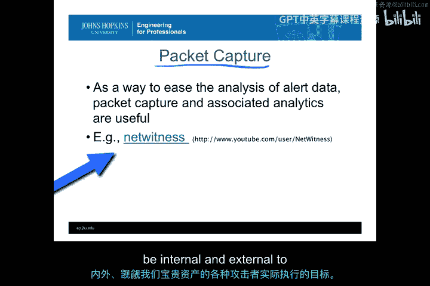

请记住，正如我们的练习和您对IDS的了解所示，这从来都不是一个简单的过程，并且完全自动化极其困难。在可预见的未来，这仍然将是一个需要大量人力和创造力的过程，我们需要根据实际观察到的活动，来推断组织内外攻击者对我们宝贵资产的真实攻击目标。