# 062：安全情报共享机制 🔐

在本节课中，我们将要学习关于入侵检测系统（IDS）警报信息共享的概念。我们将探讨共享这些数据的好处与风险，以及在实际操作中需要考虑的关键问题。

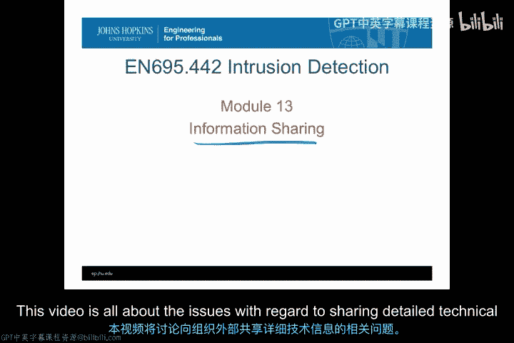

---

## 信息共享的考量因素

上一节我们介绍了信息共享的基本概念，本节中我们来看看在决定共享IDS警报或事件响应详细信息时，必须考虑的一些具体因素。

### 保密性与机密性

首要考虑的是组织信息的保密性与机密性。作为入侵响应能力一部分所收集的信息，对其他方可能具有价值，因此必须维持其机密性。

实现保密性的一种方法是尝试对数据进行匿名化或清洗，使其无法识别出具体的机密信息。然而，这种方法存在风险。例如，如果我将攻击中的目标IP地址匿名化，并赋予一个通用编号后发布信息，但保留了原始时间戳。外部人员可能将此时间戳与其他来源收集的信息结合，从而推断出我组织内实际的目标身份，甚至可能还原出载荷或相关信息。因此，仅靠匿名化不一定能完全保护信息的机密性。

即使只是团队成员的反应，也可能足以泄露部分信息。暴露信息并不一定意味着暴露了全部，有时即使只泄露一点点，也可能揭示出关键部分。例如，假设你完全没有透露任何关于某个事件的信息，只是分享了一个新漏洞或安全漏洞的存在。外界可能会推测你的组织拥有存在该漏洞的系统，并且可能并非所有系统都已打补丁。即使都已打补丁，如果我们知道存在新漏洞的系统的详细信息，或许还存在另一个针对同一系统的安全漏洞。这样，你实际上已经向外界暴露了一定程度的脆弱性。

### 信息的适当使用

在保密性之外，下一个需要考虑的问题是信息的适当使用。当信息仅对一个团队可用时，其他团队在访问该信息时，必须遵守该团队对信息使用所设定的任何限制。

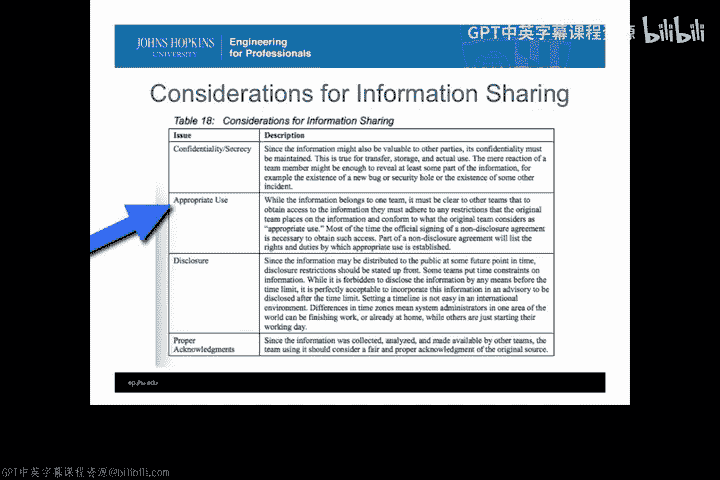

例如，如果我掌握的信息表明某些特定系统存在漏洞，但我不想承认我的系统中存在该漏洞，那么对该信息的适当使用就不能是公开该特定漏洞，即使从另一个团队的角度来看公开是有益的。这类似于查看获取此类数据所需的保密协议条款，其中明确规定了权利、义务以及在所有详细信息中“适当使用”的含义。这在非公开共享，而是与某些其他合作伙伴基于信任关系共享时尤为重要。重要的是，此类协议的所有参与方都理解获取该信息的含义，以及利用该信息为自己谋利意味着什么。

### 披露政策

与适当使用相关的是整个披露政策。由于信息可能在某个时间点向公众发布，披露限制应事先明确说明。仅仅因为某些信息向公众公开，并不意味着特定事件响应记录或IDS警报的所有细节都应该在公开时被暴露。正如我们在保密性部分讨论过的，这可能会在特定领域向公众增加信息，从而使你的站点比现在更加脆弱。

因此，这些披露政策——例如在多长时间内、由谁来决定何时公开发布信息——是需要事先确立的重要基本规则。这在漏洞披露中尤其重要。许多组织对于在向供应商、公众或某些公共漏洞列表报告之前，持有漏洞信息的时间长短有不同的政策。因此，如果你打算与其他CERT或其他类型的组织共享漏洞报告，你必须确保披露政策是同步的，以防止信息在你控制之外被发布。

### 信息来源的归属

最后，还有一个核心问题是：如何承认信息来源？在许多情况下，信息的来源更希望保持匿名，而因为另一个组织希望保持匿名就由你方来邀功，这是不公平的。因此，你必须理解正确的致谢理念，无论对方希望署名还是匿名，都不应简单地转移，让另一个组织为发布的特定类型信息邀功。

---

## 不同响应团队间的信息共享

考虑到上述问题，让我们来看看这些问题对我们之前讨论过的不同类型的响应团队意味着什么。

### 国家级CERT间的共享

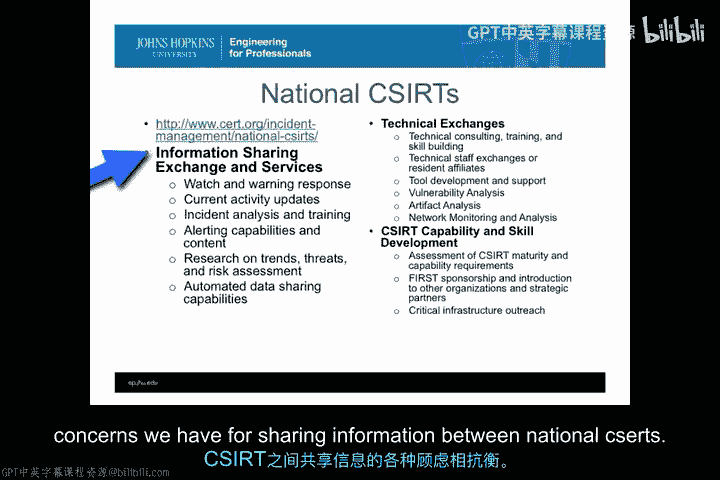

首先，我们看看国家级CERT（计算机应急响应小组）之间的共享。这些是代表世界各国的团队，例如美国的US-CERT。在这些国家之间交换信息，对于承认和应对全球网络安全威胁非常有价值。

CERT.org长期以来一直在推动国家级CERT之间的信息共享，事实上，他们举办论坛和活动，专门将国家级CERT聚集在一起进行信息共享，并尝试共享以下类别的信息：
*   监视与预警服务
*   当前活动
*   事件分析
*   警报研究
*   自动化数据共享能力

所有这些要素都是匹兹堡的CERT/CC试图在国家CERT领域内鼓励的。如果你是一个国家级CERT或代表一个国家级CERT，需要考虑的是，你是否应该参与这些技术交流。在这些交流中，你可以获得技术咨询、培训、技能建设、各种工具开发支持、额外的漏洞分析、攻击痕迹分析和网络监控分析。但作为交换，你需要以某种方式向团队外部发布一些数据，并期望这个受信任的组织团体能妥善处理。

这种类型的信息共享在国家CERT之间得到了大力推广，这可能是技术团队之间信息共享最多的领域之一。但同样，在国际社会中，政治因素偶尔会介入。不同团队对于应如何行为或处理信息的看法必然存在差异，所有这些都必须与我们之前提到的关于在国家CERT之间共享信息的任何顾虑相权衡。

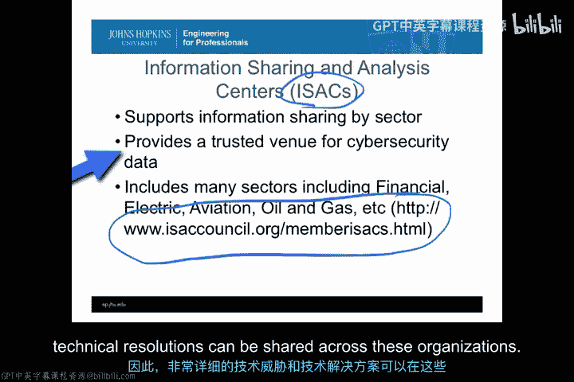

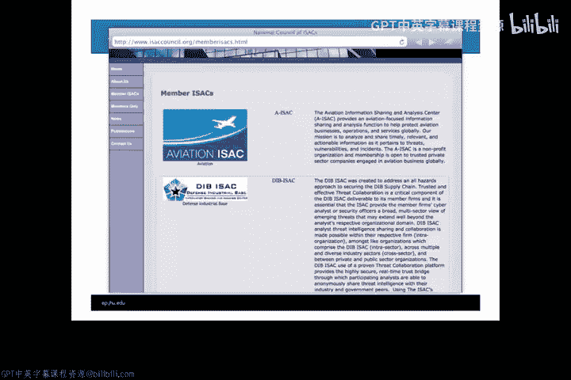

### 信息共享与分析中心

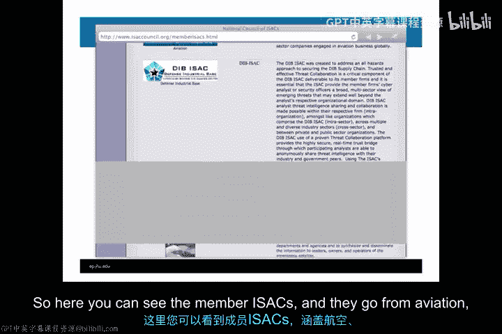

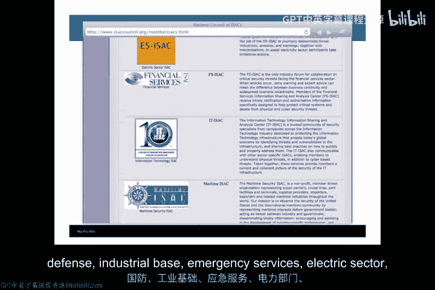

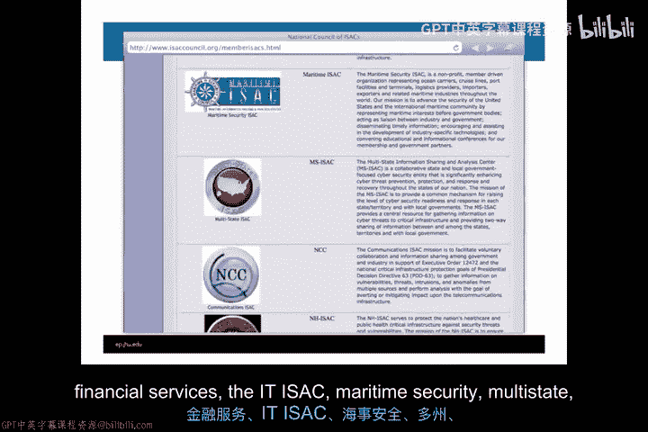

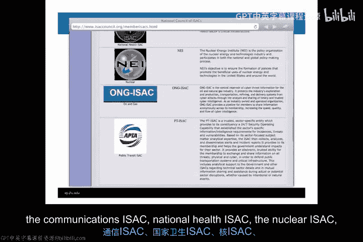

在美国国内，更贴近实际运营层面的是称为“信息共享与分析中心”（ISAC）的组织。美国的ISAC基本上是为了支持按行业进行信息共享而存在的。“行业”指的是诸如电力、金融、航空、石油和天然气等领域。在这些领域，组织、CERT和响应团队因其共同的功能而被聚集在一起。

这通常是一个非竞争性很强的空间，但金融行业可能是个例外。以金融行业为例，银行可能在争夺客户和金融利益方面相互竞争，但网络安全风险存在于金融基础设施的所有环节。因此，建立一个可信的场所来共享某些网络安全数据，以保护整个金融基础设施免受犯罪元素或其他试图破坏金融基础设施的元素的广泛攻击，是很有意义的。同样的情况也适用于电力、航空、石油和天然气等领域。你可以在我列在底部的这个特定网站上看到许多不同的ISAC，它展示了现有的ISAC成员，让你了解它们是谁，谁在参与。

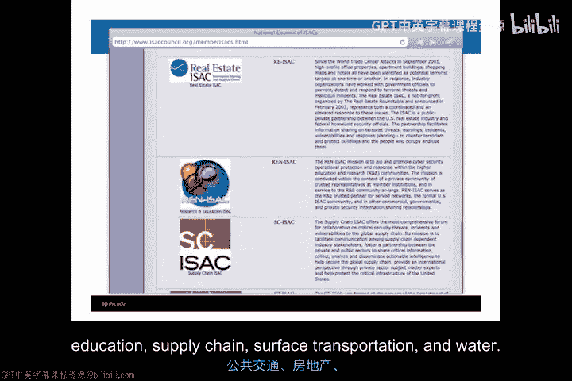

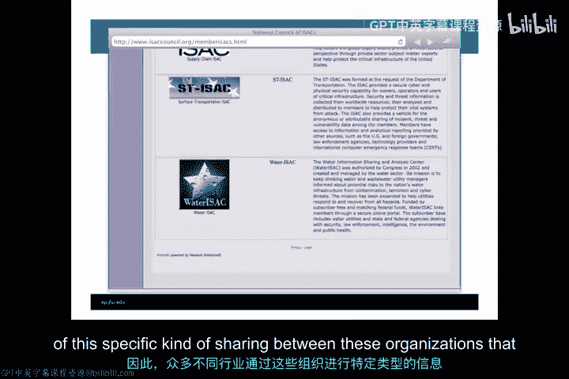

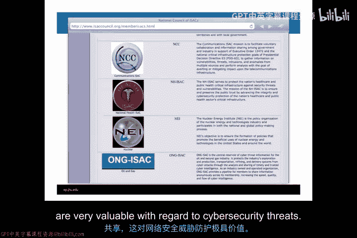

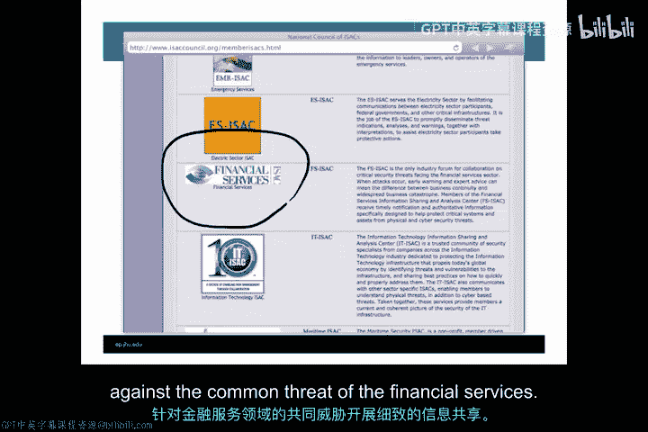

总的来说，这些组织内部的信息共享在成员之间是高度可信的，因此非常详细的技术威胁和技术解决方案可以在这些组织之间共享。

以下是主要的成员ISAC：
*   航空 ISAC
*   国防工业基地 ISAC
*   应急服务 ISAC
*   电力部门 ISAC
*   金融服务 ISAC
*   信息技术 ISAC
*   海事安全 ISAC
*   多州 ISAC
*   通信 ISAC
*   国家卫生 ISAC
*   核能 ISAC
*   石油和天然气 ISAC
*   公共交通 ISAC
*   房地产 ISAC
*   研究与教育 ISAC
*   供应链 ISAC
*   地面运输 ISAC
*   水 ISAC

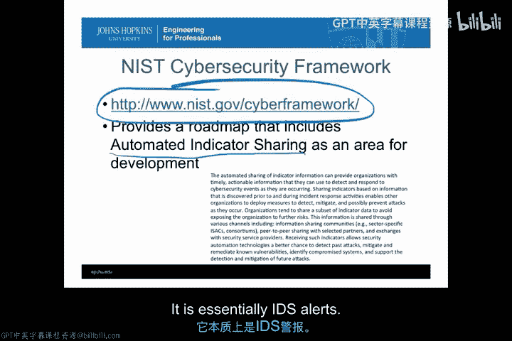

有许多不同的行业在这些组织之间进行这种特定类型的共享，这对于应对网络安全威胁非常有价值。其中，金融服务ISAC可能是最先进的之一，它已经存在了相当长的时间，并且确实针对金融服务面临的共同威胁进行了详细的信息共享。

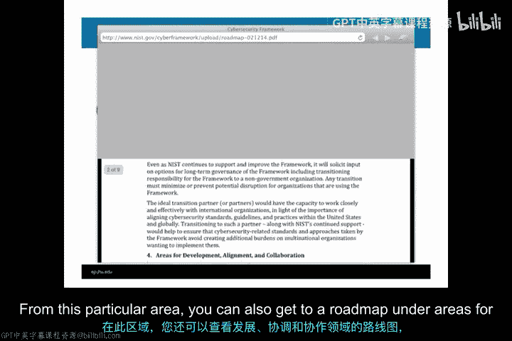

### NIST网络安全框架与自动化指标共享

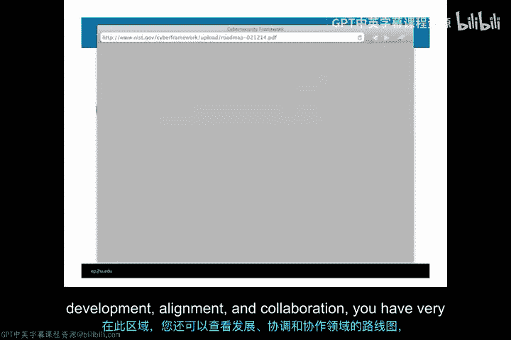

继续关注美国政府与信息共享，最近，美国国家标准与技术研究院（NIST）发布了一个网络安全框架，你可以在下面这个网站找到。该框架提供了一个路线图，其中将“自动化指标共享”作为一个发展领域。

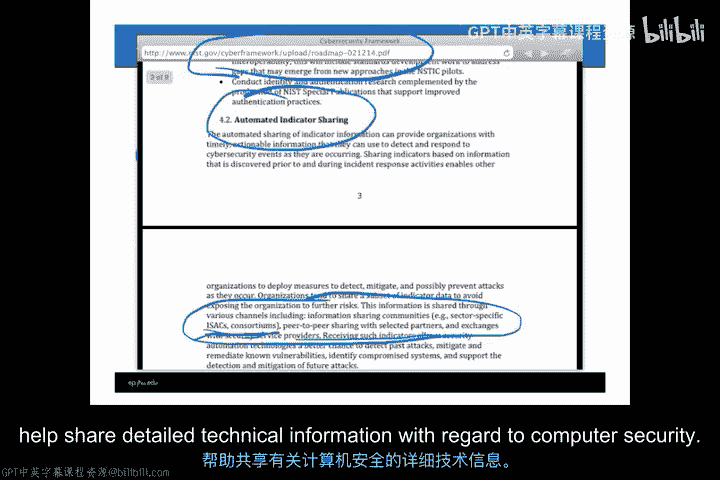

那么，什么是自动化指标共享？它本质上是IDS警报，即入侵检测系统的警报和响应信息在广泛的公共和私营组织之间进行自动化共享。你可以看到，这种共享可以为组织提供可操作的信息，并且正以一种有望让这些组织看到此类共享好处的方式得到支持，同时真正限制可能因共享信息被滥用而引发的责任。

这是NIST网络安全框架的主页，你可以在此获取关于“改善关键基础设施网络安全的框架”的全部文本。从这个特定区域，你还可以在“发展、协调与合作领域”下找到一个路线图，其中非常突出地包含了“自动化信息或自动化指标共享”。这就是我提取文本的具体领域，它是NIST政府工作的一部分。这应该有助于为公共和私营部门组织提供一些额外的共享可能性，同时限制潜在风险。顺便说一下，你可以在文本中看到，特别指出的一点是ISAC和各种联盟，它们在选定的合作伙伴之间基于信任关系提供点对点共享。这确实促进了ISAC和其他类型的联盟的理念，以帮助共享有关计算机安全的详细技术信息。

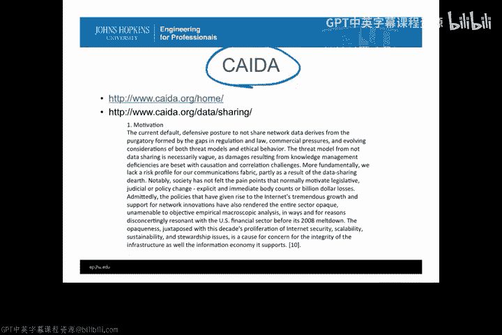

### 其他共享组织与框架

在美国政府类型的组织之外，还有像“网络分析数据档案”（CADA）这样的组织。CADA是一个旨在整合来自大量组织（包括大学、公共和私营组织）的共享信息的组织，目的是提供关于威胁、漏洞以及互联网上实际发生活动的综合信息。他们有一整套共享动机。

这是CADA关于数据共享和促进数据共享的网页。正如你所见，他们非常认真地尝试引入大量数据集，然后提供它们，以便你可以下载和使用这些包含大量关于攻击、漏洞和互联网活动信息的数据集，并允许你将你的组织与许多其他类型的组织进行比较。

另一种思考信息共享的方式是，威瑞森（Verizon）有一个名为“事件记录和事件共享词汇表”（VERIS）的组织。VERIS每年都会发布一份关于信息（尤其是数据泄露调查）的年度报告。这是一种整合整个威瑞森客户群信息，并通过年度报告公开分享的方式，该报告创建了关于事件分类的统计数据，并生成年度数据泄露报告。这是了解每年发生情况的一个极佳信息来源。你可以在VERIScommunity.net页面找到它。它确实是一个极佳的数据来源，旨在支持匿名报告。如果你是威瑞森的企业客户，你的数据会自动匿名包含在此报告中，并且客户群足够广泛，无法反向追踪到具体归属。

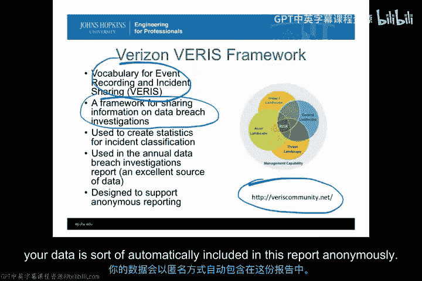

VERIS用于事件分类的框架也非常有趣，因为他们真正试图理解是谁在做这些事情，以及他们试图在基础设施内做什么。你可以看到，他们包含了各种要素，如人口统计、发现方式、影响等用于事件分类；以及主体、资产、属性等，这些非常详细的信息最终形成了VERIS每年数据泄露报告中有价值的统计信息。

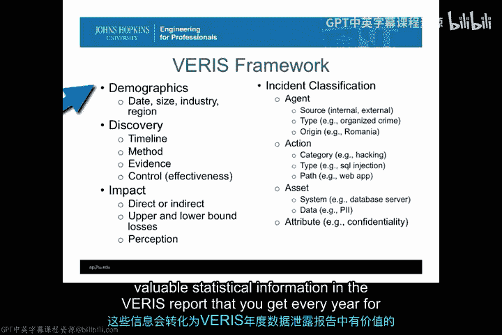

《eWeek》有一篇关于威瑞森如何编制年度数据泄露报告以及事件记录和事件共享词汇表的优秀文章，详细说明了它如何被用于实际创建这份报告。因此，这是一个关于可信数据共享如何实际产生关于数据泄露（尤其是我们在新闻中经常看到的信用卡信息泄露等）的非常有价值信息的绝佳例子。我强烈建议你看看这篇《eWeek》文章。

---

## 总结与决策

本节课中我们一起学习了关于IDS警报信息共享的各个方面。那么，结论是：你应该共享事件数据吗？这确实是问题所在。像所有好的问题一样，没有单一的正确答案。这真的取决于你能够用这些数据做什么。

你是否属于一个由ISAC支持的行业？如果是，你与其他组织存在信任关系，共享数据的风险相对较低。
你是否有一个像VERIS（威瑞森）这样的匿名场所来共享事件数据？在数据共享网络中，是否有地方可以整合信息，从而不会暴露可能反过来使你自己组织面临更脆弱处境的信息？
你是否能够或应该为了全球利益而自愿提供数据？参与CADA等组织。根据你所在组织的类型，你可能会认为自愿提供一些数据和信息，对全球利益和全球公益的贡献大于暴露组织内部数据所带来的风险。

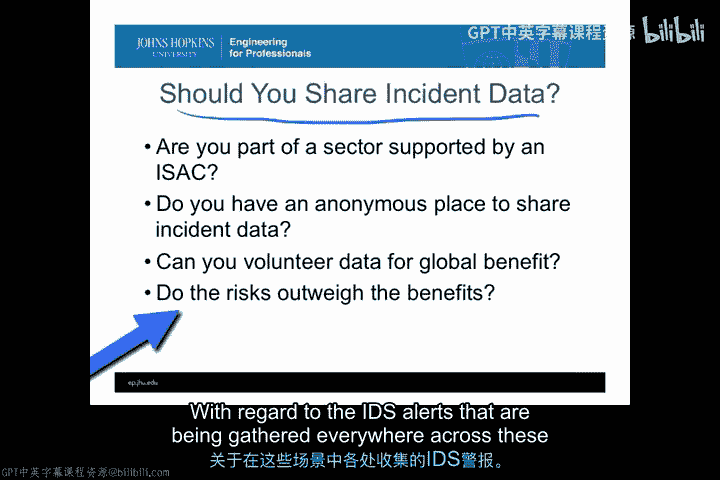

归根结底，这始终是一个权衡计算：风险是否大于收益？收益包括通过参与这些框架可以学到的信息，以及为全球理解关于在这些情况下各处收集的IDS警报正在发生什么做出贡献的能力。