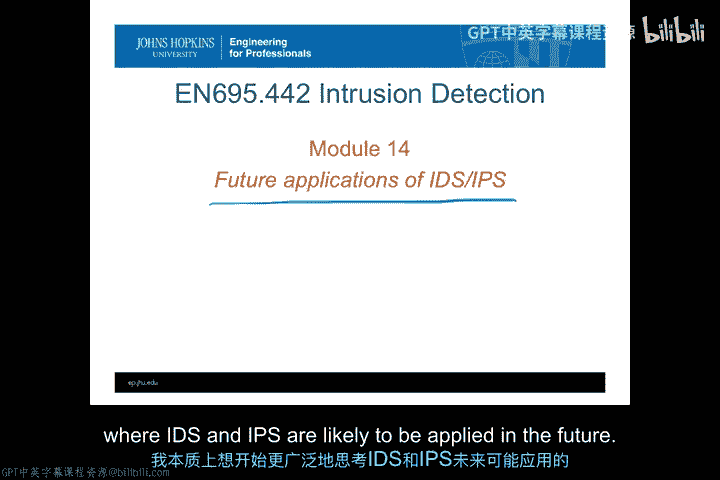
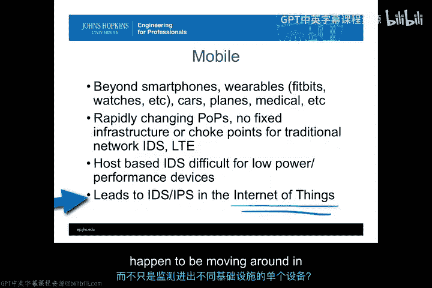
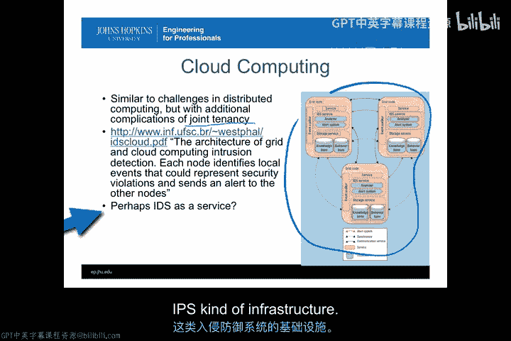
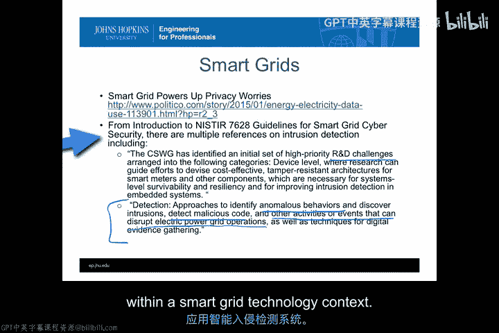
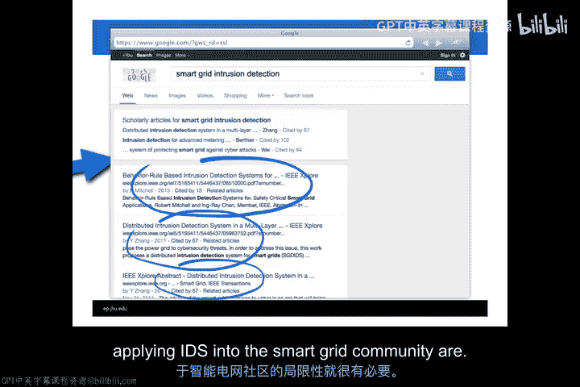
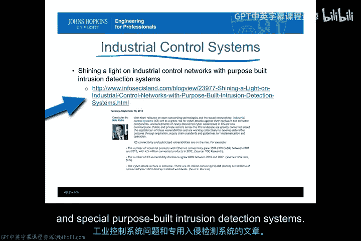
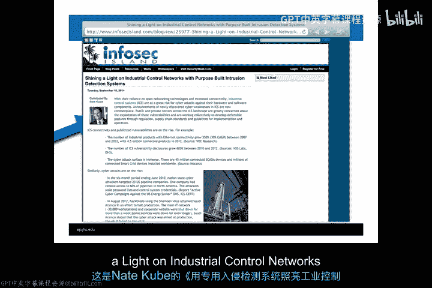
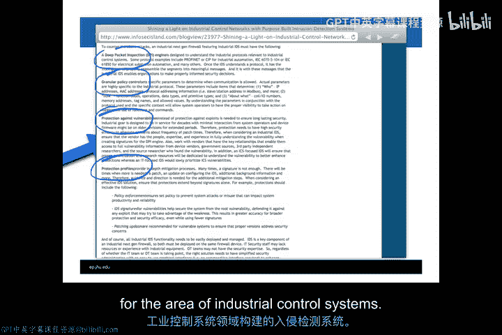
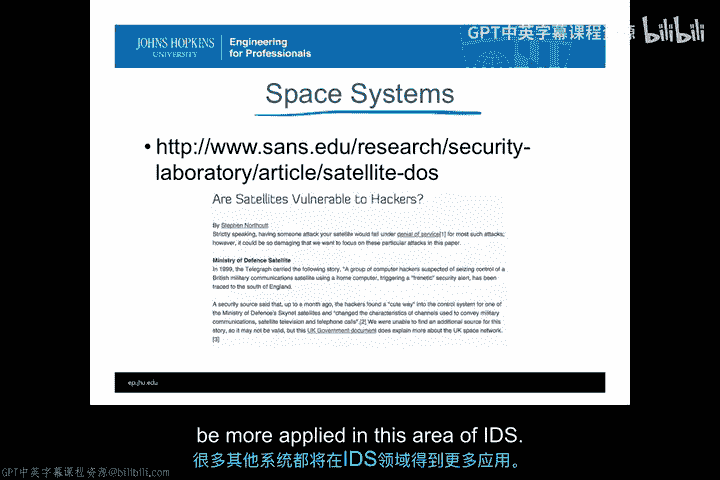

# 063：IDS/IPS未来应用场景 🚀

在本节课中，我们将探讨入侵检测系统（IDS）和入侵预防系统（IPS）在传统互联网或IT环境之外的一些潜在应用领域。我们将从移动计算环境出发，进而讨论智能电网、工业控制系统乃至太空系统等更具差异性的场景，以更广阔的视角思考IDS/IPS的未来。

## 移动环境中的应用 📱

上一节我们回顾了IDS/IPS的传统应用，本节中我们来看看它们在移动环境中的前景。这里的“移动环境”不仅指当前的智能手机，更涵盖了可穿戴设备（如Fitbits、智能手表、智能眼镜等）以及其他所有将连接到互联网的小型设备。

在这些设备频繁穿梭于家庭、工作场所、咖啡店等不同安全域并不断连接和断开的情况下，如何监控和响应安全事件成为一个开放性问题。IDS的应用方式可能包括：
*   在智能手机上运行IDS，由手机控制其他关联设备。
*   在汽车基础设施内部署IDS。
*   在飞机或医疗设备等场景中应用IDS技术。

解决方案可能来自我们随身携带的设备，也可能来自我们经过的固定基础设施。随着移动和可穿戴计算系统的飞速发展，我们必将在此领域应用更多的IDS和IPS技术。

## 解决移动环境IDS的挑战

当我们开始尝试解决众多移动设备的IDS问题时，必须认识到一个关键点：不存在一个可以放置传统IDS的固定接入点来监控所有设备的流量。我们面临以下可能路径：
*   部署多样化、分布式的IDS，并尝试协调所有信息。
*   依赖服务提供商（如LTE运营商）在快速变化的基础设施中为我们提供“IDS即服务”。

此外，移动环境还面临低功耗、低性能的挑战。虽然智能手机功能强大，但许多移动设备（如手环、手表）在电源、资源和计算能力方面非常有限，难以承载复杂的主机型IDS功能或进行跨设备通信协调。

这引出了物联网（IoT）中的IDS/IPS问题。从IDS的角度看，一个关键挑战是：如何识别针对个人的攻击，而非单个设备。即当一个人成为目标时，其关联的多种设备可能同时遭受攻击，我们能否在移动环境中构建能识别此类情况的IDS？

## 云计算环境中的应用 ☁️

云计算环境是IDS应用的另一个重要领域。这是一个分布式计算环境，但带来了“多租户”的新挑战。问题不仅在于跨分布式基础设施的协调，更在于如何获得管理权限，以查看执行IDS/IPS功能所需的重要可观测数据。

一种可能的解决方案是将“IDS即服务”作为云计算环境的一项服务提供。随着技术成熟，我们可以获取适合云环境租户（而非云环境所有者）的检测信息。鉴于云环境正成为多种攻击的常见目标，它无疑是部署IDS/IPS基础设施的合适场所，预计该领域在近期将有显著进展。

## 智能电网与工业控制系统中的应用 ⚡

在不久的将来，IDS在电力领域（尤其是智能电网）的应用将变得至关重要。美国国家标准与技术研究院（NIST）发布的《智能电网网络安全指南》（IR 7628）为在智能电网中纳入入侵检测和预防提供了许多建议和要素。

然而，指南也承认这是一个研发挑战，无法直接将现有商业产品应用于智能电网，需要新的技术、方法和产品来实现异常行为检测、恶意代码发现等功能。智能电网只是工业控制系统（ICS）的一个例子。在电力之外，还有许多其他工业控制场景可以应用IDS。

## 太空系统中的应用 🛰️

最后，我们探讨IDS在太空系统中的应用。随着太空领域从政府主导转向越来越多的私营企业参与（如卫星系统），如何保护这些系统变得愈发重要。

我们需要思考如何利用IDS/IPS来保护太空系统，特别是控制卫星和载人航天飞行所需的特定应用技术。相关文献已开始讨论太空系统的脆弱性以及未来如何应用入侵检测与预防技术。预计在未来一到五年内，IDS在太空系统和工业控制系统中的应用将成为备受关注的领域。

## 总结

本节课我们一起探讨了IDS/IPS在多个新兴领域的未来应用场景，包括移动计算与物联网、云计算、智能电网、工业控制系统以及太空系统。任何具有复杂性、存在攻击面、并且能够通过分类器区分正常行为与攻击行为（或存在基于签名的攻击）的系统，都适合应用IDS/IPS技术。可以预见，未来将有越来越多的系统开始应用这项技术。