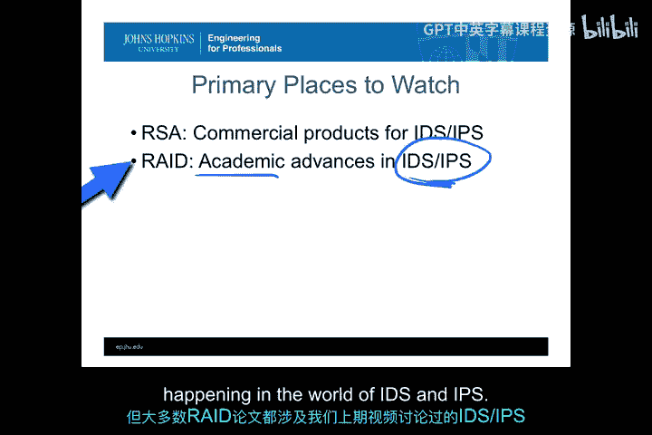
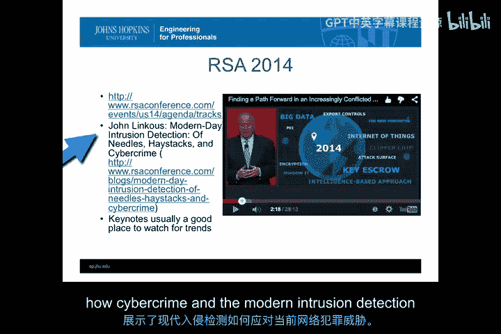
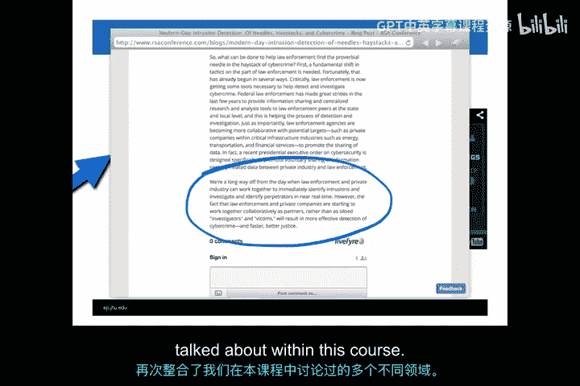
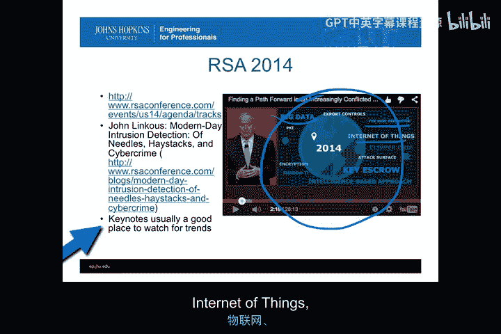
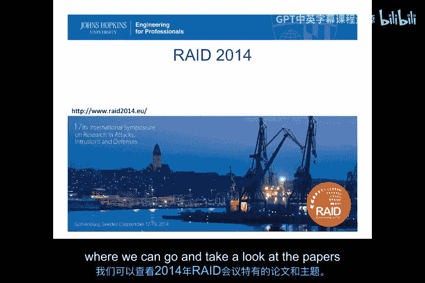
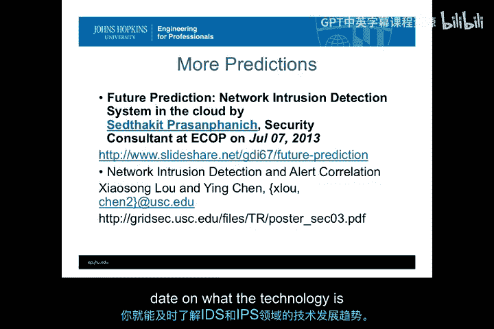

# 065：IDS/IPS发展前沿资讯获取途径 🔍

在本节课中，我们将探讨如何获取入侵检测系统（IDS）和入侵防御系统（IPS）技术的最新发展动态。课程将介绍几个关键的资讯来源，帮助你紧跟该领域的技术趋势。

## 核心资讯来源

上一节我们讨论了IDS/IPS的技术挑战，本节中我们来看看如何持续追踪这些挑战的解决方案与发展方向。获取最新资讯主要依赖两个核心渠道：RSA大会和RAID会议。

### RSA大会

RSA是主要的计算机安全会议，通常在加利福尼亚州旧金山会议中心举行。这是一个规模庞大的会议和供应商展会。去年，大会设立了25个不同的技术专题。即使无法亲临现场，也能通过其产出的丰富信息了解IDS/IPS领域的最新动态。

以下是关注RSA大会的几个有效方法：

*   **浏览会议专题**：首先可以查看RSA大会提供的各个技术专题。这些专题全面涵盖了IDS领域正在发生的一切。
*   **搜索特定议题**：我每年都会在RSA议程中进行简单搜索，专门查找“入侵检测”及相关关键词。例如，今年可以找到John Lysk的演讲《现代入侵检测：针、干草堆与网络犯罪》。其链接提供了关于网络犯罪与现代入侵检测如何应对当前威胁的宝贵信息。
*   **阅读相关博客**：在RSA材料中搜索“入侵检测”会出现相关博客。像John Lysk这样的专家会在博客中讨论近期动态，通常提供关于商业世界中识别攻击、在犯罪市场或威胁领域进行入侵检测的最新数据和信息。
*   **关注主题演讲**：主题演讲是观察趋势的绝佳方式。以RSA 2014上Art Coviello的主题演讲为例，其中的图表汇集了关键议题，如大数据、边界、物联网、基于情报的方法、加密等，这些都与我们讨论过的入侵检测世界的问题直接相关。

因此，后续需要观看的几个视频将来自RSA的一些主题演讲和重点关切领域，它们能让你很好地了解随着未来发展，入侵检测系统必须应对哪些问题。

### RAID会议

RAID是“入侵检测最新进展”会议。这是一个学术会议，发表经过同行评审的论文，深入探讨理解IDS/IPS不同元素所面临的具体技术挑战。尽管名称如此，但并非RAID的每篇论文都专门关于IDS或IPS。不过，你在RAID看到的大多数论文都与我们上一视频中谈到的IDS/IPS世界中的某个技术挑战有关。

2013年，该会议在圣卢西亚举行。2014年在瑞典哥德堡举行。2015年应会回到美国。关注RAID的举办地点很重要。如果你有机会参加RAID，可以与许多推动入侵检测和入侵响应技术未来发展的学者和个人交流。即使无法参加，RAID的论文和主题领域也是了解学术界处理IDS/IPS关键问题的绝佳概要。

以下是关注RAID动态的一些方法：

*   **分析论文主题**：我喜欢根据RAID的议程和摘要，每年制作词云并进行比较和可视化分析。这至少能让我很好地了解IDS研究的焦点如何随时间变化。例如，2014年的词云显示，恶意软件和网络是讨论最多的领域，网络仍然极其重要。相比之下，SSL等话题的占比则小得多。
*   **比较年度变化**：将2014年的词云与2013年的对比，可以看到恶意软件仍然非常重要。“移动”在2014年并非主要元素。云在2013年比2014年更重要，似乎在2013年被过度炒作，而在2014年实际提交的论文中占比降低。通过这种方式，你能感受到RAID社区内一些攻击和元素名称的关注焦点。
*   **审视分组议题**：除了词云，你还可以查看会议的分组议题标题。这些标题由程序委员会分组，代表了发现的主要主题。例如，2013年的议题涵盖硬件、服务器、恶意软件、认证、网络、云等。而2014年则完全没有硬件议题，焦点大多集中在网络安全和网络上，对恶意软件的关注远超2013年，在漏洞分析和二进制分析方面也有更多内容。
*   **关注主题演讲**：2014年的主题演讲也值得注意，因为它聚焦于物联网。查看该主题演讲的摘要，可以感受到2013年至2014年间学术界的关注重点发生了怎样的转移。

## 其他预测与观点

除了上述核心渠道，还有一些其他地方偶尔会受到媒体大量关注，也需要留意，例如Gartner等机构的预测。

Gartner以在2001年宣称IDS消亡而闻名，但他们似乎从未完全说对IPS和IDS世界的发展。因此，对于这类预测，在本课程中我们持保留态度。本课程尝试关注的不是预测我们将看到哪种商业产品，而是哪些技术挑战最有可能成为研究和商业领域解决IDS问题的焦点。至于这些是否会转化为主要产品，甚至是否会产生任何IDS进展，我认为很难判断。

你也可以从RSA等处获得许多预测，这些预测会被杂志和大众媒体转载。你会发现这些预测通常比较泛泛，例如攻击者可能变得更复杂、攻击面将继续扩大、边界概念逐渐消失、安全团队无论是否准备好变化都会发生等。

还有一些关于网络入侵检测的未来预测，有些更新一些，有些则具有历史参考价值。关注一些专家认为IDS将走向何方是合理的，但根据本课程和本模块的学习，你可能已经具备了与任何关注该领域的专家同等的能力，来展望未来并了解IDS和IPS的发展。他们所说的，基本上与我们基于“什么是IDS”以及“IDS面临哪些技术挑战”得出的课堂结论是一致的。

## 总结

本节课中，我们一起学习了如何保持对IDS/IPS领域最新发展的了解。我们介绍了两个核心资讯渠道：**RSA大会**（侧重商业实践与行业趋势）和**RAID会议**（侧重学术研究与技术挑战）。通过关注这些渠道的议程、演讲、论文和年度变化，可以有效把握技术动态。对于其他商业预测，则应批判性地看待。跟踪RSA和RAID的动向，并适当关注其他预测，就能较好地保持对IDS和IPS技术世界发展现状的了解。