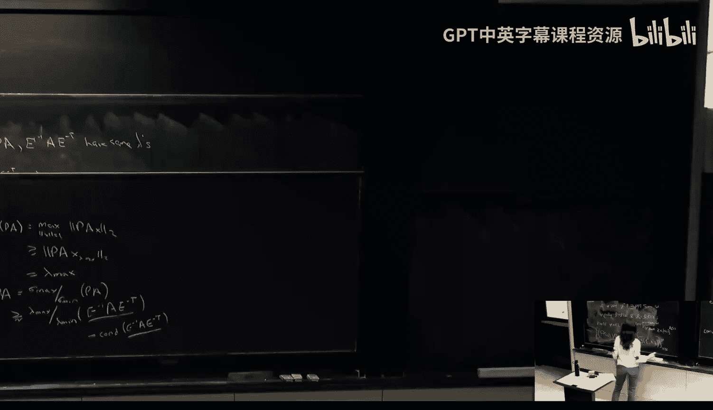
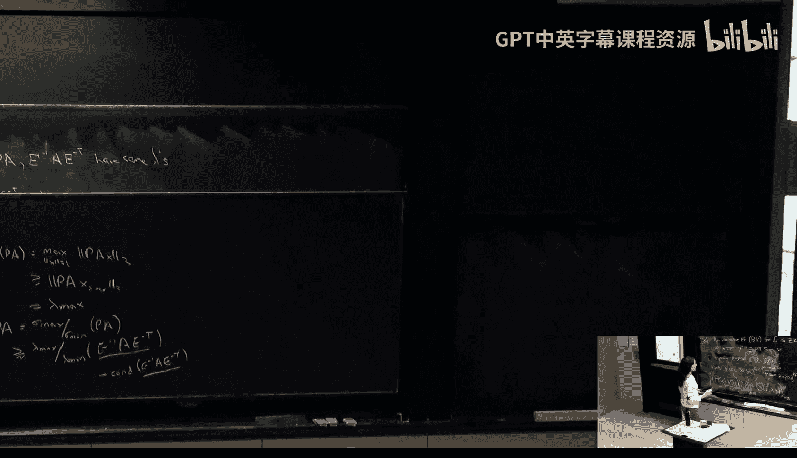

# 020：零知识证明的构造 🧠

在本节课中，我们将学习如何构造零知识证明。我们将从一个具体的语言（二次剩余）的简单构造开始，作为热身。然后，我们将探讨如何为所有NP语言构造零知识证明，核心思想是将其归约到一个NP完全问题（如图的三染色问题），并使用“数字保险箱”——即承诺方案——来实现。

---

## 二次剩余的零知识证明 🔢

上一节我们回顾了零知识证明的定义。本节中，我们来看看如何为一个具体的NP语言——二次剩余语言——构造一个零知识证明。

该语言定义为：
\[
QR_N = \{ (N, y) \mid \exists x \in \mathbb{Z}_N^* \text{ 使得 } x^2 \equiv y \pmod{N} \}
\]
其中，见证（witness）是满足 \(x^2 \equiv y \pmod{N}\) 的 \(x\)。

以下是证明者（P，拥有见证 \(x\)）和验证者（V，拥有输入 \((N, y)\)）之间的协议：

1.  **P → V**：证明者随机选择 \(r \leftarrow \mathbb{Z}_N^*\)，计算 \(s = r^2 \mod N\)，并将 \(s\) 发送给验证者。
2.  **V → P**：验证者随机选择一个挑战比特 \(b \leftarrow \{0, 1\}\)，并将其发送给证明者。
3.  **P → V**：证明者根据 \(b\) 的值进行回复：
    *   如果 \(b = 0\)，则发送 \(z = r\)。
    *   如果 \(b = 1\)，则发送 \(z = r \cdot x \mod N\)。
4.  **V**：验证者检查 \(z^2 \equiv s \cdot y^b \pmod{N}\) 是否成立。如果成立，则接受；否则拒绝。

### 协议分析

以下是该协议需要满足的性质：

*   **完备性**：如果 \((N, y) \in QR_N\) 且双方都诚实执行协议，验证者总是接受。
    *   当 \(b=0\) 时，检查 \(r^2 \equiv s \pmod{N}\)。
    *   当 \(b=1\) 时，检查 \((r \cdot x)^2 \equiv r^2 \cdot x^2 \equiv s \cdot y \pmod{N}\)。

*   **可靠性**：如果 \((N, y) \notin QR_N\)（即 \(y\) 不是二次剩余），那么任何（计算能力无限制的）恶意证明者 \(P^*\) 最多只能以 \(1/2\) 的概率欺骗验证者接受。
    *   原因：对于恶意证明者发送的第一个消息 \(s\)，\(s\) 和 \(s \cdot y\) 不可能同时是二次剩余（否则 \(y\) 将是二次剩余）。因此，至少有一个挑战比特 \(b\) 的值（0或1）是恶意证明者无法正确回答的。由于验证者随机选择 \(b\)，欺骗成功的概率最多为 \(1/2\)。

*   **零知识性（对诚实验证者）**：我们首先证明协议对**诚实验证者**是**完美零知识**的。这意味着存在一个模拟器 \(S\)，即使不知道见证 \(x\)，也能生成与真实交互视图（Transcript）完全相同的分布。
    *   **模拟器 \(S\) 的工作方式**：
        1.  随机选择 \(b' \leftarrow \{0, 1\}\)。
        2.  如果 \(b' = 0\)：随机选择 \(z \leftarrow \mathbb{Z}_N^*\)，计算 \(s = z^2 \mod N\)。输出视图 \((s, b=0, z)\)。
        3.  如果 \(b' = 1\)：随机选择 \(z \leftarrow \mathbb{Z}_N^*\)，计算 \(s = z^2 / y \mod N\)。输出视图 \((s, b=1, z)\)。
    *   **为何有效**：在真实协议中，当 \(b=0\) 时，\(s\) 是一个随机二次剩余，\(z\) 是其随机平方根；当 \(b=1\) 时，\(z\) 是随机值，\(s\) 是 \(z^2/y\) 也是一个随机二次剩余。模拟器生成的分布与之完全相同。

*   **处理恶意验证者**：对于可能不按协议随机选择 \(b\) 的恶意验证者 \(V^*\)（例如，\(b\) 可能是 \(s\) 的某个哈希函数值），模拟策略需要调整。
    *   **模拟器 \(S\) 的工作方式**：
        1.  随机猜测 \(V^*\) 将会输出的挑战比特 \(b'\)。
        2.  根据上述对诚实验证者的模拟方法，生成对应的 \((s, b', z)\)。
        3.  将 \(s\) 提交给 \(V^*\)（作为协议第一步），并接收 \(V^*\) 实际选择的挑战比特 \(b\)。
        4.  如果 \(b = b'\)，则成功，输出 \((s, b, z)\)。
        5.  如果 \(b \neq b'\)，则回到步骤1重试。
    *   **为何有效**：因为模拟器生成的 \(s\) 是一个（与 \(b'\) 无关的）随机二次剩余，恶意验证者 \(V^*\) 从 \(s\) 中得不到任何关于 \(b'\) 的信息。因此，\(V^*\) 的挑战比特 \(b\) 以 \(1/2\) 的概率等于模拟器的猜测 \(b'\)。期望在2次尝试内即可成功模拟。

### 提升可靠性

上述协议的单次可靠性误差为 \(1/2\)。为了达到可忽略的误差，我们需要重复执行协议。然而，**并行重复**可能会破坏零知识性。安全的做法是进行**顺序重复**。在顺序重复中，可以将前一轮的交互记录视为下一轮的辅助输入（auxiliary input \(z\)），而零知识定义本身要求即使给定辅助输入，模拟仍然可行，从而保证了顺序重复下零知识性得以保持。

---

## 所有NP语言的零知识证明 🎨

上一节我们为一个特定语言构造了零知识证明。本节中，我们来看看如何为**所有NP语言**构造零知识证明。核心思想是：因为NP完全问题可以归约到任何NP问题，所以我们只需为一个NP完全问题构造零知识证明即可。我们选择的问题是**图的三染色问题**。

语言 **3-Colorable** 定义为：
\[
\{ G(V, E) \mid \exists \text{染色方案 } c: V \rightarrow \{1,2,3\} \text{ 使得 } \forall (u,v) \in E, c(u) \neq c(v) \}
\]
其中，见证是一个合法的三染色方案 \(c\)。

### 物理世界协议（使用保险箱）

首先，我们描述一个使用物理“保险箱”的直观协议：

1.  **P → V**：证明者拥有染色方案 \(c\)。他首先随机选择一个颜色排列 \(\pi: \{1,2,3\} \rightarrow \{1,2,3\}\)，对染色进行“重命名”，得到 \(\pi(c(v))\)。然后，他为每个顶点 \(v\) 准备一个锁着的保险箱，里面放入该顶点重命名后的颜色值 \(\pi(c(v))\)。他将所有这些锁着的保险箱发送给验证者。
2.  **V → P**：验证者随机选择一条边 \((u, v) \in E\)，并将其发送给证明者。
3.  **P → V**：证明者将保险箱 \(u\) 和保险箱 \(v\) 的钥匙发送给验证者。
4.  **V**：验证者用钥匙打开两个保险箱，检查里面的颜色是否属于 \(\{1,2,3\}\) 且互不相同。如果是，则接受本轮；否则拒绝。

### 协议分析

以下是该协议的分析：

*   **完备性**：如果图是三染色的，且证明者诚实，验证者总是接受。
*   **可靠性**：如果图不是三染色的，那么任何染色方案至少存在一条边 \((u, v)\) 两端颜色相同。验证者随机选中这条“坏边”的概率至少为 \(1/|E|\)。通过顺序重复该协议 \(k \cdot |E|\) 次（\(k\) 为安全参数），欺骗成功的概率可降至可忽略水平。
*   **零知识性（直觉）**：
    *   验证者每次只看到一条边上两个随机、互异的颜色（因为经过了随机排列 \(\pi\)）。这没有泄露任何关于原始染色方案 \(c\) 的信息。
    *   **模拟器 \(S\) 的工作方式（对恶意验证者）**：
        1.  随机猜测一条边 \((u', v')\)。
        2.  为顶点 \(u'\) 和 \(v'\) 的保险箱随机放入两个互异的颜色（从 \(\{1,2,3\}\) 中选），其他保险箱可以任意填充（因为不会被打开）。
        3.  将所有这些保险箱发送给恶意验证者 \(V^*\)，并接收 \(V^*\) 实际选择的边 \((u, v)\)。
        4.  如果 \((u, v) = (u', v')\)，则成功，提供这两个保险箱的钥匙。
        5.  如果不相等，则回到步骤1重试。
    *   由于保险箱不透明，\(V^*\) 无法获知模拟器预设的是哪条边，因此猜中的概率为 \(1/|E|\)。期望在 \(|E|\) 次尝试内即可成功模拟出与真实交互不可区分的视图。

### 从物理到数字：承诺方案

上述协议依赖于“物理保险箱”。在数字世界，我们使用**承诺方案** 来替代它。承诺方案如同一个数字保险箱，包含两个阶段：
1.  **承诺阶段**：发送方将一个秘密值 \(m\) “锁入”一个承诺字符串 \(com\) 中并发送。此阶段具有**隐藏性**：\(com\) 不泄露 \(m\) 的信息。
2.  **打开阶段**：发送方 later 可以“打开”承诺，揭示原来的值 \(m\) 和用于生成承诺的随机数。此阶段具有**绑定性**：发送方无法找到另一对 \((m', r')\) 使得 \(commit(m', r') = com\)，即他不能改变已承诺的值。

在下一讲中，我们将正式定义承诺方案，展示其构造方法，并用它来替换上述三染色协议中的物理保险箱，从而得到一个完全数字化的、适用于所有NP语言的零知识证明协议。

---

## 总结 📝

本节课中我们一起学习了零知识证明的构造方法。
1.  我们首先为**二次剩余**语言构造了一个简单的零知识证明协议，并分析了其完备性、可靠性（误差1/2）和零知识性。
2.  接着，我们探讨了如何为**所有NP语言**构造零知识证明。通过归约到NP完全问题——图的三染色问题，我们描述了一个使用“物理保险箱”的直观协议。
3.  我们分析了该协议的完备性、可靠性（通过重复提升）和零知识性，并介绍了模拟器通过“重试”策略来应对恶意验证者的方法。
4.  最后，我们指出物理保险箱在数字世界中的对应物是**承诺方案**，它提供了所需的隐藏性和绑定性，这将是我们下一节课的重点。

通过今天的课程，我们看到零知识证明并非遥不可及的概念，而是可以通过清晰的密码学原语和协议设计来实现的。