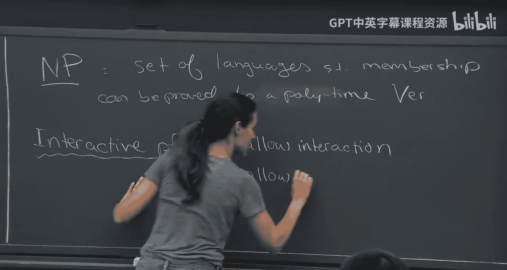
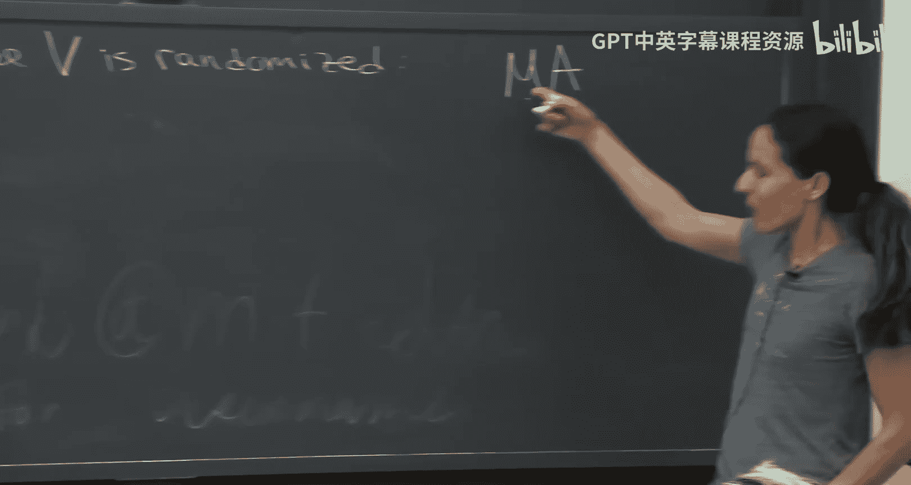
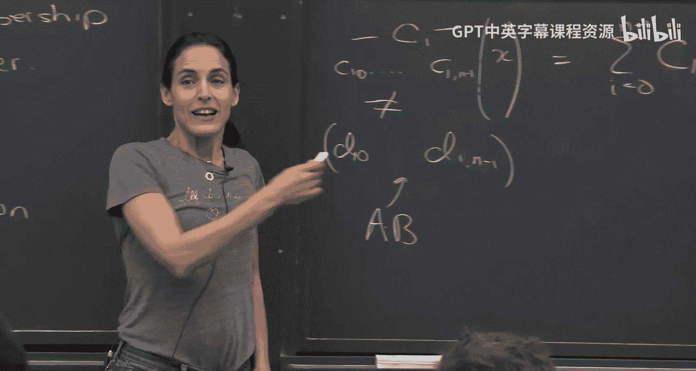
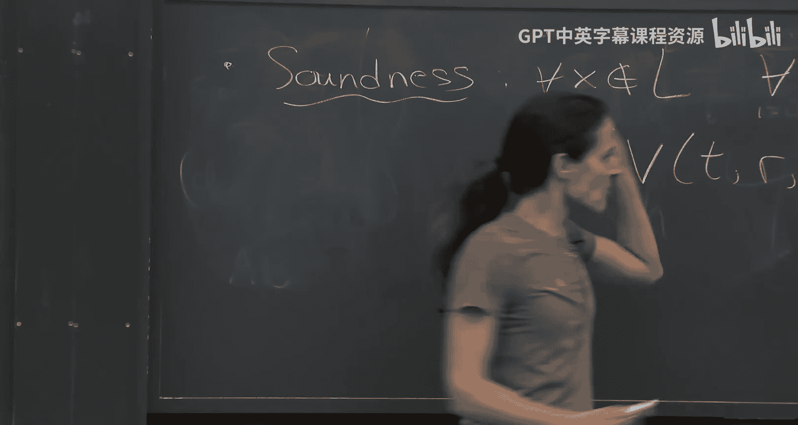
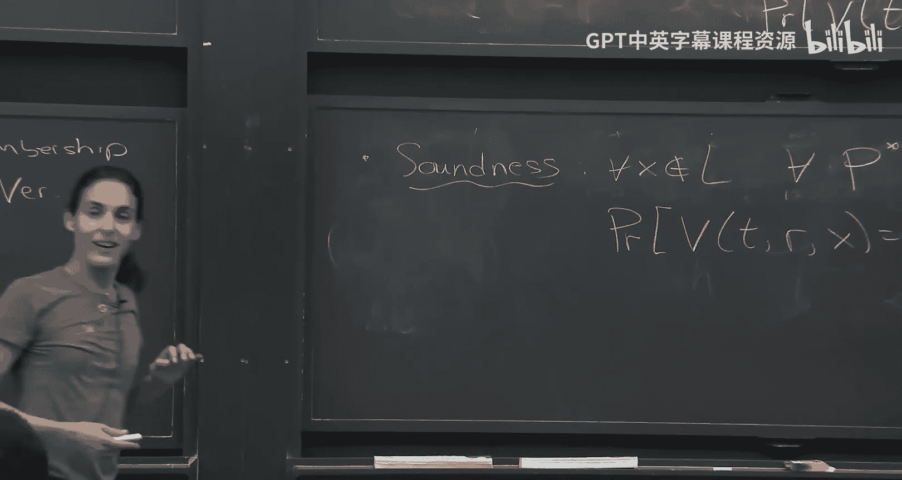
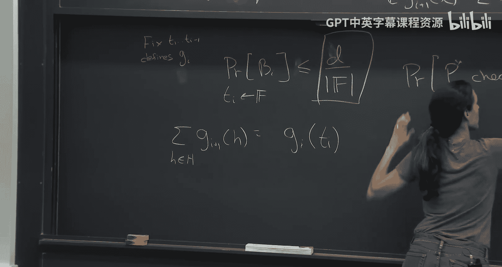
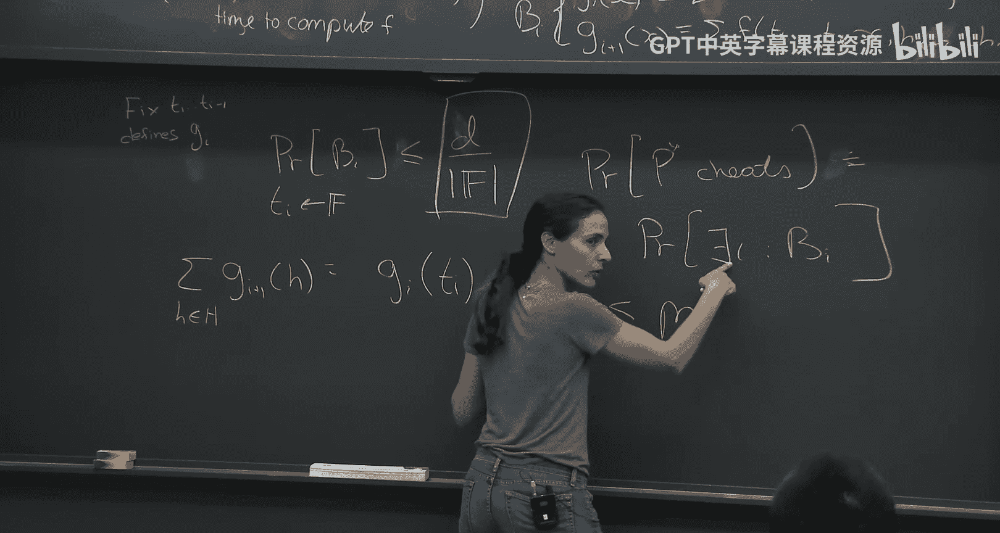

# 001：交互式证明与和校验协议（第一部分）

## 概述

在本节课中，我们将要学习密码学与理论计算机科学中的一个核心概念：交互式证明系统。我们将从经典的NP证明概念出发，探讨如何通过引入随机性和交互性来构建更强大的证明系统。我们将重点介绍一个极其重要的协议——和校验协议，并分析其工作原理与性质。

## 从NP到交互式证明

上一节我们介绍了课程的整体框架。本节中，我们来看看证明系统的基础模型。

在计算机科学中，NP类刻画了所有那些“存在一个简短证明，并且该证明能被多项式时间验证器高效验证”的语言。具体来说，NP是所有满足以下条件的语言集合：存在一个多项式时间验证器V，对于语言L中的任意输入x，都存在一个“见证”w（即证明），使得V(x, w)接受。

然而，NP的表达能力是有限的。为了获得更强大的证明系统，我们需要引入两个关键的新特性：**交互性**和**随机性**。

*   **交互性**：证明者（Prover）和验证者（Verifier）可以进行多轮对话，而不仅仅是证明者向验证者发送一个静态的证明。
*   **随机性**：验证者可以使用随机硬币（Random Coins），其决策可以基于概率。

这两点共同定义了**交互式证明（Interactive Proof， IP）**。如果验证者是确定性的，那么证明者可以预先计算出整个对话过程并作为静态证明发送，这就退化成了NP。因此，随机性是交互式证明力量的关键来源之一。

## 随机性的力量：一个例子

在深入交互式证明的形式化定义之前，我们先看一个例子，展示仅使用随机性（无需交互）如何帮助我们更高效地验证计算。

假设我们想验证三个n×n矩阵A, B, C是否满足 **C = A × B**。直接计算矩阵乘法需要O(n^ω)时间（ω ≈ 2.373）。但是，我们可以设计一个随机化的验证算法，其运行时间仅为O(n²)。

以下是该随机化算法：
1.  验证者随机选择一个向量 **r ∈ 𝔽ⁿ**（𝔽是一个足够大的有限域）。
2.  验证者计算 **A × (B × r)** 和 **C × r**。
3.  验证者检查 **A × (B × r) == C × r** 是否成立。如果成立则接受，否则拒绝。

这个算法的核心思想是：将矩阵相等问题转化为向量相等问题。如果C确实等于A×B，那么对于任何r，等式都成立（完备性）。如果C不等于A×B，那么根据Schwartz-Zippel引理（或其单变量特例），对于随机选择的r，等式成立的概率最多是 **1/|𝔽|**（可靠性）。通过选择足够大的域，我们可以使错误概率任意小。

这个例子属于**MA**（Merlin-Arthur）证明系统模型，即证明者发送一个证明，验证者进行随机化验证。我们尚不清楚MA是否真比NP更强大，但这个例子展示了随机性在验证中的潜在效用。

## 交互式证明的形式化定义

现在，我们正式定义交互式证明系统。

一个针对语言L的交互式证明系统，包含一个计算能力无限（或至少非常强大）的证明者P，和一个概率多项式时间的验证者V。它们进行多轮交互，最终验证者输出“接受”或“拒绝”。

该系统必须满足以下两个性质：

1.  **完备性（Completeness）**：如果陈述为真（x ∈ L），那么诚实的证明者P能以**至少c**的概率说服验证者V接受。通常c接近1（例如2/3）。
    *   **Pr[〈P, V〉(x) = 接受] ≥ c**

2.  **可靠性/健全性（Soundness）**：如果陈述为假（x ∉ L），那么**任何**（计算能力无限的）欺骗性证明者P*，最多只能以**至多s**的概率说服验证者V接受。通常s接近0（例如1/3）。
    *   **Pr[〈P*, V〉(x) = 接受] ≤ s**

这里的概率空间是验证者的随机硬币。常数c和s的典型选择是2/3和1/3。通过独立重复运行协议多次并采用多数决，我们可以将完备性概率放大到接近1，同时将可靠性误差降低到接近0（例如2^{-k}）。

## 和校验协议：一个核心的交互式证明

交互式证明到底有多强大？一个里程碑式的结果（Shamir, 1992）表明，**IP = PSPACE**，即交互式证明可以验证所有多项式空间可计算的语言。这被认为远比NP类更强大。

为了理解其威力，我们学习一个基础性的协议——**和校验协议（Sum-Check Protocol）**。这个协议是构建许多高级证明系统的基石。

### 问题描述

假设存在一个定义在有限域𝔽上的**m变量多项式g**，每个变量的度数最高为**d**。验证者V拥有对g的预言机访问（即可以请求计算g在任意点的值）。证明者P想要向V证明以下求和等式的值：
**∑_{(h₁, ..., hₘ) ∈ Hᵐ} g(h₁, ..., hₘ) = β**
其中H是𝔽的一个子集（例如{0, 1}），β是𝔽中的一个声称的和值。

直接计算这个求和需要O(|H|ᵐ)次求值，当m很大时这是不可行的。和校验协议提供了一个高效的交互式证明方法。

### 协议过程

协议通过m轮交互，逐步“剥离”求和中的每一个变量。

1.  **第1轮**：
    *   证明者P发送一个单变量多项式**s₁(X₁)**，声称它等于：
        **s₁(X₁) = ∑_{(h₂, ..., hₘ) ∈ Hᵐ⁻¹} g(X₁, h₂, ..., hₘ)**
    *   验证者V检查：
        *   s₁(X₁)的次数是否≤ d。
        *   **∑_{h₁ ∈ H} s₁(h₁) == β** 是否成立。
        如果任何检查失败，V立即拒绝。

2.  **第2到m轮**（归纳步骤）：
    *   假设前i-1轮中，V随机选择了值r₁, ..., r_{i-1} ∈ 𝔽。
    *   在第i轮，P发送一个单变量多项式**sᵢ(Xᵢ)**，声称它等于：
        **sᵢ(Xᵢ) = ∑_{(h_{i+1}, ..., hₘ) ∈ Hᵐ⁻ⁱ} g(r₁, ..., r_{i-1}, Xᵢ, h_{i+1}, ..., hₘ)**
    *   验证者V检查：
        *   sᵢ(Xᵢ)的次数是否≤ d。
        *   **∑_{hᵢ ∈ H} sᵢ(hᵢ) == s_{i-1}(r_{i-1})** 是否成立。
        如果任何检查失败，V立即拒绝。
    *   如果检查通过，V随机选择一个值 **rᵢ ∈ 𝔽**，并发送给P。

3.  **最终验证**：
    *   在第m轮之后，V随机选择了r₁, ..., rₘ。
    *   V使用其对g的预言机访问，直接计算 **g(r₁, ..., rₘ)** 的值。
    *   V检查 **g(r₁, ..., rₘ) == sₘ(rₘ)** 是否成立。如果成立则接受，否则拒绝。

### 协议分析

以下是该协议的关键参数：
*   **轮数**：m轮。
*   **通信复杂度**：O(m * d)个域元素（因为每轮发送一个d次多项式）。
*   **验证者时间复杂度**：O(m * d * |H|)次域操作（主要用于计算多项式在H上的求和），加上一次最终的g求值。
*   **证明者时间复杂度**：大致需要O(|H|ᵐ)次运算来计算所有必要的中间求和（这是问题的固有难度）。

**完备性**：如果初始求和确实等于β，且证明者诚实地执行协议，那么所有检查都会通过，验证者以概率1接受。

**可靠性**：如果初始求和**不等于**β，那么任何欺骗性的证明者P*必须至少在某一轮“撒谎”。假设在第i轮，P*发送的多项式sᵢ*不是正确的多项式。当验证者随机选择rᵢ时，sᵢ*(rᵢ)等于正确值的概率，最多是**d / |𝔽|**（根据Schwartz-Zippel引理，两个不同的d次多项式在随机点上相等的概率）。通过在所有m轮上应用联合界，整个协议被欺骗成功的概率上界为 **m * d / |𝔽|**。通过选择足够大的域𝔽，我们可以使这个错误概率任意小。

### 为什么多项式如此重要？

你可能会问，为什么这个协议（以及许多高级证明系统）都围绕多项式展开？原因有二：
1.  **纠错能力**：低次多项式具有强大的纠错/唯一解码特性。两个不同的d次多项式在大多数点上值都不同（仅在至多d个点上可能相同）。这使得验证者可以通过在随机点上抽查来高效地检测证明者的欺骗行为。
2.  **表达能力**：通过一种称为**低次扩展（Low-Degree Extension, LDE）** 的技术，我们可以将许多计算问题（如布尔电路执行轨迹）编码为低次多项式。这样一来，关于计算正确性的复杂声明，就可以转化为关于多项式求和的声明，进而应用和校验协议。

## 总结

本节课中我们一起学习了交互式证明系统的基本概念。我们从经典的NP证明出发，引入了交互性和随机性，定义了交互式证明（IP），并了解了其潜在威力（IP = PSPACE）。随后，我们深入探讨了密码学和证明系统中一个里程碑式的协议——和校验协议。我们详细描述了该协议如何通过多轮交互，让验证者高效地验证一个关于多变量多项式在大集合上求和的声明，并分析了其完备性、可靠性以及复杂度。和校验协议是构建众多现代简洁证明系统的核心组件，在后续课程中，我们将看到它如何被应用于构造更复杂的协议，并最终与密码学工具结合，实现非常简洁的非交互式证明。