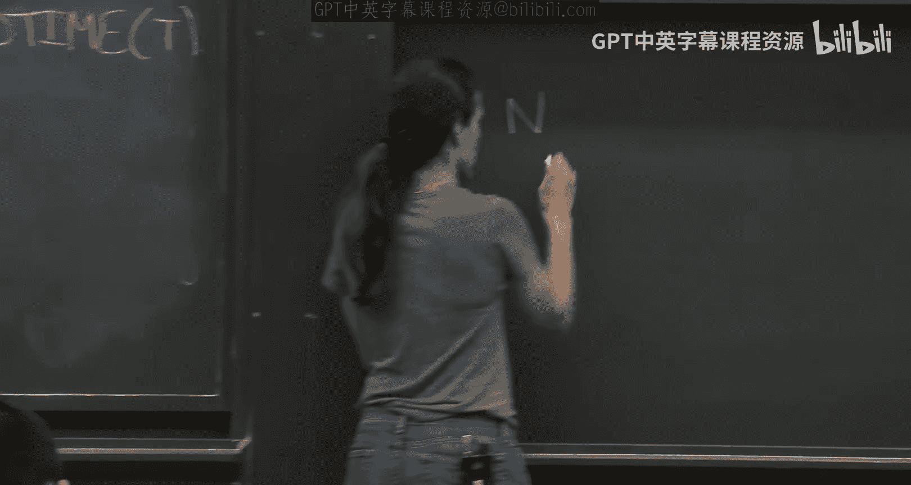

# 002：交互式证明与和校验协议（第二部分）

在本节课中，我们将继续深入探讨交互式证明系统，并学习和校验协议的具体应用。我们将看到如何利用和校验协议为复杂问题（如#SAT和三角形计数）构建高效的交互式证明，并引入“双重高效”证明的概念。

---

上一节我们介绍了和校验协议的基本框架，本节中我们来看看该协议的一些关键性质及其应用。

## 和校验协议的性质

和校验协议具有一个非常实用的性质：它是一个**公开掷币**协议。

*   **公开掷币协议**：在这种协议中，验证者的消息是公开的、真正随机的。在每一轮中，验证者选择随机数（例如，长度为 `log |F|` 的比特串），并将其公开发送给证明者。这些随机数定义了域中的一个元素。
*   **重要性**：公开掷币协议非常有用，因为在本课程后续内容中，我们将看到如何利用密码学来消除这种交互。验证者消息的完全随机性将在此发挥关键作用。

## 随机性的作用

在交互式证明中，随机性的分配至关重要。

*   **验证者需要随机性**：验证者必须使用随机性来防止证明者作弊。如果证明者提前知道验证者将要查询的点（例如，变量 `r1`），他就可以精心构造一个假的多项式，使其在该点上的值与真实多项式一致，从而通过验证。验证者的随机性正是用来对抗这种恶意行为的。
*   **证明者通常不需要随机性**：对于证明者而言，随机性通常没有帮助。因为我们可以固定证明者的最佳策略（将其视为一个非均匀的电路），而验证者是诚实的，其行为不会改变。因此，证明者可以被视为确定性的。

## 和校验协议为何可靠？——一个几何解释

我们可以从几何角度理解和校验协议为何是可靠的。

想象一个M维的小立方体 `H^M`，证明者声称某个低次多项式在这个立方体上所有点的求和值是 `β`。如果证明者作弊（即求和值不正确），那么在第一个维度 `H1` 的某个点上，他给出的部分和 `g1` 必定是错误的。
验证者随机选择一个点 `r1` 进行查询。由于 `g1` 是错误的，而真实多项式是低次的，根据施瓦茨-齐佩尔引理，`g1(r1)` 与真实部分和在 `r1` 处的值相等的概率很低。
此时，问题被约化为在剩下的 `M-1` 个维度上，证明关于 `r1` 的部分和是否正确。我们重复这个过程，逐维深入，直到最终在随机点 `(r1, r2, ..., rM)` 上检查单个点的值。通过这种“层层深入”的方式，验证者能以高概率发现证明者的任何欺骗行为。

---

上一节我们介绍了和校验协议及其原理，本节中我们来看看它的一个经典应用：为#SAT问题构建交互式证明。

## 应用示例：#SAT问题的交互式证明

#SAT是一个计算布尔公式满足赋值数量的难题。我们将展示如何利用和校验协议为#SAT构建一个交互式证明系统。核心思想是**算术化**。

### 问题定义

给定一个布尔公式 `φ`（可以视为二叉树，其中叶子节点是变量或其否定，内部节点是AND或OR门），#SAT问题是计算有多少个对 `n` 个变量的 `{0,1}` 赋值能使 `φ` 输出1。

### 算术化

为了应用和校验协议，我们需要将布尔公式 `φ` 转化为一个定义在有限域 `F` 上的多项式 `f̃`。转换规则如下：

1.  **AND门**：`AND(x, y)` 转换为乘法 `x * y`。
2.  **OR门**：`OR(x, y)` 转换为 `x + y - x*y`。
3.  **NOT门**：`NOT(x)` 转换为 `1 - x`。

在 `{0,1}` 取值上，这些算术运算与原始布尔运算完全一致。因此，对于所有 `x ∈ {0,1}^n`，有 `f̃(x) = φ(x)`。

### 转化为和校验问题

现在，证明 `φ` 恰好有 `K` 个满足赋值，等价于证明以下求和等式：
`∑_{x ∈ {0,1}^n} f̃(x) = K`
这正是和校验协议可以处理的形式！变量数 `m = n`。

### 关键：多项式的次数

我们需要确保多项式 `f̃` 的次数 `d` 不会太大，以保证验证者高效运行。
**断言**：对于公式 `φ`，其算术化版本 `f̃` 中，所有变量的次数之和至多为公式的大小 `S`（即叶子节点数）。
**证明思路**：通过对公式结构进行归纳。当 `φ` 是单个门时显然成立。对于 `φ = φ1 AND φ2`，`f̃ = f̃1 * f̃2`，变量 `xi` 的次数是其在 `f̃1` 和 `f̃2` 中次数之和。根据归纳假设，`f̃1` 和 `f̃2` 的次数和分别不超过 `S1` 和 `S2`，且 `S = S1 + S2`，因此总次数和不超过 `S`。OR门的情况类似。

因此，每个变量的次数 `d` 最多为 `S`，而 `S` 是输入规模的多项式。

### 协议执行与效率

*   **通信与验证复杂度**：和校验协议的通信量和验证者运行时间是 `O(n * d * log|F|)`，即输入规模的多项式。
*   **完备性与可靠性**：完备性为1。可靠性误差为 `(n * d) / |F|`。通过选择一个足够大的域 `F`（使 `|F| >> n * S`），我们可以使误差足够小，并可重复协议以进一步降低误差。
*   **证明者复杂度**：证明者需要计算整个求和，这至少需要 `O(2^n)` 时间，对于#SAT这类难题是不可避免的。

这个例子展示了和校验协议如何将一个看似非代数的问题，通过算术化技巧，转化为可处理的低次多项式求和问题。

---

#SAT的例子虽然精彩，但似乎是为和校验“量身定制”的。接下来，我们将探索和校验更强大的应用，并引入**双重高效交互式证明**的概念。

## 双重高效交互式证明

在之前的协议中，我们只要求验证者高效（多项式时间），而证明者可以是全能的。但在实际应用中，证明者也是资源受限的。

**双重高效交互式证明**要求：
*   **证明者高效**：诚实的证明者运行时间应与判定语言所需的时间 `T(n)` 相差不多（例如，多项式开销）。
*   **验证者超高效**：验证者运行时间应远小于 `T(n)`，理想情况下是近线性时间 `O~(n)`。

这适用于 `P` 类中的问题，目标是让验证者以远快于直接计算的速度，确信某个计算结果的正确性。

## 应用示例：图中三角形计数

我们以“计算图中三角形的数量”为例，展示如何构建一个双重高效的交互式证明。这是一个 `P` 问题（朴素算法需 `O(n^3)`），我们希望验证者能以近线性时间完成验证。

### 问题建模

设图 `G` 有 `n` 个顶点，其邻接矩阵可以用一个函数 `A` 表示：
`A(u, v) = 1` 如果边 `(u, v)` 存在，否则为 `0`。
这里，我们将顶点用长度为 `log n` 的二进制串表示，因此 `A: {0,1}^{log n} × {0,1}^{log n} -> {0,1}`。

图中三角形的数量 `K` 可以表示为：
`K = (1/6) * ∑_{i,j,k ∈ {0,1}^{log n}} A(i,j) * A(j,k) * A(k,i)`
（因子 `1/6` 用于消除顶点排列对同一三角形的重复计数）。

### 挑战与思路

上述求和式看起来像和校验，但存在两个问题：
1.  函数 `A` 是二值的，没有代数结构。
2.  求和是在 `{0,1}` 上进行的，而非一个域。

解决方案是使用**低次扩展**技术。

### 低次扩展

**定理（低次扩展）**：对于任意有限域 `F`（满足 `H ⊆ F`）和任意函数 `f: H^m -> F`，存在一个多项式 `f̃: F^m -> F`，满足：
1.  **扩展性**：对于所有 `x ∈ H^m`，有 `f̃(x) = f(x)`。
2.  **低次性**：`f̃` 在每个变量上的次数至多为 `|H| - 1`。

**直观理解**：
*   在单变量情况下（`m=1`），给定 `|H|` 个点上的取值，我们可以构造一个次数不超过 `|H|-1` 的多项式来精确拟合这些点。但此时次数可能很高（`O(n)`）。
*   在多变量情况下，我们可以通过增加变量维度 `m` 来显著降低每个变量上的次数。例如，为了表示一个长度为 `N` 的向量，我们可以选择 `H` 和 `m`，使得 `|H|^m = N`，但让 `|H|` 很小（如 `|H| = log N`），那么每个变量的次数就只有 `O(log N)`。验证者的工作量将依赖于 `m` 和 `|H|`，而不是 `N`。

### 应用于三角形计数

1.  **构造低次扩展**：对邻接函数 `A: H^m -> {0,1}`（其中 `|H|^m = n`），构造其低次扩展多项式 `Ã: F^m × F^m -> F`，在每个变量上次数为 `O(|H|) = O(log n)`。
2.  **定义目标多项式**：定义三元多项式
    `g(i, j, k) = Ã(i,j) * Ã(j,k) * Ã(k,i)`
    其中 `i, j, k ∈ F^m`。由于 `Ã` 是低次的，`g` 的总次数也是 `O(log n)`。
3.  **应用和校验**：证明者需要证明：
    `∑_{i,j,k ∈ H^m} g(i, j, k) = K'` （其中 `K' = 6K`，在域 `F` 中计算）。
    这正是一个定义在 `3m` 个变量上的和校验问题，且多项式次数很低。
4.  **效率分析**：
    *   **证明者**：需要计算 `g` 在 `H^(3m)`（即 `n^3` 个点）上的求和。这需要 `O(n^3)` 时间，与问题本身的计算复杂度同阶。
    *   **验证者**：运行和校验协议，其时间主要取决于变量数 `3m = O(log n)` 和次数 `d = O(log n)`，因此是**多项式对数时间**的，远小于 `O(n^3)`。

这就为三角形计数问题构建了一个双重高效的交互式证明！证明者工作量和直接计算相当，而验证者则快得多。

---

本节课中我们一起学习了：
1.  和校验协议的**公开掷币**性质及其随机性的关键作用。
2.  如何通过**算术化**技术，利用和校验协议为 **#SAT问题**构建交互式证明。
3.  **双重高效交互式证明**的概念，即要求证明者和验证者都高效。
4.  如何利用**低次扩展**技术，将非代数问题（如图中的**三角形计数**）转化为低次多项式求和问题，进而应用和校验协议，获得双重高效的交互式证明。

下一节课，我们将深入探讨低次扩展定理的证明，并进一步将其推广到为更一般的低深度电路计算构建双重高效证明。