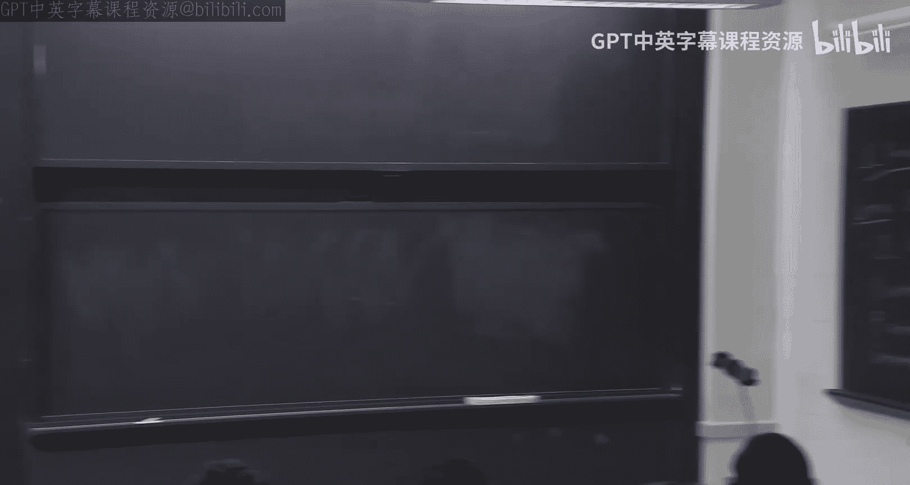
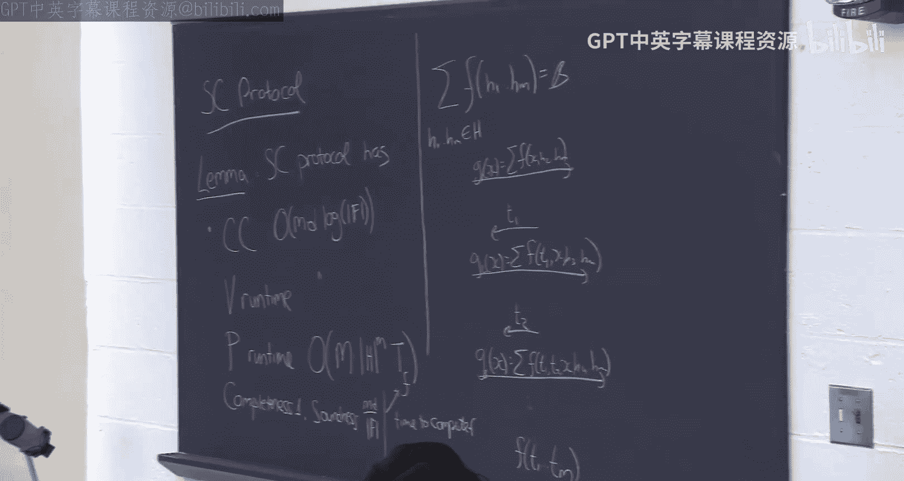

# 003：双高效交互式证明，第一部分

## 概述
在本节课中，我们将学习双高效交互式证明的核心概念，特别是低次扩展定理及其应用。我们将从回顾和校验协议开始，然后深入探讨低次扩展定理，并展示如何利用它和和校验协议为低深度电路构建双高效交互式证明。

---

## 回顾：和校验协议与双高效交互式证明

上一节我们介绍了交互式证明的概念，并展示了和校验协议。和校验协议是一种方法，用于证明一个多元多项式在一个小集合（例如布尔超立方体）上的和等于某个值。虽然计算这个和本身可能非常耗时（例如需要计算 `H^M` 次），但通过交互式证明，验证者可以在假设能高效计算该多项式在域中任意随机点上的值的前提下，非常高效地进行验证。

和校验协议是证明系统的基石，几乎每个证明系统都会用到它。它是一个非常优美的协议，我们将在整个课程中反复使用它。

接着，我们开始探讨双高效交互式证明的概念。在双高效交互式证明中，我们不仅关心验证者的运行时间，也关心证明者的运行时间。证明者虽然比验证者更强大，但我们不希望其计算开销过于巨大。

我们以计算图中三角形数量为例，开始展示如何构建双高效交互式证明，这通常通过低次扩展技术实现。

---

## 低次扩展定理

本节中，我们来看看低次扩展定理。这个定理在某种意义上赋予了和校验协议强大的能力。实际上，低次扩展定理与和校验协议相结合，几乎可以推导出一切。

**低次扩展定理** 表述如下：
设 `H` 是任意集合（例如 `{0,1}`），`M` 是一个正整数。对于任意函数 `f: H^M -> {0,1}`（可以将其视为定义在超立方体上的一组比特序列），以及任意包含集合 `H` 的有限域 `F`，存在一个**唯一**的多项式 `f̃: F^M -> F`，满足以下两个条件：
1.  **扩展性**：对于超立方体 `H^M` 中的所有点，`f̃` 的值与 `f` 完全相同。即，`∀ (h1,...,hM) ∈ H^M, f̃(h1,...,hM) = f(h1,...,hM)`。
2.  **低次数**：`f̃` 在每个变量上的次数最多为 `|H| - 1`。

**公式描述**：
`f̃` 可以显式地构造为：
`f̃(z1,...,zM) = Σ_{(h1,...,hM) ∈ H^M} f(h1,...,hM) * Π_{i=1}^{M} χ_{hi}(zi)`
其中，对于每个 `hi ∈ H`，`χ_{hi}(zi)` 是一个单变量多项式，满足在 `H` 上，当 `zi = hi` 时值为1，否则为0，并且其次数为 `|H|-1`。

**直观理解**：
你可以想象在某个超立方体（可以是布尔超立方体或更大的立方体）上有一组任意的比特序列。该定理指出，你可以将这个序列**唯一地**扩展为定义在整个大域 `F^M` 上的一个多项式，使得该多项式在原始超立方体上的值与原始序列完全一致，并且这个多项式在每个变量上的次数都很低（最多 `|H|-1`）。

**特殊情况**：
当 `H = {0,1}` 时，`|H|-1 = 1`。此时得到的扩展多项式在每个变量上都是线性的，因此被称为**多线性扩展**。

**重要性**：
这个定理的强大之处在于，它允许我们将任意、可能无结构的比特序列，转换成一个具有丰富代数结构的低次多项式。低次多项式具有很多良好的性质，例如，我们可以对其应用和校验等协议。

---

### 定理证明概要

**存在性与构造**：
上述给出的 `f̃` 的显式公式即是一个构造。可以验证，它在 `H^M` 上与 `f` 一致，并且每个变量 `zi` 的次数来自 `χ_{hi}(zi)`，即 `|H|-1`。

**唯一性**：
唯一性可以通过反证法和拉格朗日插值定理的唯一性来证明。假设存在两个不同的低次扩展多项式，它们的差 `G` 是一个在 `H^M` 上为零但不是零多项式的低次多项式。通过逐坐标归纳，利用单变量情形的唯一性，可以推导出矛盾，从而证明唯一性。

**关于计算效率的说明**：
需要注意的是，按照上述公式直接计算 `f̃` 在某个点上的值，需要对整个超立方体 `H^M` 进行求和，这通常是低效的（时间复杂度为 `O(|H|^M)`）。然而，在许多应用中，我们并不需要显式地计算整个多项式，而是利用其代数性质。对于某些具有特殊结构（例如来自浅层算术电路）的 `f`，可能存在更高效的计算其低次扩展的方法。

---

## 应用：三角形计数的双高效交互式证明（重温）

现在，让我们回到三角形计数的例子，看看如何结合低次扩展与和校验来构建双高效交互式证明。

**目标**：
证明者希望向验证者证明，在一个 `n` 个顶点的图 `G` 中，三角形的数量恰好是某个值 `β`。验证者只能运行 `O(n^2)` 时间（即大致读取图的大小），而证明者的计算也应尽可能高效。

**步骤**：
1.  **编码图为多项式**：将图的邻接矩阵编码为一个函数 `f: {0,1}^{log n} × {0,1}^{log n} -> {0,1}`，其中 `f(u,v)=1` 当且仅当存在边 `(u,v)`。这是一个定义在布尔超立方体上的函数。
2.  **低次扩展**：计算 `f` 的多线性扩展 `f̃`。这不会改变 `f` 在布尔超立方体上的值。
3.  **将计数问题表达为和**：图中三角形的数量可以表示为：
    `β = (1/6) * Σ_{i,j,k ∈ V} f̃(i,j) * f̃(j,k) * f̃(i,k)`
    这里 `i, j, k` 是顶点编号（`log n` 位字符串）。忽略常数因子 `1/6`，我们需要证明的和是 `Σ_{i,j,k} f̃(i,j) * f̃(j,k) * f̃(i,k)`。
4.  **应用和校验协议**：上述和式定义了一个关于 `3 log n` 个变量的多项式（每个 `f̃` 是多线性的，乘积后每个变量次数为2）。证明者声称这个和等于 `β`。双方可以运行和校验协议。
    *   **验证者效率**：在和校验协议的最后，验证者需要计算多项式在随机点 `(r1, r2, r3)` 上的值，即计算 `f̃(r1, r2) * f̃(r2, r3) * f̃(r1, r3)`。由于 `f̃` 是邻接矩阵的扩展，验证者可以通过查询原始的 `f`（即检查邻接关系）并利用低次扩展公式（虽然低效，但在此例中由于 `|H|^M = n^2`，验证者可以承受）或更聪明的方法来计算 `f̃` 在随机点上的值。总体验证时间约为 `O(n^2)`。
    *   **证明者效率**：证明者需要执行和校验协议中的计算，其复杂度与变量数和求和域大小相关，约为 `poly(n)`，对于多项式时间证明者是可行的。
    *   **通信复杂度**：和校验协议的轮数和通信量为 `O(log n)`。

**小结**：
这个例子展示了即使面对像邻接矩阵这样本身没有代数结构的对象，我们也可以通过低次扩展为其“注入”代数结构，进而利用和校验协议来构建关于其全局属性（如三角形计数）的高效证明系统。

---

## 迈向通用构造：GKR协议简介

上一节我们看到了一个具体问题的双高效证明。本节中，我们将探讨一个更通用的强大构造：**GKR协议**。该协议可以为任何**低深度电路**的计算提供双高效交互式证明。

**目标**：
对于一个规模为 `S`（门数量）、深度为 `D`（`D` 较小）的布尔电路 `C`，以及输入 `x`，证明者希望向验证者证明 `C(x) = 1`。验证者的运行时间应约为 `D * polylog(S)`，而证明者的运行时间约为 `poly(S)`。

**重要前提**：
为了使验证者高效，电路 `C` 必须具有简洁的表示（例如，是**对数空间均匀**的），即存在一个 `O(log S)` 空间的图灵机可以生成该电路的描述。否则，仅读取电路就需要 `O(S)` 时间。

---

### GKR协议核心思想

协议的核心思想是**逐层归约**。

1.  **电路预处理**：
    *   **分层**：假设电路是分层的，即第 `i` 层的门只连接到第 `i+1` 层的门。可以通过添加虚拟门使任意电路满足此条件。
    *   **算术化**：将电路中的布尔门（AND, OR）转换为算术域 `F` 上的加法门和乘法门。
2.  **为每一层编码**：
    *   证明者计算电路中每一层所有门在输入 `x` 下的取值。设第 `i` 层的取值构成一个函数 `V_i: H^M -> {0,1}`，其中 `|H|^M ≈ S`，每个门有一个在 `H^M` 中的唯一标签。
    *   证明者为每一层计算其低次扩展 `Ṽ_i`。
3.  **交互式归约**：
    *   协议从输出层（第0层）开始。证明者声称 `Ṽ_0(z_0) = 1`（对于某个特定的 `z_0`，代表输出门）。
    *   验证者并不直接相信。协议将进行 `D` 轮子协议，每一轮将一个关于第 `i` 层的声称，归约到关于第 `i+1` 层的一到两个声称。
    *   **归约的关键等式**：利用电路的连线关系，`V_i` 中一个门 `p` 的值可以表示为第 `i+1` 层中某些门值的函数（加法或乘法）。通过低次扩展，可以将关于 `Ṽ_i(z_i)` 的声称，转化为一个关于 `Ṽ_{i+1}` 在多个点上的值的求和形式。
    *   **应用和校验**：上述求和形式正好是和校验协议可以处理的。双方运行和校验协议，将“`Ṽ_i(z_i) = 某值`”的声称，转化为验证者需要检查“某个包含 `Ṽ_{i+1}` 的复杂多项式在随机点 `(r1, r2, r3)` 上的值等于某值”。
    *   **提取新声称**：为了完成检查，验证者需要知道 `Ṽ_{i+1}(r1)` 和 `Ṽ_{i+1}(r2)` 的值。他要求证明者提供这些值。如果最初的声称是假的，那么通过和校验的声音性，最终验证者要检查的等式很可能是假的。如果证明者提供真实的 `Ṽ_{i+1}` 值，验证者计算后会发现问题，从而拒绝。因此，作弊的证明者很可能被迫提供假的 `Ṽ_{i+1}` 值。这样，我们就将一层的一个假声称，归约到了下一层的一到两个假声称。
4.  **最终检查**：
    *   经过 `D` 轮归约，我们到达输入层（第 `D` 层）。此时验证者需要检查关于 `Ṽ_D`（即输入 `x` 的低次扩展）在某些点上的声称。
    *   由于输入 `x` 是公开的，验证者可以自己高效地计算 `Ṽ_D` 在任何点上的值（因为输入层的低次扩展可以直接由 `x` 计算）。验证者进行本地检查，如果所有归约过程中得到的声称都通过检查，且最终的输入层声称也正确，则接受证明。

**协议效率**：
*   **验证时间**：每轮归约主要是一个和校验协议，验证者需要计算电路连线函数的低次扩展（`add_i` 和 `mult_i`）在随机点上的值，以及最后检查输入层。对于均匀电路，这些计算可以在 `polylog(S)` 时间内完成。总共 `D` 轮，因此总验证时间为 `D * polylog(S)`。
*   **证明者时间**：证明者需要计算每一层的低次扩展，并执行和校验中的计算，总时间约为 `poly(S)`。
*   **通信复杂度**：每轮和校验通信 `polylog(S)`，共 `D` 轮，总通信为 `D * polylog(S)`。

**待解决的问题**：
在上述描述中，我们假设验证者能够高效计算电路连线函数的低次扩展 `add_i` 和 `mult_i`。这对于均匀电路是可能的，但需要额外的机制。我们将在下一节课中详细讨论如何解决这个问题，从而完成GKR协议的完整描述。

---

## 总结

本节课中我们一起学习了双高效交互式证明的核心基础。
1.  我们首先回顾了强大的**和校验协议**。
2.  接着，我们深入探讨了**低次扩展定理**，它能够将任意比特序列唯一地扩展为低次多项式，从而为应用和校验等代数工具铺平道路。
3.  我们通过**三角形计数**的例子，演示了如何结合低次扩展与和校验来为特定问题构建双高效证明。
4.  最后，我们介绍了**GKR协议**的宏伟蓝图。该协议利用低次扩展和和校验，通过逐层归约，为任何低深度、均匀电路的计算结果构建了双高效交互式证明。验证者时间仅与电路深度呈线性关系，而与电路规模呈对数多项式关系，这为实现高度可扩展的验证奠定了基础。

在下一讲中，我们将完成GKR协议的细节，特别是解决验证者如何高效计算电路连线函数低次扩展的问题，并进一步探讨其应用和变种。