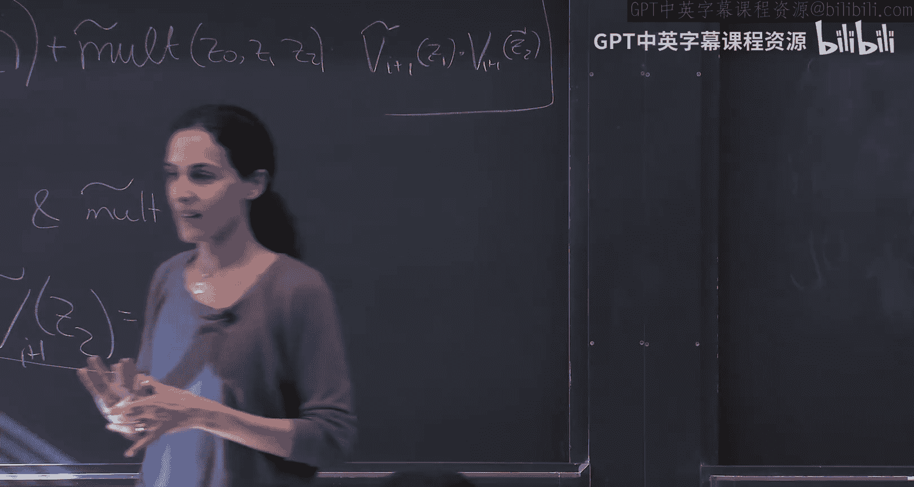

# 004：双高效交互式证明（第二部分）

在本节课中，我们将继续学习GKR协议，深入探讨如何将单点验证问题转化为多点验证问题，并分析协议的安全性、复杂度以及具体实现细节。

---

## 协议核心思路回顾

上一节我们介绍了如何利用和校验协议将电路某一层的单点验证问题，转化为对下一层两个点的验证问题。本节中，我们来看看如何处理由此产生的两个验证问题。

我们面临的核心问题是：验证者声称电路第 `i` 层扩展多项式在点 `Z_i*` 的值为 `V_i*`。通过和校验协议，我们将其转化为需要验证第 `i+1` 层扩展多项式在两个随机点 `Z1` 和 `Z2` 上的值 `V_{i+1,1}` 和 `V_{i+1,2}`。

验证者无法独立计算这些值，因此需要证明者提供。如果证明者诚实，验证者将能发现初始声明的错误；如果证明者作弊，则他必须提供错误的 `V_{i+1,1}` 或 `V_{i+1,2}` 值，否则会被和校验协议当场揭穿。这就将一个关于第 `i` 层的错误声明，转化为了关于第 `i+1` 层的（至少）一个错误声明。

## 从两个声明到更多声明？一个巧妙的观察

一个自然的担忧是：从一个声明变成两个，是否会像滚雪球一样，在下一层变成四个，再下一层变成八个，导致声明数量指数级增长？

答案是否定的。这里的关键在于 **并行执行** 和 **复用随机数**。

以下是GKR协议的处理方式：

1.  对于第 `i` 层产生的两个声明（分别关于点 `Z1` 和 `Z2`），我们并行地执行两个和校验协议。
2.  至关重要的是，这两个并行的和校验协议使用 **完全相同** 的随机数序列 `(r0, r1, r2, ...)`。
3.  每个和校验协议最终都会要求验证者检查一个形如 `F_{i+1}(Z*, r0, r1, r2)` 的值。由于随机数相同，验证者需要检查的两个点分别是 `F_{i+1}(Z1, r0, r1, r2)` 和 `F_{i+1}(Z2, r0, r1, r2)`。
4.  要计算这两个值，验证者唯一不知道的是第 `i+2` 层扩展多项式在点 `Z1` 和 `Z2` 的值。因此，他只需向证明者索要这两个值。

通过这种方式，我们从第 `i` 层的两个声明，又得到了第 `i+1` 层的两个声明。声明数量始终保持为两个，而不会增长。

## GKR协议流程总结

综上所述，完整的GKR协议可以概括为以下步骤：

1.  **初始化**：证明者声称电路输出（第0层）为某个值 `V_0*`。
2.  **迭代和校验**：对于每一层 `i`（从0到深度 `d-1`）：
    *   验证者与证明者并行执行两个和校验协议（使用相同的随机数），以验证从第 `i` 层到第 `i+1` 层的两个声明。
    *   每个和校验协议最终将验证任务简化为检查一个形如 `F_{i+1}(Z, r)` 的值。
    *   为了完成检查，验证者要求证明者提供第 `i+2` 层扩展多项式在特定点 `Z1` 和 `Z2` 的值。
3.  **最终验证**：到达最底层（输入层）后，验证者获得了关于输入层扩展多项式在两个点 `Z_{d,1}` 和 `Z_{d,2}` 的声明值 `V_{d,1}` 和 `V_{d,2}`。
    *   验证者可以自行高效计算低次扩展多项式在这两个点的真实值，因为输入层数据 `(x1, ..., xn)` 是已知的，且计算仅涉及 `n` 个项的加权和。
    *   验证者比较计算出的真实值与证明者提供的声明值。如果匹配，则接受证明；否则拒绝。

## 协议复杂度分析

以下是GKR协议各方的复杂度：

*   **通信复杂度**：共有 `d` 层，每层进行两次和校验。每次和校验的通信量为 `O(m * log|F|)`，其中 `m ≈ log S / log log S`（变量数），`d ≈ log S`（深度）。因此总通信复杂度为 `d * polylog(S) = polylog(S)`。
*   **验证者时间复杂度**：验证者主要工作是参与 `d` 次和校验，以及在最后计算两次输入层的低次扩展。每次和校验验证者只需做少量工作，最终计算复杂度为 `O(n * polylog(S))`，其中 `n` 为输入大小。通常 `n << S`，因此验证者总时间为 `polylog(S)`。
*   **证明者时间复杂度**：证明者需要为每层计算和校验中的多项式，这需要对所有门进行求和，时间复杂度为 `poly(S)`。

## 协议安全性（健全性）证明

我们简要分析GKR协议的健全性。假设存在一个作弊的证明者 `P*` 能够以概率 `ε` 让验证者接受一个错误的声明。

我们定义“坏事件” `B_i`：在第 `i-1` 层，至少有一个声明是假的；但在执行完第 `i` 层的和校验后，第 `i` 层的两个声明都变成了真的。

如果作弊成功，那么从初始的假声明到最终验证者自行验证为真的声明之间，必然至少发生了一次 `B_i` 事件。因此，作弊成功的概率 `ε` 不超过所有 `B_i` 事件发生概率之和。

现在分析单个 `B_i` 事件的概率。以 `B_{i,1}` 为例，它表示第 `i-1` 层的第一个声明是假的，但经过第 `i` 层的第一个和校验后，第 `i` 层的对应声明变成了真的。这**恰好意味着证明者在第一个和校验协议中作弊成功**。根据和校验协议本身的健全性，在随机挑战下，作弊成功的概率至多为 `(deg * m) / |F|`，其中 `deg` 为多项式次数，`m` 为变量数。

因此，每个 `B_{i,b}` 的概率上界为 `polylog(S) / |F|`。通过并集界限，总作弊概率 `ε` 的上界约为 `(d * polylog(S)) / |F|`。只要我们选取足够大的有限域 `F`（其大小 `|F|` 为 `poly(S)` 量级），就可以使 `ε` 变得可忽略不计。

关于并行使用相同随机数的安全性：安全性分析中我们对两个和校验协议分别应用了健全性界限，并通过并集界限合并风险。即使两个协议的结果存在关联，只要其中一个协议被成功作弊，就足以触发坏事件，因此并集界限足以覆盖这种风险。

## 协议的关键属性与扩展讨论

GKR协议以“黑盒”方式使用和校验协议，它只要求和校验协议满足一个关键属性：协议最终将验证任务简化为由验证者选择随机点，并检查原函数在该点的值。

关于扇入（fan-in）：我们的讨论假设电路扇入为2。对于更大扇入 `k` 的电路，和校验协议会将一个声明转化为 `k` 个声明。只要 `k` 是 `polylog(S)` 量级，协议依然有效，通信复杂度会乘以 `k`，但整体仍可能保持在对数级别。更大的扇入意味着更浅的电路深度，需要在深度和每层宽度之间进行权衡。

---

本节课中我们一起学习了GKR协议如何通过并行和校验将验证问题逐层下推，并始终保持恒定的声明数量。我们分析了协议的详细流程、计算与通信复杂度，并探讨了其健全性证明的核心思想。GKR协议巧妙地结合了低次扩展与和校验，实现了验证者时间与通信量均为亚线性的高效交互式证明。