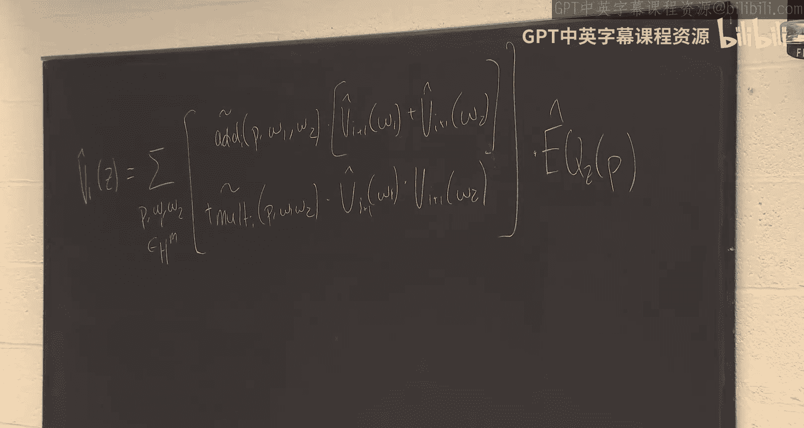
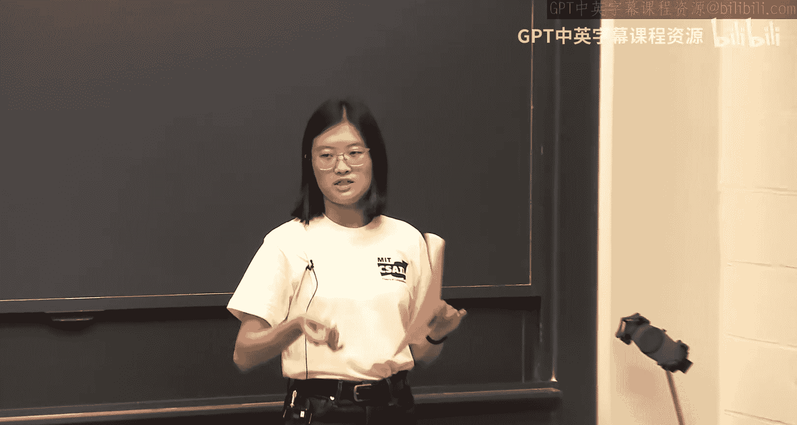
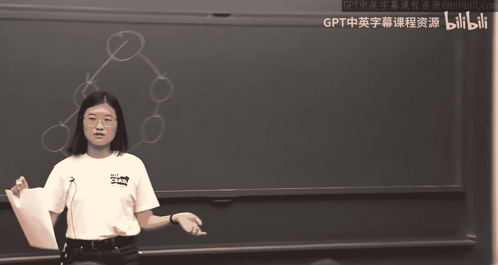
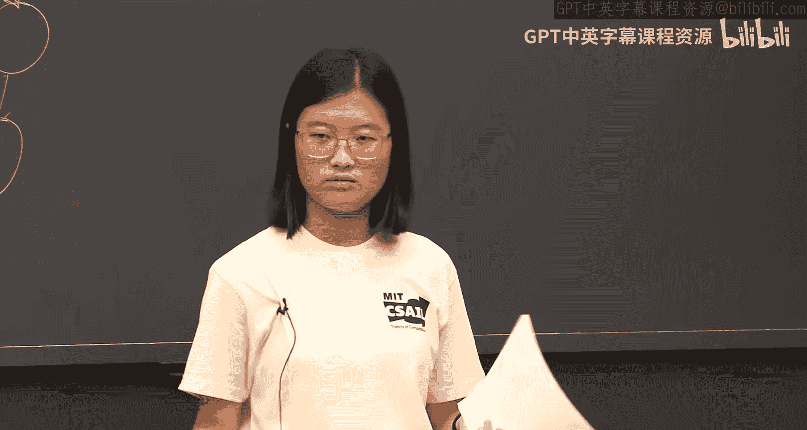
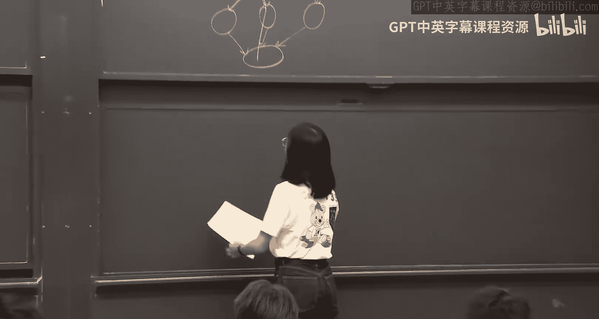
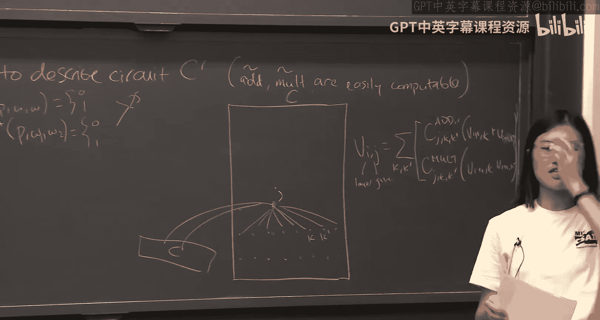
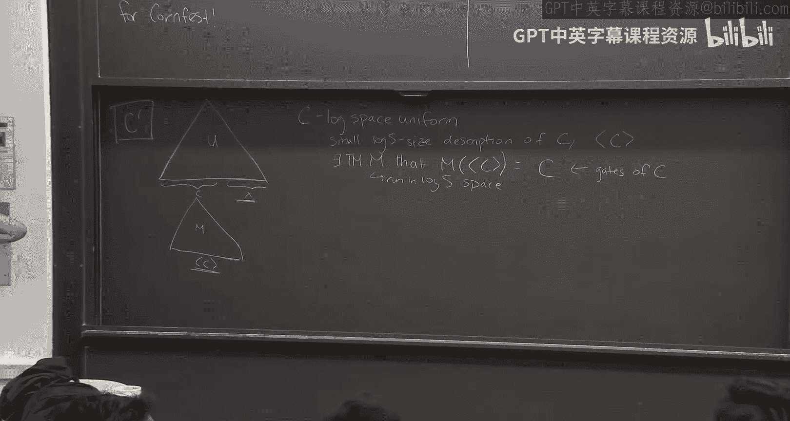
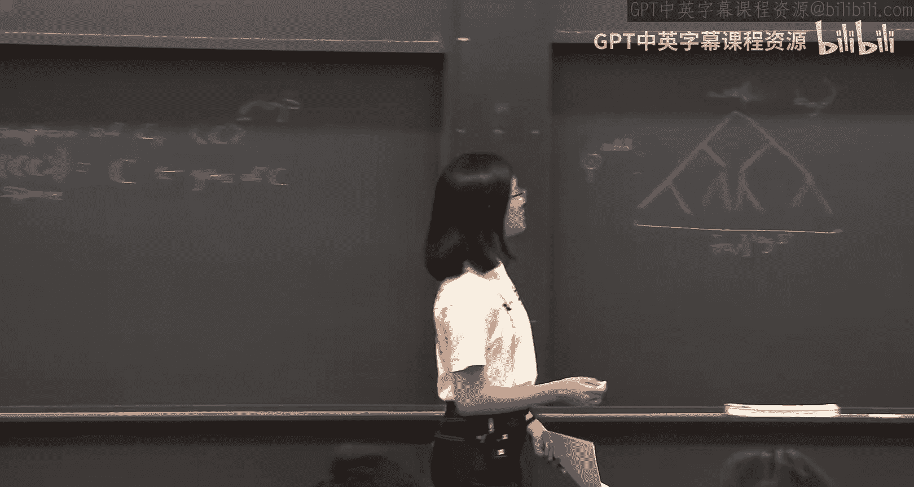
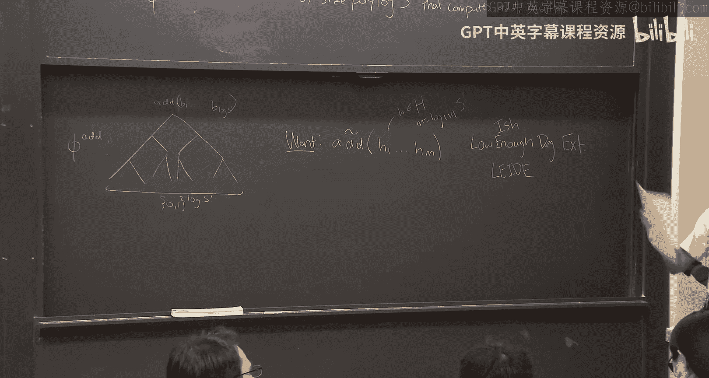
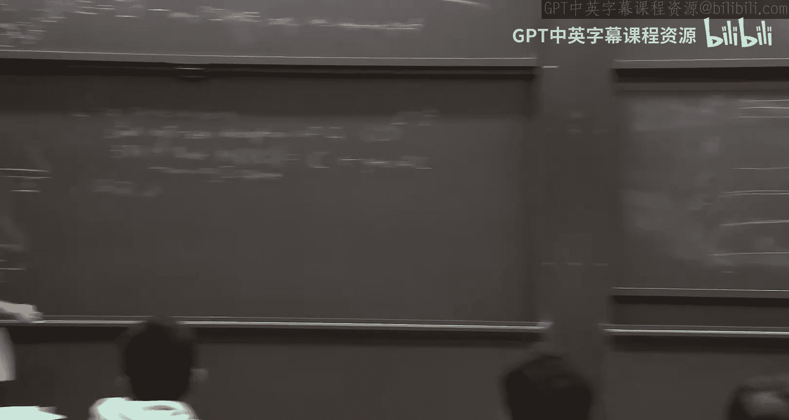

# 005：GKR协议续篇及其推论 🧠


在本节课中，我们将继续深入探讨GKR协议，学习如何解决协议中的关键问题，并了解其一个重要的应用：为多项式空间（PSPACE）计算构建高效的交互式证明系统。


## 概述：GKR协议回顾






上一节我们介绍了GKR协议的核心思想：证明者（Prover）可以将一个深度为`d`、规模为`S`的电路`C`的计算委托给验证者（Verifier）。协议通过将电路每一层的门值进行**低次扩展**，并利用求和检查协议（Sum-Check Protocol）将关于高层输出的声明，逐步归约到关于底层输入的声明。最终，验证者可以自行检查输入层的低次扩展值。








然而，我们遗留了两个关键问题：
1.  验证者如何高效地计算加法门和乘法门（`add`/`mult`）的**低次扩展**？之前我们假设验证者拥有这些函数的预言机（oracle）访问权限。
2.  当电路的描述`C`本身很大时，如何保持验证者的高效性？

本节中，我们将首先解决这两个问题，然后展示GKR协议的一个强大推论。

## 问题一：如何获取门函数的低次扩展？ 🔧

在原始的GKR协议中，验证者需要知道加法门和乘法门函数的低次扩展。直接计算这些函数的**规范低次扩展**（Canonical Low-Degree Extension）可能非常复杂。



以下是两种可能的解决方案：

**方案A：递归委托**
我们可以将`add`/`mult`门电路本身视为一个需要被验证的计算，并递归地对其应用GKR协议。这是原始GKR论文中的方法。

**方案B：使用更简单的电路进行计算（本节课采用的方法）**
我们用一个**更易于描述**的电路来替代原始电路`C`，这个新电路的`add`/`mult`门函数更容易计算。

### 引入通用电路（Universal Circuit）


核心思想是构造一个**通用电路** `U`。这个电路以原始电路`C`的描述和输入`x`作为其输入，并模拟`C`在`x`上的计算，最终输出`C(x)`。


```
U(description_of_C, x) = C(x)
```

这个通用电路`U`的关键优势在于，它的`add`/`mult`门功能比原始电路`C`的对应功能**更容易描述**。具体来说，对于`U`中的任何一个门，判断它是加法门还是乘法门，可以通过一个规模仅为**polylog(S)** 的**布尔公式**来完成。



这意味着验证者可以**自行高效地计算**这些布尔公式在特定点上的值，从而绕过了直接计算复杂低次扩展的难题。

### 算术化布尔公式

然而，GKR协议需要的是在**大域**上的多项式，而不是布尔值。因此，我们需要将判断门类型的布尔公式进行**算术化**。



以下是算术化的步骤：
1.  **编码输入**：将来自大域`H`的门索引（例如`p`, `ω1`, `ω2`）通过低次多项式编码为一串比特（0/1）。
2.  **算术化**：将布尔公式中的`AND`门替换为乘法（`a * b`），将`OR`门替换为`a + b - a*b`。
3.  **得到多项式**：最终我们得到一个多项式，其次数约为`(公式深度) * |H|`。这个多项式虽然不是`add`/`mult`函数的规范低次扩展，但它与规范扩展在超立方体`H^m`上取值相同，并且其次数足够低，可以用于后续的求和检查协议。




通过这种方式，验证者就获得了计算`add`/`mult`“类低次扩展”值的能力。

## 问题二：如何处理大型电路描述？ 📦

当我们使用通用电路`U`时，输入变成了`(description_of_C, x)`。如果`C`的描述非常庞大（例如规模为`S`），那么验证者在最终检查输入层时，需要计算规模为`S`的向量的低次扩展，这将是低效的。

解决方案依赖于电路`C`是**对数空间均匀的**这一假设。这意味着存在一个图灵机`M`，它仅使用`O(log S)`的空间，就能在给定索引时输出电路`C`中任意门的描述。

我们可以将这个图灵机`M`本身**转换成一个电路**，并把它作为我们最终要委托的计算电路`C'`的一部分。

```
C'(short_description_of_C, x) = U(M(short_description_of_C), x) = C(x)
```

现在，整个委托电路的输入仅仅是`C`的简短描述（长度为`O(log S)`）和原始输入`x`。验证者需要处理的输入规模大大减小。

### 关键：保持电路深度为对数级

一个技术挑战是：将运行时间可能为`2^S`的对数空间图灵机`M`转换成电路时，如何避免电路深度达到`O(S)`？

这里的技巧是**利用配置图（Configuration Graph）和矩阵幂运算**。
1.  将图灵机`M`在空间`S`上的所有可能配置视为节点。
2.  构造一个邻接矩阵`A`，其中`A[i][j]=1`当且仅当配置`i`能在一步内转移到配置`j`。这个矩阵`A`很容易被一个小电路计算。
3.  计算`A^T`（`T`是时间上限，例如`2^S`）。`A^T[i][j]`表示从配置`i`出发，经过恰好`T`步能否到达配置`j`。
4.  计算`A^T`可以通过重复平方（`A -> A^2 -> A^4 -> ... -> A^T`）来实现，这只需要`O(log T)`层的矩阵乘法。

最终，我们得到一个规模为`poly(S)`、深度仅为`O(log S)`的电路`C'`，它完美适用于GKR协议。

## 推论：GKR为PSPACE提供高效交互式证明 🚀

本节课最后，我们探讨GKR协议的一个深刻推论。我们知道IP = PSPACE（Shamir, 1992），即所有多项式空间可判定的语言都存在交互式证明。然而，早期的证明构造中，证明者的运行时间可能高达`2^(S^2)`，远大于单纯计算所需的时间`2^S`。


利用我们刚刚构建的GKR协议，我们可以为任何多项式空间计算（由空间界限为`S`的图灵机`M`定义）获得一个**证明者运行时间接近最优**的交互式证明系统。

**构造思路如下：**
1.  给定一个空间界限为`S`的图灵机`M`和输入`x`，我们按照上述方法，构造一个模拟`M(x)`计算、深度为`O(log S)`、规模为`poly(S)`的电路`C'`。
2.  对此电路`C'`运行GKR协议。
3.  根据GKR协议的性质：
    *   **证明者**运行时间为`poly(S)`。
    *   **验证者**运行时间为`d * polylog(S) + O(n * polylog(S))`，其中`d = O(log S)`，因此验证者也是高效的。



这个结果表明，对于多项式空间计算，我们确实存在证明者时间与计算时间相近（均为`2^O(S)`量级）的高效交互式证明系统，这比早期结果有了显著改进。

## 总结

本节课中我们一起学习了：
1.  **解决门函数计算**：通过引入通用电路和算术化小型布尔公式，使验证者能够自行高效计算`add`/`mult`门的类低次扩展值。
2.  **处理大型输入**：通过对数空间均匀性假设，将庞大的电路描述压缩，并利用配置图和矩阵幂技巧，构造出深度仅为对数级的等效电路。
3.  **强大推论**：将上述技术应用于多项式空间计算，基于GKR协议构建了证明者时间接近最优的交互式证明系统，展示了GKR协议的理论威力。

这些技术不仅完善了GKR协议本身，也为我们理解高效计算验证的可能性提供了重要工具。