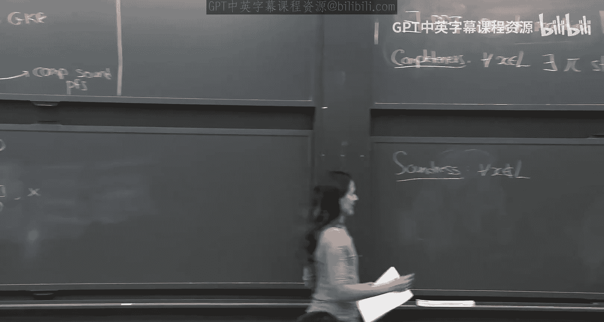
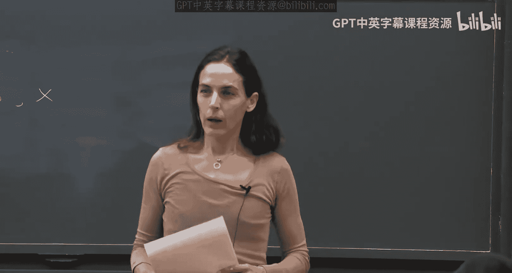

# 006：通过GKR和交互式论证构建PCP，第一部分

在本节课中，我们将学习一个非常有趣的新概念——概率可检查证明。我们将定义这个概念，并展示如何从GKR协议构造它。课程的第二部分将首次引入密码学，探讨一种新的可靠性概念——计算可靠性论证。

## 概述：什么是概率可检查证明？

概率可检查证明旨在将传统的证明转换为一种新的形式。传统证明中，验证者需要读取整个证明并进行计算。PCP的目标是生成一个可能更长的证明，但验证者只需随机查询其中极少数的几个位置，就能以高概率判断证明的有效性。

具体来说，对于语言L中的一个实例x，存在一个证明π。验证者V可以随机选择查询π中的几个比特，然后运行一个仅依赖于这些比特的验证电路。如果x在语言L中，则存在π使V以概率至少C接受；如果x不在L中，则对于任何π，V接受的概率至多为S。理想情况下，我们希望C=1，S=0。

目前已知的构造非常强大：可以将任何证明转换为一个PCP，使得验证者只需读取**3个比特**就能以一定的概率（例如7/8）被说服。本节课我们将构造一个查询复杂度为 **polylog(n)** 的PCP。

## 从GKR协议构造PCP

我们将展示如何利用之前学过的GKR交互式证明协议来构造PCP。其核心思想是将GKR协议中“证明者”的所有可能应答策略完全展开并编码到PCP字符串中。

### 回顾GKR协议

首先，我们快速回顾GKR协议。我们有一个验证电路C，其输入为见证w。电路是分层且深度D较小的（例如polylog(n)）。在GKR中：
1.  对于电路的每一层i，我们计算该层所有导线值的低次扩展 $\tilde{V}_i$。
2.  协议由2D个和校验协议组成，从输出层开始，逐层向下验证，直到输入层。
3.  每个和校验协议将验证层i上某点 $\tilde{V}_i(z)$ 的声称值，归结为验证层i-1上两个点的值。

### PCP的构造

现在，我们构造PCP证明π。证明者拥有见证w，并希望证明x ∈ L。

**PCP包含以下部分：**
1.  **电路各层的低次扩展**：对于每一层i（从输入层0到输出层D），以及域F^m中的每一个点z，计算并包含值 $\tilde{V}_i(z)$。这确保了验证者可以查询任何点的扩展值，而无需自己计算。
2.  **所有可能的和校验协议转录**：对于每一层i、每一个点z，以及和校验协议中验证者所有可能的随机选择 $r_1, ..., r_{3m}$（其中m是维度），证明者预先计算并包含证明者在相应轮次中应发送的所有应答（即单变量多项式）。这形成了一个巨大的树状结构，但由于参数设置（F的大小为polylog(n)，m约为log n / log log n），整个树的大小仍然是多项式级别的。

**验证者的操作：**
验证者V模拟与GKR证明者的交互，但“证明者”的策略已经编码在PCP π中。
1.  V首先查询输出层 $\tilde{V}_D$ 在特定点的值，确认其为1（接受状态）。
2.  接着，V像在GKR协议中一样，为第一个和校验协议生成随机数 $r_1, ..., r_{3m}$。
3.  V根据这些随机数，查询PCP中对应的应答（即多项式）。
4.  在每轮和校验后，V会得到对下一层某点 $\tilde{V}_{i-1}(z‘)$ 的声称值。V可以查询PCP中存储的 $\tilde{V}_{i-1}(z‘)$ 来验证一致性。
5.  重复此过程，经过2D个和校验后，最终到达输入层。V需要验证输入层的低次扩展 $\tilde{V}_0$（即见证w的扩展）是否正确。由于V本身知道实例x，他可以通过计算x和w的联合低次扩展的某个点来进行检查（这需要查询PCP中 $\tilde{V}_0$ 的少数点并自行计算）。

### 可靠性与复杂度分析

**完备性：** 如果证明者诚实构造PCP（基于有效的见证w），那么GKR协议的所有步骤都会通过，验证者总是接受。因此完备性为1。

**可靠性：** 如果一个实例x不在语言L中，那么任何PCP π都必须尝试“欺骗”。要成功欺骗验证者，就必须在2D个和校验协议中的至少一个上成功作弊。每个和校验协议的可靠性误差约为 `(3m * |H|) / |F|`。通过联合界，总的可靠性误差上界为 `2D * (3m * |H|) / |F|`。通过设置域F的大小 `|F|` 远大于 `D * m * |H|`（这仍然是polylog(n)量级），我们可以将可靠性误差降至1/2或更小。

**查询复杂度：** 验证者需要进行2D个和校验，每个和校验需要读取O(m)个应答，每个应答是一个低次多项式，需要读取多个域元素来评估。总的查询比特数是 `polylog(n)`。

**随机性复杂度：** 验证者为每个和校验生成 `O(m * log|F|)` 比特的随机数，总共也是 `polylog(n)` 比特。

### 关于低次测试的说明

一个关键点是，验证者必须确保PCP中提供的 $\tilde{V}_i$ 确实是某个低次多项式的值，而不仅仅是任意值。在标准的PCP构造中，这需要一个独立的“低次测试”。然而，在我们从GKR衍生的构造中，**GKR协议本身间接地充当了低次测试**。因为如果 $\tilde{V}_i$ 不是低次的，那么在后续的和校验协议中，证明者将很难保持一致性并被发现的概率很高。因此，我们不需要在PCP验证中显式地加入额外的低次测试步骤。

## 总结

本节课中，我们一起学习了概率可检查证明这一强大概念。我们看到了如何将GKR交互式证明协议“非交互化”和“编译”成一个PCP字符串。通过巧妙的参数设置（选择适当的域大小和维度），我们构造出的PCP具有以下性质：
*   **完备性**为1。
*   **可靠性**可降至1/2（通过重复可进一步降低）。
*   **验证者**只需进行 `polylog(n)` 次查询，使用 `polylog(n)` 比特的随机数。
*   **证明者**可以高效地从有效见证w生成PCP π。

这个构造展示了和校验协议以及GKR协议的基础性作用，它们不仅是简洁交互式证明的核心，也是构建高级密码学原语（如PCP）的基石。在下一部分，我们将探讨如何利用PCP进入密码学领域，并引入基于计算安全性的论证系统。