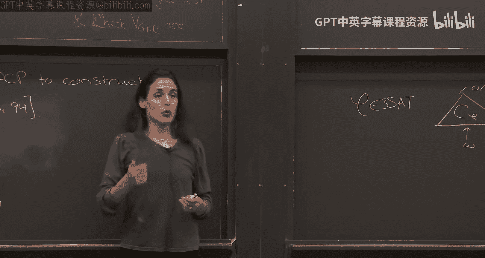
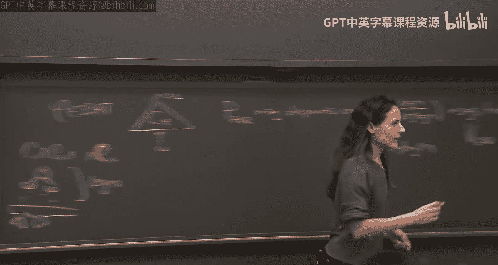
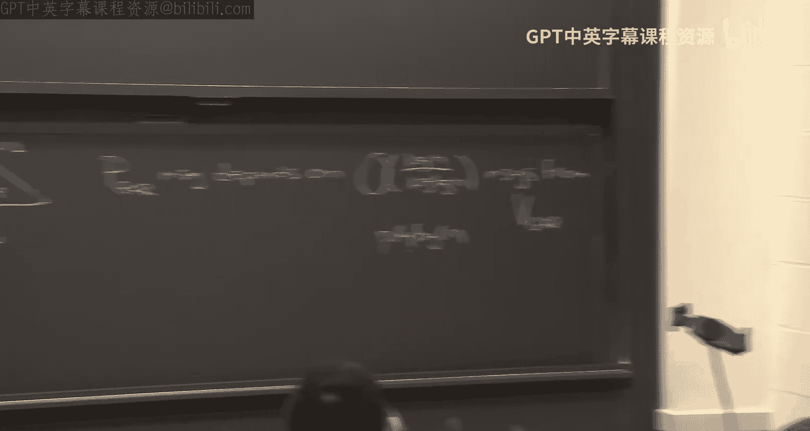

# 008：Kilian-Micali协议，第一部分

## 概述
在本节课中，我们将学习如何利用概率可检查证明和密码学原语，构造简洁的交互式论证系统。我们将首先回顾PCP的构造思路，然后介绍一种支持局部打开的碰撞抵抗哈希函数，并展示如何将它们结合，构建出著名的Kilian-Micali协议。

---

## 回顾：从GKR协议到PCP

上一节我们介绍了如何利用GKR协议构造概率可检查证明。本节中，我们来看看其核心思路和需要解决的问题。

给定一个NP语言，例如3SAT，我们有一个见证或证明。PCP的目标是将这个证明扩展得更长，但验证时只需读取其中少数几个位置。我们通过模拟GKR协议来构造PCP。

具体来说，给定一个3SAT实例，我们构造一个检查见证是否满足的电路。这个电路深度很低。然后，我们“在脑海中”运行GKR协议。证明者需要为验证者所有可能的问题写下答案，形成一个巨大的树状结构。然而，由于GKR协议中证明者的消息仅依赖于验证者最近的少数消息，这个展开的树实际上只有多项式大小。

PCP包含见证的低次扩展，以及针对所有可能验证者询问的答案。验证时，验证者模拟GKR验证者，随机选择问题并检查PCP中对应的答案，最后还需要检查输入（即见证的低次扩展）在一个随机点上的值。

这里存在一个问题：如果恶意证明者提供的不是某个向量的低次扩展，而是一个高次多项式，那么安全性可能被破坏。因此，验证者需要额外进行一个“低次测试”，以确保提供的函数接近某个低次多项式。这部分内容将在作业中涉及。

PCP虽然庞大，但验证只需读取`polylog(n)`个位置，是指数级的改进。然而，PCP需要提前提交给验证者，验证者再对其进行查询，这一点对安全性至关重要。如果证明者能根据查询动态选择答案，整个系统就会崩溃。

---

## 从PCP到简洁论证：引入密码学

上一节我们得到了一个庞大的PCP，但验证者可能无法存储它。本节中，我们来看看如何利用密码学技术来“压缩”这个证明。

我们使用密码学，特别是碰撞抵抗哈希函数，来压缩这个庞大的证明。但一旦引入密码学，我们就无法保证对抗计算能力无界的敌手的安全性，因此需要将证明系统的概念放宽为**计算可靠**的证明系统，即交互式论证。

一个针对语言L的交互式论证是一个在证明者和验证者之间的协议。完备性要求：如果x在L中且证明者持有有效见证，则验证者以概率1接受。可靠性（计算可靠性）则要求：对于任何在安全参数λ下规模为多项式的作弊证明者P*，对于任何x（可能不在L中），P*说服验证者接受的概率是可忽略的。

这里的安全参数λ通常与实例大小n有关。为了使定义有意义，我们可能需要更强的密码学假设（例如亚指数级硬度），以允许λ比n小得多（例如`polylog(n)`），同时保证对抗运行时间为`poly(n)`的敌手的安全性。

我们的目标是：为所有NP语言构造一个简洁的交互式论证。我们希望通信复杂度仅随安全参数λ增长，而不是随实例大小n增长。

---

## 核心工具：支持局部打开的碰撞抵抗哈希函数

为了构造上述协议，我们需要一个关键的密码学原语：**支持局部打开的碰撞抵抗哈希函数**。它由以下算法构成：

1.  **生成(Gen)**：输入`1^λ`，输出哈希密钥`hk`。
2.  **求值(Eval)**：输入哈希密钥`hk`和任意字符串`x ∈ {0,1}^*`，输出哈希值`v ∈ {0,1}^λ`。
3.  **打开(Open)**：输入哈希密钥`hk`、字符串`x`、索引`i`（`1 ≤ i ≤ |x|`），输出一个比特`b = x_i`和一个打开证据`ρ`。
4.  **验证(Verify)**：输入哈希密钥`hk`、哈希值`v`、索引`i`、比特`b`、打开证据`ρ`，输出0或1（接受或拒绝）。

它需要满足以下性质：
*   **正确性**：对于所有由Gen生成的`hk`，所有`x`（满足`|x| ≤ 2^λ`），所有索引`i`，有 `Verify(hk, Eval(hk, x), i, x_i, Open(hk, x, i)) = 1`。
*   **碰撞抵抗性（局部打开版本）**：对于任何在时间`T(λ)`内的敌手A，以下概率可忽略：敌手在获得随机`hk`后，能输出`(v, i, ρ0, ρ1)`，使得对于`b ∈ {0,1}`，都有 `Verify(hk, v, i, b, ρb) = 1`。这意味着，对于给定的哈希值`v`和索引`i`，敌手无法同时为比特0和1生成有效的打开证据。

---

## Kilian-Micali 协议构造

现在，我们利用PCP和支持局部打开的碰撞抵抗哈希函数来构造简洁的交互式论证，即Kilian-Micali协议。假设我们有一个针对NP语言（如3SAT）的PCP系统，其完备性为1，可靠性为可忽略函数。

**协议步骤：**

1.  **公共输入**：安全参数`1^λ`，问题实例`x`（例如一个3SAT公式）。证明者P私有输入：见证`w`。
2.  **第一轮（验证者 → 证明者）**：验证者运行`Gen(1^λ)`生成哈希密钥`hk`，并发送给证明者。
3.  **第二轮（证明者 → 验证者）**：
    *   证明者使用见证`w`生成对应的PCP字符串`π`。
    *   证明者计算哈希值 `v = Eval(hk, π)`。
    *   证明者将`v`发送给验证者。
4.  **第三轮（验证者 → 证明者）**：验证者运行PCP验证算法（针对实例`x`），生成一组要查询的索引`I = (i1, i2, ..., iL)`，其中`L`是查询次数。验证者将`I`发送给证明者。
5.  **第四轮（证明者 → 验证者）**：
    *   对于每个查询索引`ij`，证明者从PCP字符串`π`中取出对应的比特 `b_j = π[ij]`。
    *   证明者计算打开证据 `ρ_j = Open(hk, π, ij)`。
    *   证明者将所有的`(b_j, ρ_j)`对发送给验证者。
6.  **验证**：验证者执行两项检查：
    *   **PCP验证**：使用实例`x`和收到的比特`(b1, ..., bL)`，运行PCP验证算法，检查是否接受。
    *   **哈希打开验证**：对于每个`j`，运行 `Verify(hk, v, ij, b_j, ρ_j)`，检查是否全部接受。
    当且仅当两项检查都通过时，验证者才接受。

**协议分析：**
*   **完备性**：如果证明者诚实，且`x`在语言中并拥有有效见证`w`，那么构造的PCP `π`将通过PCP验证。同时，根据哈希函数的正确性，所有打开证据也会被验证通过。因此，验证者以概率1接受。
*   **简洁性**：验证者发送的消息是`hk`（大小`poly(λ)`）和索引集合`I`（大小`poly(λ)`）。证明者发送的消息是哈希值`v`（大小`λ`）和打开证据对（总大小`poly(λ)`）。因此，通信复杂度为`poly(λ)`。如果设置`λ = polylog(n)`，则通信复杂度为`polylog(n)`，实现了简洁性。
*   **可靠性（直观）**：如果一个作弊证明者对于不在语言中的`x`能以不可忽略的概率`ε`让验证者接受，那么我们可以利用它来破坏哈希函数的碰撞抵抗性。核心思想是：多次“回滚”并询问作弊证明者。如果它能在不同次询问中为同一个位置`i`打开成不同的比特（0和1），我们就直接找到了哈希函数的碰撞。如果它总是为同一位置打开相同的比特，那么这些响应实际上定义了一个（部分定义的）PCP字符串。由于作弊证明者成功概率为`ε`，这个PCP字符串被PCP验证者接受的概率也约为`ε`，这与PCP系统的可靠性（接受假陈述的概率可忽略）相矛盾。因此，作弊证明者成功意味着必然能以高效的方式找到哈希碰撞，这与我们的密码学假设矛盾。

关于可靠性证明，有一个技术细节：上述直观证明需要构造整个PCP字符串，其时间可能与实例大小`n`相关。如果哈希函数的安全性只针对时间`T(λ) < n`的敌手，则会产生问题。后续有更精巧的证明（如Barak和Goldreich的工作）避免了显式构造整个PCP，使证明更加严谨。

---

## 总结

本节课我们一起学习了构建简洁交互式论证的核心框架——Kilian-Micali协议。
1.  我们首先回顾了如何从GKR协议构造PCP，并指出了其中低次测试的必要性。
2.  我们引入了计算可靠性的概念，即交互式论证，以适应密码学假设。
3.  我们定义了一个关键的密码学构件：支持局部打开的碰撞抵抗哈希函数，它允许验证者仅检查庞大字符串的少量比特。
4.  最后，我们展示了如何将PCP与该哈希函数结合，构造出Kilian-Micali协议，实现了通信复杂度仅依赖于安全参数的简洁论证，并概述了其安全性的证明思路。

下一节课，我们将探讨如何进一步优化这个协议，并可能消除交互性。