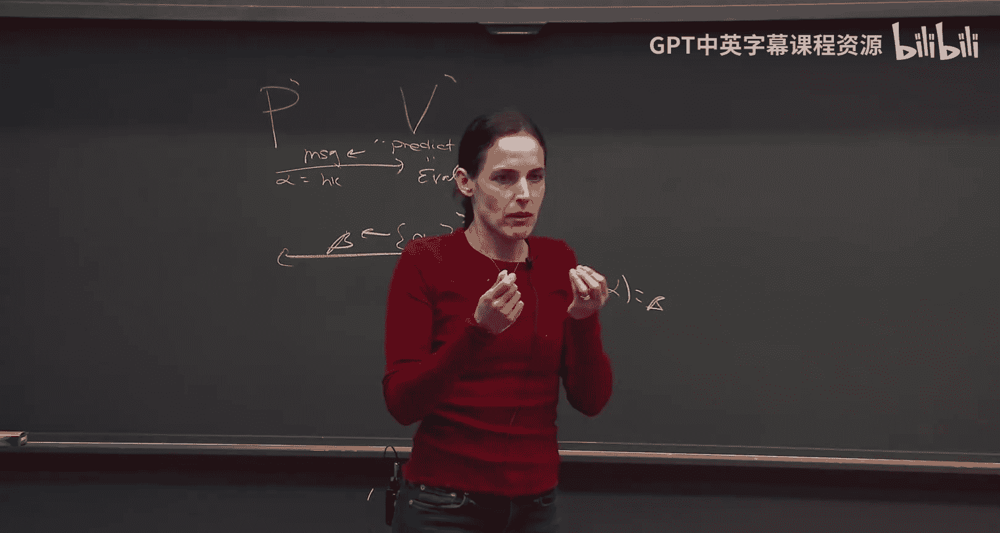

# 010：Fiat-Shamir 范式与零知识证明（第一部分）

## 概述

在本节课中，我们将要学习如何将交互式论证转换为非交互式论证。首先，我们将回顾并完成对 Merkle 哈希构造的讨论，证明其碰撞抗性。接着，我们将介绍 Fiat-Shamir 范式，这是一种消除交互的通用方法。为了分析其安全性，我们将引入随机预言机模型，并探讨其在实际应用中的意义。最后，我们将通过一个具体的零知识证明协议示例，来理解这些概念的实际应用。

---

## Merkle 哈希的碰撞抗性证明

上一节我们介绍了 Merkle 哈希的构造，它能够将任意长度的输入压缩成一个固定大小的摘要，并支持局部打开验证。本节中，我们来证明这个构造是碰撞抗性的。

### 碰撞抗性定义

一个哈希函数是碰撞抗性的，意味着对于任何多项式时间的敌手，给定哈希密钥 `hk`，他找到两个不同的输入 `x` 和 `x'` 使得 `Eval(hk, x) = Eval(hk, x')` 的概率是可忽略的。

### 证明思路

假设存在一个敌手 `A` 能够以不可忽略的概率 `ε` 找到 Merkle 哈希的碰撞。我们将利用 `A` 来构造另一个敌手 `B`，`B` 能够以相同的概率 `ε` 找到底层哈希函数的碰撞，这与底层哈希函数的碰撞抗性假设矛盾。

**构造敌手 B：**
1.  `B` 接收到底层哈希函数的密钥 `hk`。
2.  `B` 运行敌手 `A`，`A` 输出一个 Merkle 哈希值（根 `root` 和深度 `d`）、一个索引 `i` 以及两个有效的打开证明 `π0` 和 `π1`，分别证明第 `i` 位是 0 和 1。
3.  由于两个打开证明都被验证算法接受，我们知道在叶子层（第 0 层），`π0` 和 `π1` 对应的数据块 `z0_0` 和 `z1_0` 是不同的（因为一个声称是 0，另一个是 1）。
4.  同时，在根层（第 `d` 层），`π0` 和 `π1` 对应的值 `z0_d` 和 `z1_d` 是相同的（都是 `root`）。
5.  因此，必然存在一个层级 `j`，使得在 `j` 层，`z0_j ≠ z1_j`，但在 `j+1` 层，`z0_{j+1} = z1_{j+1}`。
6.  根据 Merkle 树的构造，`z0_{j+1}` 是 `z0_j` 及其兄弟节点的哈希值，`z1_{j+1}` 是 `z1_j` 及其兄弟节点的哈希值。既然 `z0_{j+1} = z1_{j+1}`，而 `z0_j ≠ z1_j`，那么 `(z0_j, sibling)` 和 `(z1_j, sibling)` 就构成了底层哈希函数的一个碰撞。
7.  `B` 输出这对碰撞。

由于 `B` 的成功概率与 `A` 相同，如果 `A` 能以不可忽略的概率找到 Merkle 哈希的碰撞，那么 `B` 也能以相同的概率找到底层哈希函数的碰撞，这与假设矛盾。因此，Merkle 哈希是碰撞抗性的。

---

## 消除交互：Fiat-Shamir 范式

我们已经有了一个简洁的交互式论证（如 Kilian-Micali 协议）。然而，交互式证明在实际应用中并不方便，例如，它无法向所有人同时证明一个陈述。本节中，我们来看看如何利用 Fiat-Shamir 范式来消除交互。

### Fiat-Shamir 范式原理

Fiat-Shamir 范式适用于**公开掷币**的交互式协议。在这种协议中，验证者的消息完全是随机的。

假设我们有一个三轮的公开掷币交互协议：
1.  证明者发送消息 `α`。
2.  验证者发送随机挑战 `β`。
3.  证明者发送应答 `γ`。

Fiat-Shamir 范式将其转换为非交互式协议的方法如下：
1.  各方预先商定一个哈希密钥 `hk`（例如，由一个可信机构发布一个标准哈希函数）。
2.  证明者计算第一轮消息 `α`。
3.  证明者**模拟**验证者的挑战：`β = Hash(hk, (x, α))`，其中 `x` 是要证明的陈述。
4.  证明者计算应答 `γ`。
5.  证明者将最终的证明 `π = (α, γ)` 发送给验证者。
6.  验证者收到 `π` 后，自行计算 `β' = Hash(hk, (x, α))`，然后运行原验证算法检查 `(α, β', γ)` 是否有效。

其核心思想是：用哈希函数对当前“转录本”（即到目前为止的所有消息）的哈希值，来替代验证者原本应随机生成的挑战。

### 安全性考量

这个范式非常简洁高效，在实践中被广泛使用。然而，其安全性并非无条件成立。我们需要问：**这个哈希函数需要具备什么性质，才能保证转换后的非交互协议是可靠的？**

原交互协议的安全性依赖于验证者挑战 `β` 的随机性。在 Fiat-Shamir 转换中，`β` 由哈希函数产生。因此，直观上，我们需要哈希函数的输出“看起来是随机的”，并且证明者无法预测或操控这个输出。

不幸的是，存在一些精心构造的（不自然的）交互协议和哈希函数族，使得无论使用哪个哈希函数，应用 Fiat-Shamir 范式后协议都会变得不安全。这些反例表明，我们无法为 Fiat-Shamir 范式找到一个适用于所有协议的通用安全性证明。

尽管如此，对于大多数“自然”的协议（包括 Kilian-Micali 协议）和实践中使用的标准哈希函数（如 SHA-256），Fiat-Shamir 范式被认为是安全且被广泛采用的。

---

## 随机预言机模型

为了在理论上分析 Fiat-Shamir 范式的安全性，密码学家引入了**随机预言机模型**。这是一种理想化的计算模型。

### 模型定义

在随机预言机模型中，我们假设所有参与者都可以访问一个完全随机的函数 `H`。这个函数：
*   对于任何输入，输出一个真正均匀随机的值。
*   对于相同的输入，总是返回相同的输出（即它是确定性的）。
*   只能通过“查询”来访问，无法窥探其内部状态。

在这个模型中应用 Fiat-Shamir 范式时，我们使用这个随机预言机 `H` 来代替具体的哈希函数计算挑战，即 `β = H(x, α)`。

### 模型的意义

随机预言机模型提供了一个“最佳可能”的哈希函数环境。如果 Fiat-Shamir 转换在随机预言机模型下被证明是安全的，那么我们可以合理地期望，当使用一个设计良好的、密码学安全的哈希函数实例化时，该转换在实际中也是安全的。

然而，需要明确的是，随机预言机模型是一个理想模型。现实中不存在真正的随机预言机，任何具体的哈希函数都是一个确定的、可被描述的算法。因此，在随机预言机模型下证明的安全，并不能直接等价于标准模型下的安全。尽管如此，它仍然是分析和设计密码方案的一个非常强大且有用的工具。

---

## 一个案例：哈密顿环的零知识证明

为了更具体地理解交互协议以及 Fiat-Shamir 范式的应用，让我们看一个经典的零知识证明协议示例：证明一个图 `G` 包含哈密顿环。

### 协议描述（交互式）

该协议由 Blum 提出，是一个三轮公开掷币协议。

**共同输入**：图 `G`（包含 `n` 个顶点）。
**证明者目标**：向验证者证明 `G` 包含一个哈密顿环，但不泄露环的具体信息。

**协议步骤：**
1.  **证明者**：
    *   随机选择一个顶点排列 `π`。
    *   计算排列后的图 `π(G)`。
    *   构造一个 `n x n` 的承诺矩阵 `C`。`C` 中仅在构成哈密顿环的边上放置承诺值 `1`，其他位置放置承诺值 `0`。承诺方案保证在打开前，验证者不知道承诺的内容。
    *   将承诺矩阵 `C` 发送给验证者。
2.  **验证者**：
    *   随机选择一个挑战比特 `b ∈ {0, 1}`，发送给证明者。
3.  **证明者**根据 `b` 进行应答：
    *   如果 `b = 0`：证明者打开**所有**承诺，展示整个矩阵 `C`。验证者检查 `C` 是否恰好包含一个简单的环（且每个顶点度数为2）。
    *   如果 `b = 1`：证明者发送排列 `π`，并仅打开 `C` 中对应于 `π(G)` **中不存在的边**的那些位置的承诺。验证者检查所有这些被打开的承诺值是否为 `0`，并验证 `π` 是否是一个有效的排列。

### 协议分析

*   **完备性**：如果证明者诚实且 `G` 有哈密顿环，他总能通过验证。
*   **可靠性（Soundness）**：如果 `G` 没有哈密顿环，一个作弊的证明者无法同时应对 `b=0` 和 `b=1` 的挑战。
    *   要过 `b=0` 这关，他必须承诺一个完整的环。
    *   要过 `b=1` 这关，他承诺的环必须全部落在 `π(G)` 的边集内。
    *   由于 `G` 无哈密顿环，`π(G)` 也没有。因此，任何环都至少包含一条 `π(G)` 中不存在的边。当 `b=1` 时，验证者要求打开这些非边的承诺，作弊者将暴露承诺值 `1`（应为 `0`）而被拒绝。
    *   因此，作弊者成功欺骗的概率最多为 `1/2`。通过顺序重复该协议 `k` 次，可将欺骗概率降至 `2^{-k}`。
*   **零知识性**：直观上，无论验证者选择 `b=0` 还是 `b=1`，他从应答中看到的要么是一个随机的环（与 `G` 无关），要么是一个随机排列和一堆 `0` 值，这些都可以由验证者自行模拟生成，不泄露关于原图哈密顿环的任何信息。

### 应用 Fiat-Shamir 范式

我们可以将上述三轮交互协议转换为非交互式：
1.  证明者计算承诺矩阵 `C`（相当于 `α`）。
2.  证明者使用随机预言机（或一个哈希函数）计算挑战：`b = H(G, C)`。
3.  证明者根据 `b` 的值生成相应的应答 `γ`（要么打开全部承诺，要么发送 `π` 并打开部分承诺）。
4.  证明者发送非交互证明 `π_nizk = (C, γ)`。
5.  验证者收到后，重新计算 `b' = H(G, C)`，然后验证 `γ` 对于挑战 `b'` 是否有效。

这个非交互式协议在随机预言机模型下可以被证明是安全的。

---

## 总结

本节课中我们一起学习了几个核心内容：
1.  **完成了 Merkle 哈希的安全性证明**，理解了如何通过归约法证明其碰撞抗性依赖于底层哈希函数。
2.  **引入了 Fiat-Shamir 范式**，掌握了将公开掷币交互式协议转换为非交互式协议的一般方法。
3.  **认识了随机预言机模型**，理解了它作为分析哈希函数理想行为的理论工具的价值和局限性。
4.  **通过哈密顿环的零知识证明协议**，具体观察了一个交互式协议的结构、安全性属性以及如何对其应用 Fiat-Shamir 转换。

这些概念是现代密码学，特别是零知识证明和 succinct 论证领域的基石。在下一节课中，我们将继续探讨 Fiat-Shamir 范式在标准模型下的安全性，并深入零知识证明的更多性质。