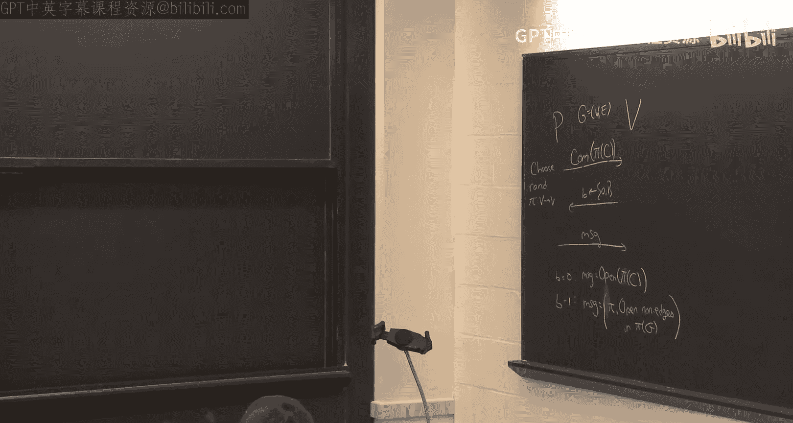
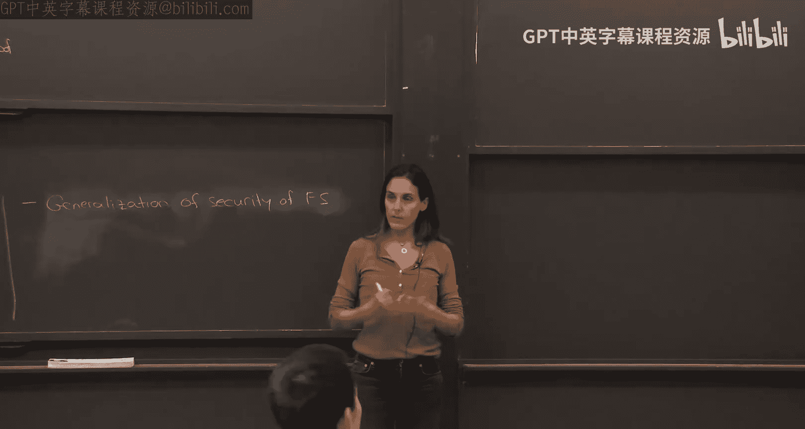

# 012：标准模型中 Fiat-Shamir 范式可靠性证明（第一部分）🔐


在本节课中，我们将要学习如何证明 Fiat-Shamir 范式在标准模型中的可靠性。我们将从一个具体的零知识证明协议入手，探讨如何通过巧妙的构造，使其在应用 Fiat-Shamir 变换后依然保持安全性。


## 课程概述与回顾



上一节我们介绍了 Fiat-Shamir 范式，它通过用哈希函数替代验证者的随机挑战，将交互式证明转化为非交互式证明。然而，一个核心问题是：当使用具体的哈希函数（而非随机预言机）时，这种变换是否依然可靠？




我们之前已经证明，对于 Kim-Micali 协议，在随机预言机模型下应用 Fiat-Shamir 范式是可靠的。但在实际应用中，我们需要在标准模型（即使用具体可计算的哈希函数）下证明其可靠性。这是一个长期存在的开放性问题，因为 Fiat-Shamir 范式在实践中被广泛使用，理解其安全性至关重要。

## 核心协议：并行重复的汉密尔顿回路零知识证明

为了进行证明，我们首先需要回顾一个具体的交互式零知识证明协议。该协议用于证明一个图 G 包含汉密尔顿回路（一个 NP 完全问题）。这是一个三消息协议：

1.  证明者选择一个随机置换 π，并提交置换后的图 π(G) 以及其中的汉密尔顿回路（如果存在）。
2.  验证者随机发送一个挑战比特 b ∈ {0, 1}。
3.  如果 b=0，证明者打开承诺，展示置换后的回路；如果 b=1，证明者展示置换 π 并打开所有非边位置的承诺。


该协议是零知识的，但其可靠性仅为 1/2（即作弊证明者有 1/2 的概率成功欺骗）。为了达到可忽略的可靠性错误，我们需要进行 λ（安全参数）次并行重复。在本节课中，当我们提及协议 P 和 V 时，均指代这个并行重复后的版本。

## Fiat-Shamir 变换的挑战

Fiat-Shamir 范式将上述交互式协议转化为非交互式协议：证明者生成第一条消息 α，然后通过哈希函数 `H(α)` 计算出挑战 β，最后生成响应 γ。整个证明就是三元组 `(α, β, γ)`。

我们的目标是：构造一个具体的哈希函数 H，使得对于任何不在语言中的陈述 x（即图 G 没有汉密尔顿回路），任何多项式时间的作弊证明者都无法生成一个能被验证者接受的证明 `(α, β, γ)`。

一个直观的观察是：在并行重复的协议中，对于证明者发送的每条第一条消息 α，**存在唯一一个“坏”的挑战 β_bad**，使得如果验证者恰好发送这个挑战，作弊证明者就能成功应答。对于所有其他挑战，作弊证明者都会失败。

因此，哈希函数 H 的核心任务似乎很简单：**对于每个 α，确保 `H(α) ≠ β_bad(α)`**。如果我们能构造这样一个 H，那么作弊证明者就永远无法命中那个能让他作弊的挑战，从而保证了可靠性。

## 构造可靠哈希函数的初步尝试与障碍

一个最直接的想法是让哈希函数计算 `H(α) = β_bad(α) + 1`（或任何其他不等于 `β_bad(α)` 的值）。然而，这存在一个根本性问题：**计算函数 `β_bad(α)` 本身是困难的**。

在汉密尔顿回路协议中，`β_bad(α)` 取决于承诺 α 中所隐藏的内容（即置换后的图中是否存在汉密尔顿回路）。如果没有打开承诺的“陷门”信息（例如加密方案的私钥），计算 `β_bad(α)` 就如同解决一个 NP 难题。如果计算 `β_bad(α)` 是容易的，那么整个交互协议就没有必要了，我们可以直接构造一个非交互式证明。


因此，我们需要一种方法，使得哈希函数在**不知道陷门**的情况下，依然能够“避开”坏挑战。

## 关键思路：陷门承诺与全同态加密

接下来的思路分为两步：

1.  **使用带陷门的承诺方案**：我们将协议中的承诺替换为一种公钥加密方案。公钥作为公共参考字符串公开。证明者使用公钥加密他的消息（置换和边信息）。这个加密方案起到了承诺的作用：它是隐藏的（语义安全），也是绑定的（因为解密是确定的）。更重要的是，对应公钥的**私钥**成为了一个“陷门”，拥有它的人可以解密承诺，从而轻松计算出 `β_bad(α)`。
2.  **在全同态加密下“隐藏地”使用陷门**：我们不能直接将私钥（陷门）硬编码到哈希函数 H 中，因为这会破坏协议的零知识性。论文 [C-LW19] 提出了一个精妙的解决方案：**让哈希函数的密钥包含一个全同态加密（FHE）的密文，这个密文加密了某个电路 G**。

首先，我们简要定义全同态加密（FHE）。一个 FHE 方案除了包含标准的密钥生成 `(pk, sk) <- Gen()`、加密 `c <- Enc(pk, m)` 和解密 `m <- Dec(sk, c)` 算法外，还有一个评估算法 `Eval`：
```
c* = Eval(pk, C, c1, ..., cn)
```
其中 `c1, ..., cn` 是分别加密了比特 `b1, ..., bn` 的密文，C 是一个布尔电路。评估算法输出一个新密文 `c*`，使得 `Dec(sk, c*) = C(b1, ..., bn)`。也就是说，FHE 允许对加密数据进行任意计算。

## 哈希函数的构造与安全性证明概要

基于 FHE，我们构造 Fiat-Shamir 哈希函数 `H` 如下：
*   **哈希密钥 `hk`**：生成一个 FHE 的公私钥对 `(fpk, fsk)`。然后，加密一个全零电路（或其描述）`G0`，得到密文 `hat{G0} = Enc(fpk, G0)`。哈希密钥就是 `hk = (fpk, hat{G0})`。
*   **哈希计算 `H(hk, α)`**：为了计算 `β = H(hk, α)`，算法在密文上执行同态评估。具体来说，它计算一个“通用电路” `U[α]`，该电路的功能是：输入一个电路描述 `G`，输出 `G(α)`。然后，运行 `Eval(fpk, U[α], hat{G0})`，得到的结果 `hat{β}` 就是一个密文。我们将这个密文 `hat{β}` 的**二进制表示本身**作为挑战 `β`。注意，这里 `β` 不是解密结果，而是密文比特串。

这个构造看起来非常奇怪，甚至有些随意。它似乎没有显式地避免坏挑战 `β_bad`。然而，其安全性的证明却非常简洁和深刻，依赖于一个混合论证（Hybrid Argument）。

**安全性证明的核心思想：**

1.  **假设存在作弊者**：假设存在一个多项式时间的作弊证明者 `P*`，能够为一个错误的陈述（即没有汉密尔顿回路的图 G）生成一个被接受的 Fiat-Shamir 证明 `(α, β, γ)`，且成功概率不可忽略。
2.  **构造一个“理想”的电路 `G*`**：在证明中，我们考虑另一个电路 `G*`。这个电路内部硬编码了承诺方案的陷门（私钥）和 FHE 的私钥 `fsk`。对于输入 `α`，`G*` 的工作流程是：
    a. 使用承诺陷门打开 `α`，计算出坏挑战 `β_bad(α)`。
    b. 使用 FHE 私钥 `fsk` 解密 `β_bad(α)`（注意：`β_bad(α)` 是一个比特串，不是密文。这里“解密”是一个形式操作，意指应用解密函数）。
    c. 将解密结果与某个固定值（例如加 1）进行异或，确保输出不等于 `β_bad(α)`。即 `G*(α) ≠ β_bad(α)`。
3.  **切换哈希密钥**：现在，我们将哈希密钥中的加密电路从 `hat{G0}`（加密全零电路）切换到 `hat{G*}`（加密这个特殊的 `G*``）。由于我们假设 FHE 方案是**循环安全**的（即加密私钥 `fsk` 的密文与加密全零字符串不可区分），并且 `G*` 的描述中包含了 `fsk`，因此 `hat{G0}` 和 `hat{G*}` 在计算上是不可区分的。所以，作弊者 `P*` 在密钥为 `(fpk, hat{G*})` 时成功的概率，与其在原始密钥下成功的概率几乎相同。
4.  **到达矛盾**：然而，在密钥 `(fpk, hat{G*})` 下，哈希函数 `H` 对输入 `α` 的输出是 `β = G*(α)`。根据 `G*` 的定义，我们确保了对所有 `α`，都有 `β = G*(α) ≠ β_bad(α)`。这意味着，作弊者 `P*` 永远无法找到一个 `α`，使得哈希输出 `H(α)` 等于他能成功作弊的那个坏挑战 `β_bad(α)`。因此，`P*` 的成功概率应该为 0（或可忽略）。这与步骤 3 的结论矛盾。
5.  **得出结论**：矛盾表明，最初的假设（存在成功的作弊者 `P*`）不成立。因此，对于按照上述方式构造的 Fiat-Shamir 哈希函数，该协议在标准模型下是可靠的。

这个证明的巧妙之处在于，它通过在安全性证明中“想象”一个特殊的电路 `G*`，并利用加密的不可区分性进行切换，从而在逻辑上迫使作弊者失败。而在实际构造中，哈希函数使用的是完全无害的加密全零电路。

## 技术要点与假设

*   **循环安全性**：上述证明需要假设所使用的 FHE 方案是循环安全的。这是一个额外的假设，但基于格的学习有误问题（LWE），我们相信存在这样的方案。后续的研究工作已经探索了如何通过更复杂的格技术来移除对循环安全性的依赖。
*   **通用性**：虽然我们以汉密尔顿回路零知识协议为例，但这项技术非常通用。它可以应用于一大类交互式证明，只要存在一个“陷门”可以识别出对作弊者有利的坏挑战。例如，该技术后续被用于证明 GKR 协议（我们之前学过的和校验协议）在应用 Fiat-Shamir 变换后，在标准模型下基于 LWE/FHE 假设也是安全的。
*   **非交互式零知识（NIZK）**：对本协议应用 Fiat-Shamir 变换后，我们实际上得到了一个基于格假设的非交互式零知识论证系统。这是该研究的一个重要动机和成果，因为在此之前，构造基于格的标准模型 NIZK 是一个长期开放问题。

## 总结

本节课我们一起学习了如何证明一个特定零知识证明协议在应用 Fiat-Shamir 范式后的标准模型可靠性。我们回顾了并行重复的汉密尔顿回路协议，分析了直接构造可靠哈希函数面临的挑战。接着，我们介绍了 [C-LW19] 论文中的核心思想：利用带陷门的承诺方案和全同态加密，构造一个看似随意但安全性可证的哈希函数。其安全性证明通过一个混合论证完成，关键步骤是在证明中构想一个能避开所有坏挑战的特殊电路，并利用加密的不可区分性进行替换，最终导出矛盾。这项技术不仅解决了这个具体协议的安全性问题，其思想更被广泛应用于其他协议，为构建基于后量子假设的简洁非交互式证明系统奠定了基础。