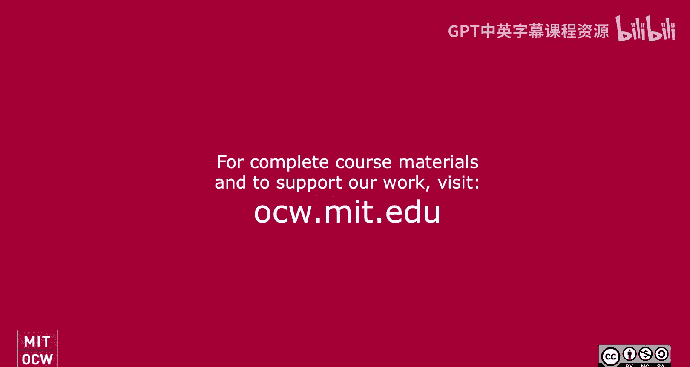
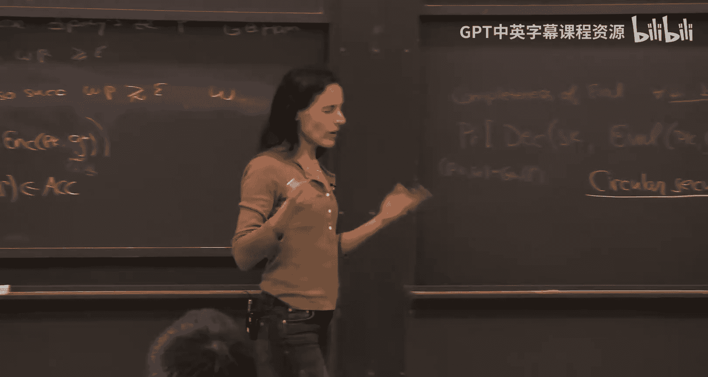

# 013：标准模型中Fiat-Shamir范式可靠性的证明（第二部分）

在本节课中，我们将继续探讨Fiat-Shamir范式在标准模型中的可靠性。我们将看到，通过应用Fiat-Shamir变换，我们可以得到一个非交互式的零知识证明系统。同时，我们也将解释这一结果为何不与之前关于Fiat-Shamir和零知识之间矛盾的直觉相冲突。最后，我们将讨论这一技术的通用性，并介绍“关联不可行哈希函数”这一更广泛的框架。

---

## 从交互式协议到非交互式协议

上一节我们介绍了如何为一个特定的并行重复协议构造一个哈希函数，使其满足Fiat-Shamir可靠性。现在，我们来看看应用Fiat-Shamir变换后，这个协议变成了什么样子。

应用Fiat-Shamir变换后，我们得到一个非交互式协议。该协议现在关联一个公钥（用于承诺方案）和一个哈希密钥（用于Fiat-Shamir哈希函数）。验证者原本发送的挑战消息 `beta`，现在由证明者通过计算哈希函数来生成。

具体来说，证明者计算：
`beta = H(G, alpha)`
其中 `H` 是哈希函数，`G` 是问题实例（如图），`alpha` 是证明者的第一条消息。

因此，原本的三轮交互协议（`alpha`, `beta`, `gamma`）变成了一个单一的消息流。证明者一次性发送 `(alpha, beta, gamma)`，而 `beta` 是由哈希函数确定的。这个协议是完备的，并且我们已证明它在使用特定哈希函数时是可靠的。

---

## 非交互式零知识

接下来，我们探讨这个非交互式协议的零知识属性。在交互式设置中，我们证明了协议是零知识的。但在应用Fiat-Shamir后，情况发生了变化。

我们需要定义非交互式零知识。一个非交互式零知识系统包含一个公共参考字符串。对于任何高效验证者，都存在一个高效模拟器，使得对于语言中的任何实例 `x`，验证者在真实世界中看到的视图（即CRS和证明者生成的证明）可以被模拟器生成的视图所模拟。

关键点在于，模拟器拥有选择CRS的权力，而作弊的证明者没有这个权力。这就是为什么我们能够同时获得Fiat-Shamir可靠性和零知识属性，两者之间并不矛盾。

为了证明我们的非交互式协议是零知识的，我们需要构造一个模拟器。模拟器的策略如下：

1.  首先生成一个看似真实的协议记录 `(alpha, beta, gamma)`。这可以通过“诚实验证者零知识模拟器”来完成，即先随机生成挑战 `beta`，然后根据 `beta` 的值来构造相应的 `alpha` 和 `gamma`。
2.  接着，模拟器需要生成CRS，其中包含哈希密钥。模拟器将编程哈希密钥，使得对 `(G, alpha)` 的哈希计算结果恰好等于它之前随机选定的那个 `beta`。

为了实现第二步，我们需要对哈希函数稍作修改。我们定义新的哈希函数为原哈希函数输出与一个固定随机字符串 `Z` 的异或（或加法）：
`H'(G, alpha) = H(G, alpha) ⊕ Z`
其中 `Z` 是CRS的一部分。

现在，模拟器可以先选择 `alpha`, `beta`, `gamma` 和原哈希密钥，然后简单地设置 `Z = beta ⊕ H(G, alpha)`。这样，`H'(G, alpha)` 就等于 `beta`。由于 `Z` 是随机均匀的，这种修改不会影响哈希函数的可靠性证明。

通过这种方式，模拟器可以生成一个与真实世界不可区分的视图，从而证明了系统的零知识性。这一切都归功于模拟器能够编程CRS。

---

## 技术的通用性：关联不可行哈希函数

以上我们针对一个特定协议进行了分析。现在，我们探讨这个技术有多通用。实际上，我们可以将其置于一个更通用的框架下：**关联不可行哈希函数**。

一个哈希函数族 `H` 对于关系 `R` 是关联不可行的，如果对于任何高效敌手，在获得随机哈希密钥 `hk` 后，很难找到一个输入 `x`，使得 `(x, H(hk, x))` 属于关系 `R`。

形式化定义如下：对于所有多项式规模敌手 `A`，存在一个可忽略函数 `negl`，使得：
`Pr[ hk ← Gen(1^λ); (x, y) ← A(hk) : (x, y) ∈ R ∧ y = H(hk, x) ] ≤ negl(λ)`

这与Fiat-Shamir有何关联？考虑一个交互式证明系统，其第一条消息为 `alpha`，验证者挑战为 `beta`。定义关系 `R` 包含所有 `(alpha, beta)` 对，使得存在一个第三条消息 `gamma` 能让验证者接受。对于一个错误的陈述，关系 `R` 是“稀疏的”（即对于每个 `alpha`，只有极少数的 `beta` 是“坏的”）。如果我们有一个对于所有稀疏关系 `R` 都关联不可行的哈希函数，那么将其用于Fiat-Shamir变换就能直接保证可靠性。

然而，我们无法为所有稀疏关系构造关联不可行哈希函数。但我们可以为一个重要的子类来构造：**在时间T内可搜索的关系**。

一个关系 `R` 被称为在时间 `T` 内可搜索，如果对于每个 `alpha`，至多存在一个 `beta` 使得 `(alpha, beta) ∈ R`，并且这个 `beta`（如果存在）可以在时间 `T` 内从 `alpha` 计算出来。

Klivans和Lombardi等人的成果表明：**对于每个多项式时间 `T`，存在一个哈希函数族，该族对于所有在时间 `T` 内可搜索的关系都是关联不可行的**。这正是我们之前构造的哈希函数！其构造核心仍然是使用全同态加密。

这个通用结果非常强大，它可以被用来证明许多复杂协议（如GKR协议、求和检查协议）的Fiat-Shamir可靠性，尽管其中需要一些额外的密码学处理来应对多轮交互带来的依赖关系。

---

## 总结

本节课中，我们一起学习了以下内容：

1.  **非交互式协议的构造**：通过应用Fiat-Shamir变换，我们将一个三轮交互式证明系统转化为一个非交互式论证系统。
2.  **非交互式零知识**：我们定义了非交互式零知识，并解释了为何通过让模拟器编程CRS，可以在保持Fiat-Shamir可靠性的同时实现零知识。这解决了之前关于两者矛盾的直觉困惑。
3.  **关联不可行哈希函数**：我们介绍了这个更通用的密码学原语，它将Fiat-Shamir可靠性的核心需求抽象出来。我们了解到，可以为“在时间T内可搜索”的关系类构造关联不可行哈希函数，这体现了我们所用技术的广泛适用性。

本节课展示的由全同态加密驱动的构造，不仅解决了一个具体的协议问题，更提供了一个强大的通用工具，用于在标准模型下为各类交互式证明系统实现安全的Fiat-Shamir变换。