# 001：Floki - 定义安全领域的智能体工作流 - Roberto Rodriguez

感谢大家前来。这个房间在大会中位置比较隐蔽，不容易找到。我感谢大家花时间一路走到这里。

我们可以从介绍开始。本次演讲将深入探讨使用Floki可以实现的一些工作流。Floki构建在Dapr之上。我将在几分钟内解释一下那是什么。

在开始之前，需要说明，这不是我为微软做的演讲，也不是代表微软。我实际上是一名网络安全研究员，过去两三年对AI充满热情。目前我的职业正朝着这个方向发展。大家在这里看到的一切，主要是我个人进行的研究，以及在公司内部与一些朋友分享的内容。我不代表微软进行这次演讲。

让我们直接进入Floki是什么。我知道仅凭标题，很多人可能不清楚这次演讲的内容。首先，我是《维京传奇》系列的粉丝，我喜欢Floki这个角色，因为他是一个动手能力很强的人。他能造船，能让其他维京人航行。这有点像构建一个其他人可以使用并能在其上构建自己工具的想法。可以把Floki看作一个智能体框架，你可以用它来构建基于LLM的应用程序。

对于那些已经在这个领域或对AI及其在多主题应用感到好奇的人来说，可能听说过像LangChain、LlamaIndex或CrewAI等库。Floki是我对智能体所需功能的理解。我试图让它尽可能轻量级，尽管它已经包含了很多功能。我的目标是学习工具的内部原理，以及一切是如何工作的。这就像在阅读相关知识后，构建某些东西的第一个里程碑。

Floki的一大特点是，当我看到所有其他应用程序时，构建工作流并不容易，比如链接操作、构建由其他事件驱动的东西，或者尝试集成人在回路中。这仍然不容易。如果你真的看过LangGraph和LlamaIndex的工作流，你必须真正成为这两个工具的专家才能构建一个。所以Floki的理念是：让它变得简单。让我们构建超级容易理解和遵循的工作流。希望这是一个你将来能够使用的工具，它已经在GitHub上发布两个月了。

首先，观众中有谁熟悉智能体？看来大家都知道智能体是什么。总的来说，想象这样一个应用程序：用户与LLM或语言模型交互，然后这个模型进行大量的“思考”。有些人说这不是推理，只是预测下一个词。但它拥有的很多知识和上下文，产生的输出非常有趣，看起来它确实在不同任务间进行思考和推理。最基本的概念是帮助人类或帮助自己选择正确的工具或下一步行动。有时这可以伴随一个它能够产生的预定计划，在某些场景中，只是一次一步，尝试选择它需要的东西。当然，模型不执行任何工具。模型只是建议工具以及如何执行工具。然后你必须获取该上下文并自己执行。通过这个基本流程，你将模型暴露给世界，允许它根据你使用此智能体的场景，从不同环境中获取观察结果。这就是智能体的基础。

当我们开始思考这个智能体流程时，从技术上讲，你可以这样使用它：你提供某种输入，希望这个东西进行推理、采取行动、观察发生了什么，然后让你知道。同时，你可以添加一些循环，比如“再试一次，我认为这不是我需要的，你再去执行整个循环”。有时你可以将这个循环设置为20到100次，或者让它运行多次。所以每次你想到一个智能体，就已经集成了某种流程，并且有不同的智能体模式遵循某种流程。

有趣的是，在这个流程的某些步骤中，模型实际上在做一些事情。例如，当你要求它推理时，模型就在那个步骤。当你想让它行动时，模型并不行动。理解在流程的哪个部分实际使用模型非常重要，这样你才能可能将其与其他工具集成。

当然，工具设置在“行动”部分，而“观察”是它能够从世界或它所操作的环境中收集到的任何信息。

当我们思考智能体模式时，我们讨论的第一个是基本的反思循环，它接受任务，进行推理，执行某些操作，尝试推理，提供关于发生了什么的反馈，然后回到那个循环中。当然，你还可以添加工具使用，为其添加工具，以便根据推理采取行动。你还可以添加一些规划。这是一个非常有趣的模式，因为在我看来，在某些场景中，比如网络安全，你不能只是规划整个调查，因为调查通常从警报开始，然后试图弄清楚接下来会发生什么。所以你可能会有一个计划，在高层面上说明你会做什么。但这个计划可能需要在接下来的几步中变成不同的计划，但至少有一个计划是好的，可以涵盖系统可能采取的基本步骤。最后，你可以将所有模式封装在一个微服务中。然后该微服务可以与其他拥有自己模式的微服务交互。所以当你开始思考智能体模式时，在这个智能体或应用程序所具有的能力之下，总有一个工作流。

在我看来，很多人将工作流讨论为：如果是确定性的，就不是智能体工作流；如果是非确定性的，就是智能体工作流。但根据我的经验，你会为许多不同的场景混合使用它们。有些地方会非常确定，有些地方你希望根据实际获取的观察结果走向不同的方向。思考这种流程非常有趣。

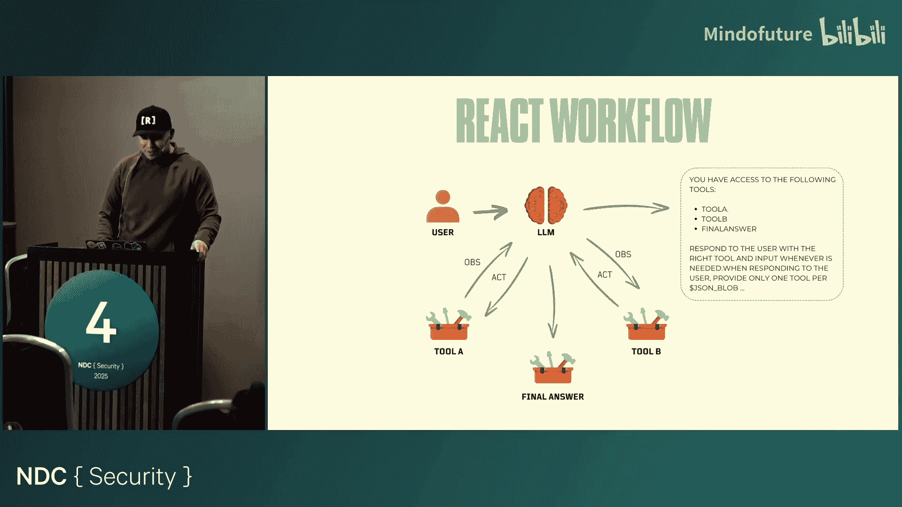

谁听说过ReAct模式？是的，推理然后行动基本上就是我最初展示的内容。这只是让智能体能够对任务进行推理、采取行动，然后简单地进入该循环的一种方式。最终，这又是一个基本的工作流。所以当有人说智能体模式、ReAct智能体模式，然后你看到这个流程时，它非常基础。所以当有人说智能体时，你必须想到类似这样的东西。显然，你可能会遇到其他复杂类型的工作流。

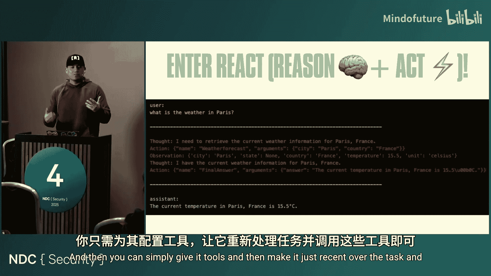

在微软内部，关于什么是智能体也有很大的争论。根据我的团队和其他互动，在我看来，Copilot智能体有时我想到它，我觉得那听起来更像一个聊天机器人。但可能在其他地方有很多连接，那里正在进行一些智能体工作流。无论如何，这是一个非常有趣的概念。对我来说，我喜欢深入研究底层发生了什么，而不太担心是否称之为智能体。

ReAct的概念会是这样的。这是我们用Floki可以做的事情。如前所述，Floki包含了许多在Python中初始化智能体的基础功能，然后你可以简单地给它工具，让它对任务进行推理，然后使用工具。

这里没什么疯狂的。现在，Dapr是什么？对于那些从未听说过Dapr的人来说，它是一个分布式应用程序运行时。对我来说，这是过去几年里我真正感到高兴的项目之一。原因是，每次我想构建一些东西时，都需要开始与一个API交互，需要编写一个新模块来与密钥库、自定义数据库或AWS实例通信。世界上有很多不同的资源，我没有时间开始构建所有存在的连接器。所以当你想到LangChain和LlamaIndex时，它们就是这样做的，它们实际上分离了一个库，称为核心LangChain，然后是社区LangChain，因为他们想要拥有所有连接器。对我来说，甚至想到如果我需要从Azure资源迁移到AWS或GCP，就必须更改代码，可能需要不同的参数，这很麻烦。

Dapr带来了一个侧车的概念，它已经作为你的代理在运行。并且已经有很多针对特定服务的连接器和集成。所以正如你在这里看到的，你可以做工作流，可以访问密钥。我的意思是，如果我编写代码从Azure密钥库访问密钥，我不想为了与AWS中的等效服务通信而重写代码或导入其他东西。Dapr作为一个侧车，为你提供了那些API。所以你不用担心正在集成的是什么。这是我喜欢它的一点。它也是平台无关的，并且有不同语言的版本，如Python、C#、Java等。

Dapr的一个组件是Dapr工作流。这实际上是构建在持久任务之上的。如果你听说过Azure中持久任务的概念，那实际上就是Azure Functions中协调器和工作流运行的东西。他们开源了很多SDK，比如Python，我认为还有Go SDK，Dapr的核心组件是用Go编写的。

但对我来说，当我看到这个时，它非常酷，是在2023年。我当时尝试用这个构建东西，但它不够好，不够稳定。但现在比2023年好多了。这里的想法是，我想将工作流定义为代码。我希望能够做一个基本的for循环、while循环、条件语句，而不必担心如何用这个做for循环。这就是我在其他库中再次体验到的。我并不是说不要用LangGraph而用Floki。但当我回到LangGraph等工具来构建基本工作流时，我必须学习很多不同的新东西。老实说，我没有时间这样做。所以我只想使用一个能让部署到生产环境变得容易、能够在本地测试所有内容、并且能够将工作流定义为代码的工具，或者只是以一种基本的、Pythonic的方式来做。

Dapr附带的工作流模式非常基础。有任务链、扇出扇入，以及监控的概念。这意味着你可以有一个while循环，并且期望发生一个事件，以便你用它做些什么。所以即使这些非常基础，你也可以用这三种模式构建很多东西。如果你开始查看外面很多关于构建下一个智能体框架甚至构建播客的博客文章，你可以用这里的这三种东西做同样的事情。想法是，其中一些可能只是多个基于LLM的任务，或者你可以将整个智能体包装进去，它内部会有自己的工作流，你可以让它进行通信，或者只是成为每个步骤的一部分。

区别在于，我可以说“你能写一封邮件吗？你能定义邮件的情绪吗？你能修改邮件吗？”这对我来说，只是尝试做基于LLM的API调用，或者只是让我做ChatGPT，期望它立即为我做些什么。一个智能体可以是：“嘿，你能查询我环境中的所有警报吗？也许连接到其他实例、其他服务，并可能做一些其他事情。”所以现在这个东西就会开始，在拥有适当访问权限的情况下，开始执行工具等过程。这就是我所说的拥有基于智能体的任务与仅仅基于LLM的任务的区别。

当然，当涉及到监控时，你可以监控一组智能体和一个能力。使用Dapr，你可以获得的一个能力是，可以轻松地与共享消息的服务连接。在我看来，像Dapr这样的服务以及其他你可能听说过的类似框架，已经解决了这个问题。他们已经将这种东西部署到生产环境中来进行这种消息共享等。所以当我看到很多其他框架试图重建它时，比如我已经提到的那些，这很令人沮丧，因为它已经存在了。它们已经连接了所有能让它实现的东西。

所以最终，这就是Floki。一个不仅提供一个智能体基础功能的工具，而且实际上允许你将该智能体转换为微服务，并将其作为FastAPI等暴露出来。然后它能够通过消息系统（如发布订阅）与其他微服务通信。这就是Floki。如果你尝试一下，请告诉我。我最近修复了很多错误。我是那种如果发布项目，就必须完美的人。但这永远不会发生。所以我不得不在11月发布它。

有趣的是，我总是把我妻子牵扯进来，因为她是我每天唯一认真交谈的人，因为我在家工作，她说：“你必须发布它。你不可能再花一两年时间试图让它成为最好的项目。”这就是我的意思。如果有错误，我很抱歉，这仍然是一个早期项目。但希望你们可以尝试一下。

现在想想，如果你现在有一个智能体，默认情况下，开箱即用，当你将其作为服务与Dapr一起部署时，你将能够直接使用。例如，如果你在本地初始化Dapr，你将在本地拥有多个Docker容器，这些容器将提供一些惊人的功能，当你开始构建智能体时（在我看来），不仅仅是查看API调用或消息，还有其他应用程序可以用于此。但要弄清楚编排是如何发生的，每个步骤花费了多少时间，这非常棒。并且，例如，我能否将智能体的状态保存在某个地方？你可以用Dapr自动做到这一点，因为它们已经有一个API，你可以直接说“保存状态”，然后传递一个字典。

所以，与其我尝试构建整个东西，它已经在那里了，非常简单。这里的概念基本上是说，你可能想要构建的所有智能体现在已经附带了许多不同的集成。这就是我之前谈到的。如果我构建一个智能体，并且想与多个服务交互，我不想构建连接器。不可能。这里甚至有一些我从未听说过的东西。你们可能已经知道很多了。例如，我前几天看的一个是Open Policy Agent，老实说，我从未听说过，我以为它是另一个AI智能体，但似乎不是。但这就是我所说的。所以如果有人问：“组织希望我们用Redis构建一些东西，并与Azure Cosmos DB或Key Vault连接，或者使用Kafka进行发布订阅”，你不再需要担心这些了。这就是Dapr的美妙之处，也是我在其上构建Floki的原因。

现在的想法是，你将拥有多个智能体，它们将通过这些服务相互通信。这就是Floki。我只想让你注意侧车。想法是侧车将暴露许多这些功能。同时，当你执行某些操作时，它已经被遥测捕获，因为侧车就在你面前。现在有很多项目试图弄清楚开放遥测如何工作，以捕获智能体执行的所有这些操作，你不需要担心任何这些。

这就是它的美妙之处。我想稍后展示一下。最后一点，如前所述。很多这些微服务或多智能体系统需要以某种方式通信。你可以有一个作为类的智能体，你可以初始化并说“运行这个”，然后你运行这个，然后你可以说“我正在与它们所有人通信，我在一个工作流中循环进行”。是的，你可以这么说。

但这种通信方式非常强大，因为你正在生成这种对话上下文，这种聊天方式来传递消息或处理问题，也非常强大。你可以在对话中提供更多上下文，也许是一些其他新想法，而不是仅仅说“执行一个操作”，如果失败，看看发生了什么，然后再执行一次，读取错误。与就此进行对话有点不同。

所以，使用Dapr和Floki，有特定的API，如你所见，发布、订阅和广播整个路径。这不是我写的，这意味着如果我将我的智能体部署为Dapr集群的一部分，我可以直接说“向状态元数据中的所有智能体广播”。就是这样。在我看来，这更容易使用。然后你还可以定义可以发送的消息类型，并且默认使用CloudEvents模式。所以如果你熟悉CloudEvents，它是一个标准，我认为是gRPC标准。这也非常强大，因为你为交换的每条消息获取额外的元数据。

好了，由于我们刚刚进入演讲20分钟，我想快速展示一些东西。我以为我已经讲了20分钟。有这个项目。这更多是为了安全研究。我喜欢从这里开始，因为这正是我相信我在这个领域开始职业生涯的方式。如前所述，我一直在做网络安全，特别是在防御方面，在微软做了四年，也做过攻击方面的工作。

对我来说，深入研究新事物，学习更快地处理所有这些信息的方法非常重要。这就是我这么做的原因。这是我用Floki构建的东西，我稍后会展示它的作用。但想法是，我最初想定义几个确定性的工作流，只是为了从ArXiv下载论文，ArXiv保存了很多研究论文，社区发布并与他人分享。有一个API，你可以设置，例如，我只想关注计算机科学论文。我想寻找关于智能体或生成式AI以及蓝队、红队、攻击、防御等概念。我构建这个的原因也是因为，在我的组织里，有很多人分享带有20多个链接和多个要点的电子邮件。我不可能全部阅读。我有ADHD，我相信，我就是无法专注于这么多不同的事情。我做不到。所以，如果我真的想强迫自己学习一些东西，唯一的方法是通过播客，通过一种沟通方式，在我通勤或锻炼时听。

所以想法是下载所有论文，用LLM过滤所有论文，以确保我们捕获正确的上下文。你可以捕获每篇论文的摘要。然后最后，我们可以下载所有论文。然后开始使用LLM编写转录稿。所以每一页都会被阅读。你通过提示告诉它：“嘿，我希望你专注于每一页，尝试收集每一页的关键概念。任何对普通人来说可能太复杂的东西，试着分解它，然后告诉我，就像我5岁一样。我还希望你能告诉我每一页的关键要点，并试着描述它，就像你在跟我说话一样，向我解释。”

这就是编写转录稿。然后，我们开始做文本转语音。这是我可以使用Eleven Labs公司做的事情。每月20美元，你可以进行10个并发API调用。所以我们可以扇出然后扇入。然后我们还可以生成每一集。

那是什么意思？我获取转录稿，基本上是每篇论文的摘要。然后我获取论文本身的摘要，因为论文带有一个小摘要。我试图定义那一集的内容，并给它一个比论文标题更具吸引力的标题，因为论文标题有时很糟糕。这就是我所做的。然后我简单地生成音频。

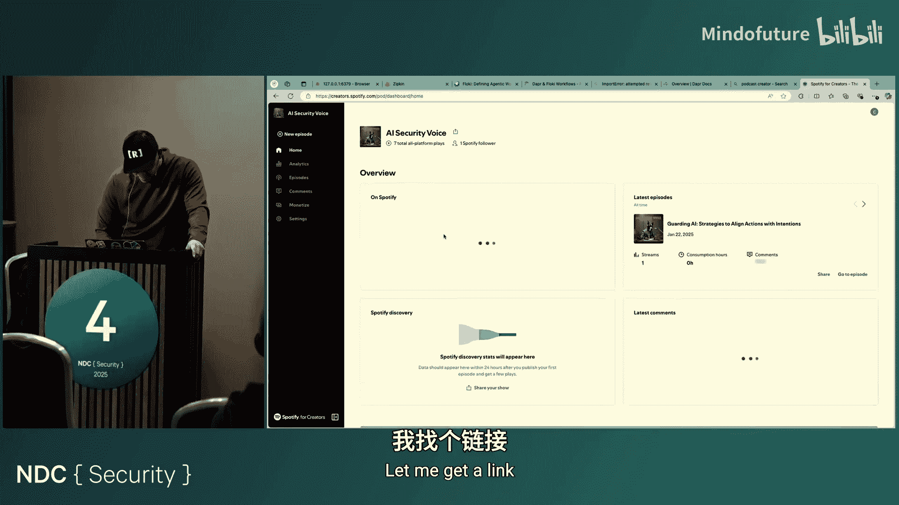

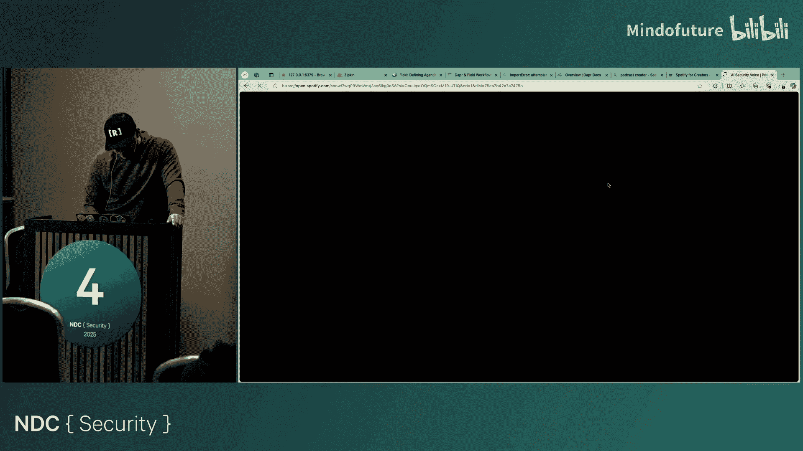

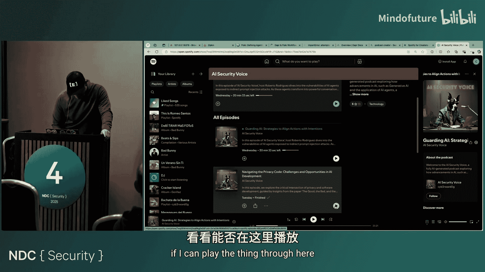

这就是我们用Floki所做的。已经有一个播客了。让我看看能不能快速展示一下。如果你能，你可以注册。让我们看看能不能快速完成这个。这是Spotify。

正在加载。这是。把它放进去。我想是那个。

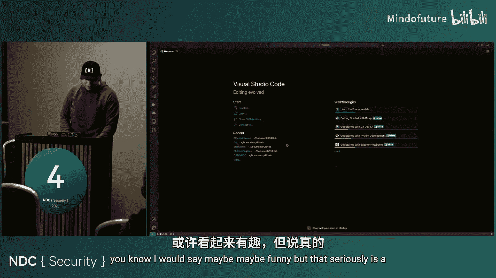

那个。这是AI安全语音播客。它已经有两集了，今天还有一集要来。它基本上是在谈论。让我看看能不能播放，我不知道能不能通过这里播放。

通过设计有效地。所以解决这些担忧可以引导我们走向一个结构化的绳索。我所做的也是克隆了我的声音。这很容易做到。你需要做大约30分钟的录音，然后等待模型在你的声音上进行训练和微调，然后它们就可以生成输出。我的一个梦想是拥有一个播客，但我在概述中明确说明了这是一个AI生成的播客。我不想欺骗任何人。但我想，你知道吗，我就把我的声音放进去，然后每天早上锻炼时听播客。就这样。

已经有一些了。如果我们去Floki的这个项目。我需要。等一下，确保我能展示。好了，我把它放大。再次，在这里。所以输出样本。我们有它下载的所有论文在这里，然后最后的所有剧集基本上是我的天，VS Code太糟糕了。抱歉，好了。它基本上是由系统本身生成的。AI给我标题、概述、整篇论文的要点。然后我们还有每篇论文的索引。然后是更新的索引，LLM说这些实际上与网络安全无关，所以也许那些应该被排除。然后我们还有转录稿。让我做这个。在转录稿中，例如，我的项目AI安全语音，实际上这个项目将在本周发布，你可以在其中定义自己的角色、自己的标题，或者可以有多个参与者。所以现在，我只是说，如果你看到一个主持人没有参与者，就像一个单人播客。如果你看到其他参与者，就开始就每一页进行对话。在我看来，这样做效果很好。

但我觉得也许第一集暂时只有我。在某个时候，20分钟后，我有点厌倦听自己的声音。但你能为研究做到这一点还是很酷的。这是我安全研究的一部分。现在，老实说，即使这可能有点，也许有趣，但这确实是我第一次真正自动化自己。因为我一直想这么做，因为我想做太多事情，但没有时间。阅读论文对我来说太多了。这是现在的一种方式，老实说，每天当我在办公室喝咖啡时，就听播客。然后我也可以做其他事情，如前所述。这很迷人。所以无论如何，这是我做的第一个安全相关的东西，现在它帮助我很多，让我跟上所有这些不同的事情。

现在，我们试图解决哪些挑战，在我看来，特别是在网络安全防御方面？这是每个人都想构建的东西。这是即使我与微软内部的一些人交谈时，我们也在试图找出最佳方式，以拥有一个具有正确工具的系统，与正确的表通信，进行自然语言到KQL的转换，然后弄清楚如何查询所有这些信息，然后让分析师等待一些后续步骤，也许等待关于这个事件进展的反馈，一直到让它进行多步骤或三分支类型的调查。

但让我们现实一点。如果你想查询KQL。你的查询会从这个变成这个，一旦你开始集成多个东西，一旦你开始尝试扩展范围，有时与多个东西连接，最终你会有一个庞大的查询。对我们来说，这是黄金。对于很多试图寻找自己模型、弄清楚如何改进智能体的AI人员来说，这也是黄金，因为他们想从中学习，或者他们只是想将这些大查询推送给系统，以便他们可以参考其中一些，并可能写出变体。

但老实说，我还没有看到那方面取得很好的成功。这是因为，例如，像KQL这样的东西的复杂性，要能够捕获多个东西。当你思考调查时，你开始连接点，开始连接节点。你的查询不会，在我看来，仅仅为了创建这个庞大的东西而可持续。智能体或语言模型在这方面并不擅长。已经有很多年尝试做自然语言到KQL了，我认为与两三年前相比，他们做得很好。但这仍然是一个巨大的挑战。目前，我不是说这会是永远的，但这只是一个挑战。

所以，作为研究的一部分，我思考的一件事是，从技术上讲，即使有转换在进行，你也有一个庞大的本体论或数据模型需要维护。当调查发生时，你的数据模型和本体论也可能被抛到一边。例如，在微软，进行调查时，有多个数据科学团队带来他们自己的数据。他们从多个地方捕获数据，并将其带入一个集群，然后说：“我丰富了这些数据，去狩猎吧。”我们马上就会问：“好吧，这里的模式是什么？”所以你必须在调查过程中学习新的模式。这不好玩。所以试图跟上这些，非常困难。

通常，我将这些视为数据转换，然后是狩猎。通常我们参与狩猎，而不是这个领域。我现在的团队更专注于AI，比如，让自主防御微软成为可能，这是我目前的团队，我们现在专注于本体论，但为了支持智能体，并弄清楚它们能用它做什么。

所以像这样的概念，例如，可能是可能的。那么这里发生了什么？在这个概念中，如你所见，线条来自前一个。所以你有了本体论在那里停止，分析师只接收本体论。这个有点像结合在一起。我们能否有一点数据转换，同时我让它成为狩猎的一部分？这意味着，如果我能构建一个系统，让我以某种方式转换数据，使其也能推断出自己的本体论，会怎样？

它可以推断出自己的模式，自己的数据模型。由于我们总是以图的方式思考，因为我们试图连接点，连接证据，我们可以实际上从本体论、数据模型转到图。我们还可以让系统编写代码，从具有本体论的数据直接摄取到图中。

有几件事在那里得到了处理。首先，你不再需要担心任何其他模式了。即使我被卷入一个事件，其中有多个具有新模式的数据集群，我也不用担心，因为会有一个系统能够查看它。它可能能够查询最后五个事件，并对这个本体论可能是什么、这个事件的模式是什么有一个概念。这样做有很多好处。最后，分析师只是一个可以用自然语言与系统交互的人。

因为现在系统能够理解用户的意图，能够理解数据模式，能够提出自己的本体论，并且能够编写代码来生成图。

所以现在我可以问问题，系统凭借图的模式和本体论，能够编写图查询，而不是编写这种庞大的查询，试图进行多次连接。我并不是说图数据库比数据集群更好，情况并非如此，因为根据经验这样做也很疯狂。

如果你依赖图数据库作为你的海量数据库，试图将很多东西从数据迁移到图数据库，以后无法扩展。但我喜欢的是，这更像是你环境的局部视图。如果我现在只关心我环境的2%，因为我试图开始我的调查，我可以接受对这2%进行图分析。对整个世界进行图分析，那是一个完全不同的挑战。但这非常有用，因为你实际上可以深入研究，甚至可以让模型思考。

即使在图中，例如，在调查过程中，你可以说：“我想让你连接一个可能被添加到组中的用户，并告诉我这个组如何与环境中的其他资源相关。”你可以编写一个Cypher查询或Gremlin查询（对于那些使用TinkerPop的人来说），这些甚至更容易用自然语言理解和解释。所以想想看，这有多强大。

最后，你拥有所有这些安全平台，包含所有这些不同的信息。即使你添加了像Bloodhound这样的攻击路径或任何其他攻击路径管理系统，你也可以集成它，说：“嘿，你能把它添加到本体论中吗？你能用我的活动数据连接那个东西，然后能够遍历图吗？”

现在，对我来说非常有趣的一点是，当你用智能体遍历图，并要求智能体制定计划时，它非常擅长说：“哦，我找到了X，我可以把它连接到Y和Z，我可以这样走。”但当你要求它制定计划时，它通常会说：“找到可疑活动。”对我来说，那是什么意思？我如何找到可疑活动？在这一点上，对我来说，这个努力是你图的局部视图或态势。

但如果你想识别异常，你必须从全局视图来看待它。所以现在，例如，在团队中的努力，总的来说，这并不新鲜，已经有很多人在做了。所以我可以分享。但我们正在试图弄清楚拥有图的全局视图意味着什么。训练一个模型来识别这些异常需要多少时间？我们从一个小的环境开始。对我来说，后来那将成为智能体的输入。所以在计划中，当智能体说“让我们找到异常”时，它只会与该工具交互，说：“嘿，我有这个实体，想知道从异常角度来看它的分数是多少。”这就是你如何集成全局视图和局部视图。这是纯粹的局部视图，范围非常集中，对于那些例如调查经验较浅的人，甚至在公司内部，也许你在自己的主题上是专家，但当你进入一个新组织时，你必须再次学习所有这些模式和数据。如前所述，在调查中，你总是会遇到新的数据集。像这样的东西会有所帮助。

那么这是如何工作的？这是我整理的东西，有点乱。但希望它能讲得通。然后我可以从这里带你到代码，到Floki。我可以解释某些领域，我如何使用扇出扇入、链式、循环等概念，以及如何与Floki和Dapr一起运行工作流。

所以我们从获取用户消息、问题开始，比如“我试图在我的环境中寻找创建的文件”。下一步，暂时不计划任何东西，因为我们试图从左到右，从左开始，意思是离数据、离环境最近。我首先总是问的问题是，如果你在寻找文件创建，我们能否弄清楚文件创建数据集是什么，比如，我去哪里找那个数据？这是一个有效的问题，很多人可以真正回答这个问题。即使在微软，如果你问登录日志数据在哪里，你会说：“你指的是客户能看到的东西，还是我们能看到的？它存在于这个环境中吗？”这很混乱。

所以想法是，我们可以索引很多这些模式。人们带到对话中的模式越多，就越能定义。只需带来你拥有的所有模式，然后能够获取所有这些，创建索引。所以能够将它们发送到向量数据库。尝试进行查询分解，你可以获取用户的第一个问题或多个句子的问题，将其分解成小块，并进行多跳类型的检索增强生成，你可以识别与查询相关的相似模式。

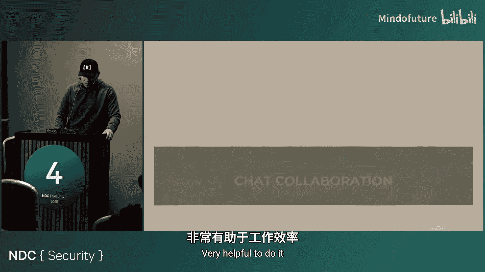

所以我们这样做，然后获取相关模式。然后我们还使用LLM来检查所有模式。这就是那个步骤的作用。所以一旦你进行多跳，你最终会得到多个模式。所以最后，你必须进行另一次传递，找出哪些是支持用户意图的最佳模式。

然后我们可以做一些扇出。这里的想法是，既然我知道需要收集什么数据以及可以从哪里收集，我实际上可以执行查询。不是做那些超级复杂的查询，而是非常基本的，比如KQL或SPL或任何其他查询语言。非常基本的查询，只是说，基于模式，如果你想寻找文件创建，我们可能会在Sysmon中查找事件11（用于本地），或者我们可以查看Defender中的文件创建事件。让我们只捕获你正在寻找的时间，然后去数据集，只检索前500个事件。这是一种方式，我们可以创建几个文件。然后，我们实际上要求LLM基于模式生成图本体论。

所以当所有这些发生时，我们可以执行另一个任务，我们说你有所有这些来自不同表的模式。我想让你用这些重新生成一个图本体论。对我来说，这非常强大，因为你没有给另一个LLM 500乘以4个事件。你只给了一个模式。所以即使你有十个模式，那个东西也能适应一个提示。

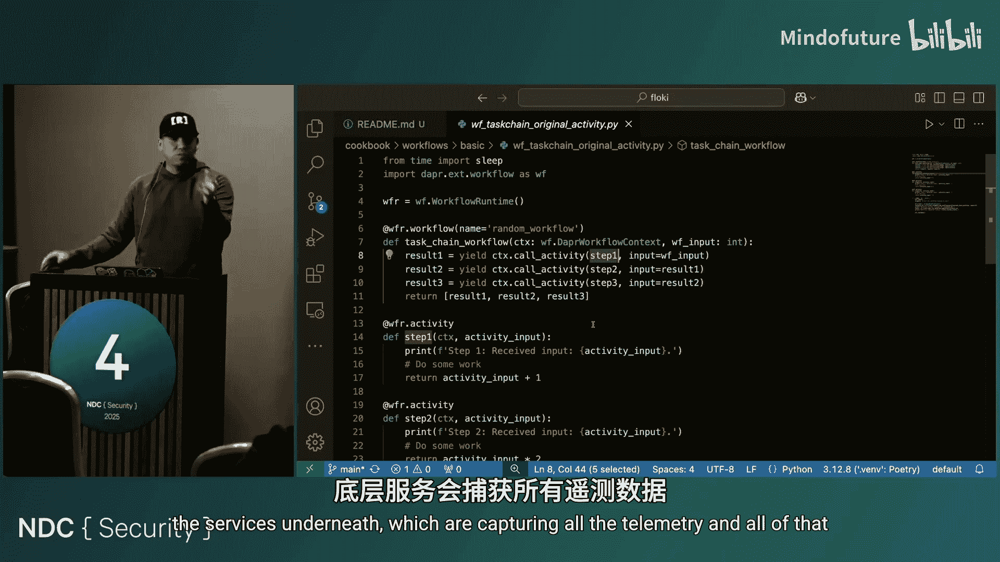

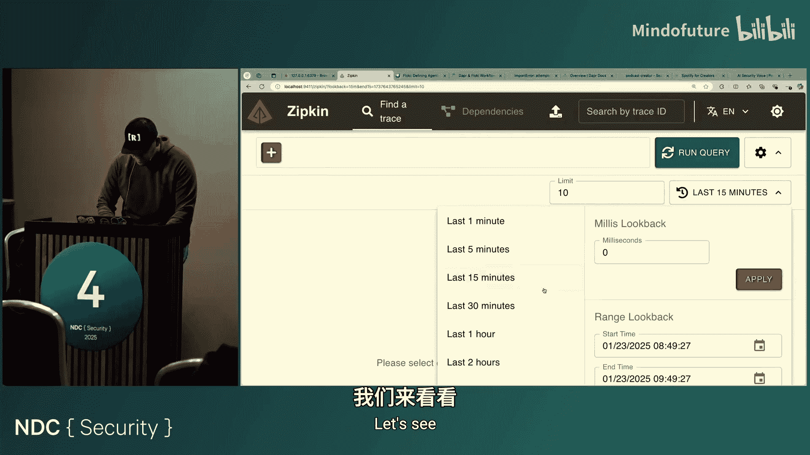

想法是，如何开始创建这种结构：基于我正在处理的模式，顶级实体是什么？我可以在这些模式中定义什么关系？然后基于此，你实际上可以让它为你编写代码。当然，现在是非常基础的Python代码，但你可以让它更好。想法是：看，我有这个模式，这意味着我们知道事件将如何处理。我们现在也有一个图本体论。那么我们能编写一些代码，让我们将其转换为图吗？

当然，再次强调，如果你对数十万条数据这样做，会花费时间。但如果你在一个范围非常集中的任务中这样做，拥有所有这些准备就绪会非常酷。然后它进入图数据库。

现在，用户实际上可以再次提问，或者只是让它的第一个问题准备好被回答。现在系统有了一个基于模式的本体论，我们也可以生成图查询。所以最后，你实际上可以拥有这样一个系统：每次有人想调查某事时，你可以启动索引。因为每个问题都会不同。我的意思是，大多数都会不同，因为你可能正在寻找，或者我已经做了文件创建，让我们看看可能创建了那个东西的进程，让我们看看谁访问了那个东西，让我们看看可能发生了哪些网络连接。所有这些，如你们所知，有不同的表，不同的模式。它们可能有一些相似的字段。这就是你向模型展示它们如何连接的方式。但这是你可以做的事情。你可以将其用作按需类型的工具。这非常有用。

让我们看看能不能做到这个。我试着让它更好，因为我不喜欢看到所有这些。希望你们能看到。让我把它弄小一点。好吧。首先让我展示一下Floki的基础知识，我打算关闭一些东西。让我展示一下Dapr中的工作流大概是什么样子。让我看看。例如，这就是Dapr工作流的样子。你只需导入库，可以初始化工作流，可以使用装饰器说“这是我的工作流”。在内部，我将简单地运行上下文，调用活动，并运行同一脚本中具有活动装饰器的其他函数。

差不多就是这样。然后在工作流内部，你可以做基本的任务链，这就是yield的作用。所以yield会等待直到完成，然后移动到下一个和下一个。但如果你去掉yield，它就会异步运行。这非常基础。但同时，我强烈鼓励你去弄清楚如何用其他为AI做这件事的库来做这个。我并不是说为了这类事情。现在，这再次带来的价值是，每个正在执行的任务都被包装在Dapr的概念、侧车、底层服务中，这些服务正在捕获所有遥测数据。那是什么意思？例如，如果我去...

抱歉。如前所述，让我把它放大。Dapr，当你在本地部署时，实际上可以有一个自动部署的Docker容器，它将运行Zipkin，Zipkin实际上从Dapr捕获开放遥测。然后你实际上可以看到，例如，执行情况。让我看看能不能找到另一个。可能没有。

是的。好了，看，我的演示早些时候失败了。这没关系。但至少我有证据证明我们是如何做到这一点的。好了。所以自动地，你可以在这里看到，你得到了这种开箱即用的东西。有一些服务试图做到这一点，但你必须要么付费，要么将数据发送到云服务。这是你使用Braintic时做的事情。例如，如果你使用Braintic AI，你可以使用这个惊人的Locksmith服务（我想是叫这个），你可以从你的AI应用程序获取开放遥测。但你的所有数据都去了那里。这个在你的电脑上，你会有类似的感觉。

你实际上可以确切地看到，例如，错误是什么。让我在这里展示。我喜欢它如何向你展示事物的顺序。例如，当某些东西被执行时，比如查询生成，你可以看到那三个是作为扇出执行的。但那一个，我想，花了很长时间。这里有一个错误。所以是的，我想知道这个发生了什么。所以我知道它在我的主工作流中失败了。这不是一个消息。哦，好吧，是一个我用来传递给我的工作流中的任务的变量。但无论如何，这就是我的意思。当你看着它时，它非常简单。但底层发生了很多事情，在我看来，当你试图监控智能体在做什么或不做什么时，这些非常强大。

现在，与Floki有什么区别？我可以采用相同的...它看起来会差不多一样。所以这是Floki。它看起来几乎一样。但Floki的区别在于，Dapr只允许你定义一个工作流、一个函数和一个任务。它被称为活动。活动、活动、活动。你只能执行Python函数。在Floki中，我引入了任务的概念。你可以看到我们如何改变它。

这个大小对你们后面的人来说合适吗？好的。所以任务和活动的区别在于，使用Floki，你可以获取一个任务，并传递任务的描述。那将是一个提示。底层已经初始化了一个LLM客户端，默认情况下只是OpenAI客户端。但你可以将其设置为任何你想要的。实际上，任务中有一个参数可以用来定义提示和LLM，或者定义智能体。所以你也可以将智能体附加到任务本身。

这就是Floki的概念，它如何在Dapr活动周围创建包装器，并使其变得如此容易创建。让我展示一下那是什么意思。例如，如果你去Dapr，想调用OpenAI，你必须这样做，这没问题。导入OpenAI，初始化它，然后放几条消息，然后尝试获取字符。

但是如果我们去Floki，这都在代码库中，你可以去cookbook工作流和基础部分。这就是它在Floki中的样子。在这个例子中，我说：“从《指环王》中随机挑选一个角色，我是它的粉丝，然后只以角色名称回应。”就这样。底层将由LLM客户端处理，发送过去，检索回来。我能展示一下发生了什么吗？有一件事我没有在这里展示，或者也许我展示了。哦，在这里。你还可以用Floki做的一件事是这样的。看这个有多小。你可以有一个工作流，其中只有一个任务及其自己的提示。函数的变量，我想是参数，也将被用来在提示内部进行替换。例如，如果我调用这个函数时带有名称，在这个例子中，我用的是Scooby Doo，那么提示将用那个运行。“Scooby Doo是谁？”第二件事是，如果你定义一个Pydantic对象或类作为模式，你可以将其传递给类型，即返回类型。然后任务就会知道：“哦，好的，你想要我进行结构化输出，或者能够使用OpenAI的工具调用来接收结构化输出。”所以这是Floki中做的一些事情，你可以用这样简单的方式完成。最后，每个任务的每个输出必须是一个字典。所以最终，Floki在底层所做的是，它获取那个Pydantic对象，接收结构化输出，验证它，然后模型转储，只导出一个字典。所以所有这些，而不是一遍遍地输入，你可以像那样做。好了，这给了你关于Floki如何操作的101介绍。

我们还可以做的另一件事。让我看看能不能展示一下。然后我们深入另一个例子。让我看看能不能做到这个。我不知道为什么我的...还有一个二号村庄。所以，用Floki，我们实际上可以做到。如果我们去cookbook，去工作流，实际上有非常基础的。它给了你一个关于这是如何工作的概念。顺便说一下，医生播客也在这里。基本概念。但我有另一个项目将其提升到新的水平。

所以Floki的想法是，当你使用Dapr时，例如，你想定义你的服务，你定义用FastAPI服务器暴露的服务，就像Dapr中的这个，你实际上可以构建一个应用程序，然后简单地用Dapr的扩展将其暴露为API。我所做的就是拿我的基本智能体，那个告诉我天气等东西的智能体，我把它暴露为一个服务，只是一个包装器，非常容易做到。我现在就展示给你看。但这就是你如何轻松运行多智能体的方法。

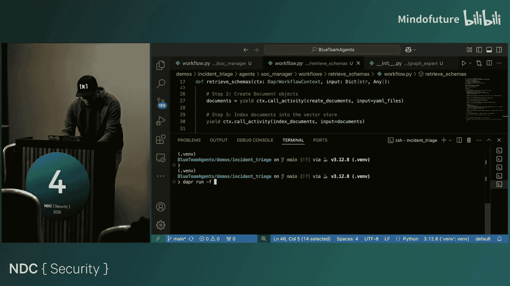

你知道，非常容易，尝试定义Dapr端口、应用程序的基本端口。让我展示一下那实际上是什么样子。如果我打开服务，然后去Elf和app，这就是app的样子，例如，它所做的就是初始化智能体，给它你典型的目标和指令以及你想要的一切。然后最后，你可以用这个Dapr智能体服务包装它，它暴露了所有Dapr连接器和组件。现在你准备好开始交换消息等所有事情了。

这就是定义一个智能体作为服务有多容易。它已经可以工作了。为了做一个非常基础的。这里。这将是。让我看看我们如何再次做到这个。所以我们将使用工作流服务，工作流LM。好的，所以我们使用工作流LM。这意味着这个工作流的工作原理是，它将知道有多少个智能体，它将知道智能体的目标，然后每个问题都将通过这个管理器智能体路由，它将决定下一个谁发言。这是你在Autogen和其他框架中看到的东西。但在这种情况下，都是用Dapr完成的。如果你想知道那是如何工作的，你可以去源代码，floy.agent.workflows.helm。它基本上，例如，这是提示之一。嗯，那不让。内部。所以另一个工作流只是处理输入，将消息添加到每个智能体的整个历史中，广播消息，然后决定下一个发言者。它触发下一个发言者。这也是Dapr和Floki非常强大的一点，你实际上可以等待外部事件。所以这也是你可以集成人在回路的地方。例如，当你进行安全调查或使用我之前提到的系统时，你可以说“本体论可以吗？”然后只是等待，或者“这个查询是正确的吗？这些模式是你实际想到的吗？从这些模式查询数据有意义吗？”这非常简单，就像你如何生成一个事件一样，只要事件进来，它就会等待。那个事件可以来自多个服务。你可以在本地做，或者只是有一个API或连接到服务。

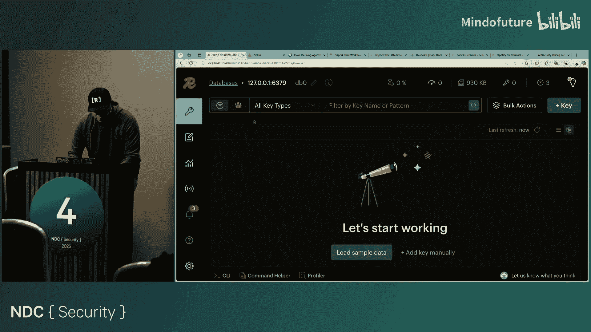

好了，最后。我们可以快速做一个。让我运行另一个，这样我们可以结束这里的演讲。所以，这是事件标签。比如说，像智能体。这就是我在幻灯片中展示给你的，那里有几个智能体。有一个智能体。有我的Stockck管理器智能体。如果我去智能体的主工作流，我们可以快速浏览一下。这也将在本周末发布。这基本上就是我告诉你的。所以这个工作流将启动。它将捕获任何输入。它将等待任何类型的。这可能是一个问题，比如“嘿，我想在我的环境中查询任何类型的文件创建事件。”然后，这将直接进行。但输入也只是为了说：“好的，所以我要获取你的消息，把它放在一个我可以交换的格式中。我可以把它发送给多智能体协作团队中的每个人。然后我将执行一个子工作流。”

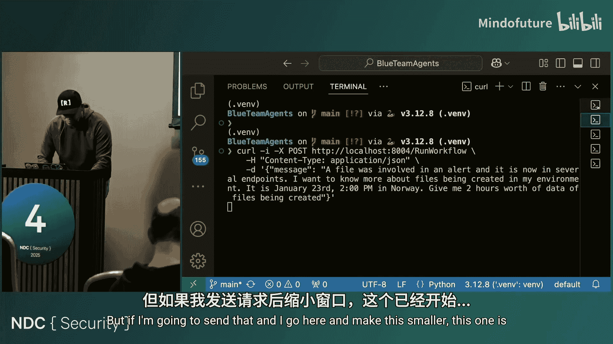

这也很棒，因为你可以保持你的主工作流非常简单。你可以用Floki定义多个工作流。这个工作流的作用是，如果我去那个工作流，我去工作流和检索模式工作流，它非常容易阅读。它读取所有模式，创建文档。所以它获取所有模式，将索引所有文档，并将执行查询分解。然后最后，它将简单地开始生成相关的模式，试图弄清楚哪些是相关的模式，以便能够调查这个事件。然后最后，它将过滤模式。然后简单地返回那个。所以通过这个基本工作流，我们已经试图确定正确的数据集，以便查询或进行调查。

你运行这个的方式。当我现在运行它时，它可能会崩溃，因为它总是崩溃一些东西。所以我做的是，我去我的演示，事件标签。有一个Dapr YAML文件，它只有一个基本的方法来定义每个智能体。我可以直接做Dapr运行那个。抱歉，那个F和那个。

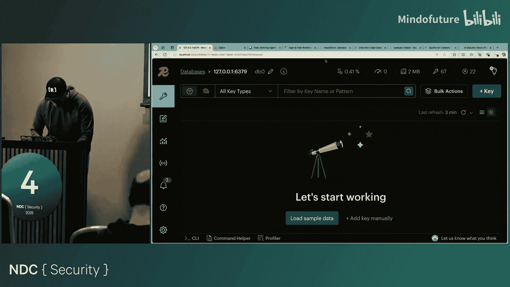

让我们把这些都放到最上面。这正在做什么，如你所见，它。哦，实际上，这就是我喜欢Dapr的地方。Dapr也捕获状态。所以我在从房间下来之前停止了它。所以它试图回到