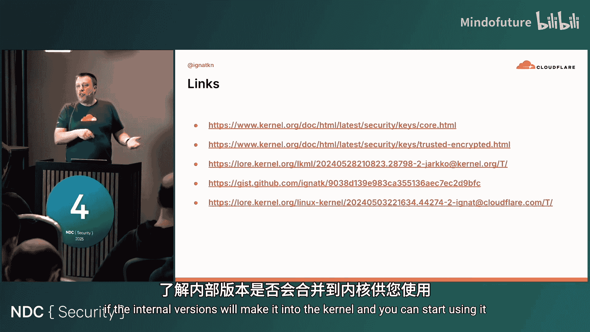

# 002：TPM与Linux内核——解锁硬件安全的新路径


## 概述

在本节课中，我们将要学习如何绕过直接与TPM交互的复杂性，利用Linux内核密钥保留服务作为抽象层，为应用程序提供一种更简单、更安全的方式来使用硬件安全功能。我们将探讨TPM的基本概念、当前开发者面临的挑战，并提出一种基于密钥派生和Linux内核功能的新颖解决方案。

## 什么是TPM？

TPM（可信平台模块）是一个小型的安全芯片，通常独立存在，但在现代硬件中也可以集成到主处理器中。它存在于大多数现代笔记本电脑和服务器中。TPM是一个被动且非侵入式的设备，它只在收到命令时执行操作，不会主动监控内存或其他系统资源。尽管它是一个廉价、低功耗且速度较慢的设备，但它为平台完整性、身份验证和远程证明建立了一个强大的基础。TPM是一个加密芯片，可以处理加密密钥。

## 开发者面临的挑战

上一节我们介绍了TPM的基本概念，本节中我们来看看开发者想要使用TPM时会遇到哪些实际困难。

我的初始思维模型很简单：我编写代码，存在一个TPM，我想使用它。但现实情况要复杂得多。我的代码运行在操作系统上，而操作系统负责管理应用程序对硬件的访问。因此，在Linux上，我的应用程序需要通过一个代表TPM的Linux设备文件 `/dev/tpm0` 来与其通信。

但这还不够。要与TPM通信，需要一个叫做资源管理器的东西。TPM价格低廉，但功能不强，不支持多租户同时访问。在操作系统的多任务环境中，可能有多个应用程序试图访问TPM。资源管理器的作用是序列化这些访问请求，以免TPM发生混乱。

此外，我还需要一个TPM库来与资源管理器或TPM进行高层通信。我的初始模型“应用程序 -> TPM”变成了“应用程序 -> TPM库 -> 资源管理器 -> TPM”。开发者需要了解所有这些组件。

以下是关于资源管理器和TPM库的具体问题：

*   **资源管理器**：最初的实现是一个用户空间的守护进程。对于开发者来说，这很令人困惑。你试图访问一个已知存在的设备，但如果这个守护进程（可能用C编写）崩溃、未启动或系统配置错误，你的应用程序就无法工作。现代Linux内核已经将资源管理器直接重新实现到操作系统中，因此它总是运行着。现在，要访问TPM，你需要与 `/dev/tpmrm0`（资源管理器设备文件）通信，而不是直接与 `/dev/tpm0` 通信。
*   **TPM库**：目前有两个主要的、相互竞争的实现：Intel TSS（可信软件栈）和IBM的实现。它们都试图遵循标准，但标准并未定义API，因此它们的API完全不兼容。开发者必须选择其一，或者编写包装层来同时支持两者。此外，还有用Go语言编写的纯Go实现（Go-TPM），可能也有Rust实现。开发者需要了解可用的库并依赖它们，或者自行打包。

## Linux内核密钥保留服务

上一节我们看到了直接使用TPM的复杂性，本节中我们来看看Linux内核提供的一个强大抽象：密钥保留服务。

Linux内核有一个很棒的功能，叫做Linux内核密钥保留服务，简称密钥环或密钥库。它类似于Mac上的钥匙串或Windows上的加密提供程序。其基本思想是：Linux内核为应用程序提供了三个特定的系统调用来管理密钥。应用程序可以使用这些系统调用将密钥作为内核对象存储在内核中。

最初，它被设计为向内核子系统提供加密信息。例如，如果你启用了全盘加密，需要提供密码来解锁磁盘，内核需要知道你的密码。应用程序（如密码解锁程序）可以通过这个接口将密码提供给内核。

后来，它被扩展为允许应用程序之间使用这些密钥。一些应用程序可以向内核提供密钥，而其他应用程序可以使用这些密钥。这类似于一种软件HSM模型，密钥与应用程序的地址空间分离，这对安全性非常有利。

在内核内部，密钥表示为密钥环和密钥的集合。密钥环可以包含其他密钥环或密钥，类似于文件系统层次结构。一个密钥可以同时存在于多个密钥环中。密钥在密钥环中的存在定义了其生命周期。例如，如果从一个密钥环中移除一个密钥，而该密钥不再存在于任何密钥环中，操作系统将安全地自动销毁它。

Linux内核密钥库支持多种密钥类型：

*   **用户密钥**：最简单的类型，本质上是一个包含秘密数据的缓冲区。一个进程可以将其放入内核，同一进程或具有适当权限的另一个进程可以将其读回。
*   **登录密钥**：与用户密钥类似，但一旦放入内核，无论拥有何种权限，都无法再读回。它专门用于向需要访问加密材料的内核子系统（如磁盘加密）提供凭证。
*   **非对称密钥**：你可以将RSA密钥等非对称密钥放入内核。另一个进程无需读取密钥本身，只要拥有适当权限，就可以请求内核使用该密钥执行加密操作（例如签名）。这使得内核成为你的软件HSM或软令牌。

## 结合TPM与内核密钥库

上一节我们介绍了内核密钥库这个软件HSM，以及TPM这个本应存储密钥的硬件。将它们结合起来不是更好吗？

Linux确实在一定程度上做到了这一点，但方式非常特定。存在一种叫做“可信密钥”的密钥类型。使用用户密钥的问题是，即使你可以将密钥插入内核，插入它的进程仍然可以访问明文的加密材料。如果此时触发类似Heartbleed的漏洞，内存可能被转储，导致密钥泄露。

可信密钥旨在解决这个问题。可信密钥是一个用特定TPM加密的密文块。当某个进程插入可信密钥时，内核内部会要求TPM解密它。在内核空间，密钥以明文形式存在。但如果你试图读回它，它总是会自动被TPM再次加密。在用户空间，它始终是加密块。

然而，直到最近，这都不是非常有用。唯一有用的功能仍然是以加密形式向内核提供磁盘加密密码，因为进程无法直接使用那个始终加密的可信密钥。

这就引出了另一个子系统：Linux加密API。它独立于密钥库和TPM。通过Linux加密API，你可以将Linux内核用作加密库。例如，你创建一个特殊的套接字类型，通过它向内核发送加密密钥来实例化一个加密算法，然后发送数据让内核加密并返回。

问题在于，Linux加密API独立于密钥库API。你提供的只是一个应用程序中的字节缓冲区。我们看到了一个机会，并提议了一个Linux内核补丁，将这两个子系统结合起来，允许你在使用内核加密时引用一个密钥库密钥，而不是直接提供字节缓冲区。

这使得可信密钥变得可用。你可以将可信密钥插入内核，它在内核中是明文的，但现在你可以创建一个加密套接字，并让该算法引用这个密钥。这样，你虽然不知道密钥内容，但仍可以用它加密数据。这让你更接近一个合适的软件HSM。此功能从Linux 6.2开始合并。

但这种方法目前仅支持对称密钥。你只能加密数据，不能签名或验证。对于非对称操作，你需要使用不同的非对称密钥类型。Linux内核开发者已经在研究将非对称密钥也与TPM绑定。一个补丁集正在开发中，它允许你将签名密钥绑定到TPM，使密钥实际驻留在TPM上，连内核都没有明文材料。

然而，这种方法存在几个固有问题：

1.  **性能**：TPM速度慢。如果你通过TPM处理所有操作，无法存放太多密钥。例如，将TLS密钥放在那里会导致Web服务器变慢，TLS握手太慢。
2.  **密钥管理**：可信密钥的创建方式带来了根本性的密钥管理问题。你随机生成一个密钥，然后用TPM将其加密成一个密文块。虽然这保护了密钥，但密钥管理部分很糟糕。如果你丢失了这个密文块，就无法恢复密钥。你需要考虑在哪里存储这些密文块、如何备份、如果磁盘损坏或配置错误意外擦除该怎么办。
3.  **状态管理**：每个服务都需要自己的密文块，导致产生大量必须小心存储和备份的关键额外状态。

## 一种更好的方法：TPM派生密钥

上一节我们探讨了现有方法的问题，本节中我们来看看一种可能更好的方法：翻转密钥生成方式，将可信密钥变为派生密钥。

每个TPM都有一个称为种子（seed）的安全、唯一的加密材料。根据TPM设计标准，你永远无法从TPM中获取这个种子。TPM提供的是一个密钥派生函数（KDF），你可以通过它从种子派生出密钥。

如果我们不生成随机密钥，而是使用这种方法呢？为了使密钥对每个应用程序唯一，我们可以提供一个“混合因子”（mix-in），即应用程序的元数据。这个元数据不需要是秘密，可以是任何能唯一标识应用程序的东西，例如文件系统路径。

这种方法的优点：

*   **可扩展性**：我们可以为任意多的应用程序生成密钥，只要混合因子唯一即可。
*   **无状态/可丢弃**：密钥生成过程完全可从TPM重现。你不需要存储任何东西，可以在每次启动时重新生成。这对于无盘系统特别有用，例如，你可以为SSH守护进程获得一个静态的SSH主机密钥，即使系统没有持久存储。
*   **简化管理**：无需备份和管理大量的密文块。

## 实现：利用Linux请求密钥机制

如何实现这一切呢？这需要理解Linux中两个系统调用的区别：`add_key` 和 `request_key`。

*   `add_key`：进程负责向内核提供加密材料（明文或密文块）。语义是：“内核，这是我的密钥，请收下。”
*   `request_key`：进程本身无法访问任何加密材料。它向内核请求：“内核，请把我的密钥给我。” 内核负责为该进程找到密钥。由于每个系统设置不同，内核不知道去哪里找。因此，它会创建一个占位符，并调用一个用户空间的特殊进程（称为“回调进程”）。系统管理员可以配置或编写自定义模块来处理特定类型的密钥请求。

我的想法是：编写一个模块，将密钥请求重定向到TPM。当进程请求密钥时，该插件根据我介绍的架构（使用TPM种子和应用程序元数据）生成一个密钥，返回给内核，内核再通知进程密钥已就绪。这样，进程甚至不需要知道它需要什么密钥，它只需请求“我的密钥”。

我编写了一个概念验证插件（用Python编写）。它根据请求密钥的应用程序的元数据，从TPM种子可靠地派生出密钥。

配置系统使用该插件后，当应用程序请求一个以 `tpm2-derived` 开头的特定ID的密钥时，就会调用我的插件与TPM通信来生成该密钥。

例如，使用Linux提供的 `keyctl` 工具模拟应用程序请求：
```
keyctl request user tpm2-derived:test 32 path
```
这请求一个32字节的用户密钥，ID为 `tpm2-derived:test`，并使用应用程序路径作为元数据。插件会生成密钥。删除该密钥后再次请求，由于元数据相同，会重新生成完全相同的密钥。如果更改元数据（例如移动应用程序路径），则会得到不同的密钥。

插件还支持其他元数据类型，如可执行文件的校验和（`checksum`），将密钥绑定到平台TPM和具体的可执行代码本身。这样，即使移动可执行文件，只要代码未变，密钥不变；如果修改了可执行文件（即使一个字节），密钥就会改变。

插件也支持非对称密钥。你可以请求一个非对称密钥，然后让Linux内核密钥库用它签名数据。删除并重新创建密钥后，由于密钥被可靠地重新生成，签名验证依然有效。

## 未来方向与总结

当前的插件架构仍有一个地方密钥以明文形式存在于用户空间（特权回调进程中）。虽然比在普通应用程序中好，但最好能消除这个中间环节。这需要内核开发。

我去年向Linux内核提交了一个补丁集，提议在内核中实现所有这些功能。最初的反馈是怀疑这种派生解决方案是否真的能解决任何实际问题。这也是我做这次演讲的部分原因。经过讨论，我们同意需要进一步研究。内核开发者提出了一些很好的改进建议，例如，通过修改TPM驱动，可以为内核保留一个专门的密钥命名空间，防止拥有root权限的用户空间进程通过直接访问TPM来重新生成并窃取内核派生的密钥。



**结论：**

1.  直接与TPM交互非常困难，因此大多数应用程序完全避免使用它们。
2.  Linux内核密钥保留服务是一个很好的抽象层，每个应用程序都可以使用它，无需特殊权限。它可以屏蔽TPM交互的复杂性。
3.  但正如所见，可能需要一些额外的开发工作（使用插件或等待内核功能合并）。
4.  TPM派生密钥可能是TPM可信密钥的一个非常好的替代方案。它提供了类似的硬件绑定安全保证，但密钥管理可能变得非常简单。
5.  目前，你可以通过请求密钥插件在当前内核中使用它。或者，可以等待内核版本更新，以避免明文材料暴露给用户空间。
6.  通过Linux内核密钥库暴露TPM功能，可以为应用程序提供采用硬件安全的直接路径。对应用程序来说，这只是通过系统调用与操作系统对话。
7.  这也适用于其他安全芯片（如手机安全芯片、Titan、Amazon的芯片等）。如果开发安全芯片，请考虑通过Linux内核密钥库暴露其密钥存储功能，这样系统上的任何应用程序都可以轻松使用你的硬件，而无需额外的软件依赖。

**本节课中我们一起学习了**如何通过Linux内核密钥库来简化TPM的使用，探讨了现有方法的挑战，并提出并演示了一种基于TPM派生密钥和`request_key`机制的无状态、可扩展的解决方案，为应用程序安全地利用硬件安全功能开辟了一条新路径。

## 有用链接

1.  Linux内核密钥保留服务文档
2.  可信密钥文档
3.  TPM维护者实现非对称TPM密钥的持续努力
4.  我的Python请求密钥插件（扩展链接）
5.  关注此项工作（如希望了解内核内部版本的进展）