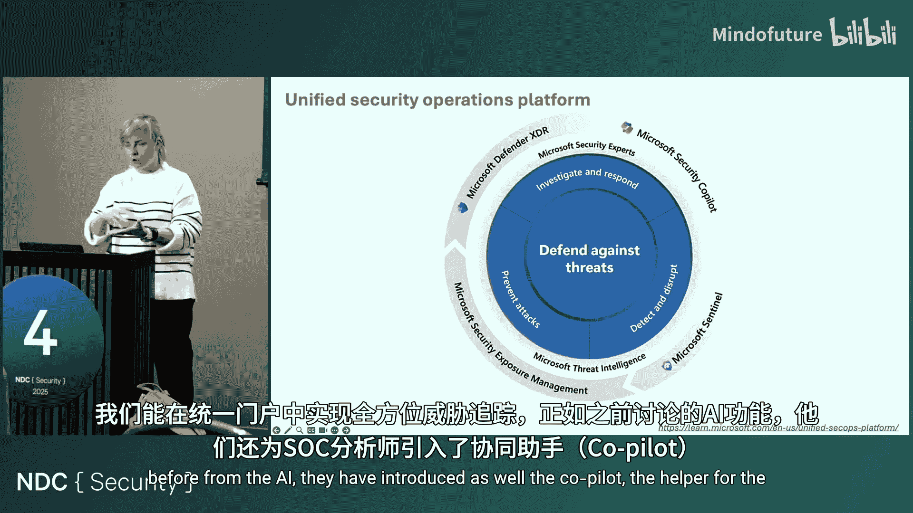
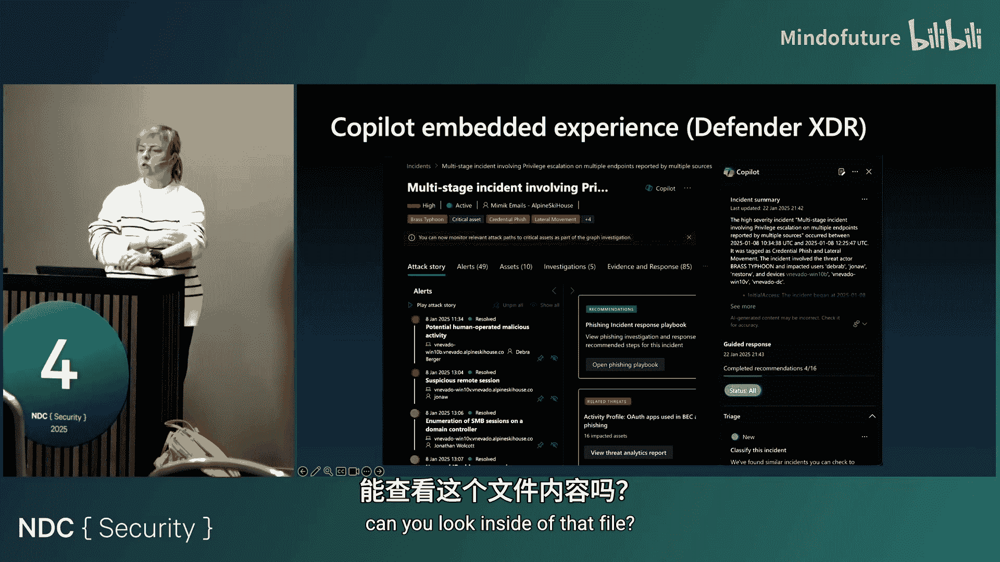
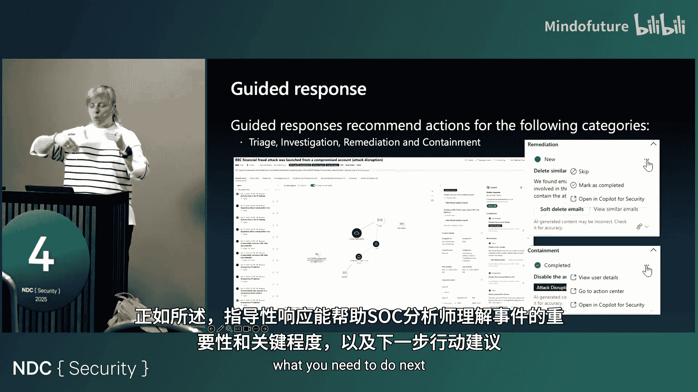
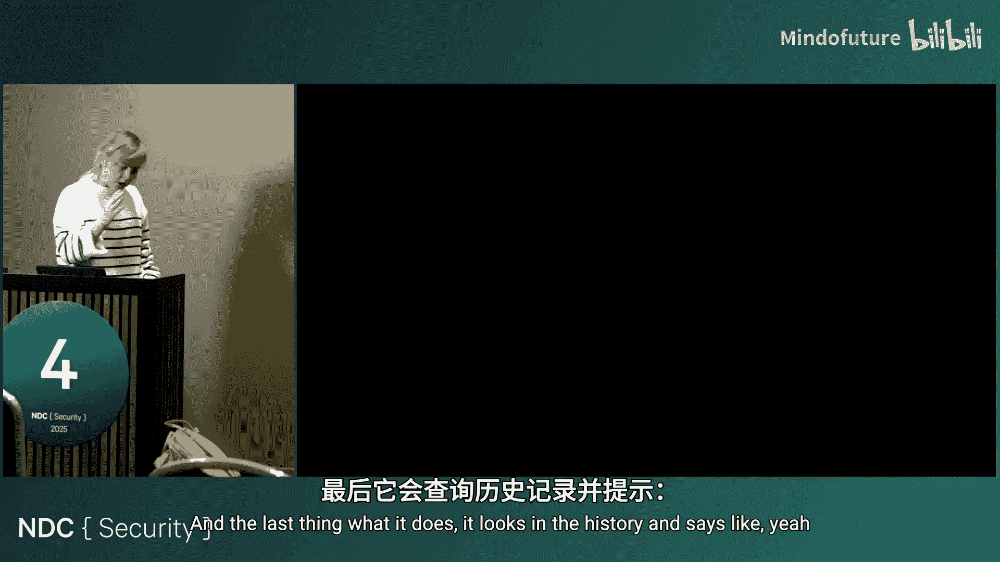
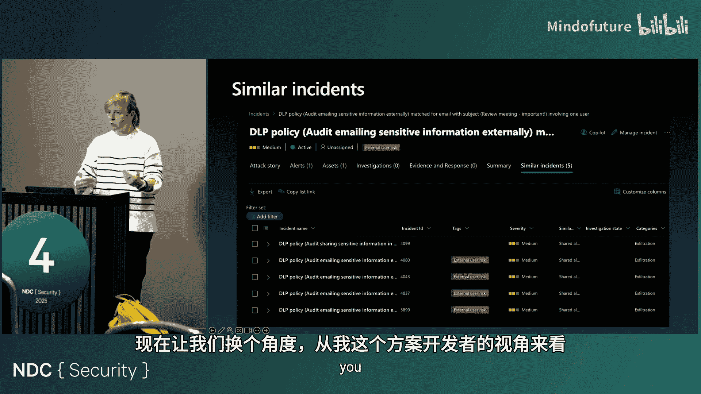
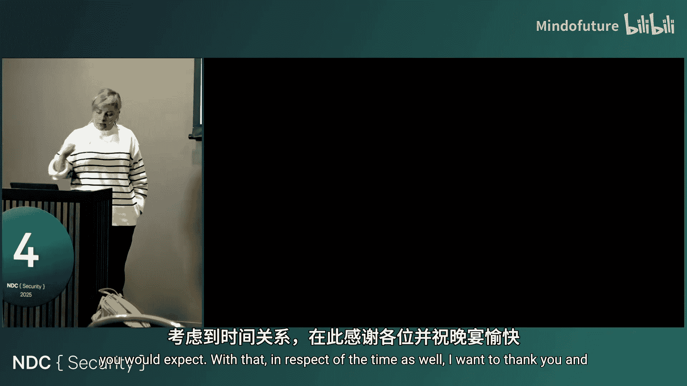

# 003：SOC工程师的演变与AI时代的人类角色

在本节课中，我们将探讨安全运营中心（SOC）在过去25年中的演变历程，并展望AI技术如何塑造SOC工程师的未来角色。我们将看到，AI并非要取代人类分析师，而是成为其强大的助手，共同应对日益复杂的网络安全挑战。

## 从历史看演变：SOC的进化之路

上一节我们介绍了课程概述，本节中我们来看看SOC角色的历史演变。网络安全本身是一个相对年轻的领域，其运营模式随着技术发展而不断进化。

### 20世纪90年代：网络监控的萌芽

在20世纪90年代，安全运营中心的概念开始出现，最初主要用于政府和国防组织。当时的网络安全管理非常基础。

以下是当时的主要特点：
*   **核心任务**：专注于基础网络监控，检查防火墙状态和入侵检测系统。
*   **数据来源**：主要收集防火墙和网络层面的日志。
*   **人员角色**：尚未出现专职的SOC分析师角色，通常由网络管理员兼任。
*   **所需技能**：了解网络协议、基础防火墙配置和日志分析。

### 21世纪初：企业化与专业化

进入21世纪，大型企业和金融机构开始重视集中式安全监控，SOC开始走向专业化。

以下是该阶段的关键发展：
*   **概念形成**：出现了集中式安全监控概念和专用的SIEM（安全信息与事件管理）解决方案。
*   **团队建设**：开始组建7x24小时的安全团队，并设立专职的安全分析师岗位。
*   **技能扩展**：分析师除了需要历史技能，还需理解工具操作和内部事件响应流程。
*   **威胁认知**：开始需要理解恶意软件的基本功能概念。

### 2005-2014年：黄金发展期与复杂化

2005年左右，合规性要求（如ISO 27001）和首批SIEM象限报告出现，SOC运营变得更加结构化。2007年至2014年被认为是SOC发展的“黄金时代”。

以下是该时期引入的新维度：
*   **分层架构**：SOC团队开始出现层级划分（如Tier 1, Tier 2, Tier 3）。
*   **技能升级**：分析师需要具备正则表达式知识，以编写更复杂的检测规则。
*   **新威胁与新服务**：高级持续性威胁（APT）攻击激增，催生了托管安全服务提供商（MSSP），即“SOC即服务”。
*   **自动化萌芽**：出现了安全编排、自动化与响应（SOAR）的概念，旨在自动化响应流程。
*   **调查深化**：分析师需要开始进行取证调查，并掌握脚本编写技能以实现自动化。

### 2015年至今：云时代与AI赋能

2015年后，云计算普及、数据量激增，推动了SOC技术的又一次变革。

以下是当前时代的主要特征：
*   **数据源爆炸**：需要监控云环境（AWS, Azure, GCP）、终端（BYOD）、云访问安全代理（CASB）、云安全态势管理（CSPM）等众多来源。
*   **技能需求拓宽**：SOC分析师需要了解身份认证、云平台原理，并成为特定领域的专家（如云安全、身份安全）。
*   **方法演进**：从被动响应转向主动威胁狩猎。
*   **AI与机器学习应用**：为应对告警疲劳，引入了用户与实体行为分析（UEBA）。如今，AI和机器学习已深度集成到现代SOC平台的各个层面。

## 现代统一安全运营平台与AI

上一节我们回顾了SOC的演变，本节中我们来看看当今最先进的统一安全运营平台如何整合AI能力。传统上，SIEM和XDR（扩展检测与响应）等工具是分离的，分析师需要在不同门户间切换调查。现代平台正致力于统一这些体验。

在一个典型的统一平台中，AI技术已应用于以下核心领域：
*   **威胁检测与分析**：利用机器学习算法检测行为异常。
*   **自动化响应**：例如，在检测到用户被入侵后，AI可自动在Active Directory中禁用该用户账户。
*   **事件优先级排序**：基于业务上下文和风险信号，AI辅助判定事件严重等级（高、中、低）。
*   **威胁狩猎**：数据科学家可使用Jupyter Notebook等工具，编写基于业务场景的高级狩猎查询。
*   **安全副驾驶（Copilot）**：这是近两年的重大发展，旨在直接辅助SOC分析师的工作。

## 深入核心：安全副驾驶（Copilot）如何工作

上一节我们了解了AI在SOC平台中的广泛应用，本节中我们重点剖析最具代表性的AI助手——安全副驾驶。它就像SOC分析师的“ChatGPT”，旨在降低工作复杂度。

安全副驾驶主要帮助分析师应对以下挑战：
*   **技能要求广**：需要熟悉产品、数据模式（Schema）和查询语言（如KQL）。
*   **事件优先级判断**：在海量告警中快速识别关键威胁。
*   **调查效率**：快速理解复杂的多阶段安全事件。

其工作流程类似于大语言模型的提示工程：
1.  **接收提示**：分析师通过界面提出问题（如“显示与此用户ID相关的所有事件”或“编写KQL查询获取前10个事件”）。
2.  **收集数据**：系统从SIEM、XDR、威胁情报等多个数据源收集相关信息。
3.  **模型处理**：将整理后的信息发送给大语言模型（如专为安全定制的模型）进行处理。
4.  **插件执行**：根据需要调用插件执行后续操作（如在ServiceNow中创建工单）。
5.  **返回结果**：将生成的响应返回给安全产品界面。

具体来说，安全副驾驶能提供以下关键帮助：
*   **事件摘要**：用人类可读的语言总结复杂安全事件。
*   **文件逆向工程**：分析可疑脚本文件，解释其行为步骤，对不擅长脚本的分析师尤其有用。
*   **查询编写**：根据自然语言描述，自动编写KQL等查询语句。
*   **影响分析**：评估安全事件可能造成的影响范围。
*   **引导式响应**：提供下一步操作建议。

## 引导式响应：AI助手的决策支持

上一节我们介绍了安全副驾驶的通用功能，本节中我们深入探讨其核心组件之一——引导式响应。它不仅仅是回答问题，更是提供一套结构化的行动建议。

引导式响应旨在帮助分析师完成分类、调查、遏制和修复的全流程。其设计目标是在保证高准确性的前提下，适应不同SOC的运营偏好和业务上下文，并能持续学习新的威胁手法。

微软公开了一份详细架构白皮书和相关数据集，以促进该领域的研究与发展。该数据集包含约200万条告警和数百万条标注事件，源自真实环境。

引导式响应系统主要依赖三个流水线协同工作：
*   **训练流水线（每周运行）**：使用历史SOC遥测数据训练分类和行动推荐模型。公式可简化为：`模型 = 训练(历史事件数据)`。
*   **推理流水线（每15分钟运行）**：为传入的新事件提供行动建议，并查找相似历史事件。
*   **嵌入流水线（每30分钟运行）**：处理过去180天的事件数据，生成并更新事件向量，以便快速进行相似性匹配。

研究表明，安全副驾驶对经验不足的安全分析师和IT管理员帮助更大，特别是在开启一项未知调查时。它正成为SOC工作中不可或缺的工具。

## 未来展望：SOC工程师的发展路径

上一节我们看到了AI工具的有效性，本节中我们展望未来，探讨SOC工程师应如何适应并引领这场变革。尽管技能要求不断拓宽，但AI不会取代SOC分析师。高级管理层仍希望由人类做出最终安全决策。

当前SOC依然面临诸多挑战：
*   专家人才短缺
*   告警疲劳
*   自动化程度有限（即使有SOAR）
*   合规负担加重（如DORA法规）
*   威胁不断演变（攻击者也在利用AI）

面对挑战，SOC分析师应把握以下机遇和发展方向：
*   **掌握提示工程与AI精通**：这是未来的必备技能。不仅要会使用AI，还应学习编写提示手册（Promptbook）甚至插件，定制化AI助手。
*   **深化云安全专业知识**：随着环境向云迁移，深入了解至少一个主流云平台的安全机制至关重要。
*   **保持适应性与敏捷学习**：安全领域持续变化，需要保持学习热情，利用会议、研究和AI工具本身进行技能提升。

未来的SOC分析师将与AI协同工作，人类负责战略决策、上下文理解和监督AI，而AI负责处理海量数据、提供初步分析和自动化响应。两者的结合将使安全运营更高效、更智能。

## 总结

本节课中我们一起学习了安全运营中心（SOC）从20世纪90年代至今的演变历程，看到了SOC工程师所需的技能如何随着网络、云和AI技术的发展而不断扩展。我们深入探讨了现代统一安全运营平台如何整合AI，特别是安全副驾驶（Copilot）及其引导式响应功能的工作原理与价值。最后，我们明确了AI不会取代人类分析师，而是强大的辅助工具。未来的SOC工程师需要积极拥抱AI，掌握提示工程等新技能，并深化在云安全等专业领域的知识，方能在日益复杂的网络安全环境中保持领先。