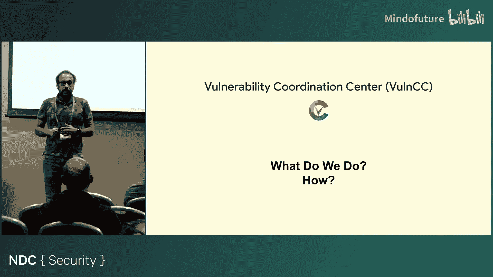
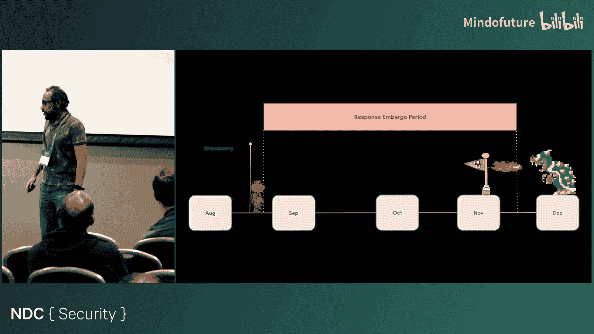
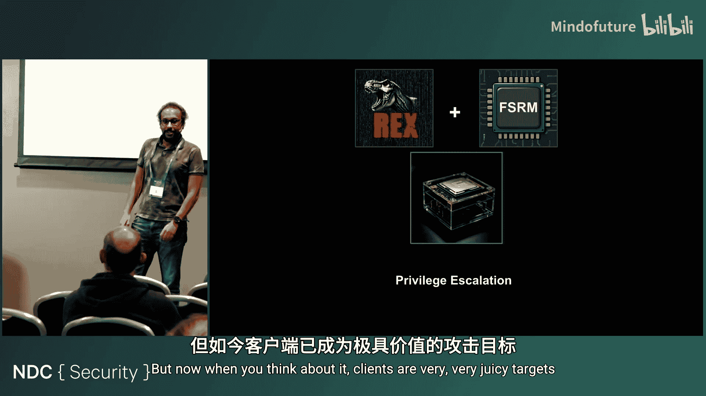

# 004：深入解析谷歌对关键CPU漏洞的发现与修复

在本节课中，我们将跟随一位谷歌安全工程师的视角，深入了解谷歌内部如何应对一个影响广泛的CPU关键漏洞。我们将学习从漏洞发现、影响评估、修复方案制定到大规模协调响应的全过程，并了解谷歌在应对此类安全事件时所遵循的严谨流程和自动化工具。

## 演讲者背景与团队介绍

我是Yu Hassein，谷歌的一名安全工程师。我目前隶属于企业基础设施保护团队，负责为谷歌的基础设施构建安全控制，并专注于确保谷歌对云服务（包括谷歌云、Azure、AWS）的安全使用。

在此之前，我曾在一个名为“漏洞协调中心”的团队工作。这个团队专门负责处理关键漏洞。当出现一个影响巨大、修复工作极其复杂且压力巨大的漏洞时，就需要这样一个团队来端到端地管理整个响应流程。我曾亲自领导过一次针对此类漏洞的响应工作，这也是本次分享的核心内容。

此外，我还参与管理谷歌的漏洞赏金计划。当外部研究人员向谷歌提交漏洞报告时，我会负责复现漏洞，并与开发人员协作修复。

我工作中非常享受的一部分是开发安全工具。可以说，我是一名安全工程师兼软件开发者。我们为谷歌开发工具必须考虑大规模应用，这要求我们像软件工程师一样思考问题。例如，我曾开发过一个自动化系统，它能自动获取关于已知漏洞的公开信息，并与谷歌内部的情报数据进行关联分析。如果发现某个漏洞在野外被利用或可通过网络被利用，该系统会自动调整该漏洞工单的优先级并通知开发人员修复。

漏洞协调中心与漏洞赏金团队关系密切。并非所有漏洞都需要协调中心处理，只有那些非常复杂和关键的问题才会从赏金计划升级到协调中心。我曾是唯一同时隶属于这两个团队的成员，这让我能更好地在两个团队间协调工作。

## 漏洞协调中心与大规模修复

那么，谷歌是如何进行大规模漏洞修复的呢？漏洞协调中心是一个既懂技术（如何识别、复现和修复漏洞）又懂大规模事件管理的团队。

在许多公司，通常有一个团队负责处理被黑后的安全事件。但在谷歌，我们对漏洞的处理方式有所不同。如果一个关键漏洞在谷歌被利用之前被发现，我们就会将其宣告为一次安全事件，并像管理事件一样管理它。时间在这种场景下至关重要。试想，如果有人发现了一个能关闭谷歌搜索的漏洞，这将是需要漏洞协调中心牵头处理的重大事件。

## 技术背景铺垫

在进入具体的响应故事之前，我们先铺垫一些技术背景，确保大家理解一致。

首先，我们编写的代码（例如C语言）经过编译后，会变成一系列供机器执行的指令比特。通过反汇编工具，我们可以将这些比特转换回人类可读性最高的形式——汇编语言。

汇编指令由操作码和操作数组成。例如，指令 `mov eax, ebx` 表示将数据从寄存器 `ebx` 移动到寄存器 `eax`。计算机的核心工作之一就是在寄存器之间移动比特并进行计算。

有些指令的操作数是隐式的。例如，`rep stos` 指令，`rep` 是前缀，表示重复执行后面的 `stos` 指令，而源和目标操作数由机器隐式处理。

那么，如果给机器一个像 `rep rep` 这样的指令会怎样？实际上，多余的 `rep` 会被忽略，机器只执行一次重复操作。

在32位系统中，我们用3个比特来寻址寄存器，最多可以表示 **2^3 = 8** 个寄存器。但在64位系统中，为了寻址更多寄存器，设计者借用了之前被忽略的 `rep` 前缀中的一个比特。这样，我们有了4个比特，可以寻址 **2^4 = 16** 个寄存器。因此，64位系统在这方面更像是一种“技巧”。

接下来介绍两个性能特性：ERMS（增强型重复移动存储）和FSRM（快速短重复移动）。它们是英特尔CPU引入的性能特性。ERMS使某些重复移动操作更高效，但当操作涉及的数据块较小时，其启动开销可能不划算。FSRM则专门针对小块数据优化，提供了性能增益。

最后，我们来看一个标志。这个标志大家都认识，但可能并不完全了解其背后的含义。我们稍后会回到这个话题，它很重要。

## 漏洞响应故事：RepTar

现在，让我们进入具体的响应故事。在谷歌，我们有安全研究员全天候寻找有趣的漏洞。有时，他们会在CPU中发现漏洞。

研究员们采用的一种方法是：获取一个程序，创建其副本并赋予其略微不同的特性。理论上，这两个程序应产生相同的输出。但如果输出不同，就说明存在问题。

他们正是通过这种方法进行测试。结果发现，在满足特定条件的系统上运行这些程序会导致机器检查异常，进而使机器宕机。这个漏洞被称为 **RepTar**，影响英特尔CPU。

这听起来似乎不是大问题？在自己的数据中心运行代码导致系统宕机，似乎影响有限。

但关键在于云环境。当你在云平台的客户机（虚拟机）上运行此漏洞利用代码时，它会导致宿主机（物理机）发生机器检查异常并宕机。在云环境中，一台物理机通常承载着多个客户的虚拟机。这意味着，攻击者可以通过在谷歌云上启动一个虚拟机，运行一段简单脚本，就能导致承载该虚拟机的物理机及其上所有其他虚拟机宕机。如果大规模进行，后果将是灾难性的。

## 响应流程与影响评估

接下来，我们看看谷歌如何响应这个漏洞。响应流程包含多个阶段。

首先是影响评估。我们需要回答几个关键问题：如何利用此漏洞？利用难度如何？我们是否有使用受影响系统的产品？在这个案例中，我们很快达成共识：对于云服务，这是一个严重问题，因为它可以导致承载多台虚拟机的宿主机宕机。

那么，谷歌哪些产品会受到影响？首先是谷歌云。攻击者可以轻易编写脚本，在谷歌云虚拟机上运行，导致物理机宕机。

## 谷歌基础设施演进与影响范围

为了理解影响范围，我们需要回顾一下谷歌基础设施的演进历史。

大约在2003年，谷歌采用传统方式管理数据中心应用，效率不高且管理复杂。为此，谷歌开发了名为 **Borg** 的集群管理系统，用于在全球数据中心自动化部署和管理软件。

几年后，为了更高效地共享资源，谷歌开发了 **cgroups**（控制组），这成为容器资源控制的基础。大约十年后，一个与Borg非常相似的系统进入了公共领域，那就是 **Kubernetes**。

基于此，你认为哪些系统会受RepTar漏洞影响？答案是：运行在英特尔CPU上的谷歌云、Borg基础设施都可能受影响。谷歌内部仍然广泛使用Borg运行所有软件。

因此，我们面临的情况是：谷歌云和Borg基础设施均受影响，并且我们有一个月左右的保密期。我们必须在此期间找到解决方案、完成修复，然后在保密期结束后向公众披露漏洞信息，以便其他人也能修复。

## 协调响应与修复方案

初始步骤是向英特尔报告漏洞，以便协作解决。同时，谷歌、亚马逊、微软等公司会组成一个协作圈，共同测试修复方案，并在公开披露前完成内部修复。

除了服务器，客户端设备是否受影响？是的，运行英特尔CPU的ChromeOS设备也受影响。我们需要在那里修复漏洞。

在客户端，漏洞似乎只是导致设备重启，属于不便，但危害不大？攻击者如何利用呢？情况在英特尔深入研究后发生了变化。

由于英特尔CPU是一个黑盒，我们不了解其全部内部细节。英特尔在收到报告后进行内部研究，发现通过此漏洞可以实现 **权限提升**。这意味着攻击者可能通过浏览器会话等途径，利用漏洞完全控制客户端系统。这使得客户端也成为了高价值目标。

## 修复策略：鸡血位与微码更新

在响应的最初几周，我们首先需要识别受影响的机器数量，并评估修复所需时间。

修复方案有两种选择：一是等待供应商（英特尔）提供修复；二是我们自己想办法。我们确实考虑过自行解决。

一位工程师提出了一个想法：利用CPU中的“鸡血位”。有时，CPU引入新功能时，会提供一个可以开关的比特位来禁用该功能。由于此漏洞的利用需要系统启用FSRM功能，因此禁用该功能即可阻止漏洞利用。

但这里有个问题：FSRM是一个性能特性。禁用它会导致性能下降约10%。这并非理想方案，但我们将其作为备用方案，以防供应商无法及时提供修复。

幸运的是，英特尔随后提供了微码更新，可以在不禁用功能的情况下修复漏洞，且没有性能影响。经过谷歌、亚马逊等公司的生产验证测试后，该微码更新被确认为可靠解决方案。

## 大规模部署与热加载

接下来是如何大规模部署修复。一种方法是重启机器并应用固件更新，但这对于Borg和谷歌云的海量机器来说挑战巨大。

我们采用了另一种策略：**热加载** 微码更新。这意味着我们可以在不重启机器的情况下，将修复固件应用到CPU上。这个过程对用户和上层应用基本是透明的，虽然从CPU周期层面看可能有细微差异，但不会影响应用程序运行。

对于ChromeOS的修复则相对简单：发布更新，客户端设备下载并应用即可。

## 事件指挥结构与IAG协议

如此复杂的响应工作绝非一两人可以完成。谷歌有一套名为 **IAG** 的事件管理协议和流程，灵感来源于医护人员和消防员的应急协议，旨在紧张情况下有条不紊地执行预案。

启动IAG流程后，首先会建立一个独立于公司常规管理结构的事件指挥团队。在此次事件中，我担任**事件指挥官**，相当于此次事件的“CEO”，拥有最高决策权。

团队结构包括：
*   **行动负责人**：负责技术修复和部署。
*   **数据中心响应负责人**：专注于数据中心层面的修复。
*   **谷歌云响应负责人**：负责谷歌云相关事宜。
*   **ChromeOS响应负责人**：处理客户端系统修复。
*   **企业响应与平台安全负责人**：保护谷歌内部企业系统。
*   **技术研究负责人**：领导最初发现漏洞的研究团队。
*   **技术负责人**：统领所有技术挑战，并与英特尔等供应商对接。
*   **沟通负责人**：负责内部外部沟通，包括撰写安全公告。
*   **法律负责人**：确保所有沟通符合法律要求。
*   **Alphabet非谷歌公司负责人**：协调保护谷歌母公司Alphabet旗下其他非谷歌公司（如Verily）。由于与英特的保密协议仅限谷歌，我们只能在漏洞公开后协助这些公司修复。

遵循IAG协议使我能够专注于关键的分析和决策工作，避免在压力下慌乱。

## 公开披露与后续插曲

响应的最后阶段是公开披露。这一天我们既感到欣慰（工作完成），也略带紧张（未知的公众反应）。我的经验是，最令人担忧的往往是那些有充足时间、不为金钱只为兴趣的研究者。漏洞公开后，他们可能会找到更简单的利用方法，甚至衍生出新的漏洞。

我们按计划发布了安全公告。一切似乎都已结束，我正准备休假。

然而，在公告发布一天后，我们收到了公众的一条消息。对方称，在谷歌云的Cloud Shell环境中使用我们发布的漏洞检测工具 **Icebreak** 进行测试，结果显示漏洞仍然存在。

这引起了我们的警觉。经过紧急分析，我们发现是 **Icebreak工具本身存在一个Bug**，导致误报。系统实际上已经修复。虚惊一场后，我们修复了工具，我也得以按计划休假。

## 经验总结与未来改进

从这次经历中我学到了很多。遵循IAG协议至关重要，它帮助我们在高压下保持专注，按部就班地处理问题。

有哪些可以做得更好？我认为可以进行更多的演练，让大家更熟悉此类响应流程。在沟通和工具部署方面也存在一些可以优化的挑战。虽然整体顺利，但总有改进空间。

我们能否实现自动化？当然可以。这次经历直接促成了我后续开发的一个内部项目——**谷歌CPU响应工具包**。这个工具包旨在让未来的CPU漏洞响应更易于管理。作为事件指挥官，你无需手动创建大量文档和准备工作。该工具包可以自动化处理诸如工件准备、修复就绪状态检查、团队协调沟通等繁琐任务，让你能更专注于需要指挥官决策的关键部分。

我相信谷歌已经为应对下一次重大漏洞做好了充分准备。我们拥有强大的流程、团队和工具，只要保持冷静、遵循协议，就能妥善处理。

本节课中，我们一起深入探讨了谷歌应对关键CPU漏洞“RepTar”的完整生命周期。我们从漏洞的发现与原理讲起，逐步分析了影响评估、修复策略制定（包括鸡血位与微码更新）、大规模协调部署的挑战，并重点介绍了谷歌内部的事件指挥协议（IAG）如何确保复杂响应工作有序进行。最后，我们总结了经验教训，并看到了自动化工具（如CPU响应工具包）在提升未来响应效率方面的价值。希望这次分享能让你对大型科技公司如何管理安全危机有一个直观的了解。