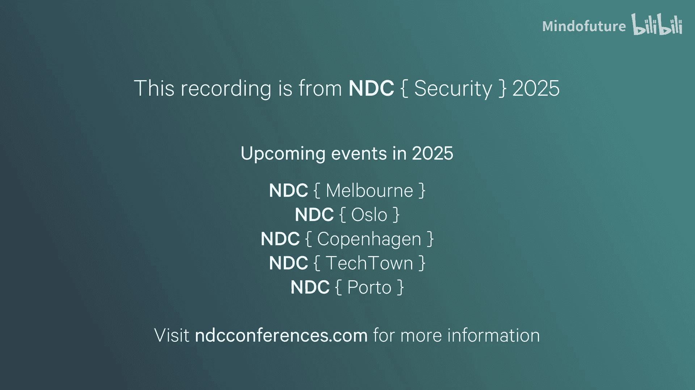
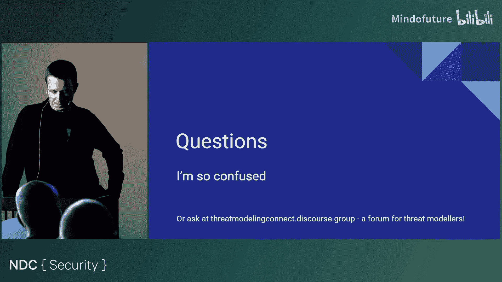
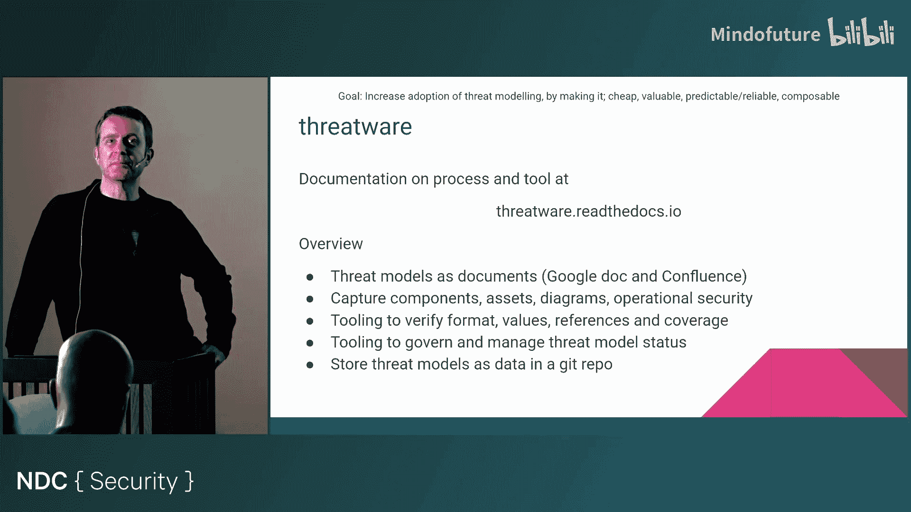

# 006：通过简化科学改进威胁建模

在本节课中，我们将学习如何利用“简化”的科学原理来改进威胁建模流程，使其更易于采用和扩展。我们将探讨一个由化学家George M. Whitesides提出的简化框架，并将其应用于威胁建模的实践。

## 概述：为什么需要简化威胁建模？

威胁建模是识别和解决系统设计安全问题的有效方法。然而，它通常是一个手动过程，难以大规模推广。一个安全冠军计划可以帮助解决推广的物流问题，但活动本身也必须足够“好”，即易于执行且能提供价值。

在我看来，让威胁建模更易于采用的一个方法是尽可能保持其简单性。但“简单”究竟意味着什么？本次演讲将探讨如何利用简化来使威胁建模成为一种更多人愿意反复进行的活动。

## 什么是“简单”？🤔

“简单”并非一个容易定义的概念。我们可以从不同角度看待它：
*   **构造简单**：例如，意大利肉酱面是初学者容易学习的菜肴。
*   **目的简单**：例如，一本书的目的是传递信息。
*   **功能简单**：例如，触摸屏平板电脑，儿童也能轻松使用。

然而，上下文至关重要。以杯子为例：
*   **对谁简单**？并非所有人都能使用杯子。
*   **何时简单**？在风平浪静时简单，在波涛汹涌的船上则不简单。
*   **在何种条件下简单**？在失重环境下，杯子无法正常工作。

因此，没有脱离上下文的“简单”定义。但我们的化学家朋友指出，简单的事物通常共享一些特性。

## 简单的四个特性 🧱

George M. Whitesides提出了简单事物通常具备的四个特性：

1.  **廉价**：简单事物的成本不应很高。
2.  **有价值**：简单事物必须具有功能，且其功能价值应与成本相匹配。
3.  **可靠且可预测**：简单系统应该是可靠和可预测的。
4.  **可组合**：简单事物应能作为构建块，易于重新组合以构建其他事物。

为了将其转化为可用的框架，我将“可组合的建筑块”重新表述为更符合技术领域的“**可组合性**”。

接下来，我们将逐一解构这些特性，探讨如何理解和应用它们来评估或优化某个事物（如流程、工具）的简单性。

### 特性一：廉价 💰

“廉价”意味着成本低。在优化时，我们可以设法减少时间、资源、人力、精力、知识或培训需求。

然而，事物不能无限便宜。成本过低可能会损害其有效性价值，这就引出了下一个特性。

### 特性二：有价值 🎯

有价值意味着事物必须有用。评估价值可以从以下几个角度考虑：
*   **有用性**：必须结合上下文来理解。对谁有用？在何时何地有用？为何有用？有多大用处？
*   **便利性**：事物在更多地点、时间、为更多人、以更多样化的方式和目的可用，则价值更高。
*   **多样性**：通过提供不同成本点的多样选择来满足不同受众。例如，乐高提供不同价位和复杂度的千年隼模型，以适应不同消费者的需求和预算。

### 特性三：可靠且可预测 ✅

我将这两个特性视为一组，关乎**可用性和采用障碍**。
*   **可预测**：意味着符合所有受众的期望，没有意外，行为一致。
*   **可靠**：意味着在给定各种输入下都能工作，并能赢得用户的信任。

一个经典的例子是某清漆的广告语：“**它完全按照罐子上说的做**”，这直接传达了可预测、可靠和可信赖的信息。

在框架中，除了可靠和可预测，还应考虑其他影响采用的因素，例如**持续时间**——简单的事物不应花费过长时间来运行。

### 特性四：可组合性 🔗

可组合性意味着一个流程或工具的输出可以轻松地作为其他事物的输入。当某物简单时，人们会以意想不到的方式使用它。

技术中有很多例子：
*   Linux `grep`命令和管道操作符被用来解决填字游戏比赛。
*   有人在《我的世界》里构建了一个可运行的《Pong》游戏。
*   开源库和API构成了一个巨大的“可组合性”资源库。

评估可组合性可能比较困难，但可以观察某物是否被设计成易于将其输出作为其他输入的格式。

## 将简化框架应用于威胁建模 🛡️

以上我们探讨了通用的简化框架。现在，让我们将其应用于**威胁建模**这个具体场景。我们的目标是：利用这个框架最小化成本、最大化价值，使威胁建模更简单，从而提升采用率。

我们将结合框架的每个特性，为威胁建模设定具体目标。

### 目标一：尽可能简单（对应“廉价”）

我们希望威胁建模的输入成本尽可能低。需要思考威胁建模给团队带来的成本，并设法最小化：
*   **人力成本**：能否与更初级的成员合作？何时进行对团队影响最小？
*   **时间成本**：流程能否与团队的工作方式（如单次会议、一个冲刺周期）对齐？
*   **知识成本**：
    *   **流程知识**：理解流程本身所需的成本。
    *   **背景与培训知识**：熟悉文档、安全术语、工具的成本。
    *   **技术知识**：创建图表、了解系统细节和数据流的成本。
    *   **安全知识**：理解需要保护什么以及现有安全控制措施的成本。

**关键在于理解参与人员的具体工作方式**，使流程尽可能贴合他们，从而降低成本。

### 目标二：交付相关且可操作的威胁（对应“有价值”）

威胁建模必须擅长发现相关且可操作的威胁。
*   **聚焦业务重点**：流程必须聚焦于发现对业务重要的东西（如知识产权、数据完整性、可用性、信任）。
*   **选择安全模型**：选择要关注的安全属性（如STRIDE、MITRE ATT&CK）。选择的安全属性越多，威胁建模的成本就越高。
*   **简化安全模型**：**减少考虑的安全属性数量是降低威胁建模成本的最有效方法之一**。但需要在成本降低和价值损失之间找到平衡。

### 目标三：消除采用障碍（对应“可靠/可预测”）

我们的威胁建模流程需要做到“名副其实”，满足期望，值得信赖。
*   **可靠**：
    *   **技术无关**：适用于所有技术栈。
    *   **高质量分析**：适用于业务的任何部分。
    *   **可重复**：相同输入产生相似输出。
    *   **令利益相关者满意**：输出能满足各方需求。
*   **可预测**：
    *   **时机恰当**：不太早（威胁太泛泛）也不太晚（改造成本太高）。
    *   **范围明确**：覆盖该覆盖的，不越界。
    *   **信息一致、完整、正确**。
    *   **符合公司标准**（如文档规范）。
    *   **威胁数量可控**，避免信息过载。
    *   **输出格式统一**，便于规划和比较。

一个显得专业、周到、可信赖的流程，更有可能被团队采纳。

### 目标四：成为基础性活动（对应“可组合性”）

我们希望威胁建模的输出能与其他流程结合，使其成为安全生态系统的基石。
*   **组合视图**：能否组合多个威胁模型以获得系统整体的安全视图？
*   **赋能其他安全流程**：输出能否用于指导安全测试、渗透测试？
*   **支持治理**：能否用于跟踪企业范围内的威胁和风险覆盖情况？
*   **满足审计要求**：输出能否格式化为外部审计或合作伙伴要求的规范？
*   **生成度量指标**：能否基于威胁和控制数据生成威胁评分或度量指标？

虽然让威胁建模数据变得有用可能需要额外工作（尤其是当数据是非结构化的自由文本时），但**优化输出的可组合性**，能使威胁建模成为一个持续相关、被广泛采用的基础活动。

## 框架实践：评估常见威胁建模方法 ⚖️

理论足够多了，这个框架在实践中是否有用？我发现它能够清晰地解释或评估其他常见威胁建模方法的优缺点。

以下是使用该框架对两种常见方法的简要评估：

**1. 头脑风暴法**
*   **优点**：能产生新颖的威胁。
*   **缺点（从框架看）**：**不可重复**，不同次会话可能产生不同的威胁集，这使得它**不可预测/不可靠**，难以满足“简单且可扩展”的标准。
*   **结论**：并非不能使用，在时间紧迫、只需一次性评估或有强力人员承诺的情况下是很好的选择。但**难以在全公司范围内扩展**。

**2. 微软威胁建模工具**
*   **优点**：较多。
*   **缺点（从框架看）**：
    *   **成本**：让人们上手使用、理解图表和安全术语（如STRIDE）的成本较高。
    *   **价值**：**输出噪音大**，产生过多威胁，降低了信号噪音比，从而降低了价值。
*   **结论**：是开始威胁建模之旅的好地方。但庞大的威胁输出量使其难以作为大规模推广威胁建模的首选工具。

## 案例研究：ThreatWare的设计决策 🛠️

基于对现有方法的不满，我创建了自己的威胁建模方法ThreatWare。许多设计决策是在了解这个简化框架之前做出的，但两者高度吻合，这反过来验证了框架的实用性。

以下是我的一些设计决策如何与框架特性对齐：

**围绕“廉价/尽可能简单”的设计决策：**
*   **使用常见工具**：用Google Docs或Confluence创建模型，无需学习新工具。
*   **放宽图表要求**：只需相关或大致准确的图表，不强求特定格式，降低维护成本。
*   **简化安全术语**：只要求理解保密性、完整性、认证和授权，并用简单术语（读/写访问）解释。
*   **聚焦设计问题**：安全模型仅用于发现设计问题。
*   **聚焦威胁而非风险**：只收集判断威胁是否存在所需的信息，降低信息收集成本。
*   **鼓励小型化**：鼓励多个小型威胁模型，而非少数大型复杂模型。
*   **使用模板和共享**：从模板开始，鼓励团队间复制高质量模型内容，加速进程。
*   **提供详细文档**：支持团队自助服务，降低对安全专家的依赖。
*   **关注系统知识而非安全知识**：只需提供系统如何工作的信息，由流程推导出威胁。

**围绕“有价值/交付相关威胁”的设计决策：**
*   **聚焦访问控制**：仅关注与访问控制相关的少数设计问题，确保威胁始终相关且数量可控。
*   **聚合表达威胁**：允许以聚合方式表达威胁，避免因组件和数据排列组合导致的威胁数量爆炸。
*   **工具辅助查漏**：利用文档结构检测缺失的排列组合，确保威胁未被遗漏。
*   **引入审批机制**：确保被复制的内容是高质量的。

**围绕“可靠可预测/消除障碍”的设计决策：**
*   **遵循康威定律**：按团队边界划分威胁模型范围，确保产生的威胁是该团队可控的。
*   **使用结构化文档**：确保每个威胁模型的数据捕获方式和位置一致，使团队明确知道该做什么以及“好”的标准。
*   **提供验证工具**：编写工具来解析和验证威胁模型文档，确保内容一致、有效，团队可自助验证。
*   **与现有流程集成**：将后续行动链接到团队的现有工单系统，使团队能以熟悉的方式消费威胁和修复建议。

**围绕“可组合性/成为基础活动”的设计决策：**
*   **可组合的范围**：配置确保每个组件只属于一个威胁模型，使得一组威胁模型可以互补地组合起来分析更大系统的安全性。
*   **输出包含元数据**：输出中包含组件、资产、安全控制等元数据，可供其他安全活动使用。
*   **机器可读输出**：工具将文档转换为YAML/JSON等机器可读格式。
*   **版本控制**：将批准的威胁模型版本存储在Git仓库中，便于访问历史和进行版本控制。

**ThreatWare的局限性：**
*   对难以分解的巨大单体系统效果较差。
*   对尚未建立通用模型、只想威胁建模特定功能的情况效果较弱。
*   文档格式意味着实时格式控制需依赖工具验证。
*   故意简化了安全模型，可能无法发现所有新颖威胁（需安全团队额外介入）。

## 简化评估：关键问题清单 ❓

最后，本着本次演讲的精神，我留下一组更简单的问题，供你评估自己或他人的威胁建模方法：

*   **廉价/尽可能简单**：
    *   如何最小化人们需要了解的安全知识？
    *   如何最小化他们需要提供的信息？
*   **有价值/交付相关威胁**：
    *   你发现的威胁是否对相关人员有价值？
    *   如何改变流程以提供更多价值？
    *   **（有争议但实用的观点）** 在成本与价值之间权衡时，我通常倾向于**以牺牲部分价值为代价来最小化成本**。一个被人们实际使用的威胁建模流程，其价值永远高于一个根本没人用的流程。
*   **可靠可预测/消除障碍**：
    *   如果同一威胁模型做两次，会得到相似的结果吗？（这能告诉你方法的可预测性和可靠性）
    *   威胁模型的输出能否轻松集成到团队现有流程中？（这表明你是否在为团队提供便利）
*   **可组合性/成为基础活动**：
    *   能否将你的威胁模型组合起来，以获得系统安全的更大视图？
    *   威胁建模的输出能否很好地输入到其他安全活动中？

## 总结 🎓

简单性是扩展（几乎）任何事物的关键。但实现简单性本身是困难的。它通常不是从简单开始，而是从一个复杂事物开始，通过不断剥离、优化，最终得到一个在合适成本点上提供价值、且高度可用的东西。

当然，所有这些决策和工作都离不开对你所处**上下文**的深刻理解。在威胁建模的上下文中，如果我们能这样解读并应用这四个特性，就有望得到一个更具可扩展性、更易于访问且最终更成功的威胁建模流程。

**本节课中，我们一起学习了：**
1.  “简单”的多维度含义及其对上下文的高度依赖。
2.  由George M. Whitesides提出的简单事物的四个特性：廉价、有价值、可靠可预测、可组合。
3.  如何将这些特性转化为一个评估和优化威胁建模流程的实用框架。
4.  如何将该框架应用于评估常见威胁建模方法（如头脑风暴法、微软威胁建模工具）。
5.  通过ThreatWare的案例，了解了如何依据框架特性做出具体的设计决策。
6.  获得了一套用于评估自身威胁建模流程的简化问题清单。

希望本教程能帮助你思考如何让你的威胁建模实践变得更简单、更有效。