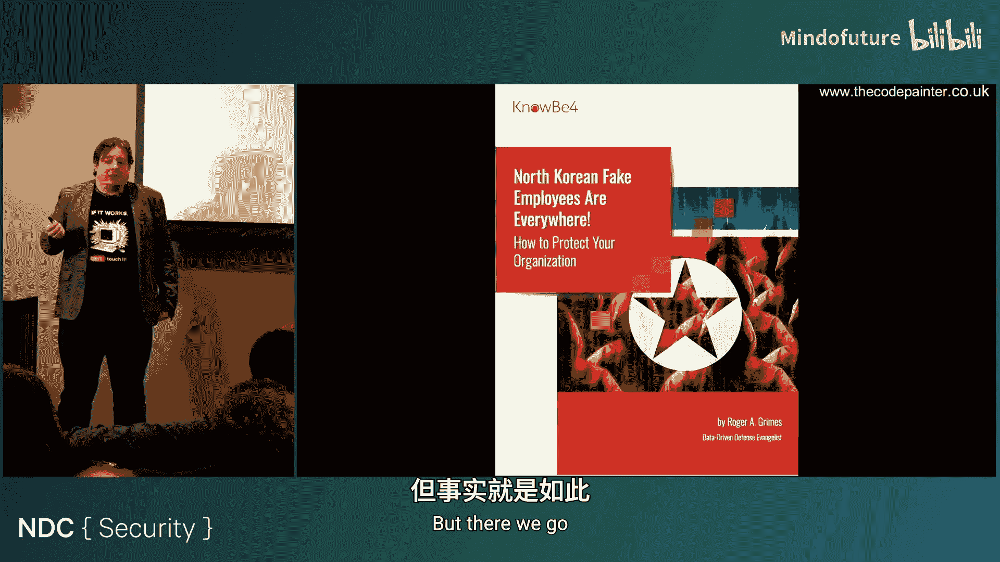
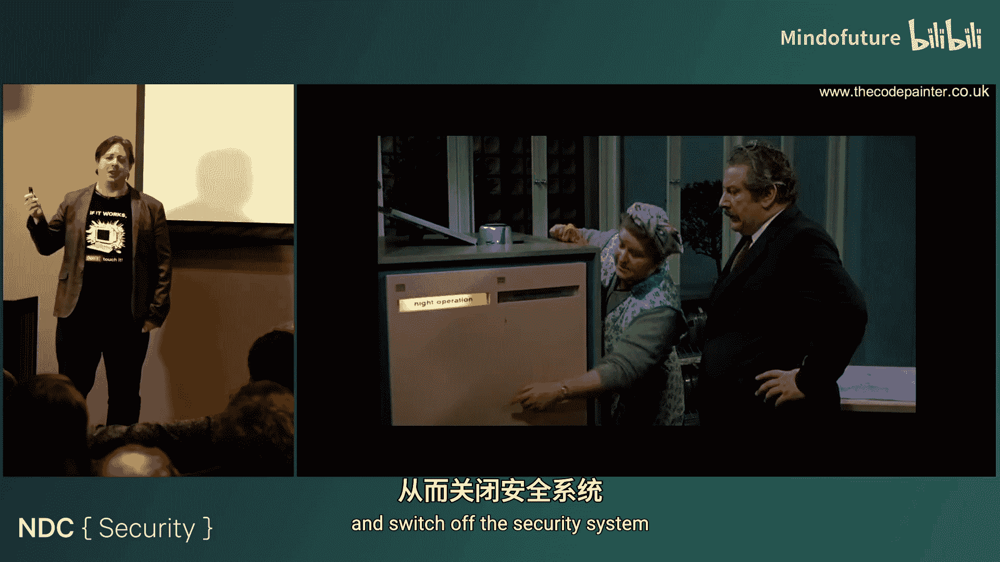
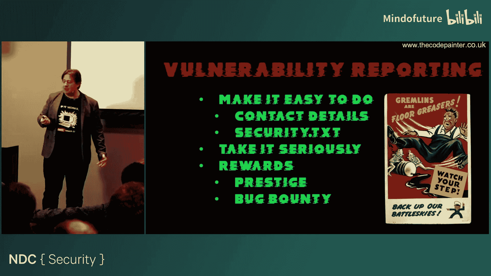
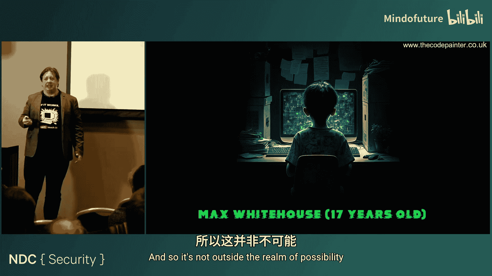
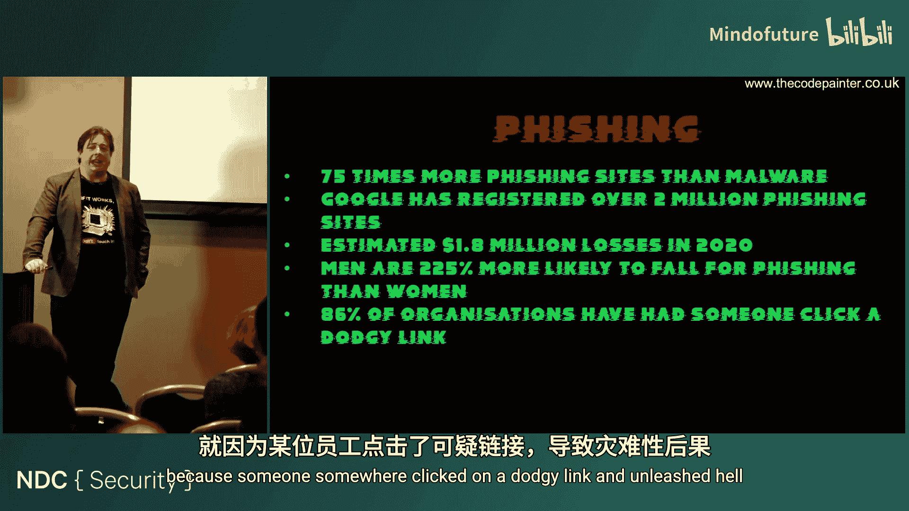
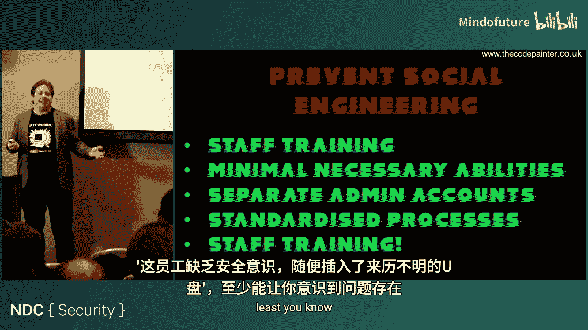
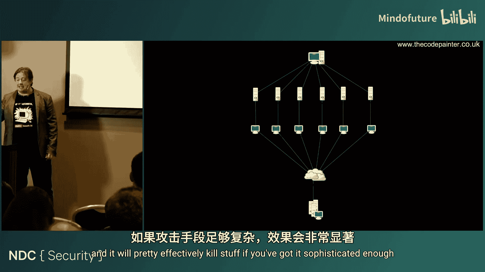
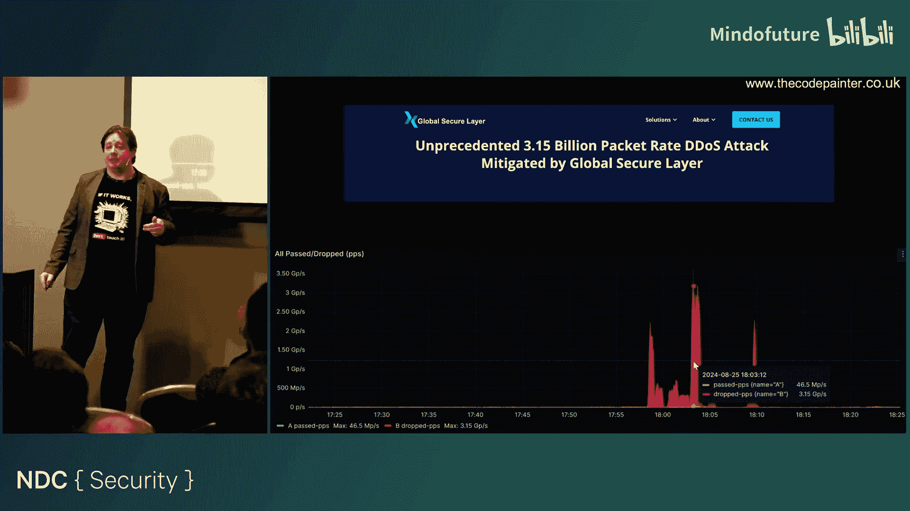
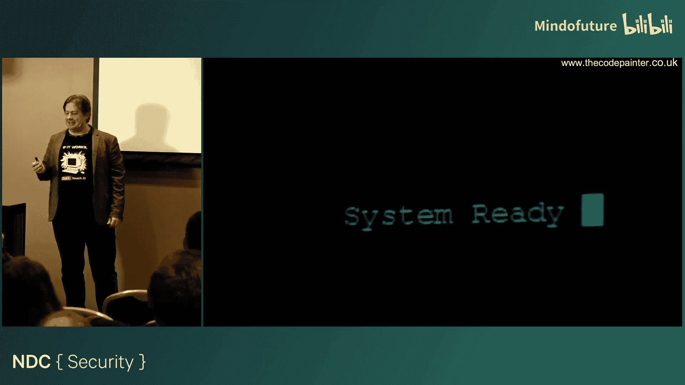
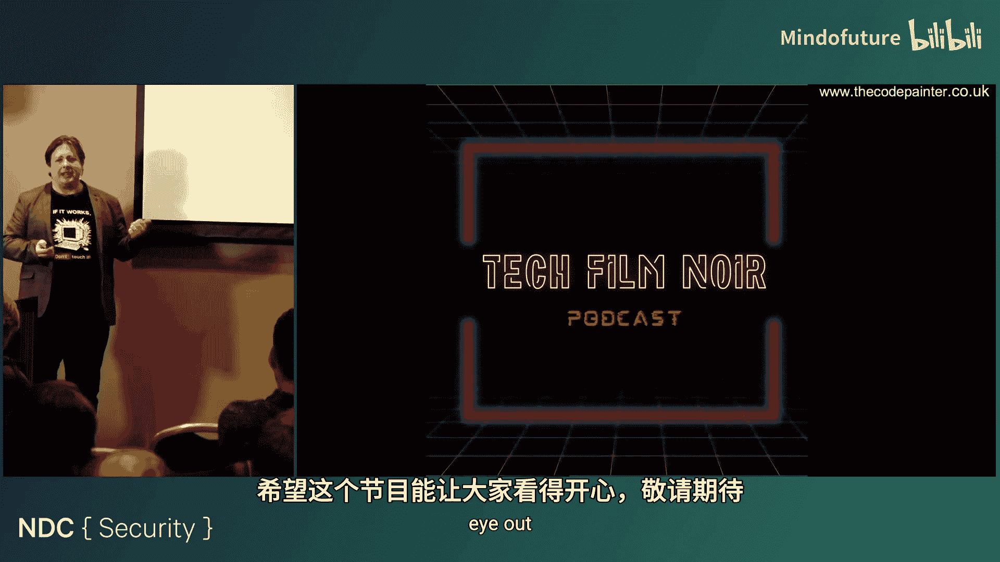

# 008：电影能教给我们什么信息安全知识


在本节课中，我们将通过分析几部经典电影中的情节，探讨其中涉及的信息安全概念与现实世界的联系。我们将学习员工欺诈、漏洞报告、密码安全、社会工程学、物理安全、DDoS攻击以及内部威胁等核心主题，并了解如何在实际工作中应用这些安全知识。

## 员工欺诈与内部威胁

上一节我们介绍了课程概述，本节中我们来看看电影《偷天换日》（Hot Millions）中展示的员工欺诈行为。影片主角通过伪造身份入职公司，并利用系统漏洞进行欺诈。

以下是关于员工欺诈的关键事实与防范措施：

*   **普遍性**：大多数公司都曾遭遇某种形式的员工欺诈，但通常因不愿公开而很少被报道。
*   **主要动机**：通常是员工陷入财务困境等绝望境地，而非单纯的贪婪。
*   **常见形式**：最常见的是账单欺诈和直接盗窃现金，通常发生在普通员工层面，而非管理层。
*   **性别比例**：约72%的欺诈行为由男性实施。
*   **成本估算**：据估计，欺诈每年消耗公司约5%的营收。
*   **防范措施**：
    *   **了解员工**：关注员工状态，及时发现财务压力等危险信号。
    *   **适度监督**：建立监督机制，表明公司关注流程。
    *   **文件追踪**：确保操作有迹可循，便于审计。
    *   **严格审查**：警惕虚假员工，特别是在远程雇佣场景下。

## 漏洞报告的重要性



在《偷天换日》中，一个关键的“蓝灯”安全设备因物理设计缺陷（敲击特定位置即可关闭）而被清洁工意外发现并利用。这引出了漏洞报告的话题。



有效的漏洞报告机制应包含以下要点：



*   **易于报告**：提供明确的联系渠道，例如 `security@yourcompany.com`。
*   **严肃对待**：必须认真处理收到的报告，否则报告来源将很快枯竭。
*   **提供奖励**：可以通过漏洞赏金计划提供金钱奖励，或通过公开致谢等方式给予荣誉激励。


## 密码安全基础

电影《蝙蝠侠与罗宾》中，芭芭拉仅通过猜测（“Peg”是“Margaret”的昵称）就破解了装有蝙蝠侠所有秘密的盒子密码。这凸显了弱密码的危险性。

以下是提升密码安全的核心措施：

*   **使用独立用户账户**：避免单一密码访问所有资源，以便追踪操作者身份。
*   **高熵值密码**：创建包含大小写字母、数字和特殊字符的长密码。
*   **检查常见密码**：在用户设置密码时，与常见密码列表比对并阻止使用。
*   **尝试次数限制**：实施登录尝试次数限制，即使加入短暂延迟也能显著增加破解难度。
*   **多因素认证**：结合密码与手机验证码、硬件密钥等其他因素。
*   **使用密码管理器**：鼓励使用密码管理器生成和存储复杂密码。
*   **安全存储密码**：在服务器端仅存储加盐的密码哈希值，而非明文密码。加盐哈希的伪代码表示如下：
    ```python
    import hashlib
    import os

    def hash_password(password):
        salt = os.urandom(32) # 生成随机盐值
        key = hashlib.pbkdf2_hmac('sha256', password.encode('utf-8'), salt, 100000)
        return salt + key # 存储盐值和密钥

    def verify_password(stored_password, provided_password):
        salt = stored_password[:32] # 提取盐值
        stored_key = stored_password[32:]
        new_key = hashlib.pbkdf2_hmac('sha256', provided_password.encode('utf-8'), salt, 100000)
        return new_key == stored_key
    ```
*   **考虑替代方案**：评估使用生物识别、智能卡、一次性密码等非传统密码认证方式。

电影《黑客》（Hackers）中也讽刺了使用“love”、“secret”、“god”等常见密码的行为。现实中，全球最常用的密码是 **`123456`**。

## 社会工程学攻击

在《黑客》中，主角通过电话伪装成技术支持人员，从保安那里套取了路由器信息。这是一种典型的社会工程学攻击。




社会工程学的主要形式包括：

*   **网络钓鱼**：通过伪造的邮件、链接诱骗受害者。
*   **诱饵攻击**：故意遗留载有恶意软件的USB设备等，诱使他人使用。
*   ** pretexting（借口欺骗）**：冒充他人身份（如同事、IT支持）以获取信息或访问权限。
*   **鱼叉式网络钓鱼**：针对特定目标进行深入研究后，发起高度个性化的钓鱼攻击。



网络钓鱼已成为比恶意软件更普遍的威胁，据统计其发生频率是后者的75倍。防范社会工程学攻击的方法包括：

*   **员工培训**：提高员工对各类社会工程学手法的认识和警惕性。
*   **最小权限原则**：只授予员工完成工作所必需的系统权限。
*   **独立的管理账户**：将日常使用账户与高权限管理账户分离。
*   **标准化流程**：严格执行安全流程，例如所有权限变更必须通过工单系统并由上级审批。
*   **模拟测试**：通过进行模拟钓鱼演练等方式检验和提升员工的防御能力。

电影《冰雪奇缘》中汉斯王子对安娜公主的欺骗，以及现实中利用AI伪造名人形象进行的“杀猪盘”诈骗，都是 pretexting 的深刻例证。



## 物理安全与信息收集

《黑客》中的角色通过翻找垃圾桶、伪装成工作人员在办公室安装嗅探设备、观察他人输入密码等方式收集信息。这说明了物理安全的重要性。

保障物理安全的措施包括：


*   **物理访问控制**：防止未经授权的人员接触办公设备，因为直接物理访问往往能轻易绕过许多软件防护。
*   **文件分级标记**：根据信息敏感度对文件进行明确标记（如“公开”、“内部”、“机密”）。
*   **安全处置**：对含敏感信息的废弃物进行粉碎或使用专业销毁服务。
*   **佩戴身份标识**：要求员工和访客佩戴身份标识，但同时要意识到仅靠标识并不完全可靠。
*   **员工培训**：培训员工敢于质疑陌生人或异常情况。
*   **多因素认证**：在物理访问点（如门禁）也采用多因素认证。
*   **限制访客活动范围**：访客应在接待区等候，不应随意进入办公区。
*   **访客登记**：对访客进行登记，必要时拍照留存记录。

## 分布式拒绝服务攻击

在《黑客》的高潮部分，黑客们联合发起了一场对公司的“黑客大战”，用各种病毒攻击对方系统。这类似于今天的分布式拒绝服务攻击。





DDoS攻击通过控制大量设备（常为不安全的物联网设备）同时向目标发送海量请求，使其服务瘫痪。攻击规模不断刷新纪录，最新的记录达到了每秒3.15太比特。

缓解DDoS攻击的策略包括：


*   **等待攻击停止**：对于由“脚本小子”发起的短期攻击，有时等待其自行停止是可行的。
*   **支付赎金**：虽然不鼓励，但有些公司会选择支付赎金以快速恢复服务（攻击者常以此勒索）。
*   **分布式网络托管**：将服务部署在全球多个节点，分散攻击流量。
*   **流量清洗与IP黑名单**：通过上游服务提供商清洗恶意流量，或屏蔽攻击源IP（但对海量分布式IP效果有限）。
*   **使用抗DDoS托管服务**：付费使用专业的DDoS防护服务。
*   **推动物联网安全法规**：从根本上解决需要制定并执行物联网设备的最低安全标准，防止其被轻易劫持成为“肉鸡”。

## 内部威胁与开发文化

电影《侏罗纪公园》中的程序员丹尼斯·奈德里因不满和财务问题，故意在系统中植入后门并关闭安全围栏，导致灾难发生。这揭示了糟糕的开发文化和单一开发者依赖带来的巨大风险。





防范此类内部威胁的方法包括：

*   **培养健康的开发文化**：杜绝像奈德里那样拒绝批评、以自我为中心、将个人凌驾于代码之上的有毒文化。鼓励代码审查和团队协作。
*   **避免“独狼”开发**：至少安排两名或以上开发者共同负责关键系统，互相监督，降低植入恶意代码的风险和诱惑。
*   **制定灾难恢复计划**：提前规划系统故障时的应对措施。
*   **明确故障策略**：对于关键系统（如 containment system），必须预先决定故障时是“失效开放”还是“失效关闭”。关着恐龙的围栏，故障时理应“失效关闭”。

## 安全通过隐匿的谬误

电影《网络惊魂》（The Net）中，反派将能入侵任何系统的“后门”代码隐藏在一个网站角落的图标里，认为无人能发现。这体现了“安全通过隐匿”思想的严重缺陷。

依赖“隐匿”作为安全手段是危险的，因为秘密一旦被发现（通常很快），就毫无安全性可言。此外，在将代码交给第三方测试时，必须谨慎区分核心敏感代码和可公开测试的代码。

## 总结与核心建议

本节课中我们一起学习了如何从电影情节中提炼信息安全教训。回顾所有内容，我们可以总结出两个最核心的要点：

1.  **善待你的员工**：员工既是公司最大的资产，也是最大的安全漏洞来源。关注他们的困难，提供帮助和培训。良好的员工关系能以最低成本预防许多内部风险，可能避免数百万的损失。
2.  **安全是相对的**：大多数攻击者并非天才，而是使用现成工具的“脚本小子”。你的安全措施不需要完美无缺，只需要比你的“邻居”更牢固。就像自行车防盗，你的锁不必坚不可摧，只要比旁边车的锁更难开就行。



信息安全是一个持续的过程，需要结合技术、流程和人员管理。希望本课程提供的视角和简单措施，能帮助你在日常工作中构建更有效的安全防线。