# 009：用不到100行Shell脚本实现Linux容器


在本教程中，我们将学习如何使用不到100行的Shell脚本，从零开始构建一个功能类似于Docker的简易Linux容器。我们将深入理解容器背后的核心技术，包括命名空间、联合文件系统和控制组，并通过实践脚本一步步实现容器的创建与启动。

## 概述：容器是什么？

容器是一种轻量级的虚拟化技术，它通过Linux内核提供的命名空间和控制组等功能，为进程组创建一个独立的运行环境，使其拥有独立的文件系统、网络、进程ID等资源视图，从而实现与宿主机及其他容器的隔离。

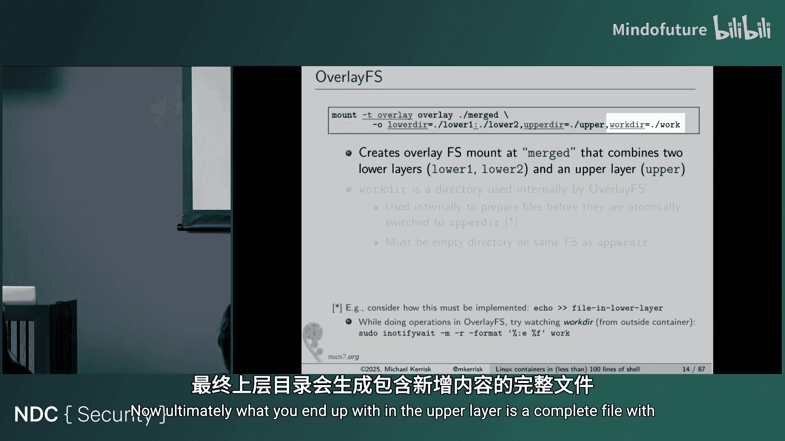

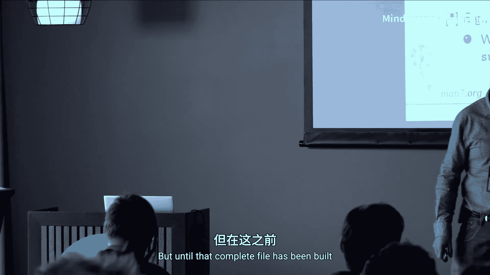

## 第一节：构建容器根文件系统

一个容器需要一个独立的根文件系统。为了高效利用资源，我们通常使用联合文件系统来构建它。

### 联合文件系统简介

联合文件系统允许我们将多个目录“堆叠”起来，提供一个合并后的视图。底层通常是只读的公共层，顶层是一个可写的差异层，这样每个容器都可以共享公共文件，同时拥有自己私有的修改。

现代容器工具如Docker使用`overlayfs`来实现这一点。以下是一个`mount`命令示例，展示了如何创建overlayfs挂载：

```bash
mount -t overlay overlay -o lowerdir=lower1:lower2,upperdir=upper,workdir=work merged
```

在这个命令中：
*   `lowerdir`：指定一个或多个只读的底层目录，用冒号分隔。列表中的第一个目录位于堆栈顶部。
*   `upperdir`：指定一个可写的上层目录，用于存放所有修改。
*   `workdir`：指定一个工作目录，`overlayfs`内部使用它来准备文件，该目录必须与`upperdir`位于同一文件系统。
*   `merged`：指定合并视图的挂载点。

在合并视图中，文件的可见性遵循“从上到下”的规则：上层目录的文件会覆盖下层目录的同名文件。还可以通过创建“白底”文件来“删除”下层文件，使其在合并视图中不可见。

### 创建基础文件系统层

我们将编写一个Shell脚本来创建所有容器共享的只读底层文件系统。以下是该脚本的核心步骤：

1.  创建目标目录并进入。
2.  创建标准的根文件系统目录结构，如`/bin`， `/dev`， `/etc`等。
3.  将`busybox`二进制文件复制到`/bin`目录。`busybox`是一个集成了数百个常用命令的单一静态链接二进制文件，非常适合构建轻量级容器。
4.  使用`busybox --install`命令在`/bin`目录下创建指向`busybox`的符号链接，这样我们就拥有了`ls`， `rm`等常用命令。

通过以上步骤，我们就得到了一个最小化的、可用的容器根文件系统基础层。

## 第二节：实现容器隔离 - 命名空间

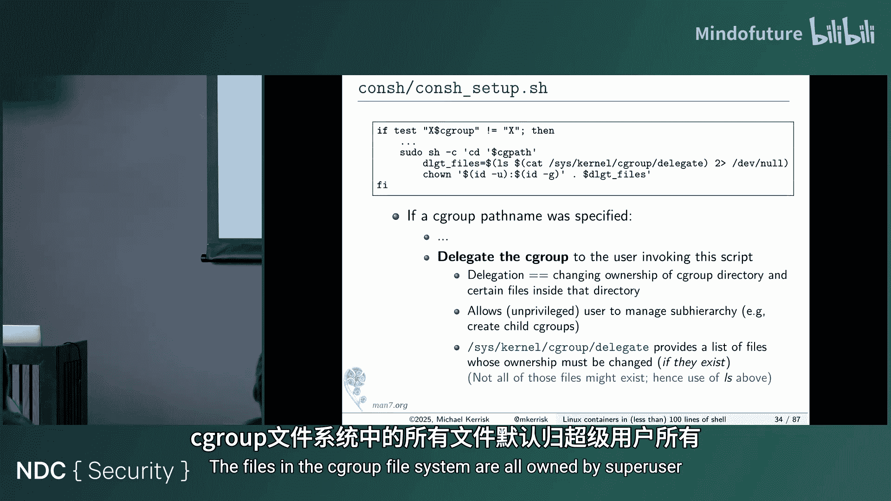

容器的核心是隔离。Linux命名空间技术为进程组提供了独立的系统资源视图。

### 命名空间类型

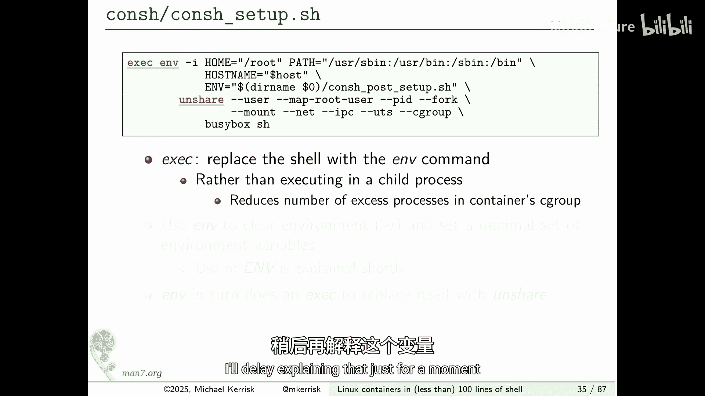

我们需要为容器创建以下几种关键的命名空间：
*   **PID命名空间**：隔离进程ID。这使得容器内可以有自己独立的PID 1（init进程），用于接管孤儿进程。
*   **Mount命名空间**：隔离文件系统挂载点。容器可以看到自己独立的目录树和挂载的文件系统。
*   **UTS命名空间**：隔离主机名和域名。每个容器可以有自己的主机名。
*   **Network命名空间**：隔离网络设备、IP地址、端口、路由表等。这是容器进行网络通信的基础。
*   **User命名空间**：隔离用户和组ID。这是实现“容器内root，容器外非root”权限模型的关键。

### 使用 `unshare` 命令创建命名空间

在Shell层面，我们使用`unshare`命令来创建新的命名空间并运行程序。例如，以下命令创建一个新的PID命名空间，并在其中启动一个Shell：

```bash
unshare --pid --fork sh -c 'echo My PID is $$'
```

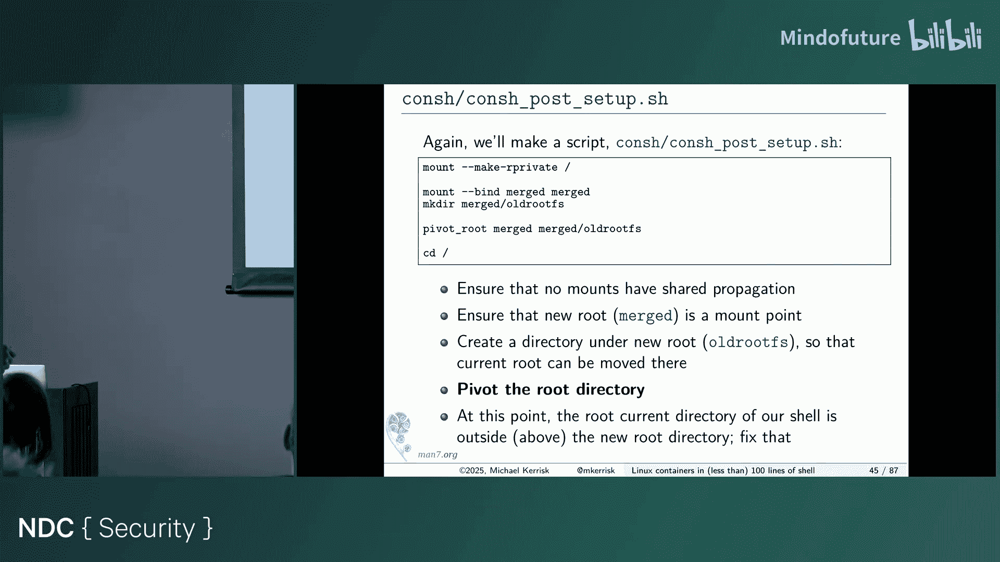

在这个新的Shell中，`$$`（当前Shell的PID）将会是1，因为它成为了新PID命名空间中的第一个进程。

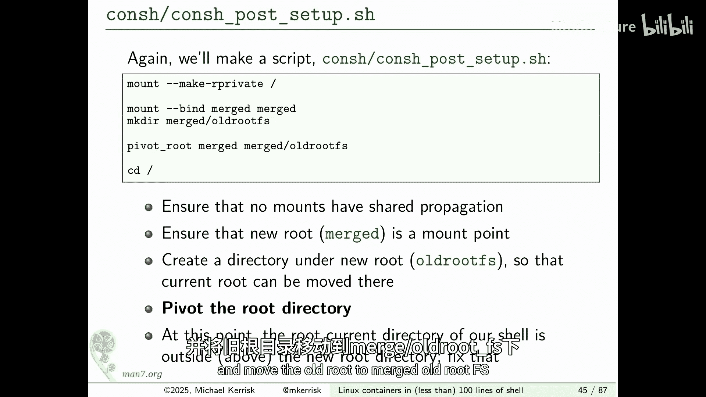

### 容器内的超级用户权限

User命名空间与Linux能力机制共同作用，实现了容器内的特权。当创建一个新的User命名空间时，内核会赋予该空间内的第一个进程**所有**的能力。因此，这个进程在容器内拥有类似root的超级权限，但在宿主机上，它仍然映射为一个普通的非特权用户（如UID 1000）。这种映射关系通过`/proc/[pid]/uid_map`和`/proc/[pid]/gid_map`文件来定义。

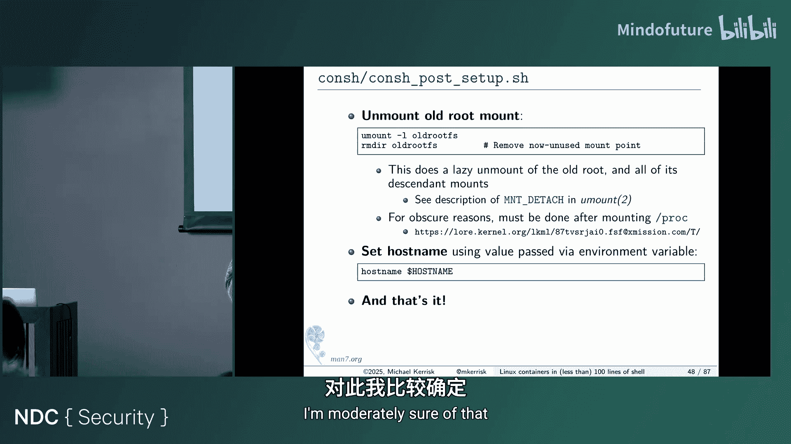

## 第三节：资源限制与管理 - 控制组


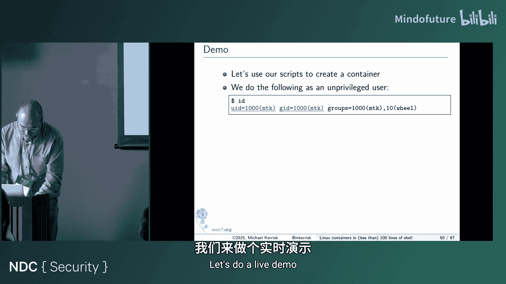

为了防止容器消耗过多资源而影响宿主机或其他容器，我们需要使用控制组来限制资源。

### Cgroups 简介

Cgroups是一个Linux内核特性，用于对进程组进行资源限制、优先级分配和资源计量。其接口通过一个虚拟文件系统暴露。

创建一个cgroup非常简单，只需在cgroup文件系统（通常挂载在`/sys/fs/cgroup`）下创建一个目录即可。资源限制通过向该目录下的特定文件（如`cpu.max`， `memory.max`）写入配置值来实现。要将一个进程加入某个cgroup，只需将其PID写入该cgroup目录下的`cgroup.procs`文件。

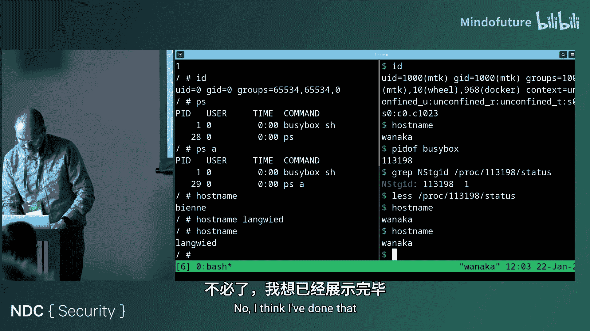

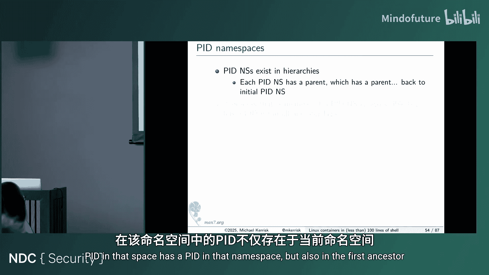


### 为非特权用户配置Cgroups

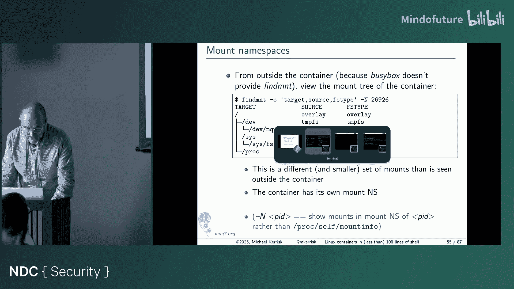

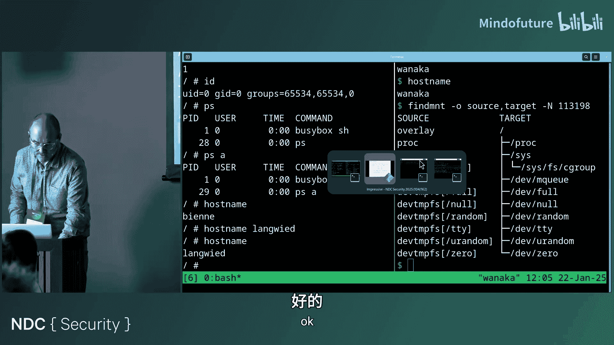

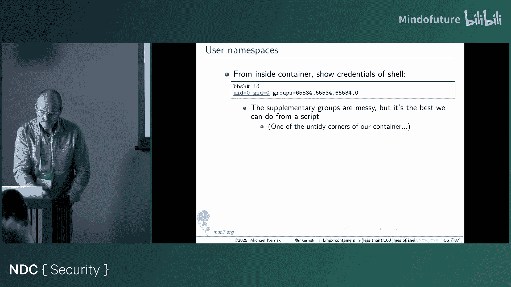

默认情况下，cgroup文件由root用户所有。为了让非特权用户运行的容器也能管理自己的cgroup，我们需要进行“委托”。这包括：
1.  将我们创建的cgroup目录的所有权更改为该非特权用户。
2.  根据`cgroup.subtree_control`和`cgroup.controllers`文件的内容，更改cgroup目录内特定控制文件的所有权。

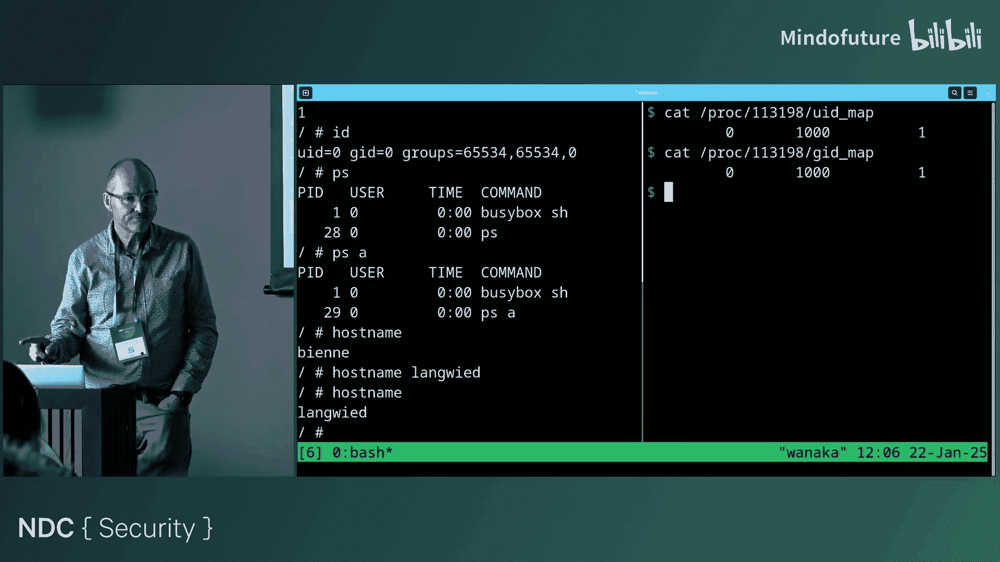

这样，容器内的进程（即使以宿主机上的非特权用户运行）就可以在自己的cgroup子树内设置资源限制了。

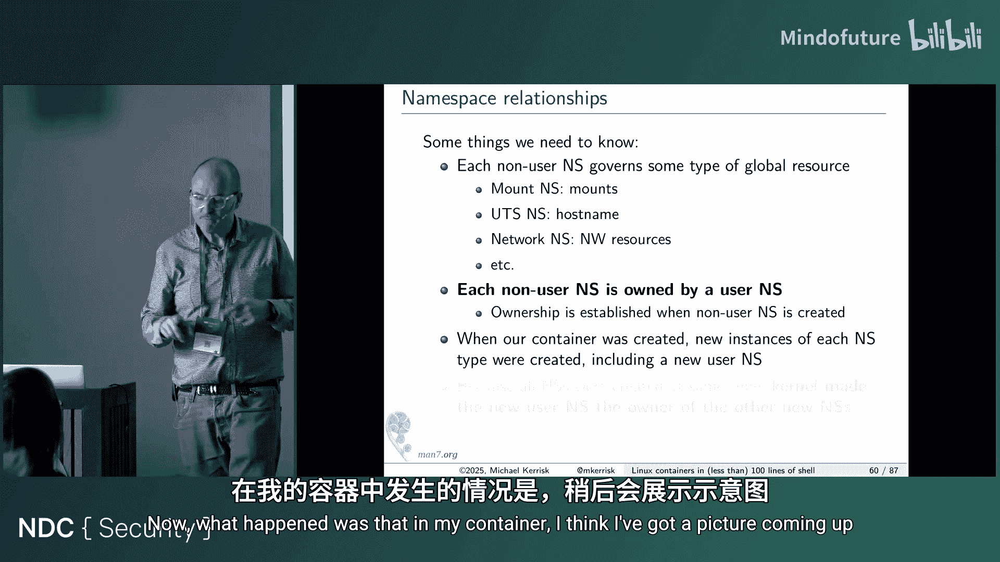

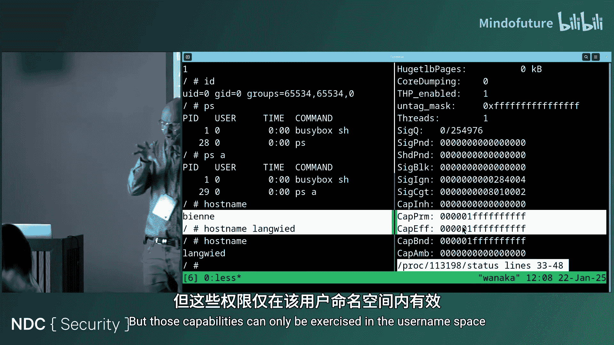

## 第四节：启动容器脚本

现在，我们将所有步骤整合到一个启动脚本中。这个脚本负责：
1.  为overlayfs创建必要的目录（upper， work， merged）。
2.  执行overlayfs挂载命令。
3.  如果指定了cgroup，则创建并配置cgroup，并将当前脚本进程加入其中。
4.  使用`exec`命令和`env`程序设置容器内的环境变量（如`HOME`， `PATH`， `HOSTNAME`）。
5.  最关键的一步：使用`unshare`命令一次性创建所有需要的命名空间（user， pid， mount， uts， ipc， network， cgroup），并映射root用户，最后在子进程中启动`busybox sh`作为容器的第一个进程（PID 1）。

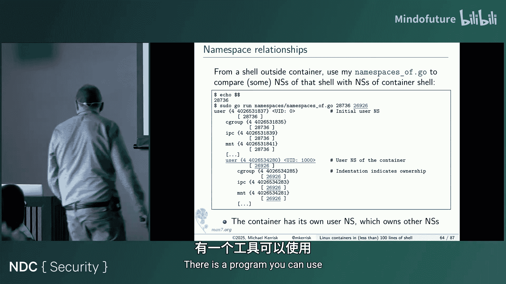

## 第五节：容器内部初始化

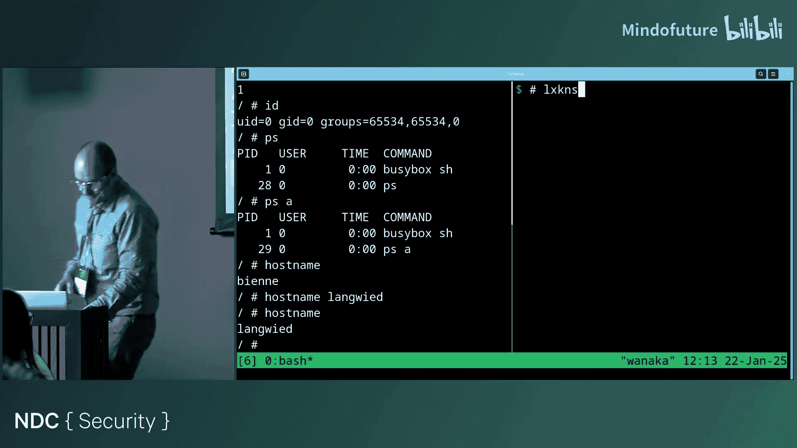

容器启动后，还需要在内部进行一些初始化工作。我们通过设置`$ENV`环境变量，让新启动的Shell自动执行一个初始化脚本。

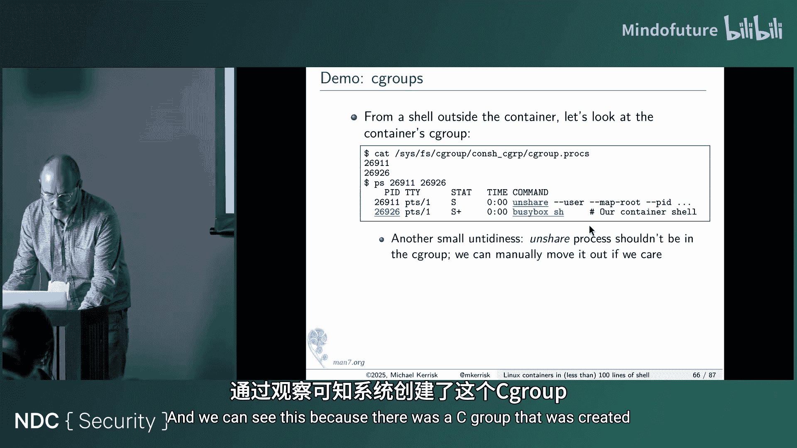

### 使用 `pivot_root` 切换根文件系统

容器继承了宿主机的挂载信息。我们需要将overlayfs的合并视图（`merged`目录）设置为容器新的根文件系统，并移除旧的根视图。这通过`pivot_root`系统调用完成。其核心步骤是：
1.  确保新的根目录是一个挂载点（如果不是，则使用`bind`挂载自身）。
2.  将当前mount命名空间的挂载传播设置为`private`，防止挂载事件泄露到宿主机。
3.  执行`pivot_root`命令，将新的根挂载移动到`/`，并将旧的根挂载移动到新根下的一个目录（如`/oldroot`）。
4.  卸载并移除`/oldroot`。

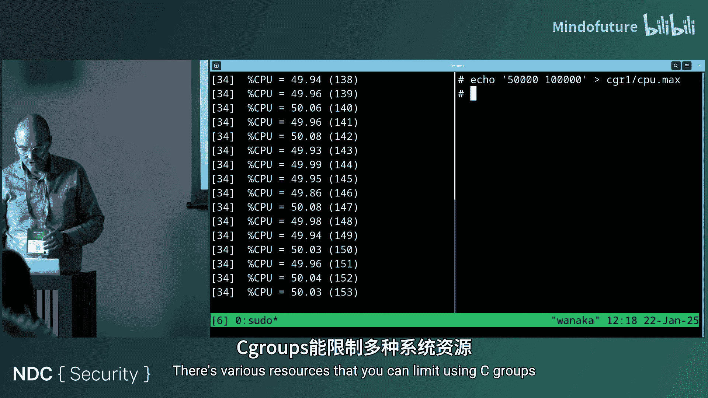

### 挂载必要的虚拟文件系统

在新的根文件系统下，我们需要挂载一些必要的虚拟文件系统，以提供标准的环境：
*   `/proc`：进程信息文件系统。
*   `/sys`：系统设备和内核信息文件系统。
*   `/dev`：设备文件。我们可以通过`bind`挂载，从旧的根文件系统的`/dev`目录中挂载`/dev/null`， `/dev/zero`， `/dev/random`等基础设备文件到新容器的`/dev`目录下。
*   `/tmp`：临时文件系统（可选，可使用`tmpfs`）。

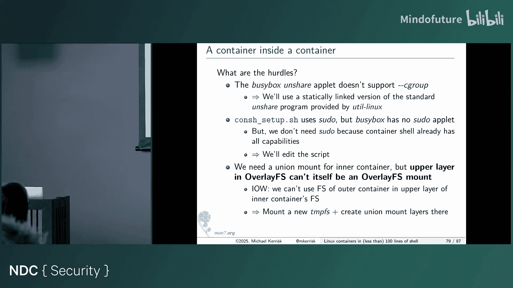

最后，根据环境变量设置容器的主机名。至此，一个功能基本完整的容器环境就准备就绪了。

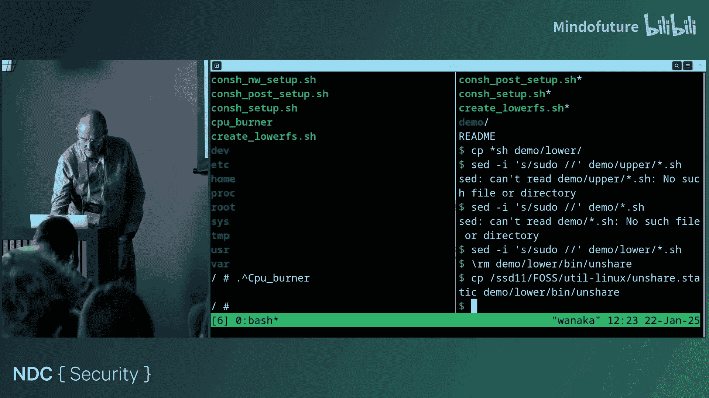

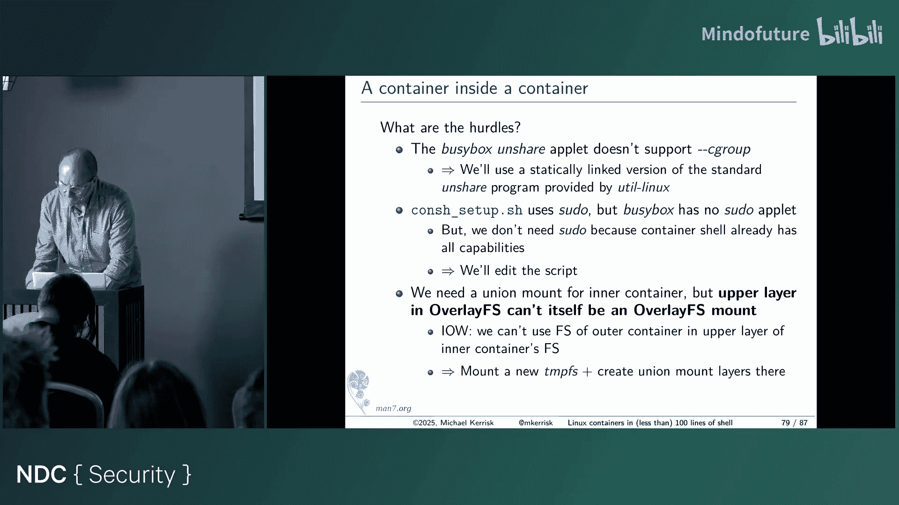

## 总结

在本教程中，我们一起学习了如何用简单的Shell脚本构建一个Linux容器。我们探讨了其三大核心技术支柱：
1.  **联合文件系统**：用于高效构建和管理容器的根文件系统。
2.  **命名空间**：提供了进程、网络、文件系统、用户等资源的隔离，是容器独立性的基础。
3.  **控制组**：用于限制和计量容器的资源使用，保证系统的稳定性。

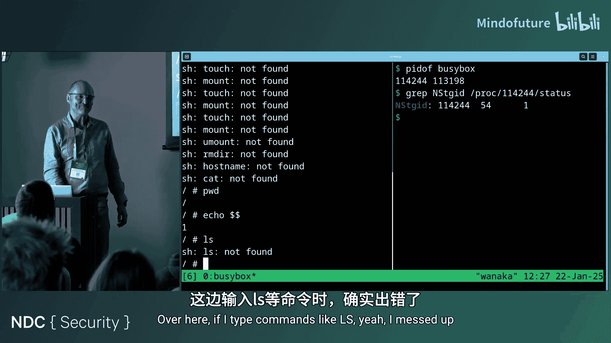

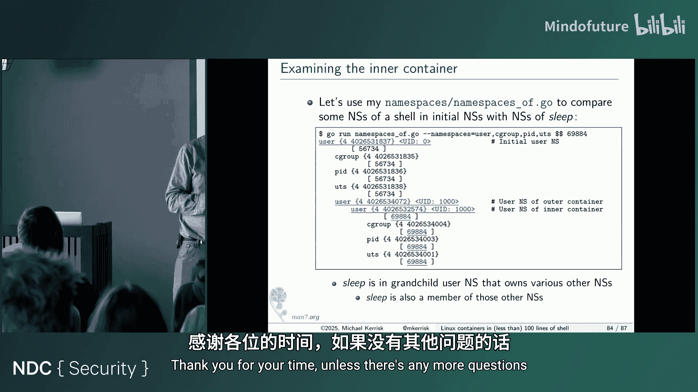

通过动手实践创建文件系统层、编写启动和初始化脚本，我们不仅实现了一个可运行的简易容器，更重要的是深入理解了现代容器技术背后的原理。虽然这个自制容器在功能上不如Docker或Podman完善（例如缺少安全沙箱`seccomp`的自动配置），但它清晰地揭示了容器技术的本质。